# API 架构图文档

> **版本**: v1.0
> **创建日期**: 2026-02-26
> **最后更新**: 2026-02-26

---

## 目录

- [API层整体架构图](#api层整体架构图)
- [目录结构图](#目录结构图)
- [请求处理流程图](#请求处理流程图)
- [错误处理流程图](#错误处理流程图)
- [重构前后对比图](#重构前后对比图)
- [模块依赖关系图](#模块依赖关系图)
- [数据流图](#数据流图)

---

## API层整体架构图

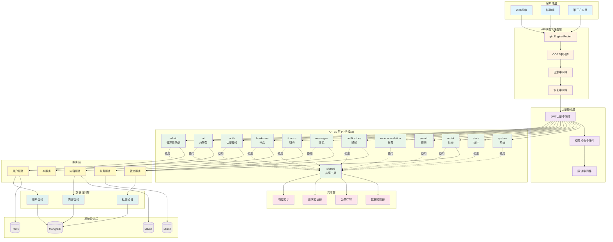

---

## 目录结构图

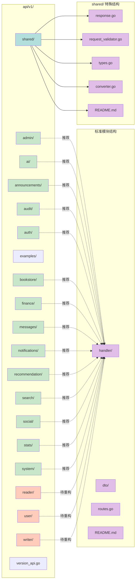

---

## 请求处理流程图

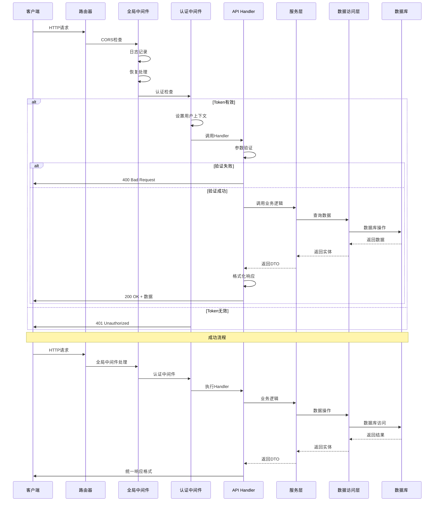

---

## 错误处理流程图

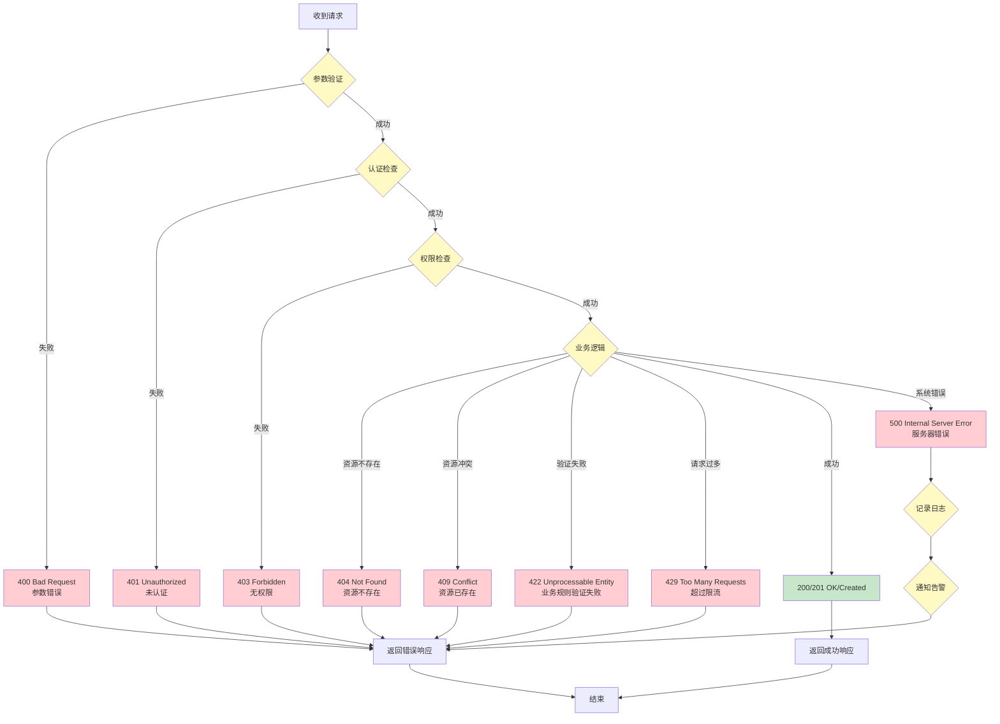

---

## 重构前后对比图

### 架构对比

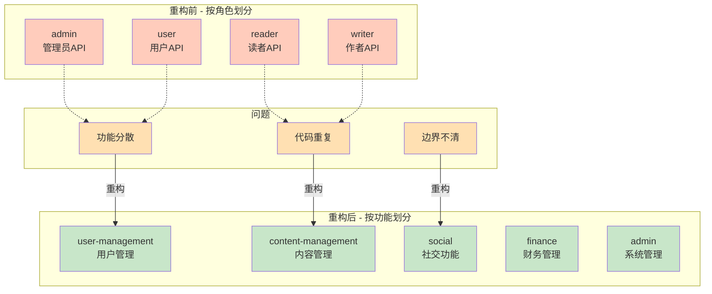

### 代码对比

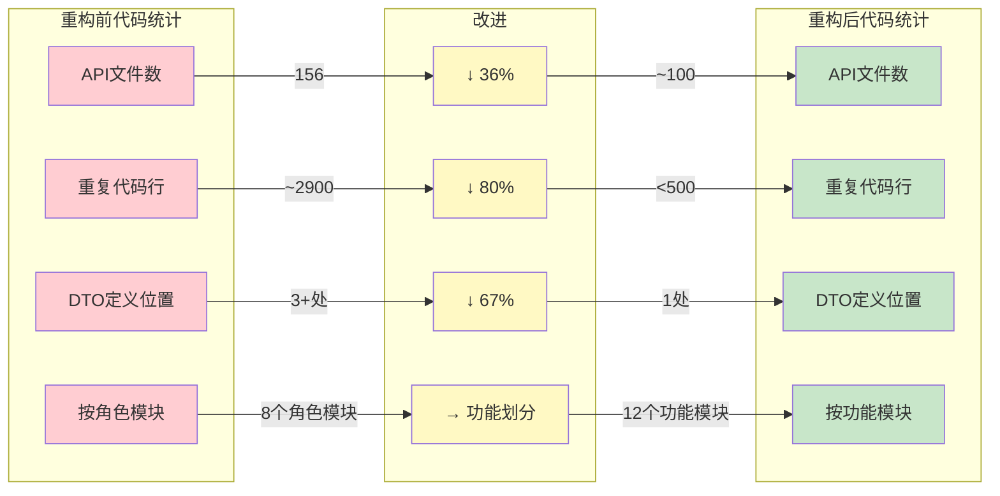

### 目录结构对比

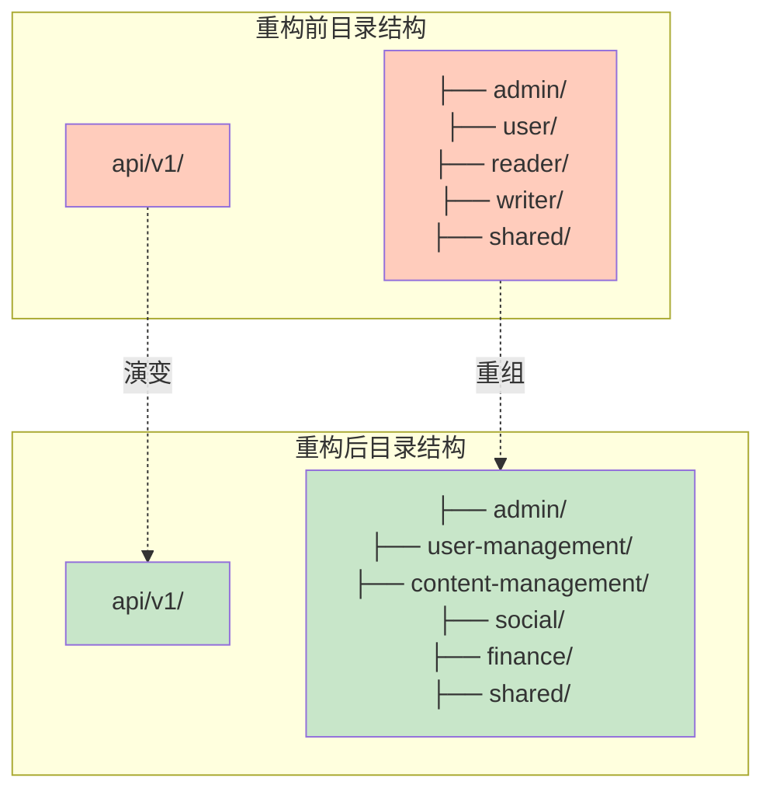

---

## 模块依赖关系图

```mermaid
graph TB
    subgraph "业务模块层"
        Admin[admin]
        AI[ai]
        Auth[auth]
        Bookstore[bookstore]
        Finance[finance]
        Messages[messages]
        Notifications[notifications]
        Recommendation[recommendation]
        Search[search]
        Social[social]
        Stats[stats]
        System[system]
    end

    subgraph "共享层"
        Shared[shared]
    end

    subgraph "中间件层"
        AuthMW[auth middleware]
        PermissionMW[permission middleware]
        RateLimitMW[rate limit middleware]
        LoggerMW[logger middleware]
    end

    subgraph "服务层"
        UserService[user service]
        ContentService[content service]
        SocialService[social service]
        AIService[AI service]
        FinanceService[finance service]
    end

    subgraph "工具层"
        Errors[errors package]
        Utils[utils package]
        Models[models package]
    end

    Admin --> Shared
    AI --> Shared
    Auth --> Shared
    Bookstore --> Shared
    Finance --> Shared
    Messages --> Shared
    Notifications --> Shared
    Recommendation --> Shared
    Search --> Shared
    Social --> Shared
    Stats --> Shared
    System --> Shared

    Admin --> UserService
    Auth --> UserService
    Bookstore --> ContentService
    Messages --> SocialService
    Notifications --> SocialService
    AI --> AIService
    Finance --> FinanceService
    Social --> SocialService

    AuthMW --> Shared
    PermissionMW --> Shared
    RateLimitMW --> Shared
    LoggerMW --> Shared

    UserService --> Errors
    ContentService --> Errors
    SocialService --> Errors
    AIService --> Errors
    FinanceService --> Errors

    Shared --> Utils
    Shared --> Models

    classDef business fill:#e8f5e9
    classDef shared fill:#fff9c4
    classDef middleware fill:#e1f5fe
    classDef service fill:#f3e5f5
    classDef utils fill:#fce4ec

    class Admin,AI,Auth,Bookstore,Finance,Messages,Notifications,Recommendation,Search,Social,Stats,System business
    class Shared shared
    class AuthMW,PermissionMW,RateLimitMW,LoggerMW middleware
    class UserService,ContentService,SocialService,AIService,FinanceService service
    class Errors,Utils,Models utils
```

---

## 数据流图

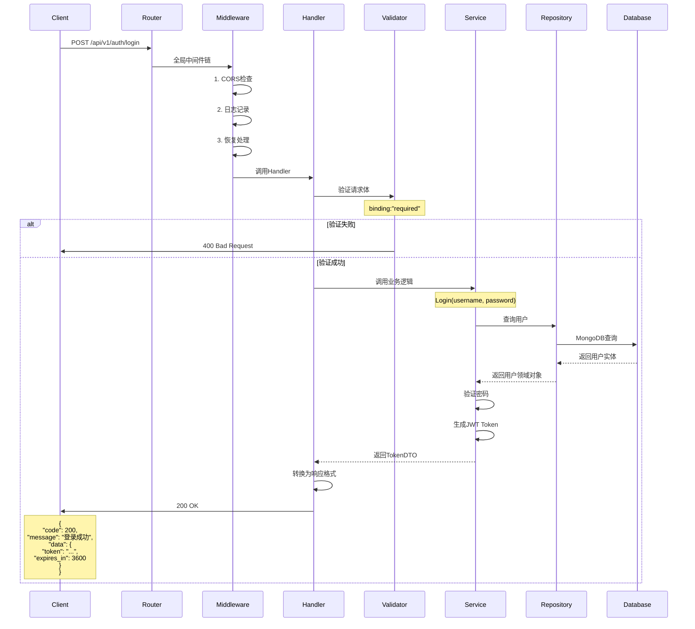

---

## 分页请求流程图

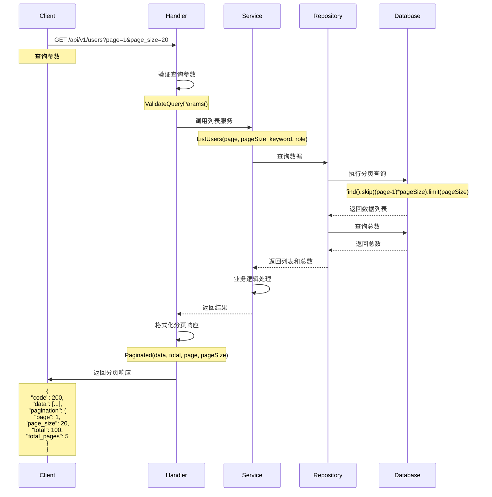

---

## 错误处理详细流程图

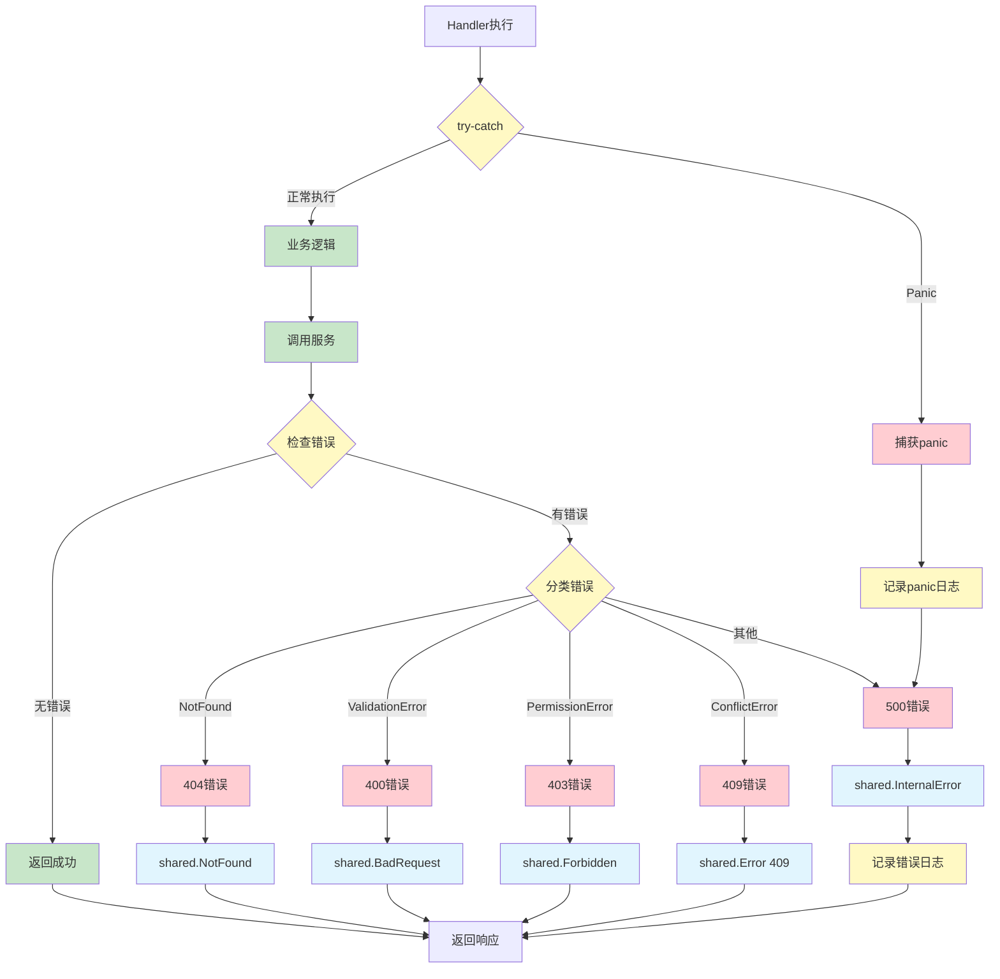

---

## 文档说明

### 图例说明

- **绿色**: 表示活跃的/正确的/新的模块或流程
- **红色**: 表示错误的/废弃的/旧的模块或流程
- **黄色**: 表示处理过程或中间状态
- **蓝色**: 表示响应或返回值

### 使用说明

1. **API层整体架构图**: 展示完整的系统架构和各层之间的关系
2. **目录结构图**: 展示API层的目录组织和模块划分
3. **请求处理流程图**: 展示从请求到响应的完整流程
4. **错误处理流程图**: 展示各种错误情况的处理逻辑
5. **重构前后对比图**: 对比重构前后的架构差异
6. **模块依赖关系图**: 展示各模块之间的依赖关系
7. **数据流图**: 展示数据在系统中的流动

### 更新记录

| 日期 | 版本 | 变更内容 |
|------|------|----------|
| 2026-02-26 | v1.0 | 初始版本，创建所有架构图 |

---

**维护者**: Backend Architecture Team
**最后更新**: 2026-02-26
