# API 架构图文档

> **版本**: v1.0
> **创建日期**: 2026-02-26
> **最后更新**: 2026-02-26

---

## 目录

- [API层整体架构图](#api层整体架构图)
- [目录结构图](#目录结构图)
- [请求处理流程图](#请求处理流程图)
- [错误处理流程图](#错误处理流程图)
- [重构前后对比图](#重构前后对比图)
- [模块依赖关系图](#模块依赖关系图)
- [数据流图](#数据流图)
- [通信模块架构](#通信模块架构)
- [AI模块架构](#ai模块架构)

---

## API层整体架构图

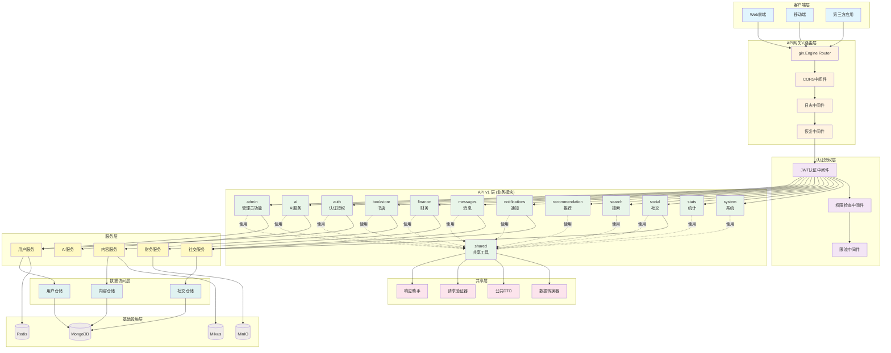
```mermaid
graph TB
    subgraph "客户端层"
        Web[Web前端]
        Mobile[移动端]
        ThirdParty[第三方应用]
    end

    subgraph "API网关 / 路由层"
        Router[gin.Engine Router]
        CORS[CORS中间件]
        Logger[日志中间件]
        Recovery[恢复中间件]
    end

    subgraph "认证授权层"
        AuthMiddleware[JWT认证中间件]
        PermissionMiddleware[权限检查中间件]
        RateLimitMiddleware[限流中间件]
    end

    subgraph "API v1 层 (业务模块)"
        AdminAPI[admin<br/>管理员功能]
        AIAPI[ai<br/>AI服务]
        AuthAPI[auth<br/>认证授权]
        BookstoreAPI[bookstore<br/>书店]
        FinanceAPI[finance<br/>财务]
        MessagesAPI[messages<br/>消息]
        NotificationsAPI[notifications<br/>通知]
        RecommendationAPI[recommendation<br/>推荐]
        SearchAPI[search<br/>搜索]
        SharedAPI[shared<br/>共享工具]
        SocialAPI[social<br/>社交]
        StatsAPI[stats<br/>统计]
        SystemAPI[system<br/>系统]
    end

    subgraph "共享层"
        ResponseHelper[响应助手]
        Validator[请求验证器]
        CommonDTOs[公共DTO]
        Converters[数据转换器]
    end

    subgraph "服务层"
        UserService[用户服务]
        ContentService[内容服务]
        SocialService[社交服务]
        AIService[AI服务]
        FinanceService[财务服务]
    end

    subgraph "数据访问层"
        UserRepo[用户仓储]
        ContentRepo[内容仓储]
        SocialRepo[社交仓储]
    end

    subgraph "基础设施层"
        MongoDB[(MongoDB)]
        Redis[(Redis)]
        Milvus[(Milvus)]
        MinIO[(MinIO)]
    end

    Web --> Router
    Mobile --> Router
    ThirdParty --> Router

    Router --> CORS
    CORS --> Logger
    Logger --> Recovery

    Recovery --> AuthMiddleware

    AuthMiddleware --> AdminAPI
    AuthMiddleware --> AIAPI
    AuthMiddleware --> AuthAPI
    AuthMiddleware --> BookstoreAPI
    AuthMiddleware --> FinanceAPI
    AuthMiddleware --> MessagesAPI
    AuthMiddleware --> NotificationsAPI
    AuthMiddleware --> RecommendationAPI
    AuthMiddleware --> SearchAPI
    AuthMiddleware --> SocialAPI
    AuthMiddleware --> StatsAPI
    AuthMiddleware --> SystemAPI

    AuthMiddleware --> PermissionMiddleware
    PermissionMiddleware --> RateLimitMiddleware

    AdminAPI -.使用.-> SharedAPI
    AIAPI -.使用.-> SharedAPI
    AuthAPI -.使用.-> SharedAPI
    BookstoreAPI -.使用.-> SharedAPI
    FinanceAPI -.使用.-> SharedAPI
    MessagesAPI -.使用.-> SharedAPI
    NotificationsAPI -.使用.-> SharedAPI
    RecommendationAPI -.使用.-> SharedAPI
    SearchAPI -.使用.-> SharedAPI
    SocialAPI -.使用.-> SharedAPI
    StatsAPI -.使用.-> SharedAPI
    SystemAPI -.使用.-> SharedAPI

    SharedAPI --> ResponseHelper
    SharedAPI --> Validator
    SharedAPI --> CommonDTOs
    SharedAPI --> Converters

    AdminAPI --> UserService
    AIAPI --> AIService
    AuthAPI --> UserService
    BookstoreAPI --> ContentService
    FinanceAPI --> FinanceService
    MessagesAPI --> SocialService
    NotificationsAPI --> SocialService
    SocialAPI --> SocialService

    UserService --> UserRepo
    ContentService --> ContentRepo
    SocialService --> SocialRepo

    UserRepo --> MongoDB
    ContentRepo --> MongoDB
    SocialRepo --> MongoDB

    UserService --> Redis
    ContentService --> Milvus
    FinanceService --> MinIO

    classDef client fill:#e1f5fe
    classDef gateway fill:#fff3e0
    classDef auth fill:#f3e5f5
    classDef api fill:#e8f5e9
    classDef shared fill:#fce4ec
    classDef service fill:#fff9c4
    classDef repo fill:#e0f2f1
    classDef db fill:#efebe9

    class Web,Mobile,ThirdParty client
    class Router,CORS,Logger,Recovery gateway
    class AuthMiddleware,PermissionMiddleware,RateLimitMiddleware auth
    class AdminAPI,AIAPI,AuthAPI,BookstoreAPI,FinanceAPI,MessagesAPI,NotificationsAPI,RecommendationAPI,SearchAPI,SharedAPI,SocialAPI,StatsAPI,SystemAPI api
    class ResponseHelper,Validator,CommonDTOs,Converters shared
    class UserService,ContentService,SocialService,AIService,FinanceService service
    class UserRepo,ContentRepo,SocialRepo repo
    class MongoDB,Redis,Milvus,MinIO db
```

---

## 目录结构图

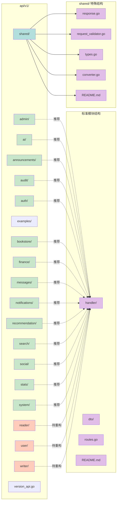
```mermaid
graph LR
    subgraph "api/v1/"
        A[admin/]
        B[ai/]
        C[announcements/]
        D[audit/]
        E[auth/]
        F[bookstore/]
        G[examples/]
        H[finance/]
        I[messages/]
        J[notifications/]
        K[reader/]
        L[recommendation/]
        M[search/]
        N[shared/]
        O[social/]
        P[stats/]
        Q[system/]
        R[user/]
        S[writer/]
        T[version_api.go]
    end

    subgraph "标准模块结构"
        M1[handler/]
        M2[dto/]
        M3[routes.go]
        M4[README.md]
    end

    subgraph "shared/ 特殊结构"
        S1[response.go]
        S2[request_validator.go]
        S3[types.go]
        S4[converter.go]
        S5[README.md]
    end

    N --> S1
    N --> S2
    N --> S3
    N --> S4
    N --> S5

    A -.推荐.-> M1
    B -.推荐.-> M1
    C -.推荐.-> M1
    D -.推荐.-> M1
    E -.推荐.-> M1
    F -.推荐.-> M1
    H -.推荐.-> M1
    I -.推荐.-> M1
    J -.推荐.-> M1
    L -.推荐.-> M1
    M -.推荐.-> M1
    O -.推荐.-> M1
    P -.推荐.-> M1
    Q -.推荐.-> M1

    K -.待重构.-> M1
    R -.待重构.-> M1
    S -.待重构.-> M1

    classDef active fill:#c8e6c9
    classDef pending fill:#ffccbc
    classDef sharedClass fill:#b2dfdb
    classDef standard fill:#e1bee7

    class A,B,C,D,E,F,H,I,J,L,M,O,P,Q active
    class K,R,S pending
    class N sharedClass
    class M1,M2,M3,M4,S1,S2,S3,S4,S5 standard
```

---

## 请求处理流程图

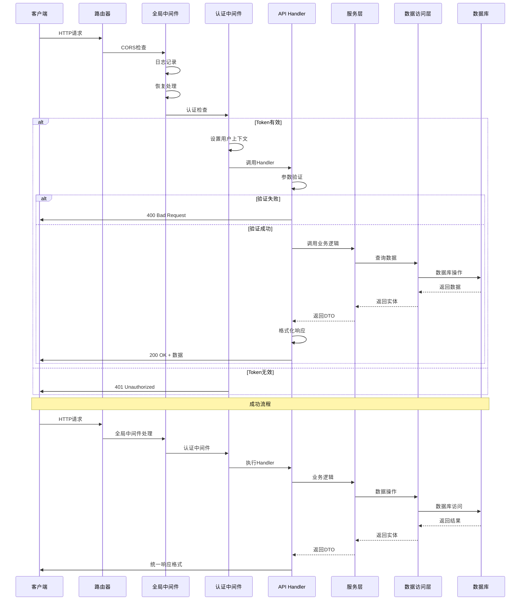
```mermaid
sequenceDiagram
    participant Client as 客户端
    participant Router as 路由器
    participant MW1 as 全局中间件
    participant MW2 as 认证中间件
    participant Handler as API Handler
    participant Service as 服务层
    participant Repo as 数据访问层
    participant DB as 数据库

    Client->>Router: HTTP请求
    Router->>MW1: CORS检查
    MW1->>MW1: 日志记录
    MW1->>MW1: 恢复处理

    MW1->>MW2: 认证检查
    alt Token有效
        MW2->>MW2: 设置用户上下文
        MW2->>Handler: 调用Handler

        Handler->>Handler: 参数验证
        alt 验证失败
            Handler->>Client: 400 Bad Request
        else 验证成功
            Handler->>Service: 调用业务逻辑
            Service->>Repo: 查询数据
            Repo->>DB: 数据库操作
            DB-->>Repo: 返回数据
            Repo-->>Service: 返回实体
            Service-->>Handler: 返回DTO
            Handler->>Handler: 格式化响应
            Handler->>Client: 200 OK + 数据
        end
    else Token无效
        MW2->>Client: 401 Unauthorized
    end

    Note over Client,DB: 成功流程

    Client->>Router: HTTP请求
    Router->>MW1: 全局中间件处理
    MW1->>MW2: 认证中间件
    MW2->>Handler: 执行Handler
    Handler->>Service: 业务逻辑
    Service->>Repo: 数据操作
    Repo->>DB: 数据库访问
    DB-->>Repo: 返回结果
    Repo-->>Service: 返回实体
    Service-->>Handler: 返回DTO
    Handler->>Client: 统一响应格式
```

---

## 错误处理流程图

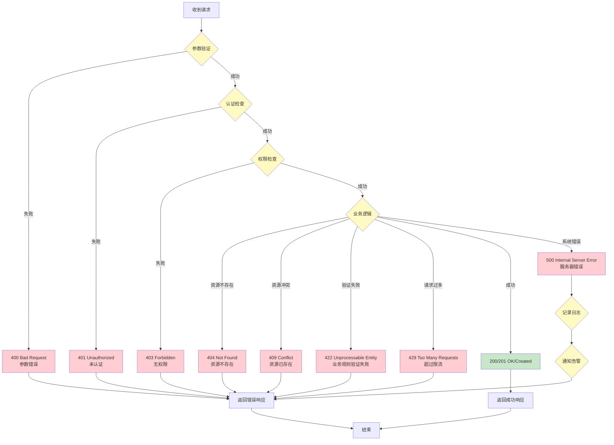
```mermaid
graph TB
    Start[收到请求] --> Validate{参数验证}

    Validate -->|失败| BadRequest[400 Bad Request<br/>参数错误]
    Validate -->|成功| Auth{认证检查}

    Auth -->|失败| Unauthorized[401 Unauthorized<br/>未认证]
    Auth -->|成功| Permission{权限检查}

    Permission -->|失败| Forbidden[403 Forbidden<br/>无权限]
    Permission -->|成功| Business{业务逻辑}

    Business -->|资源不存在| NotFound[404 Not Found<br/>资源不存在]
    Business -->|资源冲突| Conflict[409 Conflict<br/>资源已存在]
    Business -->|验证失败| Unprocessable[422 Unprocessable Entity<br/>业务规则验证失败]
    Business -->|请求过多| RateLimit[429 Too Many Requests<br/>超过限流]
    Business -->|成功| Success[200/201 OK/Created]

    Business -->|系统错误| InternalError[500 Internal Server Error<br/>服务器错误]
    InternalError --> Log{记录日志}
    Log --> Notify{通知告警}
    Notify --> ErrorResponse[返回错误响应]

    BadRequest --> ErrorResponse
    Unauthorized --> ErrorResponse
    Forbidden --> ErrorResponse
    NotFound --> ErrorResponse
    Conflict --> ErrorResponse
    Unprocessable --> ErrorResponse
    RateLimit --> ErrorResponse
    Success --> SuccessResponse[返回成功响应]

    ErrorResponse --> End[结束]
    SuccessResponse --> End

    classDef error fill:#ffcdd2
    classDef success fill:#c8e6c9
    classDef process fill:#fff9c4

    class BadRequest,Unauthorized,Forbidden,NotFound,Conflict,Unprocessable,RateLimit,InternalError error
    class Success success
    class Validate,Auth,Permission,Business,Log,Notify process
```

---

## 重构前后对比图

### 架构对比

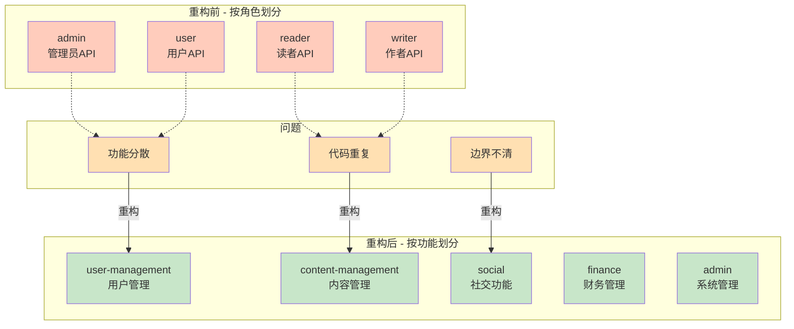
```mermaid
graph TB
    subgraph "重构前 - 按角色划分"
        OldAdmin[admin<br/>管理员API]
        OldUser[user<br/>用户API]
        OldReader[reader<br/>读者API]
        OldWriter[writer<br/>作者API]
    end

    subgraph "问题"
        P1[功能分散]
        P2[代码重复]
        P3[边界不清]
    end

    subgraph "重构后 - 按功能划分"
        NewUserManagement[user-management<br/>用户管理]
        NewContent[content-management<br/>内容管理]
        NewSocial[social<br/>社交功能]
        NewFinance[finance<br/>财务管理]
        NewAdmin[admin<br/>系统管理]
    end

    OldAdmin -.-> P1
    OldUser -.-> P1
    OldReader -.-> P2
    OldWriter -.-> P2

    P1 -->|重构| NewUserManagement
    P2 -->|重构| NewContent
    P3 -->|重构| NewSocial

    classDef old fill:#ffccbc
    classDef problem fill:#ffe0b2
    classDef new fill:#c8e6c9

    class OldAdmin,OldUser,OldReader,OldWriter old
    class P1,P2,P3 problem
    class NewUserManagement,NewContent,NewSocial,NewFinance,NewAdmin new
```

### 代码对比

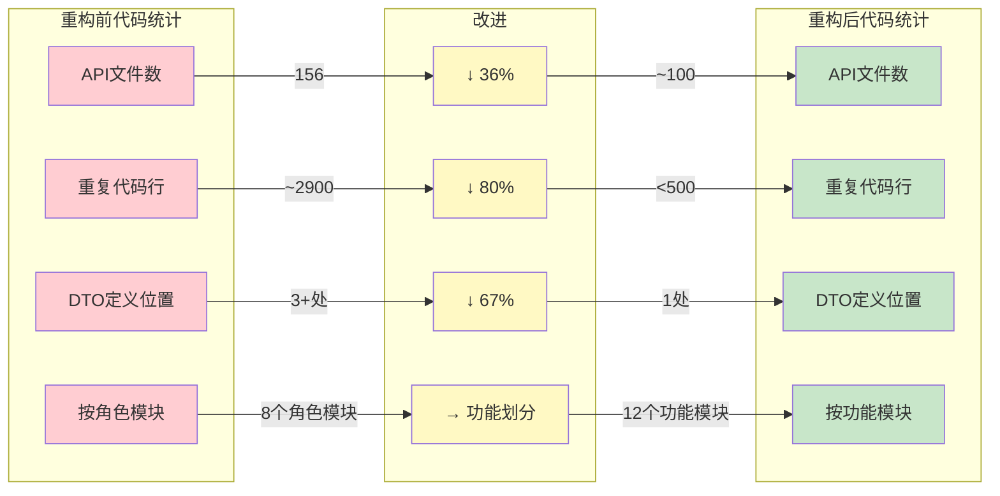
```mermaid
graph LR
    subgraph "重构前代码统计"
        OldFiles[API文件数]
        OldDup[重复代码行]
        OldDTO[DTO定义位置]
        OldModules[按角色模块]
    end

    subgraph "改进"
        Arrow1[↓ 36%]
        Arrow2[↓ 80%]
        Arrow3[↓ 67%]
        Arrow4[→ 功能划分]
    end

    subgraph "重构后代码统计"
        NewFiles[API文件数]
        NewDup[重复代码行]
        NewDTO[DTO定义位置]
        NewModules[按功能模块]
    end

    OldFiles -->|156| Arrow1
    Arrow1 -->|~100| NewFiles

    OldDup -->|~2900| Arrow2
    Arrow2 -->|<500| NewDup

    OldDTO -->|3+处| Arrow3
    Arrow3 -->|1处| NewDTO

    OldModules -->|8个角色模块| Arrow4
    Arrow4 -->|12个功能模块| NewModules

    classDef old fill:#ffcdd2
    classDef arrow fill:#fff9c4
    classDef new fill:#c8e6c9

    class OldFiles,OldDup,OldDTO,OldModules old
    class Arrow1,Arrow2,Arrow3,Arrow4 arrow
    class NewFiles,NewDup,NewDTO,NewModules new
```

### 目录结构对比

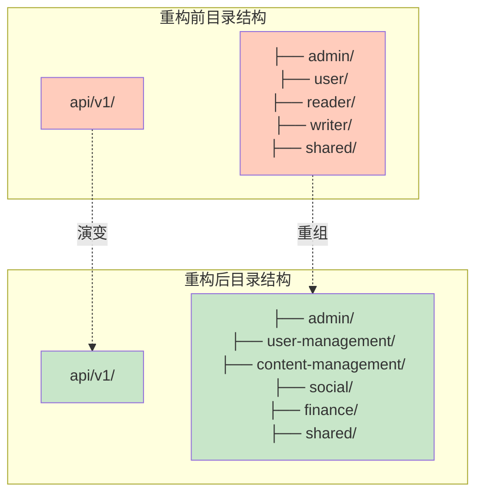
```mermaid
graph TB
    subgraph "重构前目录结构"
        OldDir1[api/v1/]
        OldDir2[├── admin/<br/>├── user/<br/>├── reader/<br/>├── writer/<br/>├── shared/]
    end

    subgraph "重构后目录结构"
        NewDir1[api/v1/]
        NewDir2[├── admin/<br/>├── user-management/<br/>├── content-management/<br/>├── social/<br/>├── finance/<br/>├── shared/]
    end

    OldDir1 -.演变.-> NewDir1
    OldDir2 -.重组.-> NewDir2

    classDef old fill:#ffccbc
    classDef new fill:#c8e6c9

    class OldDir1,OldDir2 old
    class NewDir1,NewDir2 new
```

---

## 模块依赖关系图


```mermaid
graph TB
    subgraph "业务模块层"
        Admin[admin]
        AI[ai]
        Auth[auth]
        Bookstore[bookstore]
        Finance[finance]
        Messages[messages]
        Notifications[notifications]
        Recommendation[recommendation]
        Search[search]
        Social[social]
        Stats[stats]
        System[system]
    end

    subgraph "共享层"
        Shared[shared]
    end

    subgraph "中间件层"
        AuthMW[auth middleware]
        PermissionMW[permission middleware]
        RateLimitMW[rate limit middleware]
        LoggerMW[logger middleware]
    end

    subgraph "服务层"
        UserService[user service]
        ContentService[content service]
        SocialService[social service]
        AIService[AI service]
        FinanceService[finance service]
    end

    subgraph "工具层"
        Errors[errors package]
        Utils[utils package]
        Models[models package]
    end

    Admin --> Shared
    AI --> Shared
    Auth --> Shared
    Bookstore --> Shared
    Finance --> Shared
    Messages --> Shared
    Notifications --> Shared
    Recommendation --> Shared
    Search --> Shared
    Social --> Shared
    Stats --> Shared
    System --> Shared

    Admin --> UserService
    Auth --> UserService
    Bookstore --> ContentService
    Messages --> SocialService
    Notifications --> SocialService
    AI --> AIService
    Finance --> FinanceService
    Social --> SocialService

    AuthMW --> Shared
    PermissionMW --> Shared
    RateLimitMW --> Shared
    LoggerMW --> Shared

    UserService --> Errors
    ContentService --> Errors
    SocialService --> Errors
    AIService --> Errors
    FinanceService --> Errors

    Shared --> Utils
    Shared --> Models

    classDef business fill:#e8f5e9
    classDef shared fill:#fff9c4
    classDef middleware fill:#e1f5fe
    classDef service fill:#f3e5f5
    classDef utils fill:#fce4ec

    class Admin,AI,Auth,Bookstore,Finance,Messages,Notifications,Recommendation,Search,Social,Stats,System business
    class Shared shared
    class AuthMW,PermissionMW,RateLimitMW,LoggerMW middleware
    class UserService,ContentService,SocialService,AIService,FinanceService service
    class Errors,Utils,Models utils
```

---

## 数据流图

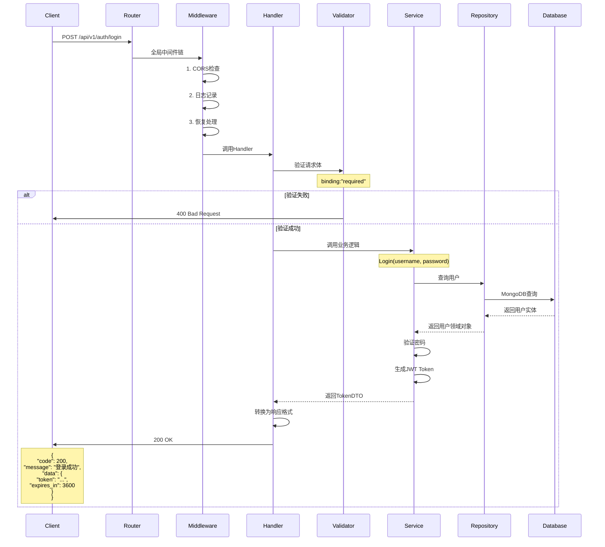
```mermaid
sequenceDiagram
    participant Client
    participant Router
    participant Middleware
    participant Handler
    participant Validator
    participant Service
    participant Repository
    participant Database

    Client->>Router: POST /api/v1/auth/login
    Router->>Middleware: 全局中间件链

    Middleware->>Middleware: 1. CORS检查
    Middleware->>Middleware: 2. 日志记录
    Middleware->>Middleware: 3. 恢复处理

    Middleware->>Handler: 调用Handler

    Handler->>Validator: 验证请求体
    Note over Validator: binding:"required"

    alt 验证失败
        Validator->>Client: 400 Bad Request
    else 验证成功
        Handler->>Service: 调用业务逻辑
        Note over Service: Login(username, password)

        Service->>Repository: 查询用户
        Repository->>Database: MongoDB查询
        Database-->>Repository: 返回用户实体
        Repository-->>Service: 返回用户领域对象

        Service->>Service: 验证密码
        Service->>Service: 生成JWT Token

        Service-->>Handler: 返回TokenDTO
        Handler->>Handler: 转换为响应格式

        Handler->>Client: 200 OK
        Note over Client: {<br/>  "code": 200,<br/>  "message": "登录成功",<br/>  "data": {<br/>    "token": "...",<br/>    "expires_in": 3600<br/>  }<br/>}
    end
```

---

## 分页请求流程图

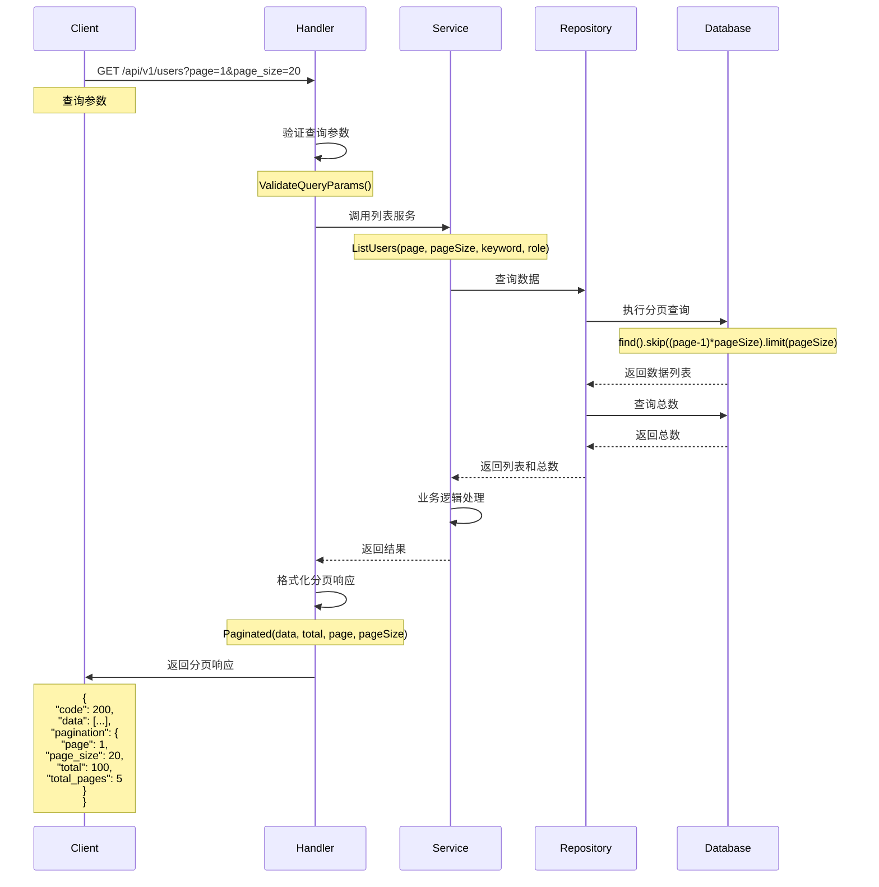
```mermaid
sequenceDiagram
    participant Client
    participant Handler
    participant Service
    participant Repository
    participant Database

    Client->>Handler: GET /api/v1/users?page=1&page_size=20
    Note over Client: 查询参数

    Handler->>Handler: 验证查询参数
    Note over Handler: ValidateQueryParams()

    Handler->>Service: 调用列表服务
    Note over Service: ListUsers(page, pageSize, keyword, role)

    Service->>Repository: 查询数据
    Repository->>Database: 执行分页查询
    Note over Database: find().skip((page-1)*pageSize).limit(pageSize)

    Database-->>Repository: 返回数据列表
    Repository->>Database: 查询总数
    Database-->>Repository: 返回总数

    Repository-->>Service: 返回列表和总数
    Service->>Service: 业务逻辑处理
    Service-->>Handler: 返回结果

    Handler->>Handler: 格式化分页响应
    Note over Handler: Paginated(data, total, page, pageSize)

    Handler->>Client: 返回分页响应
    Note over Client: {<br/>  "code": 200,<br/>  "data": [...],<br/>  "pagination": {<br/>    "page": 1,<br/>    "page_size": 20,<br/>    "total": 100,<br/>    "total_pages": 5<br/>  }<br/>}
```

---

## 错误处理详细流程图

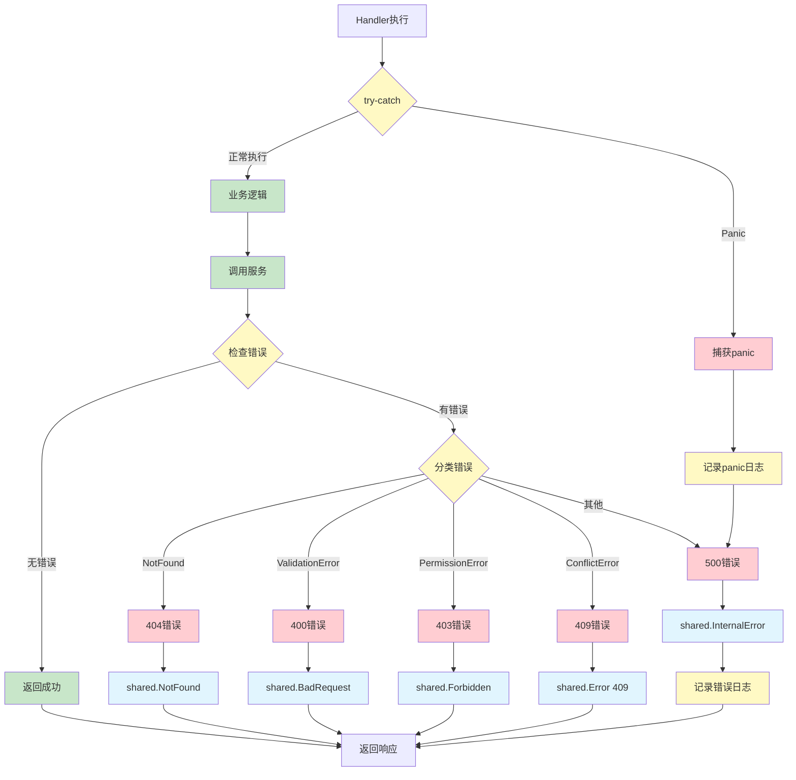
```mermaid
graph TB
    Start[Handler执行] --> Try{try-catch}

    Try -->|正常执行| BusinessLogic[业务逻辑]
    Try -->|Panic| CatchPanic[捕获panic]

    BusinessLogic --> ServiceCall[调用服务]
    ServiceCall --> CheckError{检查错误}

    CheckError -->|无错误| Success[返回成功]
    CheckError -->|有错误| ClassifyError{分类错误}

    ClassifyError -->|NotFound| NotFoundError[404错误]
    ClassifyError -->|ValidationError| ValidationErr[400错误]
    ClassifyError -->|PermissionError| PermissionErr[403错误]
    ClassifyError -->|ConflictError| ConflictErr[409错误]
    ClassifyError -->|其他| InternalErr[500错误]

    CatchPanic --> LogPanic[记录panic日志]
    LogPanic --> InternalErr

    NotFoundError --> Response1[shared.NotFound]
    ValidationErr --> Response2[shared.BadRequest]
    PermissionErr --> Response3[shared.Forbidden]
    ConflictErr --> Response4[shared.Error 409]
    InternalErr --> Response5[shared.InternalError]

    Success --> End[返回响应]
    Response1 --> End
    Response2 --> End
    Response3 --> End
    Response4 --> End
    Response5 --> LogError[记录错误日志]
    LogError --> End

    classDef normal fill:#c8e6c9
    classDef error fill:#ffcdd2
    classDef process fill:#fff9c4
    classDef response fill:#e1f5fe

    class BusinessLogic,ServiceCall,Success normal
    class NotFoundError,ValidationErr,PermissionErr,ConflictErr,InternalErr,CatchPanic error
    class Try,CheckError,ClassifyError,LogPanic,LogError process
    class Response1,Response2,Response3,Response4,Response5 response
```

---

## 通信模块架构

通信模块负责系统内所有信息传递功能，由三个独立但互补的通信系统组成。

### 三个通信系统的独立性


```mermaid
graph TB
    subgraph "Announcements（公告）"
        A1[方向: Platform → Users]
        A2[可见性: 公开]
        A3[模式: 一对多]
        A4[存储: 集中式]
        A5[推送: 被动获取]
    end

    subgraph "Notifications（通知）"
        N1[方向: System → User]
        N2[可见性: 私有]
        N3[模式: 事件驱动]
        N4[存储: 按用户]
        N5[推送: 主动推送]
    end

    subgraph "Messages（消息）"
        M1[方向: User ↔ User]
        M2[可见性: 私有]
        M3[模式: 点对点]
        M4[存储: 按会话]
        M5[推送: 实时推送]
    end

    A1 --> A2 --> A3 --> A4 --> A5
    N1 --> N2 --> N3 --> N4 --> N5
    M1 --> M2 --> M3 --> M4 --> M5

    classDef announcements fill:#e1f5fe
    classDef notifications fill:#f3e5f5
    classDef messages fill:#fff9c4

    class A1,A2,A3,A4,A5 announcements
    class N1,N2,N3,N4,N5 notifications
    class M1,M2,M3,M4,M5 messages
```

### 通信模块对比

| 特性 | Announcements | Notifications | Messages |
|------|--------------|---------------|----------|
| **方向** | Platform → Users | System → User | User ↔ User |
| **触发者** | 管理员 | 系统事件 | 用户 |
| **接收者** | 所有用户/特定角色 | 单个用户 | 参与会话的用户 |
| **可见性** | 公开 | 私有 | 私有 |
| **模式** | 一对多 | 一对一 | 点对点 |
| **存储** | Announcement集合 | 按UserID分片 | 按ConversationID组织 |
| **推送方式** | 被动获取 + WebSocket广播 | WebSocket/邮件/短信 | WebSocket实时推送 |
| **过期策略** | 按有效期 | 按ReadAt | 永久保存 |
| **API路径** | `/api/v1/announcements` | `/api/v1/notifications` | `/api/v1/social/messages` |
| **认证要求** | 公开API无需认证 | 需要JWT认证 | 需要JWT认证 |

### 通信模块数据流

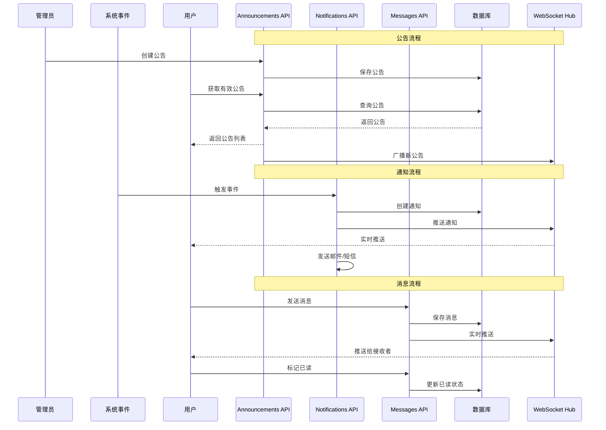
```mermaid
sequenceDiagram
    participant Admin as 管理员
    participant System as 系统事件
    participant User as 用户
    participant AnnAPI as Announcements API
    participant NotifAPI as Notifications API
    participant MsgAPI as Messages API
    participant DB as 数据库
    participant WS as WebSocket Hub

    Note over AnnAPI,WS: 公告流程
    Admin->>AnnAPI: 创建公告
    AnnAPI->>DB: 保存公告
    User->>AnnAPI: 获取有效公告
    AnnAPI->>DB: 查询公告
    DB-->>AnnAPI: 返回公告
    AnnAPI-->>User: 返回公告列表
    AnnAPI->>WS: 广播新公告

    Note over AnnAPI,WS: 通知流程
    System->>NotifAPI: 触发事件
    NotifAPI->>DB: 创建通知
    NotifAPI->>WS: 推送通知
    WS-->>User: 实时推送
    NotifAPI->>NotifAPI: 发送邮件/短信

    Note over AnnAPI,WS: 消息流程
    User->>MsgAPI: 发送消息
    MsgAPI->>DB: 保存消息
    MsgAPI->>WS: 实时推送
    WS-->>User: 推送给接收者
    User->>MsgAPI: 标记已读
    MsgAPI->>DB: 更新已读状态
```

### 通信模块路由组织

```
api/v1/
├── announcements/              # 公开API
│   ├── GET    /effective      # 获取有效公告
│   ├── GET    /:id            # 获取公告详情
│   └── POST   /:id/view       # 增加查看次数
│
├── notifications/              # 需要认证
│   ├── GET    /               # 获取通知列表
│   ├── GET    /:id            # 获取通知详情
│   ├── POST   /:id/read       # 标记已读
│   ├── POST   /batch-read     # 批量标记已读
│   ├── POST   /read-all       # 标记全部已读
│   ├── DELETE /:id            # 删除通知
│   ├── POST   /batch-delete   # 批量删除
│   ├── DELETE /delete-all     # 删除全部
│   ├── POST   /clear-read     # 清除已读
│   ├── GET    /unread-count   # 未读数量
│   ├── GET    /stats          # 通知统计
│   ├── GET    /preferences    # 偏好设置
│   ├── PUT    /preferences    # 更新偏好
│   ├── POST   /:id/resend     # 重新发送
│   └── GET    /ws-endpoint    # WebSocket端点
│
├── social/                     # 需要认证
│   └── messages/
│       ├── GET    /conversations              # 获取会话列表
│       ├── POST   /conversations              # 创建会话
│       ├── GET    /conversations/:id/messages # 获取消息
│       ├── POST   /conversations/:id/messages # 发送消息
│       └── POST   /conversations/:id/read     # 标记已读
│
└── admin/                      # 管理员API
    └── announcements/
        ├── GET    /                           # 获取公告列表
        ├── POST   /                           # 创建公告
        ├── PUT    /:id                        # 更新公告
        ├── DELETE /:id                        # 删除公告
        ├── POST   /batch/status               # 批量更新状态
        └── DELETE /batch                      # 批量删除
```

### WebSocket实时推送

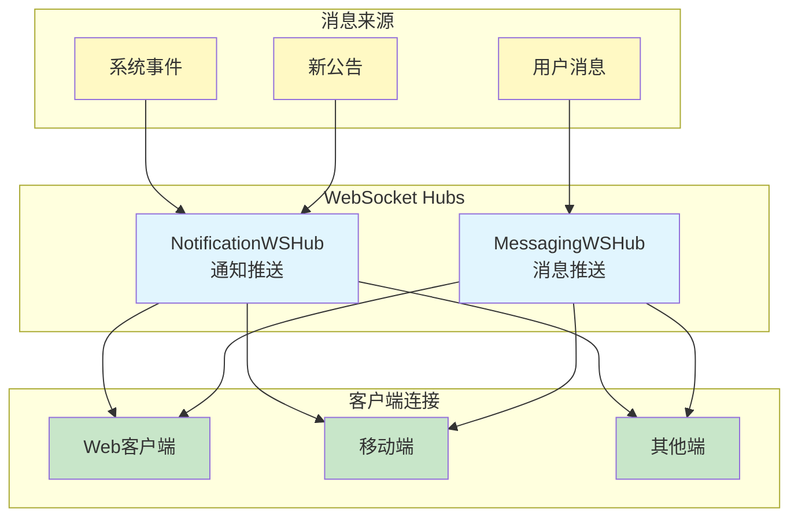
```mermaid
graph TB
    subgraph "WebSocket Hubs"
        NotifWS[NotificationWSHub<br/>通知推送]
        MsgWS[MessagingWSHub<br/>消息推送]
    end

    subgraph "客户端连接"
        Client1[Web客户端]
        Client2[移动端]
        Client3[其他端]
    end

    subgraph "消息来源"
        Event1[系统事件]
        Event2[用户消息]
        Event3[新公告]
    end

    Event1 --> NotifWS
    Event2 --> MsgWS
    Event3 --> NotifWS

    NotifWS --> Client1
    NotifWS --> Client2
    NotifWS --> Client3

    MsgWS --> Client1
    MsgWS --> Client2
    MsgWS --> Client3

    classDef hub fill:#e1f5fe
    classDef client fill:#c8e6c9
    classDef event fill:#fff9c4

    class NotifWS,MsgWS hub
    class Client1,Client2,Client3 client
    class Event1,Event2,Event3 event
```

### 废弃模块记录

在Phase 3重构中，以下模块已被废弃：

| 文件 | 废弃原因 | 替代方案 |
|------|----------|----------|
| `api/v1/shared/notification_api.go` | 功能被完全覆盖 | `api/v1/notifications/notification_api.go` |
| `api/v1/messages/message_api.go` | 旧版消息API | `api/v1/social/message_api.go` (MessageAPIV2) |

### 重构改进统计

- **删除废弃代码**: 272行
- **减少重复代码**: ~50行
- **统一响应格式**: 所有通信模块使用`pkg/response`包
- **统一参数验证**: 应用`shared.GetRequiredParam`、`shared.GetIntParam`等辅助函数
- **测试覆盖**: 178个测试全部通过

### 相关文档

- [Announcements API](../api/v1/announcements/README.md)
- [Notifications API](../api/v1/notifications/README.md)
- [Social API](../api/v1/social/README.md)
- [Phase 3 完成报告](../docs/plans/phase3_completion_report.md)

---

## AI模块架构

### AI服务整体架构

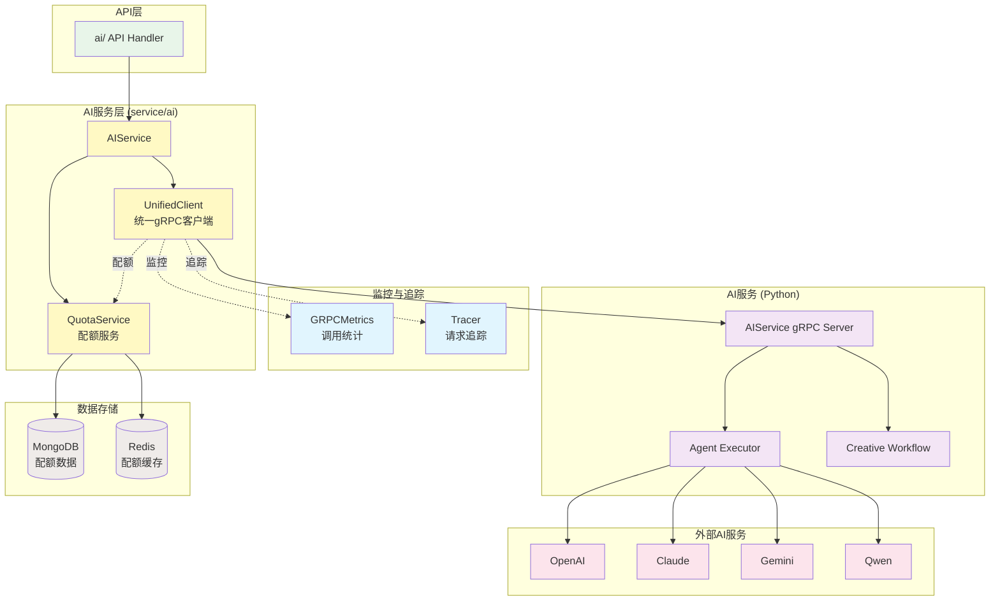
```mermaid
graph TB
    subgraph "API层"
        AIAPI[ai/ API Handler]
    end

    subgraph "AI服务层 (service/ai)"
        AIService[AIService]
        UnifiedClient[UnifiedClient<br/>统一gRPC客户端]
        QuotaService[QuotaService<br/>配额服务]
    end

    subgraph "监控与追踪"
        GRPCMetrics[GRPCMetrics<br/>调用统计]
        Tracer[Tracer<br/>请求追踪]
    end

    subgraph "AI服务 (Python)"
        AIgRPC[AIService gRPC Server]
        AgentExec[Agent Executor]
        Workflow[Creative Workflow]
    end

    subgraph "外部AI服务"
        OpenAI[OpenAI]
        Claude[Claude]
        Gemini[Gemini]
        Qwen[Qwen]
    end

    subgraph "数据存储"
        MongoQuota[(MongoDB<br/>配额数据)]
        RedisCache[(Redis<br/>配额缓存)]
    end

    AIAPI --> AIService
    AIService --> UnifiedClient
    AIService --> QuotaService

    UnifiedClient --> AIgRPC
    AIgRPC --> AgentExec
    AIgRPC --> Workflow

    AgentExec --> OpenAI
    AgentExec --> Claude
    AgentExec --> Gemini
    AgentExec --> Qwen

    UnifiedClient -.监控.-> GRPCMetrics
    UnifiedClient -.追踪.-> Tracer
    UnifiedClient -.配额.-> QuotaService

    QuotaService --> MongoQuota
    QuotaService --> RedisCache

    classDef api fill:#e8f5e9
    classDef service fill:#fff9c4
    classDef monitor fill:#e1f5fe
    classDef ai fill:#f3e5f5
    classDef external fill:#fce4ec
    classDef storage fill:#efebe9

    class AIAPI api
    class AIService,UnifiedClient,QuotaService service
    class GRPCMetrics,Tracer monitor
    class AIgRPC,AgentExec,Workflow ai
    class OpenAI,Claude,Gemini,Qwen external
    class MongoQuota,RedisCache storage
```

### gRPC调用流程

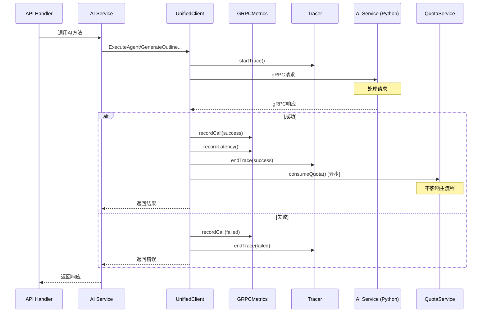
```mermaid
sequenceDiagram
    participant API as API Handler
    participant Service as AI Service
    participant Client as UnifiedClient
    participant Metrics as GRPCMetrics
    participant Tracer as Tracer
    participant AI as AI Service (Python)
    participant Quota as QuotaService

    API->>Service: 调用AI方法
    Service->>Client: ExecuteAgent/GenerateOutline...
    Client->>Tracer: startTrace()
    Client->>AI: gRPC请求

    Note over AI: 处理请求

    AI-->>Client: gRPC响应

    alt 成功
        Client->>Metrics: recordCall(success)
        Client->>Metrics: recordLatency()
        Client->>Tracer: endTrace(success)
        Client->>Quota: consumeQuota() [异步]
        Note over Quota: 不影响主流程
        Client-->>Service: 返回结果
    else 失败
        Client->>Metrics: recordCall(failed)
        Client->>Tracer: endTrace(failed)
        Client-->>Service: 返回错误
    end

    Service-->>API: 返回响应
```

### 监控架构

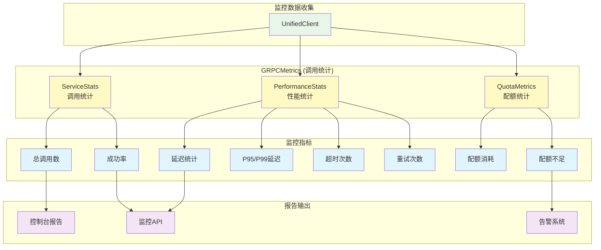
```mermaid
graph TB
    subgraph "监控数据收集"
        UnifiedClient[UnifiedClient]
    end

    subgraph "GRPCMetrics (调用统计)"
        Calls[ServiceStats<br/>调用统计]
        Performance[PerformanceStats<br/>性能统计]
        QuotaMetrics[QuotaMetrics<br/>配额统计]
    end

    subgraph "监控指标"
        TotalCalls[总调用数]
        SuccessRate[成功率]
        Latency[延迟统计]
        P95P99[P95/P99延迟]
        Timeouts[超时次数]
        Retries[重试次数]
        QuotaConsumed[配额消耗]
        QuotaShortage[配额不足]
    end

    subgraph "报告输出"
        ConsoleReport[控制台报告]
        MetricsAPI[监控API]
        AlertSystem[告警系统]
    end

    UnifiedClient --> Calls
    UnifiedClient --> Performance
    UnifiedClient --> QuotaMetrics

    Calls --> TotalCalls
    Calls --> SuccessRate

    Performance --> Latency
    Performance --> P95P99
    Performance --> Timeouts
    Performance --> Retries

    QuotaMetrics --> QuotaConsumed
    QuotaMetrics --> QuotaShortage

    TotalCalls --> ConsoleReport
    SuccessRate --> MetricsAPI
    Latency --> MetricsAPI
    QuotaShortage --> AlertSystem

    classDef client fill:#e8f5e9
    classDef metrics fill:#fff9c4
    classDef indicators fill:#e1f5fe
    classDef output fill:#f3e5f5

    class UnifiedClient client
    class Calls,Performance,QuotaMetrics metrics
    class TotalCalls,SuccessRate,Latency,P95P99,Timeouts,Retries,QuotaConsumed,QuotaShortage indicators
    class ConsoleReport,MetricsAPI,AlertSystem output
```

### 配额管理流程

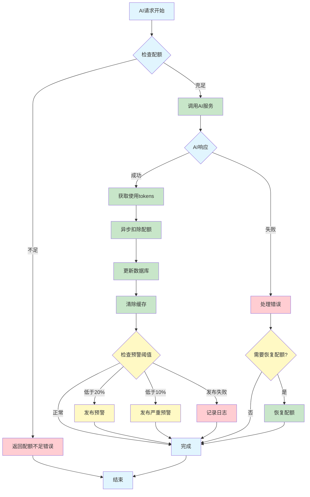
```mermaid
graph TB
    Start[AI请求开始] --> CheckQuota{检查配额}

    CheckQuota -->|充足| CallAI[调用AI服务]
    CheckQuota -->|不足| ReturnError[返回配额不足错误]

    CallAI --> AIResponse{AI响应}
    AIResponse -->|成功| GetTokens[获取使用tokens]
    AIResponse -->|失败| HandleError[处理错误]

    GetTokens --> ConsumeQuota[异步扣除配额]
    ConsumeQuota --> UpdateDB[更新数据库]
    UpdateDB --> InvalidateCache[清除缓存]
    InvalidateCache --> CheckWarning{检查预警阈值}

    CheckWarning -->|低于20%| PublishWarning[发布预警]
    CheckWarning -->|低于10%| PublishCritical[发布严重预警]
    CheckWarning -->|正常| Finish[完成]
    CheckWarning -->|发布失败| LogError[记录日志]

    PublishWarning --> Finish
    PublishCritical --> Finish
    LogError --> Finish

    HandleError --> RestoreQuota{需要恢复配额?}
    RestoreQuota -->|是| Restore[恢复配额]
    RestoreQuota -->|否| Finish
    Restore --> Finish

    ReturnError --> End[结束]
    Finish --> End

    classDef success fill:#c8e6c9
    classDef error fill:#ffcdd2
    classDef warning fill:#fff9c4
    classDef process fill:#e1f5fe

    class CallAI,GetTokens,ConsumeQuota,UpdateDB,InvalidateCache,Restore success
    class ReturnError,HandleError,LogError error
    class CheckWarning,PublishWarning,PublishCritical,RestoreQuota warning
    class CheckQuota,AIResponse,Finish,Start,End process
```

### AI服务列表

| 服务名 | 端点 | 方法 | 描述 | 超时 |
|--------|------|------|------|------|
| **ExecuteAgent** | `/grpc.AIService/ExecuteAgent` | POST | 执行AI Agent工作流 | 30s |
| **GenerateOutline** | `/grpc.AIService/GenerateOutline` | POST | 生成故事大纲 | 30s |
| **GenerateCharacters** | `/grpc.AIService/GenerateCharacters` | POST | 生成角色设定 | 30s |
| **GeneratePlot** | `/grpc.AIService/GeneratePlot` | POST | 生成情节设定 | 30s |
| **ExecuteCreativeWorkflow** | `/grpc.AIService/ExecuteCreativeWorkflow` | POST | 执行完整创作工作流 | 120s |
| **HealthCheck** | `/grpc.AIService/HealthCheck` | POST | 健康检查 | 5s |

### AI模块文件组织

```
service/ai/
├── unified_client.go          # 统一gRPC客户端
├── grpc_client.go             # 基础gRPC客户端
├── phase3_client.go           # Phase3客户端（创作相关）
├── grpc_metrics.go            # 监控指标
├── grpc_tracing.go            # 请求追踪
├── grpc_errors.go             # 错误处理
├── quota_service.go           # 配额服务
├── ai_service.go              # AI服务配置
├── text_service.go            # 文本服务
├── image_service.go           # 图片服务
├── proofread_service.go       # 校对服务
├── summarize_service.go       # 摘要服务
├── sensitive_words_service.go # 敏感词服务
├── context_service.go         # 上下文服务
├── chat_service.go            # 聊天服务
├── chat_repository.go         # 聊天仓储
├── chat_repository_memory.go  # 内存聊天仓储
├── adapter/                   # AI适配器
│   ├── adapter_interface.go   # 适配器接口
│   ├── manager.go             # 适配器管理器
│   ├── openai.go              # OpenAI适配器
│   ├── claude.go              # Claude适配器
│   ├── gemini.go              # Gemini适配器
│   ├── qwen.go                # Qwen适配器
│   ├── glm.go                 # GLM适配器
│   ├── wenxin.go              # 文心适配器
│   ├── deepseek_adapter.go    # DeepSeek适配器
│   └── retry.go               # 重试逻辑
├── dto/                       # 数据传输对象
│   ├── chat_dto.go            # 聊天DTO
│   └── writing_assistant_dto.go # 写作助手DTO
├── mocks/                     # Mock对象
│   └── ai_adapter_mock.go     # AI适配器Mock
├── ai_service_test.go         # 服务测试
└── grpc_monitor_test.go       # 监控测试
```

### 相关文档

- [gRPC对接文档](../docs/architecture/ai_grpc_integration.md)
- [配额管理指南](../docs/guides/quota_management.md)
- [AI服务配置](../docs/configuration/ai_service_config.md)

---

## 文档说明

### 图例说明

- **绿色**: 表示活跃的/正确的/新的模块或流程
- **红色**: 表示错误的/废弃的/旧的模块或流程
- **黄色**: 表示处理过程或中间状态
- **蓝色**: 表示响应或返回值

### 使用说明

1. **API层整体架构图**: 展示完整的系统架构和各层之间的关系
2. **目录结构图**: 展示API层的目录组织和模块划分
3. **请求处理流程图**: 展示从请求到响应的完整流程
4. **错误处理流程图**: 展示各种错误情况的处理逻辑
5. **重构前后对比图**: 对比重构前后的架构差异
6. **模块依赖关系图**: 展示各模块之间的依赖关系
7. **数据流图**: 展示数据在系统中的流动

### 更新记录

| 日期 | 版本 | 变更内容 |
|------|------|----------|
| 2026-02-26 | v1.0 | 初始版本，创建所有架构图 |
| 2026-02-27 | v1.1 | 添加通信模块架构详细说明 |
| 2026-02-27 | v1.2 | 添加AI模块架构、gRPC调用流程、监控架构、配额流程 |

---

**维护者**: Backend Architecture Team
**最后更新**: 2026-02-27
