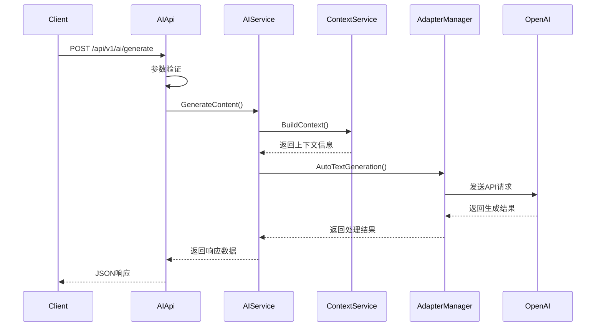
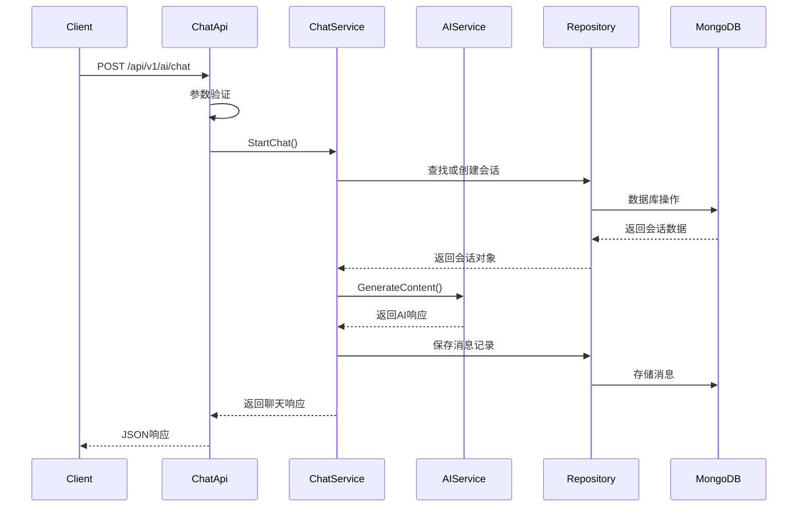

# AI模块设计文档

## 1. 概述

### 1.1 项目背景
青羽智能写作系统是一个基于AI技术的智能写作平台，旨在为用户提供全方位的写作辅助服务。AI模块是系统的核心组件，负责处理所有与人工智能相关的功能请求，包括内容生成、文本分析、智能续写、大纲生成等功能。

### 1.2 设计目标
- **智能化**: 提供高质量的AI写作辅助功能
- **上下文感知**: 基于项目上下文提供精准的AI服务
- **可扩展性**: 支持多种AI服务提供商和模型
- **高性能**: 优化响应时间和资源利用率
- **易用性**: 提供简洁明了的RESTful API接口
- **可靠性**: 具备错误处理、重试机制和熔断保护

### 1.3 技术架构
- **框架**: Go + Gin Web Framework
- **AI服务**: OpenAI API / Azure OpenAI / 其他兼容服务
- **数据存储**: MongoDB (上下文数据、聊天记录) + PostgreSQL (业务数据)
- **缓存**: Redis (上下文缓存、会话缓存)
- **配置管理**: Viper + 环境变量
- **认证授权**: JWT Token

## 2. 系统架构设计

### 2.1 整体架构

```
┌─────────────────┐    ┌─────────────────┐    ┌─────────────────┐
│   前端应用      │    │   移动端应用    │    │   第三方集成    │
└─────────────────┘    └─────────────────┘    └─────────────────┘
         │                       │                       │
         └───────────────────────┼───────────────────────┘
                                 │
                    ┌─────────────────┐
                    │   API Gateway   │
                    └─────────────────┘
                                 │
                    ┌─────────────────┐
                    │   AI Router     │
                    └─────────────────┘
                                 │
         ┌───────────────────────┼───────────────────────┐
         │                       │                       │
┌─────────────────┐    ┌─────────────────┐    ┌─────────────────┐
│   AI API        │    │   Chat API      │    │Novel Context API│
└─────────────────┘    └─────────────────┘    └─────────────────┘
         │                       │                       │
         └───────────────────────┼───────────────────────┘
                                 │
                    ┌─────────────────┐
                    │   AI Service    │
                    └─────────────────┘
                                 │
         ┌───────────────────────┼───────────────────────┐
         │                       │                       │
┌─────────────────┐    ┌─────────────────┐    ┌─────────────────┐
│ Context Service │    │Adapter Manager  │    │  Chat Service   │
└─────────────────┘    └─────────────────┘    └─────────────────┘
         │                       │                       │
┌─────────────────┐    ┌─────────────────┐    ┌─────────────────┐
│   MongoDB       │    │   OpenAI API    │    │     Redis       │
└─────────────────┘    └─────────────────┘    └─────────────────┘
```

### 2.2 模块划分

#### 2.2.1 路由层 (Router Layer)
- **文件**: `router/ai/ai_router.go`
- **职责**: 定义API路由规则，将HTTP请求路由到对应的控制器方法
- **主要功能**:
  - 路由注册和管理
  - 中间件集成（认证、日志、限流）
  - 参数预处理

#### 2.2.2 控制器层 (Controller Layer)
- **文件**: 
  - `api/v1/ai/ai_api.go` - 基础AI功能API
  - `api/v1/ai/chat_api.go` - 聊天功能API
  - `api/v1/ai/novel_context_api.go` - 小说上下文API
- **职责**: 处理HTTP请求，参数验证，调用业务服务，返回响应
- **主要功能**:
  - 请求参数绑定和验证
  - 业务逻辑调用
  - 响应格式化
  - 错误处理

#### 2.2.3 服务层 (Service Layer)
- **文件**: 
  - `service/ai/ai_service.go` - 核心AI服务
  - `service/ai/chat_service.go` - 聊天服务
  - `service/ai/context_service.go` - 上下文服务
- **职责**: 核心业务逻辑处理，协调各个子服务
- **主要功能**:
  - 业务流程编排
  - 数据转换和处理
  - 服务间调用协调

#### 2.2.4 适配器层 (Adapter Layer)
- **文件**: 
  - `service/ai/adapter/adapter_interface.go` - 适配器接口定义
  - `service/ai/adapter/openai.go` - OpenAI适配器实现
  - `service/ai/adapter/adapter_manager.go` - 适配器管理器
- **职责**: 与外部AI服务提供商的API交互
- **主要功能**:
  - API请求构建和发送
  - 响应解析和处理
  - 错误重试和恢复
  - 多服务商支持

#### 2.2.5 数据模型层 (Model Layer)
- **文件**: 
  - `models/ai/provider.go` - AI服务提供商模型
  - `models/ai/aimodel.go` - AI模型配置
  - `models/ai/chat.go` - 聊天相关模型
- **职责**: 定义数据结构和数据库操作
- **主要功能**:
  - 数据结构定义
  - 数据验证规则
  - 数据库映射

## 3. API接口设计

### 3.1 接口概览

| 接口路径 | HTTP方法 | 功能描述 | 认证要求 |
|---------|----------|----------|----------|
| `/api/v1/ai/generate` | POST | 生成内容 | 是 |
| `/api/v1/ai/continue` | POST | 续写内容 | 是 |
| `/api/v1/ai/optimize` | POST | 优化文本 | 是 |
| `/api/v1/ai/outline` | POST | 生成大纲 | 是 |
| `/api/v1/ai/analyze` | POST | 分析内容 | 否 |
| `/api/v1/ai/context/:projectId` | GET | 获取项目上下文 | 是 |
| `/api/v1/ai/context/feedback` | POST | 更新上下文反馈 | 是 |
| `/api/v1/ai/chat` | POST | 开始聊天 | 是 |
| `/api/v1/ai/chat/stream` | POST | 流式聊天 | 是 |
| `/api/v1/ai/chat/sessions` | GET | 获取会话列表 | 是 |
| `/api/v1/ai/chat/:sessionId/history` | GET | 获取聊天历史 | 是 |
| `/api/v1/ai/chat/:sessionId` | PUT | 更新会话信息 | 是 |
| `/api/v1/ai/chat/:sessionId` | DELETE | 删除会话 | 是 |
| `/api/v1/ai/chat/statistics` | GET | 获取统计信息 | 是 |
| `/api/v1/ai/novel/context/:projectId` | GET | 获取小说上下文 | 是 |
| `/api/v1/ai/novel/memory` | POST | 创建小说记忆 | 是 |
| `/api/v1/ai/novel/memory/:memoryId` | PUT | 更新记忆 | 是 |
| `/api/v1/ai/novel/memory/:memoryId` | DELETE | 删除记忆 | 是 |
| `/api/v1/ai/novel/search` | POST | 搜索上下文 | 是 |

### 3.2 统一响应格式

#### 3.2.1 成功响应
```json
{
  "code": 0,
  "message": "success",
  "data": {},
  "timestamp": 1640995200,
  "request_id": "uuid"
}
```

#### 3.2.2 错误响应
```json
{
  "code": 400,
  "message": "参数错误",
  "error": {
    "type": "validation_error",
    "details": [
      {
        "field": "projectId",
        "message": "项目ID不能为空"
      }
    ]
  },
  "timestamp": 1640995200,
  "request_id": "uuid"
}
```

### 3.3 详细接口设计

#### 3.3.1 生成内容接口

**接口信息**
- **路径**: `POST /api/v1/ai/generate`
- **功能**: 基于项目上下文和用户提示生成新内容
- **认证**: 需要JWT Token

**请求参数**
```json
{
  "projectId": "string",           // 必填，项目ID
  "chapterId": "string",           // 可选，章节ID
  "prompt": "string",              // 必填，生成提示词
  "options": {                     // 可选，生成选项
    "temperature": 0.7,            // 创造性程度 (0-1)
    "maxTokens": 1000,             // 最大生成长度
    "style": "string",             // 写作风格
    "genre": "string",             // 文体类型
    "model": "string"              // 指定模型
  }
}
```

**响应示例**
```json
{
  "code": 0,
  "message": "success",
  "data": {
    "content": "生成的内容文本...",
    "tokensUsed": 256,
    "model": "gpt-3.5-turbo",
    "generatedAt": "2024-01-01T12:00:00Z"
  },
  "timestamp": 1640995200
}
```

#### 3.3.2 聊天接口

**接口信息**
- **路径**: `POST /api/v1/ai/chat`
- **功能**: 开始AI聊天对话
- **认证**: 需要JWT Token

**请求参数**
```json
{
  "projectId": "string",           // 可选，项目ID
  "sessionId": "string",           // 可选，会话ID（续聊时提供）
  "message": "string",             // 必填，用户消息
  "useContext": true,              // 可选，是否使用项目上下文
  "model": "string"                // 可选，指定模型
}
```

**响应示例**
```json
{
  "code": 0,
  "message": "success",
  "data": {
    "sessionId": "session-uuid",
    "message": {
      "id": "message-uuid",
      "role": "assistant",
      "content": "AI回复内容...",
      "timestamp": "2024-01-01T12:00:00Z"
    },
    "tokensUsed": 150,
    "model": "gpt-3.5-turbo",
    "contextUsed": true,
    "responseTime": 1500
  },
  "timestamp": 1640995200
}
```

#### 3.3.3 流式聊天接口

**接口信息**
- **路径**: `POST /api/v1/ai/chat/stream`
- **功能**: 流式AI聊天对话
- **认证**: 需要JWT Token
- **响应类型**: Server-Sent Events (SSE)

**请求参数**
```json
{
  "projectId": "string",
  "sessionId": "string",
  "message": "string",
  "useContext": true,
  "model": "string"
}
```

**流式响应示例**
```
data: {"sessionId":"session-uuid","messageId":"msg-uuid","content":"你好","delta":"你好","tokensUsed":2,"model":"gpt-3.5-turbo","contextUsed":true,"isComplete":false,"responseTime":100}

data: {"sessionId":"session-uuid","messageId":"msg-uuid","content":"你好，我是","delta":"，我是","tokensUsed":5,"model":"gpt-3.5-turbo","contextUsed":true,"isComplete":false,"responseTime":200}

data: {"sessionId":"session-uuid","messageId":"msg-uuid","content":"你好，我是AI助手","delta":"AI助手","tokensUsed":8,"model":"gpt-3.5-turbo","contextUsed":true,"isComplete":true,"responseTime":300}
```

## 4. 数据模型设计

### 4.1 AI服务提供商模型

```go
type AIProvider struct {
    ID        string    `bson:"_id,omitempty" json:"id"`
    Name      string    `bson:"name" json:"name"`        // 服务提供商名称
    APIKey    string    `bson:"api_key" json:"-"`        // API密钥
    BaseURL   string    `bson:"base_url" json:"baseUrl"` // API基础URL
    Enabled   bool      `bson:"enabled" json:"enabled"`  // 是否启用
    CreatedAt time.Time `bson:"created_at" json:"createdAt"`
    UpdatedAt time.Time `bson:"updated_at" json:"updatedAt"`
}
```

### 4.2 AI模型配置

```go
type AIModel struct {
    ID          string    `bson:"_id,omitempty" json:"id"`
    Provider    string    `bson:"provider" json:"provider"`       // 服务提供商
    Name        string    `bson:"name" json:"name"`               // 模型名称
    Type        ModelType `bson:"type" json:"type"`               // 模型类型
    MaxTokens   int       `bson:"max_tokens" json:"maxTokens"`    // 最大令牌数
    Enabled     bool      `bson:"enabled" json:"enabled"`         // 是否启用
    Description string    `bson:"description" json:"description"` // 模型描述
    CreatedAt   time.Time `bson:"created_at" json:"createdAt"`
    UpdatedAt   time.Time `bson:"updated_at" json:"updatedAt"`
}
```

### 4.3 聊天会话模型

```go
type ChatSession struct {
    ID          primitive.ObjectID `bson:"_id,omitempty" json:"id"`
    SessionID   string            `bson:"session_id" json:"sessionId"`
    ProjectID   string            `bson:"project_id" json:"projectId"`
    Title       string            `bson:"title" json:"title"`
    Messages    []ChatMessage     `bson:"messages" json:"messages"`
    TokensUsed  int               `bson:"tokens_used" json:"tokensUsed"`
    Model       string            `bson:"model" json:"model"`
    CreatedAt   time.Time         `bson:"created_at" json:"createdAt"`
    UpdatedAt   time.Time         `bson:"updated_at" json:"updatedAt"`
}

type ChatMessage struct {
    ID        primitive.ObjectID `bson:"_id,omitempty" json:"id"`
    SessionID string            `bson:"session_id" json:"sessionId"`
    Role      string            `bson:"role" json:"role"` // user, assistant, system
    Content   string            `bson:"content" json:"content"`
    TokenUsed int               `bson:"token_used" json:"tokenUsed"`
    Timestamp time.Time         `bson:"timestamp" json:"timestamp"`
}
```

## 5. 业务流程设计

### 5.1 内容生成流程



### 5.2 聊天对话流程



## 6. 错误处理设计

### 6.1 错误分类

| 错误类型 | HTTP状态码 | 错误代码 | 描述 |
|---------|-----------|---------|------|
| 参数错误 | 400 | 400001 | 请求参数格式错误或缺失必填参数 |
| 认证错误 | 401 | 401001 | JWT Token无效或过期 |
| 权限错误 | 403 | 403001 | 用户无权限访问该资源 |
| 资源不存在 | 404 | 404001 | 请求的资源不存在 |
| 限流错误 | 429 | 429001 | 请求频率超过限制 |
| 服务器错误 | 500 | 500001 | 内部服务器错误 |
| AI服务错误 | 502 | 502001 | 外部AI服务不可用 |
| 超时错误 | 504 | 504001 | 请求处理超时 |

### 6.2 重试机制

```go
type RetryConfig struct {
    MaxRetries    int           // 最大重试次数
    InitialDelay  time.Duration // 初始延迟
    MaxDelay      time.Duration // 最大延迟
    BackoffFactor float64       // 退避因子
}
```

### 6.3 熔断器设计

```go
type CircuitBreaker struct {
    maxFailures   int           // 最大失败次数
    resetTimeout  time.Duration // 重置超时时间
    state         State         // 当前状态：Closed/Open/HalfOpen
    failures      int           // 当前失败次数
    lastFailTime  time.Time     // 最后失败时间
}
```

## 7. 性能优化设计

### 7.1 缓存策略

#### 7.1.1 上下文缓存
- **缓存键**: `context:{projectId}:{chapterId}`
- **过期时间**: 30分钟
- **更新策略**: 文档更新时主动失效

#### 7.1.2 会话缓存
- **缓存键**: `chat_session:{sessionId}`
- **过期时间**: 24小时
- **更新策略**: 会话更新时同步更新缓存

### 7.2 限流设计

#### 7.2.1 用户级限流
- **限制**: 每用户每分钟100次请求
- **算法**: 令牌桶算法
- **存储**: Redis

#### 7.2.2 IP级限流
- **限制**: 每IP每分钟1000次请求
- **算法**: 滑动窗口算法
- **存储**: Redis

### 7.3 连接池配置

```go
type PoolConfig struct {
    MaxIdleConns    int           // 最大空闲连接数
    MaxOpenConns    int           // 最大打开连接数
    ConnMaxLifetime time.Duration // 连接最大生存时间
    ConnMaxIdleTime time.Duration // 连接最大空闲时间
}
```

## 8. 安全设计

### 8.1 认证授权

#### 8.1.1 JWT Token验证
- **算法**: HS256
- **过期时间**: 24小时
- **刷新机制**: 支持Token刷新

#### 8.1.2 API密钥管理
- **存储**: 环境变量 + 加密存储
- **轮换**: 支持密钥定期轮换
- **权限**: 基于角色的访问控制

### 8.2 数据安全

#### 8.2.1 敏感数据处理
- **API密钥**: 不在响应中返回
- **用户消息**: 支持端到端加密
- **日志脱敏**: 敏感信息自动脱敏

#### 8.2.2 输入验证
- **参数验证**: 严格的参数类型和格式验证
- **内容过滤**: 敏感内容检测和过滤
- **SQL注入防护**: 使用参数化查询

## 9. 监控和日志

### 9.1 日志规范

#### 9.1.1 日志级别
- **DEBUG**: 调试信息
- **INFO**: 一般信息
- **WARN**: 警告信息
- **ERROR**: 错误信息

#### 9.1.2 日志格式
```json
{
  "timestamp": "2024-01-01T12:00:00Z",
  "level": "INFO",
  "service": "ai-service",
  "request_id": "uuid",
  "user_id": "user123",
  "message": "AI content generated successfully",
  "duration": 1500,
  "tokens_used": 256
}
```

### 9.2 监控指标

#### 9.2.1 业务指标
- **请求量**: 每秒请求数 (QPS)
- **响应时间**: P50, P95, P99延迟
- **错误率**: 4xx和5xx错误比例
- **Token使用量**: AI服务Token消耗统计

#### 9.2.2 系统指标
- **CPU使用率**: 服务器CPU占用
- **内存使用率**: 内存占用情况
- **连接数**: 数据库连接池状态
- **缓存命中率**: Redis缓存效果

## 10. 部署和运维

### 10.1 环境配置

#### 10.1.1 开发环境
```yaml
AI_SERVICE_PORT: 8080
AI_OPENAI_API_KEY: sk-xxx
AI_OPENAI_BASE_URL: https://api.openai.com/v1
MONGODB_URI: mongodb://localhost:27017/qingyu_dev
REDIS_URI: redis://localhost:6379/0
```

#### 10.1.2 生产环境
```yaml
AI_SERVICE_PORT: 8080
AI_OPENAI_API_KEY: ${OPENAI_API_KEY}
AI_OPENAI_BASE_URL: ${OPENAI_BASE_URL}
MONGODB_URI: ${MONGODB_URI}
REDIS_URI: ${REDIS_URI}
```

### 10.2 健康检查

#### 10.2.1 健康检查端点
- **路径**: `GET /health`
- **检查项**: 数据库连接、Redis连接、AI服务可用性
- **响应格式**:
```json
{
  "status": "healthy",
  "checks": {
    "database": "healthy",
    "redis": "healthy",
    "ai_service": "healthy"
  },
  "timestamp": "2024-01-01T12:00:00Z"
}
```

### 10.3 容器化部署

#### 10.3.1 Dockerfile
```dockerfile
FROM golang:1.21-alpine AS builder
WORKDIR /app
COPY . .
RUN go mod download
RUN go build -o ai-service ./cmd/ai

FROM alpine:latest
RUN apk --no-cache add ca-certificates
WORKDIR /root/
COPY --from=builder /app/ai-service .
EXPOSE 8080
CMD ["./ai-service"]
```

## 11. 测试策略

### 11.1 单元测试

#### 11.1.1 测试覆盖率要求
- **总体覆盖率**: > 80%
- **核心业务逻辑**: > 90%
- **API接口**: > 85%

#### 11.1.2 测试工具
- **测试框架**: Go testing + testify
- **Mock工具**: testify/mock
- **覆盖率工具**: go test -cover

### 11.2 集成测试

#### 11.2.1 测试场景
- **API端到端测试**: 完整的请求响应流程
- **数据库集成测试**: 数据持久化和查询
- **外部服务集成**: AI服务调用测试

### 11.3 性能测试

#### 11.3.1 测试指标
- **并发用户数**: 1000用户
- **响应时间**: P95 < 2秒
- **吞吐量**: > 500 QPS
- **错误率**: < 0.1%

## 12. 版本管理和升级

### 12.1 API版本控制

#### 12.1.1 版本策略
- **URL版本控制**: `/api/v1/`, `/api/v2/`
- **语义化版本**: major.minor.patch
- **向后兼容**: 新版本保持向后兼容

#### 12.1.2 废弃策略
- **提前通知**: 废弃前3个月通知
- **过渡期**: 提供6个月过渡期
- **迁移指南**: 提供详细的迁移文档

### 12.2 数据库迁移

#### 12.2.1 迁移策略
- **渐进式迁移**: 分步骤进行数据迁移
- **回滚机制**: 支持快速回滚到上一版本
- **数据验证**: 迁移后进行数据完整性验证

## 13. 附录

### 13.1 API设计检查清单

- [ ] URL设计符合RESTful规范
- [ ] 使用正确的HTTP方法和状态码
- [ ] 响应格式统一且符合项目规范
- [ ] 错误处理完善，包含详细错误信息
- [ ] 参数验证严格，防止无效输入
- [ ] 认证授权机制完整
- [ ] 文档完整准确，包含示例
- [ ] 性能优化合理，包含缓存和限流
- [ ] 安全措施到位，防止常见攻击
- [ ] 监控和日志完善
- [ ] 测试覆盖率达标

### 13.2 常见问题解答

#### Q: 如何选择合适的AI模型？
A: 根据任务类型选择：文本生成使用GPT系列，对话使用Chat模型，图像生成使用DALL-E系列。

#### Q: 如何处理AI服务的限流？
A: 实现指数退避重试机制，同时在应用层实现限流控制，避免超出API限制。

#### Q: 如何保证数据安全？
A: 使用HTTPS传输，敏感数据加密存储，API密钥安全管理，定期进行安全审计。

### 13.3 参考资料

- [OpenAI API文档](https://platform.openai.com/docs)
- [RESTful API设计指南](https://restfulapi.net/)
- [Go Web开发最佳实践](https://golang.org/doc/)
- [MongoDB最佳实践](https://docs.mongodb.com/manual/administration/production-notes/)