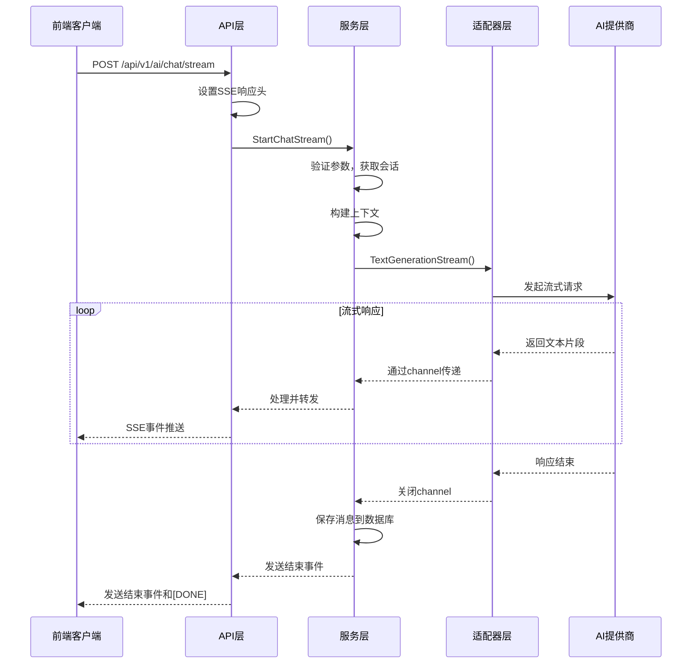
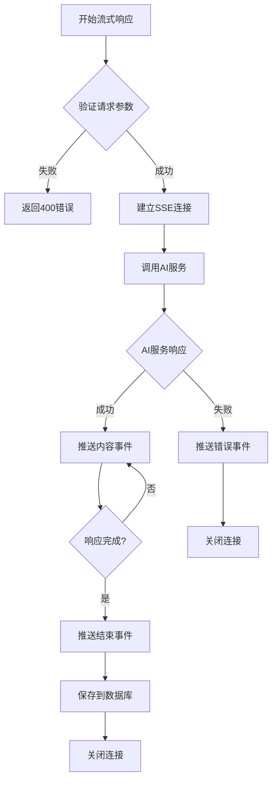

> ⚠️ **文档状态**: 已归档（2025-10-21）
> 
> 本文档基于v2.0架构设计，已被新的v2.1架构取代。
> 
> **替代文档**: 12.AI流式接口规范.md
> 
> 详见：[青羽平台模块化架构设计v2.1](../../青羽平台模块化架构设计v2.1.md)

---

# AI 流式响应设计文档

## 1. 概述

本文档描述了青羽AI系统的流式响应功能设计，包括架构设计、接口规范、数据流程和实现方案。

### 1.1 目标

- 提供实时的AI响应体验，减少用户等待时间
- 支持长文本生成的逐步输出
- 提高用户交互体验和系统响应性能
- 支持多种AI提供商的流式响应

### 1.2 技术选型

- **协议**: Server-Sent Events (SSE)
- **数据格式**: JSON
- **传输方式**: HTTP/1.1 长连接
- **编码**: UTF-8

## 2. 架构设计

### 2.1 整体架构

```
前端客户端 <---> API层 <---> 服务层 <---> 适配器层 <---> AI提供商
    |           |         |         |            |
EventSource  ContinueChat ChatService AdapterManager  OpenAI/Claude/etc
```

### 2.2 核心组件

#### 2.2.1 API层 (chat_api.go)
- **职责**: 处理HTTP请求，设置SSE响应头，管理连接
- **核心方法**: `ContinueChat` - 流式聊天接口

#### 2.2.2 服务层 (chat_service.go)
- **职责**: 业务逻辑处理，会话管理，上下文构建
- **核心方法**: `StartChatStream` - 流式聊天服务

#### 2.2.3 适配器层 (adapter/)
- **职责**: 封装不同AI提供商的API调用
- **核心接口**: `TextGenerationStream` - 流式文本生成

## 3. 接口规范

### 3.1 HTTP接口

#### 3.1.1 流式聊天接口

**请求**
```
POST /api/v1/ai/chat/stream
Content-Type: application/json

{
  "sessionId": "optional-session-id",
  "projectId": "project-123",
  "message": "用户消息内容",
  "useContext": true,
  "contextType": "novel",
  "options": {
    "model": "gpt-3.5-turbo",
    "temperature": 0.7,
    "maxTokens": 2000,
    "stream": true
  }
}
```

**响应**
```
Content-Type: text/event-stream
Cache-Control: no-cache
Connection: keep-alive
Access-Control-Allow-Origin: *

data: {"type":"start","sessionId":"session-123","messageId":"msg-456"}

data: {"type":"content","content":"你好"}

data: {"type":"content","content":"！我是"}

data: {"type":"content","content":"AI助手"}

data: {"type":"end","tokensUsed":50,"model":"gpt-3.5-turbo","responseTime":1500}

data: [DONE]
```

### 3.2 SSE事件类型

#### 3.2.1 开始事件 (start)
```json
{
  "type": "start",
  "sessionId": "session-123",
  "messageId": "msg-456",
  "timestamp": "2024-01-20T10:30:00Z"
}
```

#### 3.2.2 内容事件 (content)
```json
{
  "type": "content",
  "content": "文本片段",
  "index": 0
}
```

#### 3.2.3 结束事件 (end)
```json
{
  "type": "end",
  "tokensUsed": 50,
  "model": "gpt-3.5-turbo",
  "responseTime": 1500,
  "finishReason": "stop"
}
```

#### 3.2.4 错误事件 (error)
```json
{
  "type": "error",
  "code": "RATE_LIMIT_EXCEEDED",
  "message": "请求频率超限",
  "retryAfter": 60
}
```

## 4. 数据流程

### 4.1 流式响应流程



### 4.2 错误处理流程



## 5. 实现方案

### 5.1 核心数据结构

#### 5.1.1 流式响应事件
```go
type StreamEvent struct {
    Type      string      `json:"type"`      // start, content, end, error
    Content   string      `json:"content,omitempty"`
    SessionID string      `json:"sessionId,omitempty"`
    MessageID string      `json:"messageId,omitempty"`
    Index     int         `json:"index,omitempty"`
    TokensUsed int        `json:"tokensUsed,omitempty"`
    Model     string      `json:"model,omitempty"`
    Error     *StreamError `json:"error,omitempty"`
    Timestamp time.Time   `json:"timestamp"`
}

type StreamError struct {
    Code       string `json:"code"`
    Message    string `json:"message"`
    RetryAfter int    `json:"retryAfter,omitempty"`
}
```

#### 5.1.2 流式请求选项
```go
type StreamOptions struct {
    BufferSize    int           `json:"bufferSize"`    // 缓冲区大小
    FlushInterval time.Duration `json:"flushInterval"` // 刷新间隔
    Timeout       time.Duration `json:"timeout"`       // 超时时间
    KeepAlive     bool          `json:"keepAlive"`     // 保持连接
}
```

### 5.2 关键实现点

#### 5.2.1 连接管理
- 使用context控制连接生命周期
- 实现优雅的连接关闭
- 处理客户端断开连接的情况

#### 5.2.2 错误处理
- 网络错误重试机制
- AI服务错误的优雅降级
- 超时处理和资源清理

#### 5.2.3 性能优化
- 合理的缓冲区大小设置
- 批量发送小片段内容
- 内存使用优化

## 6. 安全考虑

### 6.1 认证授权
- JWT token验证
- 会话权限检查
- 项目访问权限验证

### 6.2 限流控制
- 基于用户的请求频率限制
- 并发连接数限制
- 资源使用监控

### 6.3 数据安全
- 敏感信息过滤
- 输入内容验证
- 输出内容审核

## 7. 监控和日志

### 7.1 关键指标
- 连接建立成功率
- 平均响应时间
- 错误率统计
- 并发连接数

### 7.2 日志记录
- 请求开始和结束日志
- 错误详细信息记录
- 性能指标记录
- 用户行为追踪

## 8. 测试策略

### 8.1 单元测试
- 各个组件的独立测试
- Mock AI服务响应
- 错误场景覆盖

### 8.2 集成测试
- 端到端流式响应测试
- 多客户端并发测试
- 长时间连接稳定性测试

### 8.3 性能测试
- 高并发场景测试
- 大文本流式输出测试
- 内存泄漏检测

## 9. 部署和运维

### 9.1 配置管理
- 流式响应相关配置项
- 不同环境的配置差异
- 动态配置更新机制

### 9.2 负载均衡
- 支持多实例部署
- 会话粘性处理
- 健康检查机制

### 9.3 故障恢复
- 服务重启后的连接恢复
- 数据一致性保证
- 降级方案设计

## 10. 未来扩展

### 10.1 功能扩展
- 支持多模态流式响应（图片、音频）
- 实时协作编辑功能
- 自定义流式处理插件

### 10.2 性能优化
- HTTP/2 Server Push支持
- WebSocket协议支持
- 边缘计算部署

### 10.3 生态集成
- 第三方AI服务接入
- 插件系统设计
- API开放平台