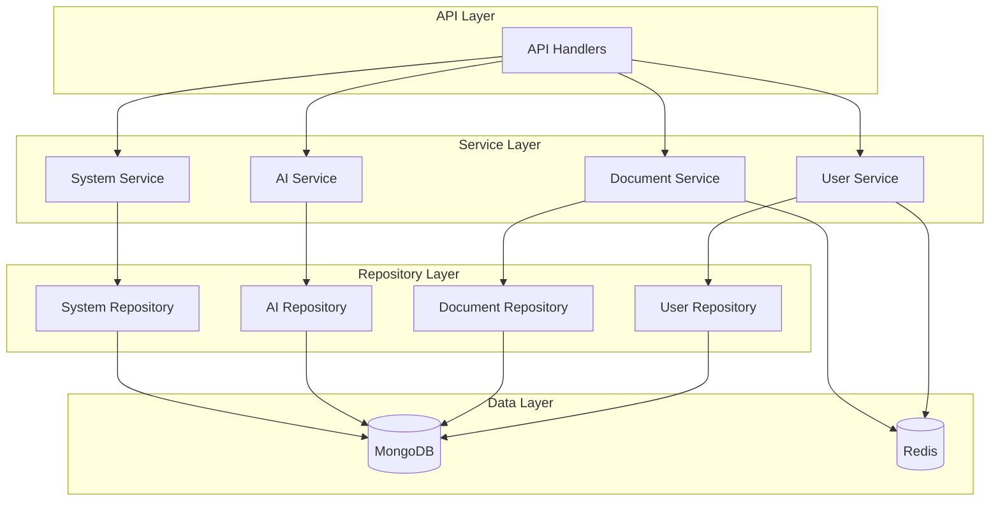

# Repository层与Service层架构重新设计

## 1. 设计目标

### 1.1 核心目标
- **统一接口**：建立统一的Repository和Service接口标准
- **清晰分层**：明确Repository层和Service层的职责边界
- **类型安全**：解决泛型类型不匹配问题
- **易于维护**：简化代码结构，提高可维护性
- **向后兼容**：确保现有代码能够平滑迁移

### 1.2 设计原则
- **单一职责**：每层只负责自己的核心职责
- **依赖倒置**：高层模块不依赖低层模块，都依赖抽象
- **接口隔离**：使用小而专一的接口
- **开闭原则**：对扩展开放，对修改关闭

## 2. 新架构设计

### 2.1 整体架构图



### 2.2 分层职责定义

#### Repository层职责
- **数据访问**：提供统一的数据访问接口
- **数据映射**：处理数据库模型与业务模型的转换
- **查询优化**：提供高效的查询方法
- **事务管理**：处理数据一致性

#### Service层职责
- **业务逻辑**：实现核心业务规则和流程
- **数据验证**：验证业务数据的完整性和有效性
- **权限控制**：处理业务权限和访问控制
- **事务协调**：协调多个Repository的操作

## 3. 统一接口设计

### 3.1 Repository层接口

#### 3.1.1 基础Repository接口

```go
// repository/interfaces/base_repository.go
package interfaces

import (
    "context"
    "time"
)

// Entity 实体接口
type Entity interface {
    GetID() string
    SetID(id string)
    GetCreatedAt() time.Time
    SetCreatedAt(t time.Time)
    GetUpdatedAt() time.Time
    SetUpdatedAt(t time.Time)
}

// Filter 过滤器接口
type Filter interface {
    GetConditions() map[string]interface{}
    GetSort() map[string]int
    GetFields() []string
    Validate() error
}

// Pagination 分页参数
type Pagination struct {
    Page     int `json:"page" validate:"min=1"`
    PageSize int `json:"pageSize" validate:"min=1,max=100"`
    Skip     int `json:"skip,omitempty"`
}

// PagedResult 分页结果
type PagedResult[T Entity] struct {
    Data       []T   `json:"data"`
    Total      int64 `json:"total"`
    Page       int   `json:"page"`
    PageSize   int   `json:"pageSize"`
    TotalPages int   `json:"totalPages"`
    HasNext    bool  `json:"hasNext"`
    HasPrev    bool  `json:"hasPrev"`
}

// BaseRepository 基础Repository接口
type BaseRepository[T Entity, F Filter] interface {
    // 基础CRUD操作
    Create(ctx context.Context, entity T) error
    GetByID(ctx context.Context, id string) (T, error)
    Update(ctx context.Context, id string, updates map[string]interface{}) error
    Delete(ctx context.Context, id string) error
    HardDelete(ctx context.Context, id string) error
    
    // 查询操作
    List(ctx context.Context, filter F) ([]T, error)
    Count(ctx context.Context, filter F) (int64, error)
    Exists(ctx context.Context, id string) (bool, error)
    
    // 分页查询
    FindWithPagination(ctx context.Context, filter F, pagination Pagination) (*PagedResult[T], error)
    
    // 批量操作
    BatchCreate(ctx context.Context, entities []T) error
    BatchUpdate(ctx context.Context, ids []string, updates map[string]interface{}) error
    BatchDelete(ctx context.Context, ids []string) error
    
    // 健康检查
    Health(ctx context.Context) error
}
```

#### 3.1.2 用户Repository接口

```go
// repository/interfaces/user_repository.go
package interfaces

import (
    "context"
    "time"
    
    "Qingyu_backend/models/system"
)

// UserFilter 用户查询过滤器
type UserFilter struct {
    ID       string    `json:"id,omitempty"`
    Username string    `json:"username,omitempty"`
    Email    string    `json:"email,omitempty"`
    Status   string    `json:"status,omitempty"`
    FromDate time.Time `json:"from_date,omitempty"`
    ToDate   time.Time `json:"to_date,omitempty"`
    Limit    int64     `json:"limit,omitempty"`
    Offset   int64     `json:"offset,omitempty"`
}

// GetConditions 获取查询条件
func (f UserFilter) GetConditions() map[string]interface{} {
    conditions := make(map[string]interface{})
    
    if f.ID != "" {
        conditions["_id"] = f.ID
    }
    if f.Username != "" {
        conditions["username"] = f.Username
    }
    if f.Email != "" {
        conditions["email"] = f.Email
    }
    if f.Status != "" {
        conditions["status"] = f.Status
    }
    if !f.FromDate.IsZero() {
        conditions["created_at"] = map[string]interface{}{
            "$gte": f.FromDate,
        }
    }
    if !f.ToDate.IsZero() {
        if conditions["created_at"] == nil {
            conditions["created_at"] = make(map[string]interface{})
        }
        conditions["created_at"].(map[string]interface{})["$lte"] = f.ToDate
    }
    
    return conditions
}

// GetSort 获取排序条件
func (f UserFilter) GetSort() map[string]int {
    return map[string]int{
        "created_at": -1,
    }
}

// GetFields 获取字段选择
func (f UserFilter) GetFields() []string {
    return []string{}
}

// Validate 验证过滤器
func (f UserFilter) Validate() error {
    if f.Limit < 0 {
        return NewRepositoryError(ErrorTypeValidation, "Limit不能为负数", nil)
    }
    if f.Offset < 0 {
        return NewRepositoryError(ErrorTypeValidation, "Offset不能为负数", nil)
    }
    if !f.FromDate.IsZero() && !f.ToDate.IsZero() && f.FromDate.After(f.ToDate) {
        return NewRepositoryError(ErrorTypeValidation, "开始时间不能晚于结束时间", nil)
    }
    return nil
}

// UserRepository 用户Repository接口
type UserRepository interface {
    BaseRepository[*system.User, UserFilter]
    
    // 用户特定的查询方法
    GetByUsername(ctx context.Context, username string) (*system.User, error)
    GetByEmail(ctx context.Context, email string) (*system.User, error)
    ExistsByUsername(ctx context.Context, username string) (bool, error)
    ExistsByEmail(ctx context.Context, email string) (bool, error)
    
    // 用户状态管理
    UpdateLastLogin(ctx context.Context, id string) error
    UpdatePassword(ctx context.Context, id string, hashedPassword string) error
    GetActiveUsers(ctx context.Context, limit int64) ([]*system.User, error)
    
    // 事务操作
    Transaction(ctx context.Context, fn func(ctx context.Context, repo UserRepository) error) error
}
```

### 3.2 Service层接口

#### 3.2.1 基础Service接口

```go
// service/interfaces/base_service.go
package interfaces

import (
    "context"
    "time"
)

// BaseService 基础Service接口
type BaseService interface {
    // 服务生命周期
    Initialize(ctx context.Context) error
    Health(ctx context.Context) error
    Close(ctx context.Context) error
    
    // 服务信息
    GetServiceName() string
    GetVersion() string
}

// ServiceError 服务错误类型
type ServiceError struct {
    Type      string    `json:"type"`
    Message   string    `json:"message"`
    Cause     error     `json:"cause,omitempty"`
    Service   string    `json:"service"`
    Timestamp time.Time `json:"timestamp"`
}

func (e *ServiceError) Error() string {
    if e.Cause != nil {
        return fmt.Sprintf("[%s] %s: %s (caused by: %v)", e.Service, e.Type, e.Message, e.Cause)
    }
    return fmt.Sprintf("[%s] %s: %s", e.Service, e.Type, e.Message)
}

// 错误类型常量
const (
    ErrorTypeValidation   = "VALIDATION"
    ErrorTypeBusiness     = "BUSINESS"
    ErrorTypeNotFound     = "NOT_FOUND"
    ErrorTypeUnauthorized = "UNAUTHORIZED"
    ErrorTypeForbidden    = "FORBIDDEN"
    ErrorTypeInternal     = "INTERNAL"
    ErrorTypeTimeout      = "TIMEOUT"
    ErrorTypeExternal     = "EXTERNAL"
)

// NewServiceError 创建服务错误
func NewServiceError(service, errorType, message string, cause error) *ServiceError {
    return &ServiceError{
        Type:      errorType,
        Message:   message,
        Cause:     cause,
        Service:   service,
        Timestamp: time.Now(),
    }
}
```

#### 3.2.2 用户Service接口

```go
// service/interfaces/user_service.go
package interfaces

import (
    "context"
    
    "Qingyu_backend/models/system"
    "Qingyu_backend/repository/interfaces"
)

// UserService 用户服务接口
type UserService interface {
    BaseService
    
    // 用户管理
    CreateUser(ctx context.Context, req *CreateUserRequest) (*CreateUserResponse, error)
    GetUser(ctx context.Context, req *GetUserRequest) (*GetUserResponse, error)
    UpdateUser(ctx context.Context, req *UpdateUserRequest) (*UpdateUserResponse, error)
    DeleteUser(ctx context.Context, req *DeleteUserRequest) (*DeleteUserResponse, error)
    ListUsers(ctx context.Context, req *ListUsersRequest) (*ListUsersResponse, error)
    
    // 用户认证
    RegisterUser(ctx context.Context, req *RegisterUserRequest) (*RegisterUserResponse, error)
    LoginUser(ctx context.Context, req *LoginUserRequest) (*LoginUserResponse, error)
    LogoutUser(ctx context.Context, req *LogoutUserRequest) (*LogoutUserResponse, error)
    ValidateToken(ctx context.Context, req *ValidateTokenRequest) (*ValidateTokenResponse, error)
    
    // 用户状态管理
    UpdateLastLogin(ctx context.Context, req *UpdateLastLoginRequest) (*UpdateLastLoginResponse, error)
    UpdatePassword(ctx context.Context, req *UpdatePasswordRequest) (*UpdatePasswordResponse, error)
    ResetPassword(ctx context.Context, req *ResetPasswordRequest) (*ResetPasswordResponse, error)
    
    // 用户权限管理
    AssignRole(ctx context.Context, req *AssignRoleRequest) (*AssignRoleResponse, error)
    RemoveRole(ctx context.Context, req *RemoveRoleRequest) (*RemoveRoleResponse, error)
    GetUserRoles(ctx context.Context, req *GetUserRolesRequest) (*GetUserRolesResponse, error)
    GetUserPermissions(ctx context.Context, req *GetUserPermissionsRequest) (*GetUserPermissionsResponse, error)
}

// 请求和响应结构体
type CreateUserRequest struct {
    Username string `json:"username" validate:"required,min=3,max=50"`
    Email    string `json:"email" validate:"required,email"`
    Password string `json:"password" validate:"required,min=6"`
    Role     string `json:"role,omitempty"`
}

type CreateUserResponse struct {
    User *system.User `json:"user"`
}

type GetUserRequest struct {
    ID string `json:"id" validate:"required"`
}

type GetUserResponse struct {
    User *system.User `json:"user"`
}

// ... 其他请求响应结构体
```

## 4. 依赖注入设计

### 4.1 服务容器

```go
// service/container/service_container.go
package container

import (
    "context"
    "fmt"
    
    "Qingyu_backend/repository/interfaces"
    "Qingyu_backend/service/interfaces"
)

// ServiceContainer 服务容器
type ServiceContainer struct {
    repositoryFactory interfaces.RepositoryFactory
    services          map[string]interfaces.BaseService
    initialized       bool
}

// NewServiceContainer 创建服务容器
func NewServiceContainer(repositoryFactory interfaces.RepositoryFactory) *ServiceContainer {
    return &ServiceContainer{
        repositoryFactory: repositoryFactory,
        services:          make(map[string]interfaces.BaseService),
        initialized:       false,
    }
}

// RegisterService 注册服务
func (c *ServiceContainer) RegisterService(name string, service interfaces.BaseService) error {
    if c.services[name] != nil {
        return fmt.Errorf("服务 %s 已存在", name)
    }
    
    c.services[name] = service
    return nil
}

// GetService 获取服务
func (c *ServiceContainer) GetService(name string) (interfaces.BaseService, error) {
    service, exists := c.services[name]
    if !exists {
        return nil, fmt.Errorf("服务 %s 不存在", name)
    }
    
    return service, nil
}

// Initialize 初始化所有服务
func (c *ServiceContainer) Initialize(ctx context.Context) error {
    if c.initialized {
        return nil
    }
    
    for name, service := range c.services {
        if err := service.Initialize(ctx); err != nil {
            return fmt.Errorf("初始化服务 %s 失败: %w", name, err)
        }
    }
    
    c.initialized = true
    return nil
}
```

### 4.2 服务实现

```go
// service/user/user_service.go
package user

import (
    "context"
    "fmt"
    
    "Qingyu_backend/models/system"
    "Qingyu_backend/repository/interfaces"
    "Qingyu_backend/service/interfaces"
)

// UserServiceImpl 用户服务实现
type UserServiceImpl struct {
    userRepo interfaces.UserRepository
    name     string
    version  string
}

// NewUserService 创建用户服务
func NewUserService(userRepo interfaces.UserRepository) interfaces.UserService {
    return &UserServiceImpl{
        userRepo: userRepo,
        name:     "UserService",
        version:  "1.0.0",
    }
}

// Initialize 初始化服务
func (s *UserServiceImpl) Initialize(ctx context.Context) error {
    return s.userRepo.Health(ctx)
}

// Health 健康检查
func (s *UserServiceImpl) Health(ctx context.Context) error {
    return s.userRepo.Health(ctx)
}

// Close 关闭服务
func (s *UserServiceImpl) Close(ctx context.Context) error {
    return nil
}

// GetServiceName 获取服务名称
func (s *UserServiceImpl) GetServiceName() string {
    return s.name
}

// GetVersion 获取服务版本
func (s *UserServiceImpl) GetVersion() string {
    return s.version
}

// CreateUser 创建用户
func (s *UserServiceImpl) CreateUser(ctx context.Context, req *interfaces.CreateUserRequest) (*interfaces.CreateUserResponse, error) {
    // 1. 验证请求数据
    if err := s.validateCreateUserRequest(req); err != nil {
        return nil, interfaces.NewServiceError(s.name, interfaces.ErrorTypeValidation, "请求数据验证失败", err)
    }
    
    // 2. 检查用户是否已存在
    exists, err := s.userRepo.ExistsByUsername(ctx, req.Username)
    if err != nil {
        return nil, interfaces.NewServiceError(s.name, interfaces.ErrorTypeInternal, "检查用户名失败", err)
    }
    if exists {
        return nil, interfaces.NewServiceError(s.name, interfaces.ErrorTypeBusiness, "用户名已存在", nil)
    }
    
    exists, err = s.userRepo.ExistsByEmail(ctx, req.Email)
    if err != nil {
        return nil, interfaces.NewServiceError(s.name, interfaces.ErrorTypeInternal, "检查邮箱失败", err)
    }
    if exists {
        return nil, interfaces.NewServiceError(s.name, interfaces.ErrorTypeBusiness, "邮箱已存在", nil)
    }
    
    // 3. 创建用户对象
    user := &system.User{
        Username: req.Username,
        Email:    req.Email,
        Password: req.Password,
        Role:     req.Role,
    }
    
    // 4. 设置密码
    if err := user.SetPassword(req.Password); err != nil {
        return nil, interfaces.NewServiceError(s.name, interfaces.ErrorTypeInternal, "设置密码失败", err)
    }
    
    // 5. 保存到数据库
    if err := s.userRepo.Create(ctx, user); err != nil {
        return nil, interfaces.NewServiceError(s.name, interfaces.ErrorTypeInternal, "创建用户失败", err)
    }
    
    return &interfaces.CreateUserResponse{
        User: user,
    }, nil
}

// validateCreateUserRequest 验证创建用户请求
func (s *UserServiceImpl) validateCreateUserRequest(req *interfaces.CreateUserRequest) error {
    if req.Username == "" {
        return fmt.Errorf("用户名不能为空")
    }
    if req.Email == "" {
        return fmt.Errorf("邮箱不能为空")
    }
    if req.Password == "" {
        return fmt.Errorf("密码不能为空")
    }
    return nil
}

// ... 其他方法实现
```

## 5. 迁移计划

### 5.1 阶段一：接口统一（1-2天）
1. 创建新的统一接口定义
2. 修复 `UserFilter` 缺少ID字段的问题
3. 更新 `BaseRepository` 接口定义

### 5.2 阶段二：Repository层重构（2-3天）
1. 实现新的Repository接口
2. 更新MongoDB实现
3. 移除旧的适配器

### 5.3 阶段三：Service层重构（2-3天）
1. 实现新的Service接口
2. 更新服务容器
3. 实现依赖注入

### 5.4 阶段四：测试和验证（1-2天）
1. 编写单元测试
2. 集成测试
3. 性能测试

## 6. 实施建议

### 6.1 立即行动
1. 创建新的接口定义文件
2. 修复 `UserFilter` 结构体
3. 更新 `BaseRepository` 接口

### 6.2 渐进式迁移
1. 保持旧接口可用
2. 逐步迁移到新接口
3. 最后移除旧代码

### 6.3 测试策略
1. 每个阶段都要有测试
2. 确保向后兼容性
3. 性能不能下降

## 7. 总结

这个重新设计的架构解决了以下问题：

1. **接口统一**：建立了统一的Repository和Service接口标准
2. **类型安全**：修复了泛型类型不匹配问题
3. **职责清晰**：明确了各层的职责边界
4. **易于维护**：简化了代码结构
5. **向后兼容**：确保现有代码能够平滑迁移

通过这个新架构，项目将具有更好的可维护性、可扩展性和可测试性。
