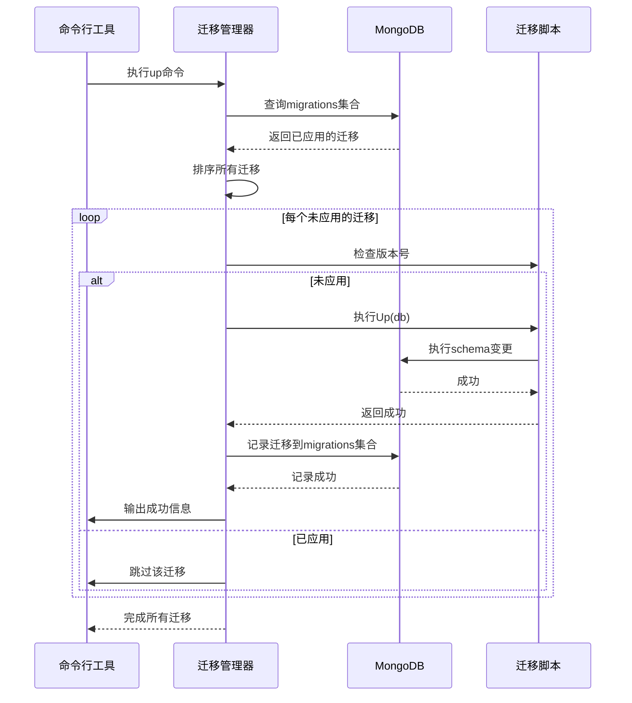
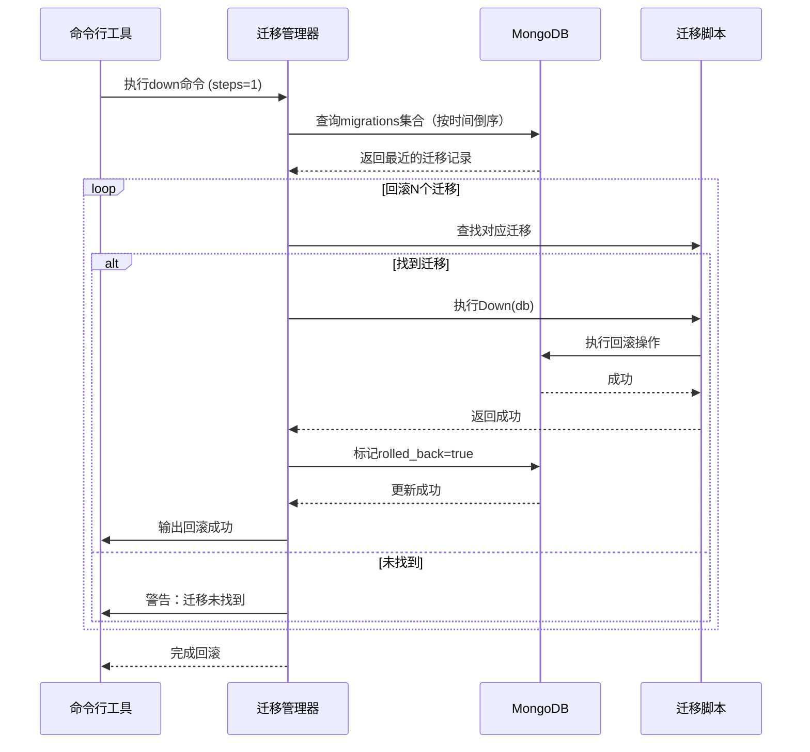

# 数据库迁移系统设计

> **文档版本**: v1.0  
> **创建日期**: 2025-10-21  
> **最后更新**: 2025-10-21  
> **状态**: ✅ 设计完成

---

## 1. 需求概述

### 1.1 功能描述

数据库迁移系统（Database Migration System）为青羽后端提供数据库schema变更管理能力，支持版本控制、正向迁移、回滚、种子数据等功能，确保数据库schema变更的可追溯、可回滚和可重复执行。

### 1.2 业务价值

- **版本控制**：追踪所有数据库schema变更历史
- **团队协作**：多人开发时避免schema冲突
- **环境一致性**：确保开发、测试、生产环境数据库结构一致
- **安全保障**：支持回滚，降低变更风险
- **快速搭建**：通过种子数据快速搭建测试环境

### 1.3 应用场景

- **Schema变更**：添加/删除字段、修改字段类型
- **索引管理**：创建/删除索引、修改索引
- **数据迁移**：历史数据格式转换、数据清洗
- **测试数据**：快速填充测试数据
- **环境初始化**：新环境快速搭建
- **回滚操作**：变更失败后快速恢复

---

## 2. 架构设计

### 2.1 整体架构

```
┌─────────────────────────────────────────────┐
│        数据库迁移系统架构                      │
├─────────────────────────────────────────────┤
│                                             │
│  ┌────────────────────────────────────┐   │
│  │   命令行工具 (cmd/migrate)          │   │
│  │   - up / down / status / seed     │   │
│  │   - reset / create                │   │
│  └────────────────────────────────────┘   │
│                 ↓                          │
│  ┌────────────────────────────────────┐   │
│  │   迁移管理器 (migration.Manager)    │   │
│  │   - Register()                     │   │
│  │   - Up() / Down()                  │   │
│  │   - Status()                       │   │
│  │   - Reset()                        │   │
│  └────────────────────────────────────┘   │
│                 ↓                          │
│  ┌────────────────────────────────────┐   │
│  │   迁移接口 (Migration Interface)    │   │
│  │   - Version()                      │   │
│  │   - Description()                  │   │
│  │   - Up(db)                         │   │
│  │   - Down(db)                       │   │
│  └────────────────────────────────────┘   │
│         ↙              ↘                   │
│  ┌──────────┐    ┌──────────┐            │
│  │ Schema   │    │ 种子数据  │            │
│  │ 迁移脚本  │    │ 脚本      │            │
│  └──────────┘    └──────────┘            │
│         ↓              ↓                   │
│  ┌────────────────────────────────────┐   │
│  │   MongoDB数据库                     │   │
│  │   - 业务集合                        │   │
│  │   - migrations集合（迁移记录）       │   │
│  └────────────────────────────────────┘   │
└─────────────────────────────────────────────┘
```

### 2.2 迁移执行流程



### 2.3 回滚流程



---

## 3. 详细设计

### 3.1 核心数据结构

#### 3.1.1 迁移记录模型

```go
// 实现文件：migration/manager.go

// MigrationRecord 迁移记录
// 存储在MongoDB的migrations集合中
type MigrationRecord struct {
    Version      string     `bson:"version" json:"version"`           // 版本号（唯一）
    Description  string     `bson:"description" json:"description"`   // 描述
    AppliedAt    time.Time  `bson:"applied_at" json:"appliedAt"`      // 应用时间
    RolledBack   bool       `bson:"rolled_back" json:"rolledBack"`    // 是否已回滚
    RolledBackAt *time.Time `bson:"rolled_back_at,omitempty" json:"rolledBackAt,omitempty"` // 回滚时间
}
```

**设计要点**：
- `Version` 字段用于唯一标识迁移，使用3位数字（001, 002, 003...）
- `RolledBack` 布尔字段标记是否已回滚，避免重复回滚
- `RolledBackAt` 使用指针类型，未回滚时为nil

#### 3.1.2 迁移接口

```go
// 实现文件：migration/manager.go

// Migration 迁移接口
// 所有迁移脚本必须实现此接口
type Migration interface {
    Version() string                                      // 版本号
    Description() string                                  // 描述
    Up(ctx context.Context, db *mongo.Database) error    // 正向迁移
    Down(ctx context.Context, db *mongo.Database) error  // 回滚迁移
}
```

**设计原则**：
- **向后兼容**：Up()操作不能破坏现有数据
- **可回滚**：Down()必须能完全撤销Up()的操作
- **幂等性**：多次执行Up()应该安全（通过版本号检查）
- **原子性**：尽可能使用事务，确保操作的原子性

#### 3.1.3 迁移管理器

```go
// 实现文件：migration/manager.go

// Manager 迁移管理器
type Manager struct {
    db         *mongo.Database      // MongoDB数据库连接
    collection *mongo.Collection    // migrations集合
    migrations []Migration           // 已注册的迁移列表
}

// 核心方法
func NewManager(db *mongo.Database) *Manager
func (m *Manager) Register(migration Migration)
func (m *Manager) RegisterMultiple(migrations ...Migration)
func (m *Manager) Up(ctx context.Context) error
func (m *Manager) Down(ctx context.Context, steps int) error
func (m *Manager) Status(ctx context.Context) error
func (m *Manager) Reset(ctx context.Context) error
```

---

### 3.2 迁移管理器实现

#### 3.2.1 正向迁移（Up）

```go
// 实现文件：migration/manager.go (58-101行)

func (m *Manager) Up(ctx context.Context) error {
    // 1. 获取已应用的迁移版本
    appliedVersions, err := m.getAppliedVersions(ctx)
    if err != nil {
        return fmt.Errorf("failed to get applied versions: %w", err)
    }
    
    // 2. 按版本号排序迁移
    m.sortMigrations()
    
    // 3. 执行未应用的迁移
    for _, migration := range m.migrations {
        version := migration.Version()
        
        // 检查是否已应用
        if appliedVersions[version] {
            fmt.Printf("Migration %s already applied, skipping\n", version)
            continue
        }
        
        fmt.Printf("Applying migration %s: %s\n", version, migration.Description())
        
        // 执行迁移
        if err := migration.Up(ctx, m.db); err != nil {
            return fmt.Errorf("failed to apply migration %s: %w", version, err)
        }
        
        // 记录迁移
        record := MigrationRecord{
            Version:     version,
            Description: migration.Description(),
            AppliedAt:   time.Now(),
            RolledBack:  false,
        }
        
        if _, err := m.collection.InsertOne(ctx, record); err != nil {
            return fmt.Errorf("failed to record migration %s: %w", version, err)
        }
        
        fmt.Printf("✓ Migration %s applied successfully\n", version)
    }
    
    return nil
}
```

**设计亮点**：
- ✅ 自动跳过已应用的迁移（幂等性）
- ✅ 按版本号排序执行（确保顺序）
- ✅ 每个迁移执行后立即记录（避免中断导致状态不一致）
- ✅ 详细的日志输出（便于调试）

#### 3.2.2 回滚迁移（Down）

```go
// 实现文件：migration/manager.go (104-163行)

func (m *Manager) Down(ctx context.Context, steps int) error {
    // 1. 获取已应用的迁移（按时间倒序）
    appliedRecords, err := m.getAppliedRecords(ctx)
    if err != nil {
        return fmt.Errorf("failed to get applied migrations: %w", err)
    }
    
    if len(appliedRecords) == 0 {
        fmt.Println("No migrations to rollback")
        return nil
    }
    
    // 2. 确定要回滚的数量
    rollbackCount := steps
    if steps <= 0 || steps > len(appliedRecords) {
        rollbackCount = len(appliedRecords)
    }
    
    // 3. 创建迁移映射
    migrationMap := make(map[string]Migration)
    for _, migration := range m.migrations {
        migrationMap[migration.Version()] = migration
    }
    
    // 4. 按应用时间倒序回滚
    for i := 0; i < rollbackCount; i++ {
        record := appliedRecords[i]
        migration, exists := migrationMap[record.Version]
        
        if !exists {
            fmt.Printf("Warning: Migration %s not found, skipping\n", record.Version)
            continue
        }
        
        fmt.Printf("Rolling back migration %s: %s\n", record.Version, migration.Description())
        
        // 执行回滚
        if err := migration.Down(ctx, m.db); err != nil {
            return fmt.Errorf("failed to rollback migration %s: %w", record.Version, err)
        }
        
        // 更新记录
        now := time.Now()
        update := bson.M{
            "$set": bson.M{
                "rolled_back":    true,
                "rolled_back_at": now,
            },
        }
        
        filter := bson.M{"version": record.Version}
        if _, err := m.collection.UpdateOne(ctx, filter, update); err != nil {
            return fmt.Errorf("failed to update migration record %s: %w", record.Version, err)
        }
        
        fmt.Printf("✓ Migration %s rolled back successfully\n", record.Version)
    }
    
    return nil
}
```

**设计亮点**：
- ✅ 支持部分回滚（steps参数）
- ✅ 按应用时间倒序回滚（后进先出）
- ✅ 保留回滚历史（标记而非删除记录）
- ✅ 优雅降级（迁移不存在时跳过并警告）

#### 3.2.3 状态查询（Status）

```go
// 实现文件：migration/manager.go (166-194行)

func (m *Manager) Status(ctx context.Context) error {
    // 获取已应用的迁移
    appliedVersions, err := m.getAppliedVersions(ctx)
    if err != nil {
        return fmt.Errorf("failed to get applied versions: %w", err)
    }
    
    // 排序迁移
    m.sortMigrations()
    
    fmt.Println("\n=== Migration Status ===")
    fmt.Printf("%-20s %-10s %-50s\n", "VERSION", "STATUS", "DESCRIPTION")
    fmt.Println("--------------------------------------------------------------------------------")
    
    for _, migration := range m.migrations {
        version := migration.Version()
        status := "Pending"
        if appliedVersions[version] {
            status = "Applied"
        }
        
        fmt.Printf("%-20s %-10s %-50s\n", version, status, migration.Description())
    }
    
    fmt.Printf("\nTotal: %d migrations, %d applied, %d pending\n",
        len(m.migrations), len(appliedVersions), len(m.migrations)-len(appliedVersions))
    
    return nil
}
```

---

### 3.3 迁移示例

#### 3.3.1 添加索引迁移

```go
// 实现文件：migration/examples/001_add_user_indexes.go

package examples

import (
    "context"
    "fmt"
    
    "go.mongodb.org/mongo-driver/bson"
    "go.mongodb.org/mongo-driver/mongo"
    "go.mongodb.org/mongo-driver/mongo/options"
)

type AddUserIndexes struct{}

func (m *AddUserIndexes) Version() string {
    return "001"
}

func (m *AddUserIndexes) Description() string {
    return "Add indexes to users collection"
}

func (m *AddUserIndexes) Up(ctx context.Context, db *mongo.Database) error {
    collection := db.Collection("users")
    
    // 创建唯一索引
    indexes := []mongo.IndexModel{
        {
            Keys:    bson.D{{Key: "username", Value: 1}},
            Options: options.Index().SetUnique(true),
        },
        {
            Keys:    bson.D{{Key: "email", Value: 1}},
            Options: options.Index().SetUnique(true),
        },
        {
            Keys:    bson.D{{Key: "phone", Value: 1}},
            Options: options.Index().SetUnique(true).SetSparse(true),
        },
        {
            Keys: bson.D{{Key: "createdAt", Value: 1}},
        },
    }
    
    _, err := collection.Indexes().CreateMany(ctx, indexes)
    if err != nil {
        return fmt.Errorf("failed to create indexes: %w", err)
    }
    
    fmt.Println("  ✓ Created username, email, phone unique indexes")
    fmt.Println("  ✓ Created createdAt index")
    
    return nil
}

func (m *AddUserIndexes) Down(ctx context.Context, db *mongo.Database) error {
    collection := db.Collection("users")
    
    // 删除索引
    indexNames := []string{"username_1", "email_1", "phone_1", "createdAt_1"}
    
    for _, name := range indexNames {
        _, err := collection.Indexes().DropOne(ctx, name)
        if err != nil {
            return fmt.Errorf("failed to drop index %s: %w", name, err)
        }
    }
    
    fmt.Println("  ✓ Dropped all user indexes")
    return nil
}
```

#### 3.3.2 添加字段迁移

```go
// 实现文件：migration/examples/002_add_book_fields.go

package examples

import (
    "context"
    "fmt"
    
    "go.mongodb.org/mongo-driver/bson"
    "go.mongodb.org/mongo-driver/mongo"
)

type AddBookFields struct{}

func (m *AddBookFields) Version() string {
    return "002"
}

func (m *AddBookFields) Description() string {
    return "Add view_count and like_count fields to books"
}

func (m *AddBookFields) Up(ctx context.Context, db *mongo.Database) error {
    collection := db.Collection("books")
    
    // 添加字段（默认值为0）
    filter := bson.M{}
    update := bson.M{
        "$set": bson.M{
            "view_count": 0,
            "like_count": 0,
        },
    }
    
    result, err := collection.UpdateMany(ctx, filter, update)
    if err != nil {
        return fmt.Errorf("failed to add fields: %w", err)
    }
    
    fmt.Printf("  ✓ Updated %d books with new fields\n", result.ModifiedCount)
    
    // 创建索引
    indexes := []mongo.IndexModel{
        {
            Keys: bson.D{
                {Key: "view_count", Value: -1},
                {Key: "like_count", Value: -1},
            },
        },
    }
    
    _, err = collection.Indexes().CreateMany(ctx, indexes)
    if err != nil {
        return fmt.Errorf("failed to create index: %w", err)
    }
    
    fmt.Println("  ✓ Created view_count and like_count index")
    
    return nil
}

func (m *AddBookFields) Down(ctx context.Context, db *mongo.Database) error {
    collection := db.Collection("books")
    
    // 删除字段
    filter := bson.M{}
    update := bson.M{
        "$unset": bson.M{
            "view_count": "",
            "like_count": "",
        },
    }
    
    result, err := collection.UpdateMany(ctx, filter, update)
    if err != nil {
        return fmt.Errorf("failed to remove fields: %w", err)
    }
    
    fmt.Printf("  ✓ Removed fields from %d books\n", result.ModifiedCount)
    
    // 删除索引
    _, err = collection.Indexes().DropOne(ctx, "view_count_-1_like_count_-1")
    if err != nil {
        return fmt.Errorf("failed to drop index: %w", err)
    }
    
    fmt.Println("  ✓ Dropped view_count and like_count index")
    
    return nil
}
```

---

### 3.4 种子数据系统

#### 3.4.1 种子数据设计原则

```go
// 种子数据函数签名
type SeedFunc func(ctx context.Context, db *mongo.Database) error

// 种子数据设计原则：
// 1. 幂等性：多次执行应该安全
// 2. 检查存在：插入前检查数据是否已存在
// 3. 清晰输出：输出详细的执行信息
// 4. 测试友好：提供统一的测试账号和数据
```

#### 3.4.2 用户种子数据示例

```go
// 实现文件：migration/seeds/users.go

package seeds

import (
    "context"
    "fmt"
    
    "go.mongodb.org/mongo-driver/bson"
    "go.mongodb.org/mongo-driver/mongo"
    "golang.org/x/crypto/bcrypt"
)

func SeedUsers(ctx context.Context, db *mongo.Database) error {
    collection := db.Collection("users")
    
    // 1. 检查是否已有数据
    count, err := collection.CountDocuments(ctx, bson.M{})
    if err != nil {
        return fmt.Errorf("failed to count users: %w", err)
    }
    
    if count > 0 {
        fmt.Printf("Users already exist (%d), skipping seed\n", count)
        return nil
    }
    
    // 2. 准备测试数据
    hashedPassword, _ := bcrypt.GenerateFromPassword([]byte("password123"), bcrypt.DefaultCost)
    
    users := []interface{}{
        bson.M{
            "username": "admin",
            "email":    "admin@qingyu.com",
            "password": string(hashedPassword),
            "role":     "admin",
            "status":   "active",
        },
        bson.M{
            "username": "author1",
            "email":    "author1@qingyu.com",
            "password": string(hashedPassword),
            "role":     "author",
            "status":   "active",
        },
        bson.M{
            "username": "reader1",
            "email":    "reader1@qingyu.com",
            "password": string(hashedPassword),
            "role":     "reader",
            "status":   "active",
        },
    }
    
    // 3. 插入数据
    result, err := collection.InsertMany(ctx, users)
    if err != nil {
        return fmt.Errorf("failed to seed users: %w", err)
    }
    
    fmt.Printf("✓ Seeded %d users\n", len(result.InsertedIDs))
    fmt.Println("  Test accounts (password: password123):")
    fmt.Println("    - admin:admin@qingyu.com")
    fmt.Println("    - author1:author1@qingyu.com")
    fmt.Println("    - reader1:reader1@qingyu.com")
    
    return nil
}
```

---

## 4. 命令行工具

### 4.1 命令列表

```bash
# 升级到最新版本
./migrate -command=up

# 查看迁移状态
./migrate -command=status

# 回滚N个迁移
./migrate -command=down -steps=N

# 运行种子数据
./migrate -command=seed

# 重置所有迁移（危险！）
./migrate -command=reset

# 指定配置文件
./migrate -config=/path/to/config.yaml -command=up
```

### 4.2 命令实现

```go
// 实现文件：cmd/migrate/main.go

func main() {
    // 解析命令行参数
    configPath := flag.String("config", "config/config.yaml", "配置文件路径")
    command := flag.String("command", "status", "命令: up/down/status/seed/reset")
    steps := flag.Int("steps", 1, "回滚步数")
    flag.Parse()
    
    // 加载配置
    cfg, err := config.LoadConfig(*configPath)
    if err != nil {
        log.Fatal("加载配置失败:", err)
    }
    
    // 连接数据库
    db, err := initDatabase(cfg)
    if err != nil {
        log.Fatal("连接数据库失败:", err)
    }
    defer db.Client().Disconnect(context.Background())
    
    // 创建迁移管理器
    manager := migration.NewManager(db)
    
    // 注册迁移
    registerMigrations(manager)
    
    // 执行命令
    ctx := context.Background()
    
    switch *command {
    case "up":
        err = manager.Up(ctx)
    case "down":
        err = manager.Down(ctx, *steps)
    case "status":
        err = manager.Status(ctx)
    case "seed":
        err = runSeeds(ctx, db)
    case "reset":
        // 确认操作
        if confirmReset() {
            err = manager.Reset(ctx)
        }
    default:
        log.Fatalf("Unknown command: %s", *command)
    }
    
    if err != nil {
        log.Fatal("✗ Command failed:", err)
    }
    
    fmt.Println("✓ Command completed successfully")
}
```

---

## 5. 最佳实践

### 5.1 迁移编写规范

#### 版本号规则

```
001 - 第一个迁移
002 - 第二个迁移
003 - 第三个迁移
...
010 - 第十个迁移
```

**规范**：
- ✅ 使用3位数字，从001开始
- ✅ 按时间顺序递增
- ❌ 不要修改已应用的迁移版本号
- ❌ 不要跳号或重复

#### 文件命名规范

```
migration/examples/
├── 001_add_user_indexes.go        ✅ 好的命名
├── 002_add_book_fields.go         ✅ 好的命名
├── 003_update_user_schema.go      ✅ 好的命名
└── add_index.go                   ❌ 缺少版本号
```

**格式**：`{version}_{description}.go`

### 5.2 迁移设计原则

#### 向后兼容

```go
// ❌ 错误：直接删除字段会破坏现有代码
func (m *Migration) Up(ctx context.Context, db *mongo.Database) error {
    update := bson.M{
        "$unset": bson.M{"old_field": ""},
    }
    _, err := collection.UpdateMany(ctx, bson.M{}, update)
    return err
}

// ✅ 正确：先标记为deprecated，后续版本再删除
func (m *Migration) Up(ctx context.Context, db *mongo.Database) error {
    // 添加新字段
    update := bson.M{
        "$set": bson.M{
            "new_field": "$old_field",
        },
    }
    _, err := collection.UpdateMany(ctx, bson.M{}, update)
    return err
    // old_field保留，等应用代码全部迁移后再删除
}
```

#### 可回滚性

```go
// ✅ 每个Up必须有对应的Down
type Migration struct{}

func (m *Migration) Up(ctx context.Context, db *mongo.Database) error {
    // 添加字段
    update := bson.M{"$set": bson.M{"new_field": "default_value"}}
    _, err := collection.UpdateMany(ctx, bson.M{}, update)
    return err
}

func (m *Migration) Down(ctx context.Context, db *mongo.Database) error {
    // 删除字段
    update := bson.M{"$unset": bson.M{"new_field": ""}}
    _, err := collection.UpdateMany(ctx, bson.M{}, update)
    return err
}
```

#### 幂等性

```go
// ✅ 创建索引前检查是否存在
func (m *Migration) Up(ctx context.Context, db *mongo.Database) error {
    collection := db.Collection("users")
    
    // 检查索引是否已存在
    cursor, _ := collection.Indexes().List(ctx)
    var indexes []bson.M
    cursor.All(ctx, &indexes)
    
    for _, idx := range indexes {
        if idx["name"] == "email_1" {
            fmt.Println("  Index already exists, skipping")
            return nil
        }
    }
    
    // 创建索引
    indexModel := mongo.IndexModel{
        Keys: bson.D{{Key: "email", Value: 1}},
    }
    _, err := collection.Indexes().CreateOne(ctx, indexModel)
    return err
}
```

### 5.3 生产环境执行流程

```bash
# 1. 备份数据库
mongodump --db qingyu --out /backup/qingyu_$(date +%Y%m%d_%H%M%S)

# 2. 在staging环境测试
./migrate -config=config/config.staging.yaml -command=status
./migrate -config=config/config.staging.yaml -command=up

# 3. 验证staging环境
# ... 运行测试 ...

# 4. 制定回滚计划
./migrate -config=config/config.staging.yaml -command=down -steps=1
./migrate -config=config/config.staging.yaml -command=up

# 5. 在生产环境执行
./migrate -config=config/config.prod.yaml -command=status
./migrate -config=config/config.prod.yaml -command=up

# 6. 验证生产环境
# ... 运行健康检查 ...
```

---

## 6. 监控与日志

### 6.1 迁移记录查询

```javascript
// 查询所有迁移历史
db.migrations.find().sort({applied_at: -1})

// 查看特定迁移
db.migrations.findOne({version: "001"})

// 查看未回滚的迁移
db.migrations.find({rolled_back: false})

// 查看回滚记录
db.migrations.find({rolled_back: true})

// 统计迁移数量
db.migrations.count({rolled_back: false})
```

### 6.2 日志输出

```bash
# 成功输出示例
Applying migration 001: Add indexes to users collection
  ✓ Created username unique index
  ✓ Created email unique index
  ✓ Created phone unique index
  ✓ Created created_at index
✓ Migration 001 applied successfully

# 跳过输出示例
Migration 002 already applied, skipping

# 回滚输出示例
Rolling back migration 002: Add view_count and like_count fields to books
  ✓ Removed fields from 5 books
  ✓ Dropped view_count and like_count index
✓ Migration 002 rolled back successfully
```

---

## 7. 故障排除

### 7.1 常见问题

#### 问题1：索引冲突

**症状**：创建索引时提示已存在
**原因**：迁移被重复执行或手动创建了索引
**解决**：在创建索引前检查是否存在

```go
// 解决方案
func checkIndexExists(ctx context.Context, collection *mongo.Collection, indexName string) (bool, error) {
    cursor, err := collection.Indexes().List(ctx)
    if err != nil {
        return false, err
    }
    defer cursor.Close(ctx)
    
    var indexes []bson.M
    if err := cursor.All(ctx, &indexes); err != nil {
        return false, err
    }
    
    for _, idx := range indexes {
        if idx["name"] == indexName {
            return true, nil
        }
    }
    
    return false, nil
}
```

#### 问题2：迁移中断

**症状**：迁移执行到一半失败，状态不一致
**原因**：网络中断、MongoDB崩溃、迁移脚本错误
**解决**：
1. 检查migrations集合，确定哪些迁移已记录
2. 手动验证数据库状态
3. 如必要，手动删除错误的迁移记录
4. 重新执行迁移

```bash
# 检查迁移记录
db.migrations.find()

# 删除错误的迁移记录（谨慎！）
db.migrations.deleteOne({version: "003"})

# 重新执行
./migrate -command=up
```

#### 问题3：回滚失败

**症状**：Down()执行失败，无法回滚
**原因**：数据已被手动修改、Down()逻辑有误
**解决**：
1. 检查错误日志
2. 手动执行回滚操作
3. 更新迁移记录

---

## 8. 性能优化

### 8.1 批量操作

```go
// ❌ 低效：逐条更新
for _, doc := range documents {
    filter := bson.M{"_id": doc.ID}
    update := bson.M{"$set": bson.M{"new_field": "value"}}
    collection.UpdateOne(ctx, filter, update)
}

// ✅ 高效：批量更新
filter := bson.M{}
update := bson.M{"$set": bson.M{"new_field": "value"}}
result, err := collection.UpdateMany(ctx, filter, update)
```

### 8.2 索引创建

```go
// ✅ 使用CreateMany批量创建索引
indexes := []mongo.IndexModel{
    {Keys: bson.D{{Key: "field1", Value: 1}}},
    {Keys: bson.D{{Key: "field2", Value: 1}}},
    {Keys: bson.D{{Key: "field3", Value: 1}}},
}
_, err := collection.Indexes().CreateMany(ctx, indexes)
```

---

## 9. 测试设计

### 9.1 迁移测试

```go
func TestMigration_Up(t *testing.T) {
    // 1. 准备测试数据库
    db := setupTestDatabase(t)
    defer cleanupTestDatabase(t, db)
    
    // 2. 执行迁移
    migration := &AddUserIndexes{}
    err := migration.Up(context.Background(), db)
    
    // 3. 验证结果
    assert.NoError(t, err)
    
    // 4. 检查索引是否创建
    collection := db.Collection("users")
    cursor, _ := collection.Indexes().List(context.Background())
    var indexes []bson.M
    cursor.All(context.Background(), &indexes)
    
    assert.True(t, containsIndex(indexes, "username_1"))
}

func TestMigration_Down(t *testing.T) {
    // 1. 准备测试数据库（先执行Up）
    db := setupTestDatabase(t)
    defer cleanupTestDatabase(t, db)
    
    migration := &AddUserIndexes{}
    migration.Up(context.Background(), db)
    
    // 2. 执行回滚
    err := migration.Down(context.Background(), db)
    
    // 3. 验证结果
    assert.NoError(t, err)
    
    // 4. 检查索引是否删除
    collection := db.Collection("users")
    cursor, _ := collection.Indexes().List(context.Background())
    var indexes []bson.M
    cursor.All(context.Background(), &indexes)
    
    assert.False(t, containsIndex(indexes, "username_1"))
}
```

---

## 10. 关联文件

### 实现文件

- `migration/manager.go` - 迁移管理器核心实现 (258行)
- `migration/examples/001_add_user_indexes.go` - 索引迁移示例
- `migration/examples/002_add_book_fields.go` - 字段迁移示例
- `migration/seeds/users.go` - 用户种子数据
- `migration/seeds/categories.go` - 分类种子数据
- `migration/seeds/books.go` - 书籍种子数据
- `cmd/migrate/main.go` - 命令行工具入口

### 文档

- `migration/README.md` - 使用文档 (663行)

### 相关设计

- [MongoDB Repository设计](./Repository层设计规范.md) - 数据访问层
- [项目四层架构CRUD设计](./项目四层架构CRUD设计.md) - Schema设计
- [青羽平台模块化架构设计v2.1](../青羽平台模块化架构设计v2.1.md) - 总体架构

---

**文档版本**: v1.0  
**创建时间**: 2025-10-21  
**作者**: 青羽架构组

