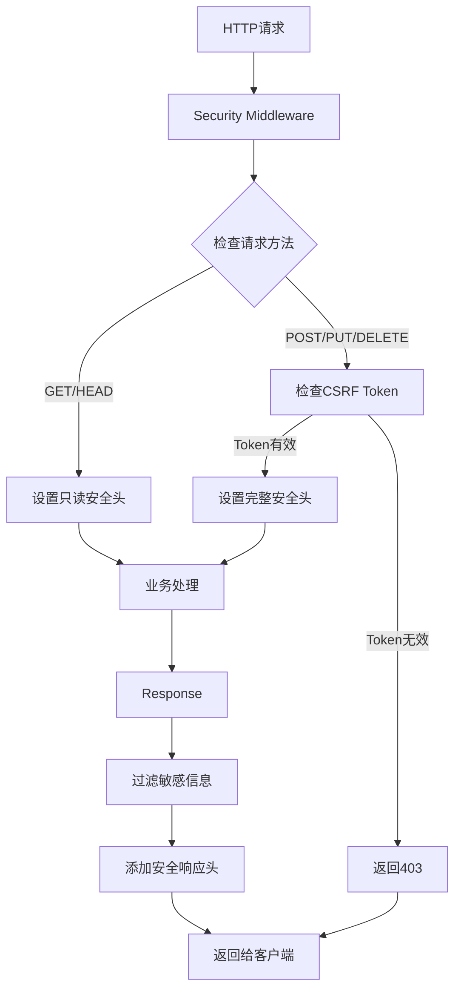
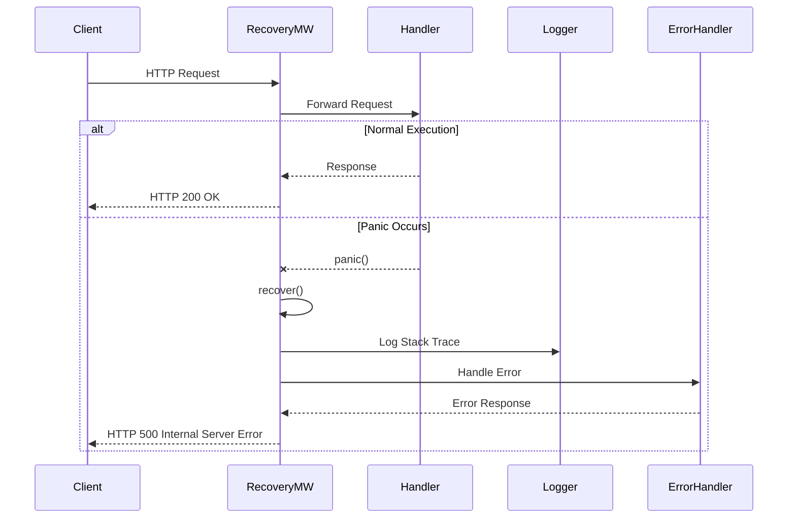

# 安全中间件设计

> **文档版本**: v1.0  
> **创建日期**: 2025-10-21  
> **最后更新**: 2025-10-21  
> **状态**: ✅ 设计完成

---

## 1. 需求概述

### 1.1 功能描述

安全中间件为青羽后端提供多层次的Web安全防护，包括安全HTTP响应头设置、CSRF防护、Panic恢复、敏感信息过滤等，防御常见Web攻击，确保系统安全稳定运行。

### 1.2 业务价值

- **安全防护**：防御XSS、CSRF、点击劫持等常见Web攻击
- **合规要求**：满足安全审计和合规性要求
- **系统稳定性**：Panic恢复确保单个请求错误不影响整个服务
- **数据保护**：防止敏感信息泄露（密码、Token等）

### 1.3 涵盖范围

本设计涵盖2个安全相关中间件文件：
- `security.go` - 安全头设置、CSRF防护、敏感信息过滤
- `recovery.go` - Panic恢复、错误处理

### 1.4 应用场景

- **HTTP安全头设置**：防御XSS、点击劫持、MIME嗅探攻击
- **CSRF防护**：防止跨站请求伪造攻击
- **Panic恢复**：捕获运行时panic，防止服务崩溃
- **敏感信息保护**：过滤响应中的敏感数据

---

## 2. 架构设计

### 2.1 安全防护层级

```
┌─────────────────────────────────────────┐
│         Web安全防护体系                   │
├─────────────────────────────────────────┤
│  第一层：网络层安全                        │
│  - HTTPS/TLS加密                         │
│  - DDoS防护（云WAF）                      │
│  └─────────────────────────────────────┘
│              ↓                           │
│  第二层：传输层安全（安全中间件）           │
│  ┌─────────────────────────────────┐   │
│  │ Security Middleware             │   │
│  │ - 安全HTTP响应头                │   │
│  │ - HSTS强制HTTPS                 │   │
│  │ - CSP内容安全策略               │   │
│  │ - X-Frame-Options防点击劫持     │   │
│  │ - CSRF令牌验证                  │   │
│  └─────────────────────────────────┘   │
│              ↓                           │
│  ┌─────────────────────────────────┐   │
│  │ Recovery Middleware             │   │
│  │ - Panic捕获与恢复               │   │
│  │ - 错误日志记录                  │   │
│  │ - 友好错误响应                  │   │
│  └─────────────────────────────────┘   │
│              ↓                           │
│  第三层：应用层安全                        │
│  - 认证授权（JWT、RBAC）                  │
│  - 业务逻辑验证                           │
│  - 数据访问控制                           │
└─────────────────────────────────────────┘
```

### 2.2 安全头防护流程



### 2.3 Panic恢复流程



---

## 3. 详细设计

### 3.1 安全HTTP响应头

#### 3.1.1 核心安全头

```go
// 安全配置
type SecurityConfig struct {
    // XSS防护
    XSSProtection         string        `json:"xss_protection" yaml:"xss_protection"`
    
    // 内容安全策略
    ContentSecurityPolicy string        `json:"content_security_policy" yaml:"content_security_policy"`
    
    // 防止点击劫持
    FrameOptions          string        `json:"frame_options" yaml:"frame_options"`
    
    // MIME类型嗅探防护
    ContentTypeNosniff    bool          `json:"content_type_nosniff" yaml:"content_type_nosniff"`
    
    // HSTS（强制HTTPS）
    HSTSMaxAge            int           `json:"hsts_max_age" yaml:"hsts_max_age"`
    HSTSIncludeSubdomains bool          `json:"hsts_include_subdomains" yaml:"hsts_include_subdomains"`
    
    // Referrer策略
    ReferrerPolicy        string        `json:"referrer_policy" yaml:"referrer_policy"`
    
    // CSRF防护
    CSRFEnabled           bool          `json:"csrf_enabled" yaml:"csrf_enabled"`
    CSRFTokenLength       int           `json:"csrf_token_length" yaml:"csrf_token_length"`
    CSRFCookieName        string        `json:"csrf_cookie_name" yaml:"csrf_cookie_name"`
    CSRFHeaderName        string        `json:"csrf_header_name" yaml:"csrf_header_name"`
    
    // 敏感信息过滤
    FilterSensitiveData   bool          `json:"filter_sensitive_data" yaml:"filter_sensitive_data"`
    SensitiveFields       []string      `json:"sensitive_fields" yaml:"sensitive_fields"`
}
```

#### 3.1.2 默认配置

```go
// 实现文件：security.go

func DefaultSecurityConfig() SecurityConfig {
    return SecurityConfig{
        // XSS防护：启用浏览器内置XSS过滤器，阻止检测到的攻击
        XSSProtection: "1; mode=block",
        
        // 内容安全策略：限制资源加载来源
        ContentSecurityPolicy: "default-src 'self'; " +
            "script-src 'self' 'unsafe-inline' 'unsafe-eval'; " +
            "style-src 'self' 'unsafe-inline'; " +
            "img-src 'self' data: https:; " +
            "font-src 'self' data:; " +
            "connect-src 'self'",
        
        // 防止点击劫持：不允许在iframe中加载
        FrameOptions: "DENY",
        
        // 防止MIME类型嗅探
        ContentTypeNosniff: true,
        
        // HSTS：强制使用HTTPS，有效期1年
        HSTSMaxAge:            31536000, // 1年
        HSTSIncludeSubdomains: true,
        
        // Referrer策略：仅同源时发送完整Referer
        ReferrerPolicy: "strict-origin-when-cross-origin",
        
        // CSRF防护
        CSRFEnabled:     true,
        CSRFTokenLength: 32,
        CSRFCookieName:  "_csrf",
        CSRFHeaderName:  "X-CSRF-Token",
        
        // 敏感信息过滤
        FilterSensitiveData: true,
        SensitiveFields: []string{
            "password",
            "secret",
            "token",
            "api_key",
            "private_key",
        },
    }
}
```

#### 3.1.3 安全头中间件实现

```go
// 实现文件：security.go

func Security() gin.HandlerFunc {
    return SecurityWithConfig(DefaultSecurityConfig())
}

func SecurityWithConfig(config SecurityConfig) gin.HandlerFunc {
    return func(c *gin.Context) {
        // 1. 设置安全响应头
        setSecurityHeaders(c, config)
        
        // 2. 对于修改性请求，验证CSRF Token
        if config.CSRFEnabled && isModifyingRequest(c.Request) {
            if !validateCSRFToken(c, config) {
                c.JSON(http.StatusForbidden, gin.H{
                    "code":    40314,
                    "message": "CSRF验证失败",
                })
                c.Abort()
                return
            }
        }
        
        c.Next()
        
        // 3. 过滤响应中的敏感信息
        if config.FilterSensitiveData {
            filterSensitiveResponse(c, config)
        }
    }
}

// 设置安全响应头
func setSecurityHeaders(c *gin.Context, config SecurityConfig) {
    // X-XSS-Protection
    if config.XSSProtection != "" {
        c.Header("X-XSS-Protection", config.XSSProtection)
    }
    
    // Content-Security-Policy
    if config.ContentSecurityPolicy != "" {
        c.Header("Content-Security-Policy", config.ContentSecurityPolicy)
    }
    
    // X-Frame-Options
    if config.FrameOptions != "" {
        c.Header("X-Frame-Options", config.FrameOptions)
    }
    
    // X-Content-Type-Options
    if config.ContentTypeNosniff {
        c.Header("X-Content-Type-Options", "nosniff")
    }
    
    // Strict-Transport-Security (HSTS)
    if config.HSTSMaxAge > 0 && c.Request.TLS != nil {
        hsts := fmt.Sprintf("max-age=%d", config.HSTSMaxAge)
        if config.HSTSIncludeSubdomains {
            hsts += "; includeSubDomains"
        }
        c.Header("Strict-Transport-Security", hsts)
    }
    
    // Referrer-Policy
    if config.ReferrerPolicy != "" {
        c.Header("Referrer-Policy", config.ReferrerPolicy)
    }
    
    // X-Permitted-Cross-Domain-Policies
    c.Header("X-Permitted-Cross-Domain-Policies", "none")
    
    // X-Download-Options
    c.Header("X-Download-Options", "noopen")
}

// 判断是否为修改性请求
func isModifyingRequest(req *http.Request) bool {
    method := req.Method
    return method == http.MethodPost ||
           method == http.MethodPut ||
           method == http.MethodDelete ||
           method == http.MethodPatch
}
```

---

### 3.2 CSRF防护

#### 3.2.1 CSRF令牌生成

```go
// 实现文件：security.go

// 生成CSRF令牌
func GenerateCSRFToken() string {
    bytes := make([]byte, 32)
    if _, err := rand.Read(bytes); err != nil {
        // 降级到伪随机
        return generatePseudoRandomToken()
    }
    return base64.URLEncoding.EncodeToString(bytes)
}

// 设置CSRF令牌（在Cookie和响应头中）
func SetCSRFToken(c *gin.Context, config SecurityConfig) {
    token := GenerateCSRFToken()
    
    // 1. 设置到Cookie
    c.SetCookie(
        config.CSRFCookieName,
        token,
        3600,                    // 1小时有效期
        "/",                     // 路径
        "",                      // 域名（空表示当前域名）
        true,                    // Secure（仅HTTPS）
        true,                    // HttpOnly
    )
    
    // 2. 设置到响应头（供前端读取）
    c.Header(config.CSRFHeaderName, token)
}

// CSRF令牌生成中间件
func CSRFToken() gin.HandlerFunc {
    config := DefaultSecurityConfig()
    return CSRFTokenWithConfig(config)
}

func CSRFTokenWithConfig(config SecurityConfig) gin.HandlerFunc {
    return func(c *gin.Context) {
        // 对于GET请求，生成并设置CSRF令牌
        if c.Request.Method == http.MethodGet {
            SetCSRFToken(c, config)
        }
        c.Next()
    }
}
```

#### 3.2.2 CSRF令牌验证

```go
// 实现文件：security.go

// 验证CSRF令牌
func validateCSRFToken(c *gin.Context, config SecurityConfig) bool {
    // 1. 从请求头获取令牌
    tokenFromHeader := c.GetHeader(config.CSRFHeaderName)
    if tokenFromHeader == "" {
        // 降级：从表单参数获取
        tokenFromHeader = c.PostForm("_csrf")
    }
    
    // 2. 从Cookie获取令牌
    tokenFromCookie, err := c.Cookie(config.CSRFCookieName)
    if err != nil {
        return false
    }
    
    // 3. 比较两个令牌
    if tokenFromHeader == "" || tokenFromCookie == "" {
        return false
    }
    
    // 使用常量时间比较，防止时序攻击
    return subtle.ConstantTimeCompare(
        []byte(tokenFromHeader),
        []byte(tokenFromCookie),
    ) == 1
}

// 白名单路径（不需要CSRF验证）
var csrfWhitelistPaths = []string{
    "/api/v1/login",
    "/api/v1/register",
    "/api/v1/health",
}

func isCSRFWhitelisted(path string) bool {
    for _, whitelisted := range csrfWhitelistPaths {
        if path == whitelisted {
            return true
        }
    }
    return false
}
```

---

### 3.3 Panic恢复中间件

#### 3.3.1 核心数据结构

```go
// Recovery配置
type RecoveryConfig struct {
    EnableLogging    bool          `json:"enable_logging" yaml:"enable_logging"`       // 是否记录日志
    EnableStackTrace bool          `json:"enable_stack_trace" yaml:"enable_stack_trace"` // 是否记录堆栈
    PanicHandler     func(*gin.Context, interface{}) `json:"-" yaml:"-"`          // 自定义panic处理
}

func DefaultRecoveryConfig() RecoveryConfig {
    return RecoveryConfig{
        EnableLogging:    true,
        EnableStackTrace: true,
        PanicHandler:     nil, // 使用默认处理
    }
}
```

#### 3.3.2 Recovery中间件实现

```go
// 实现文件：recovery.go

func Recovery() gin.HandlerFunc {
    return RecoveryWithConfig(DefaultRecoveryConfig())
}

func RecoveryWithConfig(config RecoveryConfig) gin.HandlerFunc {
    return func(c *gin.Context) {
        defer func() {
            if err := recover(); err != nil {
                // 1. 记录panic信息
                if config.EnableLogging {
                    logPanic(c, err, config.EnableStackTrace)
                }
                
                // 2. 调用自定义处理器或默认处理
                if config.PanicHandler != nil {
                    config.PanicHandler(c, err)
                } else {
                    defaultPanicHandler(c, err)
                }
                
                // 3. 中止后续处理
                c.Abort()
            }
        }()
        
        c.Next()
    }
}

// 记录panic信息
func logPanic(c *gin.Context, err interface{}, enableStackTrace bool) {
    fields := []zap.Field{
        zap.String("request_id", c.GetString("request_id")),
        zap.String("method", c.Request.Method),
        zap.String("path", c.Request.URL.Path),
        zap.String("ip", c.ClientIP()),
        zap.Any("error", err),
    }
    
    if enableStackTrace {
        // 获取堆栈信息
        stack := make([]byte, 4096)
        length := runtime.Stack(stack, false)
        fields = append(fields, zap.String("stack", string(stack[:length])))
    }
    
    logger.Error("Panic recovered", fields...)
}

// 默认panic处理
func defaultPanicHandler(c *gin.Context, err interface{}) {
    // 检查是否为已知错误类型
    var message string
    switch e := err.(type) {
    case string:
        message = e
    case error:
        message = e.Error()
    default:
        message = fmt.Sprintf("%v", err)
    }
    
    // 返回500错误
    c.JSON(http.StatusInternalServerError, gin.H{
        "code":    50001,
        "message": "服务器内部错误",
        "error":   message, // 生产环境应该隐藏详细错误
    })
}
```

---

### 3.4 敏感信息过滤

```go
// 过滤响应中的敏感信息
func filterSensitiveResponse(c *gin.Context, config SecurityConfig) {
    // 注意：这需要在响应写入前拦截
    // 实际实现需要自定义ResponseWriter
}

// 递归过滤敏感字段
func filterSensitiveFields(data interface{}, sensitiveFields []string) interface{} {
    switch v := data.(type) {
    case map[string]interface{}:
        filtered := make(map[string]interface{})
        for key, value := range v {
            // 检查是否为敏感字段
            if isSensitiveField(key, sensitiveFields) {
                filtered[key] = "***FILTERED***"
            } else {
                // 递归过滤
                filtered[key] = filterSensitiveFields(value, sensitiveFields)
            }
        }
        return filtered
        
    case []interface{}:
        filtered := make([]interface{}, len(v))
        for i, item := range v {
            filtered[i] = filterSensitiveFields(item, sensitiveFields)
        }
        return filtered
        
    default:
        return v
    }
}

func isSensitiveField(fieldName string, sensitiveFields []string) bool {
    lowerName := strings.ToLower(fieldName)
    for _, sensitive := range sensitiveFields {
        if strings.Contains(lowerName, strings.ToLower(sensitive)) {
            return true
        }
    }
    return false
}
```

---

## 4. 配置管理

### 4.1 配置文件

```yaml
# config/security.yaml
security:
  # 安全响应头
  headers:
    xss_protection: "1; mode=block"
    content_security_policy: >
      default-src 'self';
      script-src 'self' 'unsafe-inline' 'unsafe-eval' https://cdn.example.com;
      style-src 'self' 'unsafe-inline' https://cdn.example.com;
      img-src 'self' data: https:;
      font-src 'self' data: https://cdn.example.com;
      connect-src 'self' https://api.example.com;
      frame-ancestors 'none';
      base-uri 'self';
      form-action 'self'
    frame_options: "DENY"
    content_type_nosniff: true
    hsts_max_age: 31536000  # 1年
    hsts_include_subdomains: true
    referrer_policy: "strict-origin-when-cross-origin"
  
  # CSRF防护
  csrf:
    enabled: true
    token_length: 32
    cookie_name: "_csrf"
    header_name: "X-CSRF-Token"
    whitelist_paths:
      - "/api/v1/login"
      - "/api/v1/register"
      - "/api/v1/health"
      - "/api/v1/metrics"
  
  # 敏感信息过滤
  sensitive_data:
    enabled: true
    fields:
      - "password"
      - "secret"
      - "token"
      - "api_key"
      - "private_key"
      - "access_token"
      - "refresh_token"
  
  # Panic恢复
  recovery:
    enable_logging: true
    enable_stack_trace: true
    hide_error_details: true  # 生产环境隐藏错误详情
```

---

## 5. 安全最佳实践

### 5.1 CSP配置建议

```go
// 严格的CSP配置（推荐生产环境）
func StrictCSPConfig() string {
    return "default-src 'none'; " +
           "script-src 'self'; " +
           "style-src 'self'; " +
           "img-src 'self' data: https:; " +
           "font-src 'self'; " +
           "connect-src 'self'; " +
           "frame-ancestors 'none'; " +
           "base-uri 'self'; " +
           "form-action 'self'"
}

// 宽松的CSP配置（开发环境）
func RelaxedCSPConfig() string {
    return "default-src 'self'; " +
           "script-src 'self' 'unsafe-inline' 'unsafe-eval'; " +
           "style-src 'self' 'unsafe-inline'"
}
```

### 5.2 HSTS配置建议

```go
// HSTS预加载配置（最高安全级别）
func HSTSPreloadConfig() string {
    return "max-age=31536000; includeSubDomains; preload"
}

// 注意：启用preload需要在https://hstspreload.org/提交域名
```

### 5.3 安全头检查清单

- ✅ **X-XSS-Protection**: 启用浏览器XSS过滤器
- ✅ **Content-Security-Policy**: 限制资源加载来源
- ✅ **X-Frame-Options**: 防止点击劫持
- ✅ **X-Content-Type-Options**: 防止MIME类型嗅探
- ✅ **Strict-Transport-Security**: 强制HTTPS
- ✅ **Referrer-Policy**: 控制Referer信息
- ✅ **X-Permitted-Cross-Domain-Policies**: 限制跨域策略
- ✅ **X-Download-Options**: IE下载安全

---

## 6. 监控与日志

### 6.1 安全事件日志

```go
// 记录安全事件
func logSecurityEvent(c *gin.Context, eventType string, details map[string]interface{}) {
    logger.Warn("安全事件",
        zap.String("event_type", eventType),
        zap.String("ip", c.ClientIP()),
        zap.String("method", c.Request.Method),
        zap.String("path", c.Request.URL.Path),
        zap.String("user_agent", c.Request.UserAgent()),
        zap.Any("details", details),
    )
}

// 记录CSRF攻击尝试
func logCSRFAttack(c *gin.Context) {
    logSecurityEvent(c, "csrf_attack", map[string]interface{}{
        "token_from_header": c.GetHeader("X-CSRF-Token"),
        "has_cookie":        c.Cookie("_csrf") != nil,
    })
}

// 记录Panic
func logPanicEvent(c *gin.Context, err interface{}, stack string) {
    logger.Error("Panic recovered",
        zap.String("request_id", c.GetString("request_id")),
        zap.String("path", c.Request.URL.Path),
        zap.Any("error", err),
        zap.String("stack", stack),
    )
}
```

### 6.2 Prometheus指标

```go
var (
    csrfAttemptsTotal = prometheus.NewCounterVec(
        prometheus.CounterOpts{
            Name: "csrf_attacks_total",
            Help: "Total number of CSRF attack attempts",
        },
        []string{"path"},
    )
    
    panicRecoveredTotal = prometheus.NewCounterVec(
        prometheus.CounterOpts{
            Name: "panic_recovered_total",
            Help: "Total number of recovered panics",
        },
        []string{"path"},
    )
)
```

---

## 7. 测试设计

### 7.1 安全头测试

```go
func TestSecurityHeaders(t *testing.T) {
    gin.SetMode(gin.TestMode)
    
    router := gin.New()
    router.Use(Security())
    router.GET("/test", func(c *gin.Context) {
        c.JSON(200, gin.H{"status": "ok"})
    })
    
    w := httptest.NewRecorder()
    req, _ := http.NewRequest("GET", "/test", nil)
    router.ServeHTTP(w, req)
    
    // 验证安全头
    assert.Equal(t, "1; mode=block", w.Header().Get("X-XSS-Protection"))
    assert.Equal(t, "DENY", w.Header().Get("X-Frame-Options"))
    assert.Equal(t, "nosniff", w.Header().Get("X-Content-Type-Options"))
    assert.NotEmpty(t, w.Header().Get("Content-Security-Policy"))
}
```

### 7.2 CSRF防护测试

```go
func TestCSRFProtection(t *testing.T) {
    gin.SetMode(gin.TestMode)
    
    router := gin.New()
    router.Use(SecurityWithConfig(DefaultSecurityConfig()))
    router.POST("/test", func(c *gin.Context) {
        c.JSON(200, gin.H{"status": "ok"})
    })
    
    // 测试无CSRF令牌的请求被拒绝
    w := httptest.NewRecorder()
    req, _ := http.NewRequest("POST", "/test", nil)
    router.ServeHTTP(w, req)
    assert.Equal(t, 403, w.Code)
    
    // 测试有效CSRF令牌的请求通过
    token := GenerateCSRFToken()
    w = httptest.NewRecorder()
    req, _ = http.NewRequest("POST", "/test", nil)
    req.Header.Set("X-CSRF-Token", token)
    req.AddCookie(&http.Cookie{Name: "_csrf", Value: token})
    router.ServeHTTP(w, req)
    assert.Equal(t, 200, w.Code)
}
```

### 7.3 Panic恢复测试

```go
func TestRecovery(t *testing.T) {
    gin.SetMode(gin.TestMode)
    
    router := gin.New()
    router.Use(Recovery())
    router.GET("/panic", func(c *gin.Context) {
        panic("test panic")
    })
    
    w := httptest.NewRecorder()
    req, _ := http.NewRequest("GET", "/panic", nil)
    router.ServeHTTP(w, req)
    
    // 验证返回500错误
    assert.Equal(t, 500, w.Code)
    
    // 验证服务未崩溃，可以继续处理请求
    w = httptest.NewRecorder()
    req, _ = http.NewRequest("GET", "/panic", nil)
    router.ServeHTTP(w, req)
    assert.Equal(t, 500, w.Code)
}
```

---

## 8. 使用示例

### 8.1 基本使用

```go
// router/enter.go
func InitRoutes(r *gin.Engine) {
    // 全局应用安全中间件
    r.Use(middleware.Recovery())  // Panic恢复（最外层）
    r.Use(middleware.Security())  // 安全头设置
    
    // API路由
    api := r.Group("/api/v1")
    {
        // 公开路由
        api.POST("/login", authApi.Login)
        api.POST("/register", authApi.Register)
        
        // 需要CSRF保护的路由
        authenticated := api.Group("")
        authenticated.Use(middleware.CSRFToken()) // 生成CSRF令牌
        {
            authenticated.POST("/projects", projectApi.Create)
            authenticated.PUT("/projects/:id", projectApi.Update)
            authenticated.DELETE("/projects/:id", projectApi.Delete)
        }
    }
}
```

### 8.2 自定义配置

```go
// 自定义安全配置
securityConfig := middleware.SecurityConfig{
    ContentSecurityPolicy: "default-src 'self'; script-src 'self' https://cdn.example.com",
    FrameOptions:          "SAMEORIGIN", // 允许同域名iframe
    CSRFEnabled:           true,
    FilterSensitiveData:   true,
}

router.Use(middleware.SecurityWithConfig(securityConfig))
```

---

## 9. 最佳实践

### 9.1 安全配置建议

1. ✅ **生产环境必须启用HSTS**
2. ✅ **CSP策略从严格开始，逐步放宽**
3. ✅ **CSRF防护必须启用**（除了纯API服务）
4. ✅ **敏感信息过滤必须启用**
5. ✅ **Panic恢复必须在最外层**

### 9.2 使用建议

- ✅ 定期审查和更新CSP策略
- ✅ 监控CSRF攻击尝试
- ✅ 记录所有Panic事件
- ✅ 定期进行安全扫描
- ❌ 不要在CSP中使用`unsafe-eval`（除非必要）
- ❌ 不要禁用CSRF防护

---

## 10. 关联文件

### 实现文件

- `middleware/security.go` - 安全头、CSRF防护 (~270行)
- `middleware/recovery.go` - Panic恢复 (~150行)

### 相关设计

- [中间件总体设计](./中间件总体设计.md) - 中间件架构
- [CORS中间件设计](./CORS中间件设计.md) - 跨域安全
- [认证中间件设计](./认证中间件设计.md) - 身份认证

---

**文档版本**: v1.0  
**创建时间**: 2025-10-21  
**作者**: 青羽架构组

