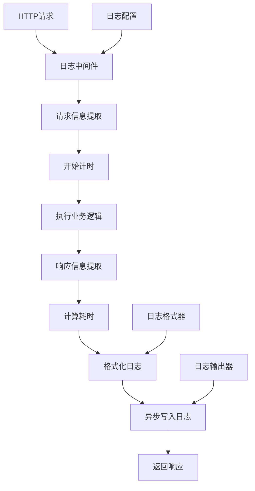

# 日志中间件设计

## 1. 需求概述

### 1.1 功能描述
日志中间件负责记录HTTP请求和响应信息，提供系统运行状态监控、性能分析、错误追踪和审计功能。

### 1.2 业务价值
- **运维监控**：实时监控系统运行状态和性能指标
- **问题诊断**：快速定位和分析系统问题
- **性能优化**：提供性能分析数据支持优化决策
- **安全审计**：记录用户操作和系统访问日志
- **合规要求**：满足数据保护和审计合规要求

### 1.3 用户场景
- **开发调试**：开发人员查看请求响应详情
- **运维监控**：运维人员监控系统健康状态
- **性能分析**：分析接口响应时间和吞吐量
- **安全审计**：安全人员审计用户操作记录
- **故障排查**：快速定位和分析系统故障

### 1.4 功能边界
- **包含**：请求日志、响应日志、性能指标、错误追踪、访问统计
- **不包含**：日志存储、日志分析、告警通知、日志可视化

## 2. 架构设计

### 2.1 整体架构



### 2.2 模块划分
- **请求捕获模块**：提取HTTP请求信息
- **响应捕获模块**：提取HTTP响应信息
- **性能监控模块**：计算请求处理时间和性能指标
- **日志格式化模块**：格式化日志输出
- **异步写入模块**：异步写入日志到文件或外部系统

### 2.3 数据流向
1. 接收HTTP请求，记录请求开始时间
2. 提取请求信息（方法、路径、头部、参数等）
3. 执行后续中间件和业务逻辑
4. 捕获响应信息（状态码、响应体大小等）
5. 计算请求处理耗时和性能指标
6. 格式化日志记录
7. 异步写入日志存储

### 2.4 技术选型
- **日志库**：go.uber.org/zap（高性能结构化日志）
- **配置管理**：viper（配置文件管理）
- **异步处理**：channel + goroutine
- **日志轮转**：lumberjack（日志文件轮转）
- **监控指标**：prometheus（可选集成）

## 3. 详细设计

### 3.1 Router层设计
- **全局应用**：应用于所有HTTP路由
- **路径过滤**：支持跳过特定路径的日志记录
- **条件记录**：基于状态码、耗时等条件记录日志
- **优先级**：作为第一个中间件执行

```go
// 路由配置示例
func SetupRoutes(r *gin.Engine) {
    // 配置日志中间件
    loggerConfig := middleware.LoggerConfig{
        EnableColor:      true,
        EnableReqBody:    false,
        EnableRespBody:   false,
        MaxReqBodySize:   1024,
        MaxRespBodySize:  1024,
        SkipPaths: []string{
            "/health",
            "/metrics",
            "/favicon.ico",
        },
        SlowThreshold: 200 * time.Millisecond,
    }
    
    r.Use(middleware.LoggerWithConfig(loggerConfig))
    
    // 其他中间件和路由
    r.Use(middleware.Recovery())
    r.Use(middleware.CORS())
    
    // API路由
    api := r.Group("/api/v1")
    {
        api.GET("/users", userAPI.List)
        api.POST("/users", userAPI.Create)
    }
}
```

### 3.2 API层设计
- **透明记录**：对业务逻辑透明，不影响API接口
- **错误捕获**：捕获和记录API错误信息
- **性能监控**：记录API响应时间和性能指标
- **访问统计**：统计API访问频率和模式

### 3.3 Service层设计
- **日志服务**：提供统一的日志记录服务
- **格式化服务**：负责日志格式化和结构化
- **输出服务**：管理日志输出到不同目标
- **配置服务**：管理日志配置和动态更新

```go
// 日志服务接口
type LoggerService interface {
    LogRequest(ctx context.Context, req *RequestInfo) error
    LogResponse(ctx context.Context, resp *ResponseInfo) error
    LogError(ctx context.Context, err error, req *RequestInfo) error
    LogSlow(ctx context.Context, req *RequestInfo, duration time.Duration) error
}

// 日志格式化服务
type LogFormatter interface {
    FormatRequest(req *RequestInfo) map[string]interface{}
    FormatResponse(resp *ResponseInfo) map[string]interface{}
    FormatError(err error, req *RequestInfo) map[string]interface{}
}

// 日志输出服务
type LogWriter interface {
    Write(level string, fields map[string]interface{}) error
    WriteAsync(level string, fields map[string]interface{}) error
    Flush() error
    Close() error
}
```

### 3.4 Model层设计
- **请求信息模型**：HTTP请求相关信息
- **响应信息模型**：HTTP响应相关信息
- **日志记录模型**：完整的日志记录结构
- **配置模型**：日志中间件配置结构

```go
// 请求信息模型
type RequestInfo struct {
    Method      string            `json:"method"`
    Path        string            `json:"path"`
    Query       string            `json:"query,omitempty"`
    Headers     map[string]string `json:"headers,omitempty"`
    Body        string            `json:"body,omitempty"`
    ClientIP    string            `json:"client_ip"`
    UserAgent   string            `json:"user_agent"`
    UserID      string            `json:"user_id,omitempty"`
    RequestID   string            `json:"request_id"`
    Timestamp   time.Time         `json:"timestamp"`
    BodySize    int64             `json:"body_size"`
}

// 响应信息模型
type ResponseInfo struct {
    StatusCode   int               `json:"status_code"`
    Headers      map[string]string `json:"headers,omitempty"`
    Body         string            `json:"body,omitempty"`
    BodySize     int64             `json:"body_size"`
    Duration     time.Duration     `json:"duration"`
    Error        string            `json:"error,omitempty"`
}

// 完整日志记录模型
type LogRecord struct {
    Level       string       `json:"level"`
    Timestamp   time.Time    `json:"timestamp"`
    RequestID   string       `json:"request_id"`
    Request     *RequestInfo `json:"request"`
    Response    *ResponseInfo `json:"response"`
    Performance *PerformanceInfo `json:"performance,omitempty"`
    Error       *ErrorInfo   `json:"error,omitempty"`
}

// 性能信息模型
type PerformanceInfo struct {
    Duration      time.Duration `json:"duration"`
    MemoryUsage   int64         `json:"memory_usage,omitempty"`
    CPUUsage      float64       `json:"cpu_usage,omitempty"`
    GoroutineNum  int           `json:"goroutine_num,omitempty"`
}
```

## 4. 数据设计

### 4.1 日志配置模型

```go
type LoggerConfig struct {
    // 基础配置
    Level            string        `json:"level" yaml:"level"`                         // 日志级别
    Format           string        `json:"format" yaml:"format"`                       // 日志格式：json/text
    EnableColor      bool          `json:"enable_color" yaml:"enable_color"`           // 启用颜色输出
    EnableCaller     bool          `json:"enable_caller" yaml:"enable_caller"`         // 启用调用者信息
    EnableStacktrace bool          `json:"enable_stacktrace" yaml:"enable_stacktrace"` // 启用堆栈跟踪
    
    // 请求日志配置
    EnableReqBody    bool          `json:"enable_req_body" yaml:"enable_req_body"`     // 记录请求体
    EnableRespBody   bool          `json:"enable_resp_body" yaml:"enable_resp_body"`   // 记录响应体
    MaxReqBodySize   int           `json:"max_req_body_size" yaml:"max_req_body_size"` // 最大请求体大小
    MaxRespBodySize  int           `json:"max_resp_body_size" yaml:"max_resp_body_size"` // 最大响应体大小
    
    // 性能监控配置
    SlowThreshold    time.Duration `json:"slow_threshold" yaml:"slow_threshold"`       // 慢请求阈值
    EnableMetrics    bool          `json:"enable_metrics" yaml:"enable_metrics"`       // 启用指标收集
    
    // 过滤配置
    SkipPaths        []string      `json:"skip_paths" yaml:"skip_paths"`               // 跳过的路径
    SkipMethods      []string      `json:"skip_methods" yaml:"skip_methods"`           // 跳过的方法
    OnlyErrors       bool          `json:"only_errors" yaml:"only_errors"`             // 只记录错误
    
    // 输出配置
    OutputPaths      []string      `json:"output_paths" yaml:"output_paths"`           // 输出路径
    ErrorOutputPaths []string      `json:"error_output_paths" yaml:"error_output_paths"` // 错误输出路径
    
    // 轮转配置
    MaxSize          int           `json:"max_size" yaml:"max_size"`                   // 最大文件大小(MB)
    MaxAge           int           `json:"max_age" yaml:"max_age"`                     // 最大保存天数
    MaxBackups       int           `json:"max_backups" yaml:"max_backups"`             // 最大备份数量
    Compress         bool          `json:"compress" yaml:"compress"`                   // 压缩旧文件
}
```

### 4.2 日志字段标准

#### 标准字段
```go
const (
    FieldLevel      = "level"       // 日志级别
    FieldTimestamp  = "timestamp"   // 时间戳
    FieldMessage    = "message"     // 日志消息
    FieldRequestID  = "request_id"  // 请求ID
    FieldUserID     = "user_id"     // 用户ID
    FieldMethod     = "method"      // HTTP方法
    FieldPath       = "path"        // 请求路径
    FieldStatusCode = "status_code" // 状态码
    FieldDuration   = "duration"    // 耗时
    FieldClientIP   = "client_ip"   // 客户端IP
    FieldUserAgent  = "user_agent"  // 用户代理
    FieldError      = "error"       // 错误信息
)
```

#### 扩展字段
```go
const (
    FieldReqHeaders  = "req_headers"  // 请求头
    FieldReqBody     = "req_body"     // 请求体
    FieldRespHeaders = "resp_headers" // 响应头
    FieldRespBody    = "resp_body"    // 响应体
    FieldReqSize     = "req_size"     // 请求大小
    FieldRespSize    = "resp_size"    // 响应大小
    FieldReferer     = "referer"      // 引用页
    FieldProtocol    = "protocol"     // 协议版本
)
```

### 4.3 日志级别定义

```go
const (
    LevelDebug = "debug" // 调试信息
    LevelInfo  = "info"  // 一般信息
    LevelWarn  = "warn"  // 警告信息
    LevelError = "error" // 错误信息
    LevelFatal = "fatal" // 致命错误
)

// 日志级别映射
var LogLevelMap = map[string]int{
    LevelDebug: 0,
    LevelInfo:  1,
    LevelWarn:  2,
    LevelError: 3,
    LevelFatal: 4,
}
```

## 5. 接口设计

### 5.1 中间件接口

#### Logger - 基础日志中间件
```go
func Logger() gin.HandlerFunc {
    return LoggerWithConfig(DefaultLoggerConfig())
}

func LoggerWithConfig(config LoggerConfig) gin.HandlerFunc {
    // 初始化日志器
    logger := initLogger(config)
    
    return func(c *gin.Context) {
        // 检查是否跳过
        if shouldSkip(c, config) {
            c.Next()
            return
        }
        
        // 记录开始时间
        start := time.Now()
        
        // 生成请求ID
        requestID := generateRequestID()
        c.Set("request_id", requestID)
        
        // 提取请求信息
        reqInfo := extractRequestInfo(c, config)
        reqInfo.RequestID = requestID
        reqInfo.Timestamp = start
        
        // 创建响应写入器
        writer := &responseWriter{
            ResponseWriter: c.Writer,
            body:          &bytes.Buffer{},
        }
        c.Writer = writer
        
        // 执行后续处理
        c.Next()
        
        // 计算耗时
        duration := time.Since(start)
        
        // 提取响应信息
        respInfo := extractResponseInfo(writer, duration)
        
        // 记录日志
        logRequest(logger, reqInfo, respInfo, config)
    }
}
```

#### 请求信息提取
```go
func extractRequestInfo(c *gin.Context, config LoggerConfig) *RequestInfo {
    req := c.Request
    
    info := &RequestInfo{
        Method:    req.Method,
        Path:      req.URL.Path,
        Query:     req.URL.RawQuery,
        ClientIP:  c.ClientIP(),
        UserAgent: req.UserAgent(),
        Protocol:  req.Proto,
        Referer:   req.Referer(),
    }
    
    // 提取用户ID（如果存在）
    if userID, exists := c.Get("userID"); exists {
        info.UserID = userID.(string)
    }
    
    // 提取请求头
    if len(config.LogHeaders) > 0 {
        info.Headers = make(map[string]string)
        for _, header := range config.LogHeaders {
            if value := req.Header.Get(header); value != "" {
                info.Headers[header] = value
            }
        }
    }
    
    // 提取请求体
    if config.EnableReqBody && req.ContentLength > 0 {
        if body, err := io.ReadAll(io.LimitReader(req.Body, int64(config.MaxReqBodySize))); err == nil {
            info.Body = string(body)
            info.BodySize = int64(len(body))
            // 重新设置请求体
            req.Body = io.NopCloser(bytes.NewReader(body))
        }
    }
    
    return info
}
```

#### 响应信息提取
```go
func extractResponseInfo(writer *responseWriter, duration time.Duration) *ResponseInfo {
    info := &ResponseInfo{
        StatusCode: writer.status,
        Duration:   duration,
        BodySize:   int64(writer.body.Len()),
    }
    
    // 提取响应头
    if writer.Header() != nil {
        info.Headers = make(map[string]string)
        for key, values := range writer.Header() {
            if len(values) > 0 {
                info.Headers[key] = values[0]
            }
        }
    }
    
    // 提取响应体
    if writer.body.Len() > 0 {
        info.Body = writer.body.String()
    }
    
    return info
}
```

### 5.2 自定义响应写入器

```go
type responseWriter struct {
    gin.ResponseWriter
    body   *bytes.Buffer
    status int
}

func (w *responseWriter) Write(data []byte) (int, error) {
    w.body.Write(data)
    return w.ResponseWriter.Write(data)
}

func (w *responseWriter) WriteString(s string) (int, error) {
    w.body.WriteString(s)
    return w.ResponseWriter.WriteString(s)
}

func (w *responseWriter) WriteHeader(statusCode int) {
    w.status = statusCode
    w.ResponseWriter.WriteHeader(statusCode)
}

func (w *responseWriter) Status() int {
    return w.status
}

func (w *responseWriter) Size() int {
    return w.body.Len()
}
```

### 5.3 日志记录函数

```go
func logRequest(logger *zap.Logger, req *RequestInfo, resp *ResponseInfo, config LoggerConfig) {
    // 构建日志字段
    fields := []zap.Field{
        zap.String(FieldRequestID, req.RequestID),
        zap.String(FieldMethod, req.Method),
        zap.String(FieldPath, req.Path),
        zap.Int(FieldStatusCode, resp.StatusCode),
        zap.Duration(FieldDuration, resp.Duration),
        zap.String(FieldClientIP, req.ClientIP),
        zap.String(FieldUserAgent, req.UserAgent),
        zap.Int64(FieldReqSize, req.BodySize),
        zap.Int64(FieldRespSize, resp.BodySize),
    }
    
    // 添加用户ID
    if req.UserID != "" {
        fields = append(fields, zap.String(FieldUserID, req.UserID))
    }
    
    // 添加查询参数
    if req.Query != "" {
        fields = append(fields, zap.String("query", req.Query))
    }
    
    // 添加请求头
    if len(req.Headers) > 0 {
        fields = append(fields, zap.Any(FieldReqHeaders, req.Headers))
    }
    
    // 添加响应头
    if len(resp.Headers) > 0 {
        fields = append(fields, zap.Any(FieldRespHeaders, resp.Headers))
    }
    
    // 添加请求体
    if config.EnableReqBody && req.Body != "" {
        fields = append(fields, zap.String(FieldReqBody, req.Body))
    }
    
    // 添加响应体
    if config.EnableRespBody && resp.Body != "" {
        fields = append(fields, zap.String(FieldRespBody, resp.Body))
    }
    
    // 确定日志级别和消息
    level := determineLogLevel(resp.StatusCode, resp.Duration, config)
    message := formatLogMessage(req, resp)
    
    // 记录日志
    switch level {
    case LevelError:
        logger.Error(message, fields...)
    case LevelWarn:
        logger.Warn(message, fields...)
    case LevelInfo:
        logger.Info(message, fields...)
    case LevelDebug:
        logger.Debug(message, fields...)
    }
}
```

### 5.4 工具函数

```go
// 确定日志级别
func determineLogLevel(statusCode int, duration time.Duration, config LoggerConfig) string {
    if statusCode >= 500 {
        return LevelError
    }
    if statusCode >= 400 {
        return LevelWarn
    }
    if duration > config.SlowThreshold {
        return LevelWarn
    }
    return LevelInfo
}

// 格式化日志消息
func formatLogMessage(req *RequestInfo, resp *ResponseInfo) string {
    return fmt.Sprintf("%s %s %d %v", 
        req.Method, 
        req.Path, 
        resp.StatusCode, 
        resp.Duration.Truncate(time.Millisecond))
}

// 生成请求ID
func generateRequestID() string {
    return fmt.Sprintf("%d-%s", 
        time.Now().UnixNano(), 
        randomString(8))
}

// 检查是否跳过日志
func shouldSkip(c *gin.Context, config LoggerConfig) bool {
    path := c.Request.URL.Path
    method := c.Request.Method
    
    // 检查跳过路径
    for _, skipPath := range config.SkipPaths {
        if path == skipPath {
            return true
        }
    }
    
    // 检查跳过方法
    for _, skipMethod := range config.SkipMethods {
        if method == skipMethod {
            return true
        }
    }
    
    return false
}
```

## 6. 安全设计

### 6.1 敏感信息保护
- **密码过滤**：自动过滤密码字段
- **令牌脱敏**：对JWT令牌进行脱敏处理
- **个人信息保护**：对敏感个人信息进行掩码处理

```go
// 敏感字段列表
var SensitiveFields = []string{
    "password", "passwd", "pwd",
    "token", "access_token", "refresh_token",
    "secret", "key", "api_key",
    "credit_card", "ssn", "phone",
}

// 脱敏处理
func sanitizeValue(key, value string) string {
    lowerKey := strings.ToLower(key)
    
    for _, field := range SensitiveFields {
        if strings.Contains(lowerKey, field) {
            if len(value) <= 4 {
                return "***"
            }
            return value[:2] + "***" + value[len(value)-2:]
        }
    }
    
    return value
}
```

### 6.2 日志访问控制
- **文件权限**：设置适当的日志文件权限
- **网络传输**：使用TLS加密日志传输
- **访问审计**：记录日志文件访问记录

### 6.3 数据完整性
- **日志签名**：对重要日志进行数字签名
- **防篡改**：使用哈希校验防止日志篡改
- **备份策略**：定期备份重要日志

## 7. 测试设计

### 7.1 测试策略
- **单元测试**：测试各个组件功能
- **集成测试**：测试中间件集成效果
- **性能测试**：测试日志记录性能影响
- **压力测试**：测试高并发下的稳定性

### 7.2 测试用例

#### 基础功能测试
```go
func TestLoggerMiddleware_BasicLogging(t *testing.T) {
    // 创建测试路由
    r := gin.New()
    
    // 配置日志中间件
    var logBuffer bytes.Buffer
    config := LoggerConfig{
        Level:  "info",
        Format: "json",
        Writer: &logBuffer,
    }
    r.Use(LoggerWithConfig(config))
    
    // 添加测试路由
    r.GET("/test", func(c *gin.Context) {
        c.JSON(200, gin.H{"message": "success"})
    })
    
    // 发送测试请求
    w := httptest.NewRecorder()
    req := httptest.NewRequest("GET", "/test", nil)
    r.ServeHTTP(w, req)
    
    // 验证日志输出
    assert.Equal(t, 200, w.Code)
    assert.Contains(t, logBuffer.String(), "GET")
    assert.Contains(t, logBuffer.String(), "/test")
    assert.Contains(t, logBuffer.String(), "200")
}
```

#### 性能测试
```go
func BenchmarkLoggerMiddleware(b *testing.B) {
    r := gin.New()
    r.Use(Logger())
    r.GET("/test", func(c *gin.Context) {
        c.String(200, "OK")
    })
    
    w := httptest.NewRecorder()
    req := httptest.NewRequest("GET", "/test", nil)
    
    b.ResetTimer()
    for i := 0; i < b.N; i++ {
        r.ServeHTTP(w, req)
    }
}
```

#### 并发测试
```go
func TestLoggerMiddleware_Concurrent(t *testing.T) {
    r := gin.New()
    r.Use(Logger())
    r.GET("/test", func(c *gin.Context) {
        time.Sleep(10 * time.Millisecond)
        c.String(200, "OK")
    })
    
    var wg sync.WaitGroup
    concurrency := 100
    
    for i := 0; i < concurrency; i++ {
        wg.Add(1)
        go func() {
            defer wg.Done()
            w := httptest.NewRecorder()
            req := httptest.NewRequest("GET", "/test", nil)
            r.ServeHTTP(w, req)
            assert.Equal(t, 200, w.Code)
        }()
    }
    
    wg.Wait()
}
```

### 7.3 性能基准
- **延迟增加**：< 1ms
- **内存开销**：< 1KB per request
- **CPU开销**：< 1%
- **吞吐量影响**：< 5%

## 8. 部署和运维

### 8.1 配置管理

#### 环境变量配置
```bash
# 日志级别
LOG_LEVEL=info

# 日志格式
LOG_FORMAT=json

# 日志输出路径
LOG_OUTPUT_PATH=/var/log/qingyu/app.log

# 错误日志路径
LOG_ERROR_OUTPUT_PATH=/var/log/qingyu/error.log

# 慢请求阈值
LOG_SLOW_THRESHOLD=200ms

# 日志轮转配置
LOG_MAX_SIZE=100
LOG_MAX_AGE=30
LOG_MAX_BACKUPS=10
LOG_COMPRESS=true
```

#### 配置文件示例
```yaml
logger:
  level: info
  format: json
  enable_color: false
  enable_caller: true
  enable_stacktrace: true
  
  # 请求日志配置
  enable_req_body: false
  enable_resp_body: false
  max_req_body_size: 1024
  max_resp_body_size: 1024
  
  # 性能监控
  slow_threshold: 200ms
  enable_metrics: true
  
  # 过滤配置
  skip_paths:
    - /health
    - /metrics
    - /favicon.ico
  
  # 输出配置
  output_paths:
    - /var/log/qingyu/app.log
    - stdout
  error_output_paths:
    - /var/log/qingyu/error.log
    - stderr
  
  # 轮转配置
  max_size: 100
  max_age: 30
  max_backups: 10
  compress: true
```

### 8.2 监控指标

```go
// 日志监控指标
type LogMetrics struct {
    TotalRequests    int64   `json:"total_requests"`
    ErrorRequests    int64   `json:"error_requests"`
    SlowRequests     int64   `json:"slow_requests"`
    AverageLatency   float64 `json:"average_latency"`
    P95Latency       float64 `json:"p95_latency"`
    P99Latency       float64 `json:"p99_latency"`
    LogsPerSecond    float64 `json:"logs_per_second"`
    LogFileSize      int64   `json:"log_file_size"`
    LogErrors        int64   `json:"log_errors"`
}
```

### 8.3 告警规则
- **错误率告警**：错误率 > 5%
- **慢请求告警**：慢请求率 > 10%
- **日志写入失败**：日志写入失败率 > 1%
- **磁盘空间告警**：日志目录磁盘使用率 > 80%

### 8.4 日志轮转策略
- **按大小轮转**：单个文件超过100MB
- **按时间轮转**：每天轮转一次
- **保留策略**：保留30天的日志文件
- **压缩策略**：自动压缩旧日志文件

## 9. 风险评估

### 9.1 性能风险
- **I/O阻塞**：使用异步写入避免阻塞
- **内存占用**：限制日志缓冲区大小
- **CPU消耗**：优化日志格式化性能

### 9.2 存储风险
- **磁盘空间**：实施日志轮转和清理策略
- **文件句柄**：合理管理文件句柄数量
- **写入失败**：实现日志写入重试机制

### 9.3 安全风险
- **敏感信息泄露**：实施敏感信息过滤
- **日志注入**：验证和转义日志内容
- **访问控制**：设置适当的文件权限

### 9.4 运维风险
- **日志丢失**：实现日志备份机制
- **配置错误**：提供配置验证功能
- **监控盲区**：确保关键操作都有日志记录

## 10. 实施计划

### 10.1 开发阶段
- **第1周**：基础日志中间件开发
- **第2周**：高级功能和配置管理
- **第3周**：性能优化和异步处理
- **第4周**：测试和文档完善

### 10.2 测试阶段
- **单元测试**：覆盖率 > 90%
- **性能测试**：验证性能影响 < 5%
- **集成测试**：与现有系统集成测试
- **压力测试**：高并发稳定性测试

### 10.3 上线计划
- **灰度发布**：先在测试环境验证
- **分批上线**：按模块逐步启用日志
- **监控观察**：实时监控系统性能
- **问题处理**：快速响应和处理问题

### 10.4 后续优化
- **性能调优**：基于监控数据优化性能
- **功能增强**：支持更多日志输出格式
- **集成扩展**：集成更多监控和分析工具
- **用户体验**：优化日志查看和分析体验