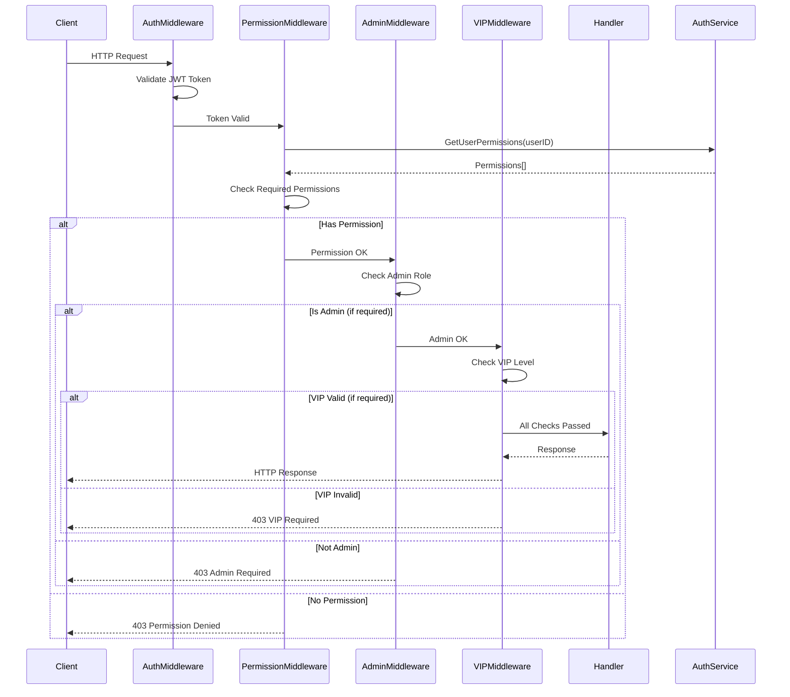

# 权限中间件设计

> **文档版本**: v1.0  
> **创建日期**: 2025-10-21  
> **最后更新**: 2025-10-21  
> **状态**: ✅ 设计完成

---

## 1. 需求概述

### 1.1 功能描述

权限中间件系统为青羽后端提供多层次的权限控制，包括RBAC（基于角色的访问控制）、管理员权限、VIP会员权限等，确保用户只能访问其被授权的资源和功能。

### 1.2 业务价值

- **安全防护**：防止未授权访问和越权操作
- **精细化控制**：支持资源级、功能级、数据级权限控制
- **商业模式支持**：支持VIP会员分级和功能订阅
- **灵活扩展**：支持动态权限配置和自定义权限规则

### 1.3 涵盖范围

本设计涵盖4个权限中间件文件：
- `permission_middleware.go` - RBAC权限检查中间件
- `permission.go` - 权限验证逻辑和配置
- `admin_permission.go` - 管理员权限中间件
- `vip_permission.go` - VIP会员权限中间件

### 1.4 应用场景

- **API访问控制**：限制特定角色访问特定API端点
- **资源权限控制**：限制用户对特定资源的操作（如项目、文档）
- **功能权限控制**：限制用户使用特定功能（如AI生成、导出等）
- **内容访问控制**：限制VIP内容访问（如VIP章节、VIP书籍）
- **管理员操作**：限制敏感操作仅管理员可执行

---

## 2. 架构设计

### 2.1 权限层级模型

```
┌─────────────────────────────────────────┐
│         权限中间件系统                    │
├─────────────────────────────────────────┤
│  ┌───────────────────────────────────┐  │
│  │  第一层：基础认证 (JWT验证)        │  │
│  └───────────────────────────────────┘  │
│              ↓                          │
│  ┌───────────────────────────────────┐  │
│  │  第二层：角色权限 (RBAC)           │  │
│  │  - RequirePermission()            │  │
│  │  - RequireAllRoles()              │  │
│  │  - CheckResourcePermission()      │  │
│  └───────────────────────────────────┘  │
│              ↓                          │
│  ┌───────────────────────────────────┐  │
│  │  第三层：管理员权限                 │  │
│  │  - RequireAdmin()                 │  │
│  │  - RequireSuperAdmin()            │  │
│  └───────────────────────────────────┘  │
│              ↓                          │
│  ┌───────────────────────────────────┐  │
│  │  第四层：VIP会员权限                │  │
│  │  - RequireVIP()                   │  │
│  │  - RequireFeature()               │  │
│  │  - CheckChapterVIPAccess()        │  │
│  └───────────────────────────────────┘  │
└─────────────────────────────────────────┘
```

### 2.2 权限检查流程



### 2.3 技术架构

```
┌──────────────────────────────────────────────┐
│            权限中间件架构                       │
├──────────────────────────────────────────────┤
│                                              │
│  ┌────────────┐  ┌────────────┐            │
│  │ Permission │  │   Admin    │            │
│  │ Middleware │  │ Middleware │            │
│  └────────────┘  └────────────┘            │
│         │               │                   │
│         └───────┬───────┘                   │
│                 ↓                           │
│      ┌──────────────────┐                  │
│      │  Auth Service    │  ← 权限数据源     │
│      │  - GetPermissions│                  │
│      │  - CheckRole     │                  │
│      │  - GetVIPLevel   │                  │
│      └──────────────────┘                  │
│                 ↓                           │
│      ┌──────────────────┐                  │
│      │  Permission      │                  │
│      │  Cache (Redis)   │  ← 权限缓存       │
│      └──────────────────┘                  │
│                                              │
│  ┌──────────────────────────────┐          │
│  │  VIP Permission Middleware    │          │
│  │  - RequireVIP()               │          │
│  │  - RequireFeature()           │          │
│  │  - CheckChapterVIPAccess()    │          │
│  │  - VIPRateLimiter()           │          │
│  └──────────────────────────────┘          │
│                 ↓                           │
│      ┌──────────────────┐                  │
│      │  VIP Service     │  ← VIP业务逻辑    │
│      │  - GetVIPStatus  │                  │
│      │  - CheckFeature  │                  │
│      └──────────────────┘                  │
└──────────────────────────────────────────────┘
```

---

## 3. 详细设计

### 3.1 RBAC权限中间件

#### 3.1.1 核心数据结构

```go
// 权限配置
type PermissionConfig struct {
    Permissions      []string              // 必需的权限列表
    RequireAll       bool                  // 是否需要全部权限
    Roles            []string              // 必需的角色列表
    ResourceType     string                // 资源类型（用于资源级权限）
    CheckOwnership   bool                  // 是否检查资源所有权
    CacheExpiration  time.Duration         // 权限缓存过期时间
}

// 权限中间件
type PermissionMiddleware struct {
    authService auth.AuthService
}

// 权限检查结果
type PermissionCheckResult struct {
    Allowed     bool
    MissingPerms []string
    Reason      string
}
```

#### 3.1.2 核心方法

**RequirePermission - 单个权限检查**

```go
// 实现文件：permission.go
func RequirePermission(permissions ...string) gin.HandlerFunc {
    config := DefaultPermissionConfig()
    config.Permissions = permissions
    config.RequireAll = false  // 任一权限即可
    return PermissionWithConfig(config)
}

// 使用示例：
router.DELETE("/api/v1/projects/:id", 
    RequirePermission("project.delete", "admin.full"))
```

**RequireAllRoles - 多角色检查**

```go
// 实现文件：permission.go
func RequireAllRoles(roles ...string) gin.HandlerFunc {
    config := DefaultPermissionConfig()
    config.Roles = roles
    config.RequireAll = true  // 需要全部角色
    return PermissionWithConfig(config)
}

// 使用示例：
router.POST("/api/v1/admin/config", 
    RequireAllRoles("admin", "config_manager"))
```

**CheckResourcePermission - 资源级权限检查**

```go
// 实现文件：permission_middleware.go
func (pm *PermissionMiddleware) CheckResourcePermission(
    resourceType string,
    resourceID string,
    action string,
) gin.HandlerFunc {
    return func(c *gin.Context) {
        userID := c.GetString("user_id")
        
        // 检查用户对特定资源的权限
        hasPermission, err := pm.authService.CheckResourcePermission(
            c.Request.Context(),
            userID,
            resourceType,
            resourceID,
            action,
        )
        
        if err != nil || !hasPermission {
            c.JSON(http.StatusForbidden, gin.H{
                "code":    40301,
                "message": "无权访问该资源",
            })
            c.Abort()
            return
        }
        
        c.Next()
    }
}

// 使用示例：
router.PUT("/api/v1/projects/:id", 
    pm.CheckResourcePermission("project", ":id", "edit"))
```

#### 3.1.3 权限缓存策略

```go
// 权限缓存Key格式
const (
    PermissionCacheKeyFormat = "permission:user:%s:perms"
    PermissionCacheTTL       = 5 * time.Minute
)

// 获取用户权限（带缓存）
func (pm *PermissionMiddleware) GetUserPermissions(
    ctx context.Context,
    userID string,
) ([]string, error) {
    // 1. 尝试从缓存获取
    cacheKey := fmt.Sprintf(PermissionCacheKeyFormat, userID)
    cached, err := pm.cache.Get(ctx, cacheKey)
    if err == nil && cached != nil {
        return cached.([]string), nil
    }
    
    // 2. 从数据库获取
    permissions, err := pm.authService.GetUserPermissions(ctx, userID)
    if err != nil {
        return nil, err
    }
    
    // 3. 写入缓存
    _ = pm.cache.Set(ctx, cacheKey, permissions, PermissionCacheTTL)
    
    return permissions, nil
}
```

---

### 3.2 管理员权限中间件

#### 3.2.1 管理员角色定义

```go
const (
    RoleAdmin      = "admin"        // 普通管理员
    RoleSuperAdmin = "super_admin"  // 超级管理员
    RoleModerator  = "moderator"    // 内容审核员
)

// 管理员权限配置
type AdminConfig struct {
    RequireSuper bool   // 是否需要超级管理员
    AllowRoles   []string // 允许的角色列表
}
```

#### 3.2.2 核心方法

**RequireAdmin - 管理员权限检查**

```go
// 实现文件：admin_permission.go
func RequireAdmin() gin.HandlerFunc {
    return func(c *gin.Context) {
        userRole, exists := c.Get("user_role")
        if !exists {
            c.JSON(http.StatusUnauthorized, gin.H{
                "code":    40101,
                "message": "未授权访问",
            })
            c.Abort()
            return
        }
        
        role := userRole.(string)
        if role != RoleAdmin && role != RoleSuperAdmin {
            c.JSON(http.StatusForbidden, gin.H{
                "code":    40302,
                "message": "需要管理员权限",
            })
            c.Abort()
            return
        }
        
        c.Next()
    }
}

// 使用示例：
router.GET("/api/v1/admin/users", 
    middleware.JWTAuth(),
    RequireAdmin(),
    adminApi.ListUsers)
```

**RequireSuperAdmin - 超级管理员检查**

```go
// 实现文件：admin_permission.go
func RequireSuperAdmin() gin.HandlerFunc {
    return func(c *gin.Context) {
        userRole := c.GetString("user_role")
        
        if userRole != RoleSuperAdmin {
            c.JSON(http.StatusForbidden, gin.H{
                "code":    40303,
                "message": "需要超级管理员权限",
            })
            c.Abort()
            return
        }
        
        c.Next()
    }
}

// 使用示例：
router.DELETE("/api/v1/admin/users/:id", 
    RequireSuperAdmin(),
    adminApi.DeleteUser)
```

---

### 3.3 VIP会员权限中间件

#### 3.3.1 VIP等级定义

```go
// VIP等级枚举
type VIPLevel int

const (
    VIPLevelNone VIPLevel = 0  // 非VIP
    VIPLevelBasic VIPLevel = 1 // VIP基础版
    VIPLevelPlus VIPLevel = 2  // VIP Plus
    VIPLevelPro VIPLevel = 3   // VIP Pro
)

// VIP配置
type VIPConfig struct {
    RequiredLevel VIPLevel      // 必需的VIP等级
    AllowTrial    bool           // 是否允许试用期用户
    GracePeriod   time.Duration  // 宽限期（VIP过期后仍可访问的时间）
}

// VIP功能枚举
type VIPFeature string

const (
    FeatureAIGeneration    VIPFeature = "ai_generation"     // AI生成
    FeatureExport          VIPFeature = "export"            // 导出功能
    FeatureAdvancedEditor  VIPFeature = "advanced_editor"   // 高级编辑器
    FeatureUnlimitedStorage VIPFeature = "unlimited_storage" // 无限存储
    FeatureNoAds           VIPFeature = "no_ads"            // 无广告
)
```

#### 3.3.2 核心方法

**RequireVIP - VIP等级检查**

```go
// 实现文件：vip_permission.go
func RequireVIP(requiredLevel VIPLevel) gin.HandlerFunc {
    return RequireVIPWithConfig(VIPConfig{
        RequiredLevel: requiredLevel,
        AllowTrial:    false,
        GracePeriod:   0,
    })
}

func RequireVIPWithConfig(config VIPConfig) gin.HandlerFunc {
    return func(c *gin.Context) {
        userID := c.GetString("user_id")
        
        // 获取用户VIP状态
        vipStatus, err := getVIPStatus(c.Request.Context(), userID)
        if err != nil {
            c.JSON(http.StatusInternalServerError, gin.H{
                "code":    50001,
                "message": "获取VIP状态失败",
            })
            c.Abort()
            return
        }
        
        // 检查VIP等级
        if !checkVIPLevel(vipStatus, config) {
            c.JSON(http.StatusForbidden, gin.H{
                "code":         40304,
                "message":      "需要VIP权限",
                "required_vip": GetVIPLevelName(config.RequiredLevel),
                "current_vip":  GetVIPLevelName(vipStatus.Level),
            })
            c.Abort()
            return
        }
        
        // 将VIP信息存入context
        c.Set("vip_level", vipStatus.Level)
        c.Set("vip_expiry", vipStatus.ExpiresAt)
        
        c.Next()
    }
}

// 使用示例：
router.POST("/api/v1/ai/generate", 
    RequireVIP(VIPLevelBasic),
    aiApi.Generate)
```

**RequireFeature - VIP功能检查**

```go
// 实现文件：vip_permission.go
func RequireFeature(feature VIPFeature) gin.HandlerFunc {
    return func(c *gin.Context) {
        userID := c.GetString("user_id")
        
        // 获取用户VIP状态
        vipStatus, _ := getVIPStatus(c.Request.Context(), userID)
        
        // 检查功能权限
        requiredLevel := GetFeatureRequiredLevel(feature)
        if vipStatus.Level < requiredLevel {
            c.JSON(http.StatusForbidden, gin.H{
                "code":            40305,
                "message":         "该功能需要VIP权限",
                "feature":         string(feature),
                "required_vip":    GetVIPLevelName(requiredLevel),
                "upgrade_url":     "/api/v1/vip/upgrade",
            })
            c.Abort()
            return
        }
        
        c.Next()
    }
}

// 功能等级映射
func GetFeatureRequiredLevel(feature VIPFeature) VIPLevel {
    featureMap := map[VIPFeature]VIPLevel{
        FeatureAIGeneration:     VIPLevelBasic,
        FeatureExport:           VIPLevelBasic,
        FeatureAdvancedEditor:   VIPLevelPlus,
        FeatureUnlimitedStorage: VIPLevelPro,
        FeatureNoAds:            VIPLevelBasic,
    }
    return featureMap[feature]
}

// 使用示例：
router.POST("/api/v1/export", 
    RequireFeature(FeatureExport),
    exportApi.Export)
```

**CheckChapterVIPAccess - VIP章节访问控制**

```go
// 实现文件：vip_permission.go
func CheckChapterVIPAccess() gin.HandlerFunc {
    return func(c *gin.Context) {
        chapterID := c.Param("chapter_id")
        userID := c.GetString("user_id")
        
        // 获取章节VIP要求
        chapter, err := getChapter(c.Request.Context(), chapterID)
        if err != nil {
            c.JSON(http.StatusNotFound, gin.H{
                "code":    40401,
                "message": "章节不存在",
            })
            c.Abort()
            return
        }
        
        // 如果章节不需要VIP，直接放行
        if !chapter.RequiresVIP {
            c.Next()
            return
        }
        
        // 检查用户VIP等级
        vipStatus, _ := getVIPStatus(c.Request.Context(), userID)
        if vipStatus.Level < VIPLevelBasic {
            c.JSON(http.StatusForbidden, gin.H{
                "code":         40306,
                "message":      "该章节需要VIP权限",
                "chapter_id":   chapterID,
                "required_vip": "VIP",
                "preview_url":  fmt.Sprintf("/api/v1/chapters/%s/preview", chapterID),
            })
            c.Abort()
            return
        }
        
        c.Next()
    }
}

// 使用示例：
router.GET("/api/v1/chapters/:chapter_id/content", 
    CheckChapterVIPAccess(),
    chapterApi.GetContent)
```

**VIPRateLimiter - VIP限流优化**

```go
// 实现文件：vip_permission.go
func VIPRateLimiter() gin.HandlerFunc {
    return func(c *gin.Context) {
        userID := c.GetString("user_id")
        
        // 获取用户VIP等级
        vipLevel, _ := c.Get("vip_level")
        
        // 根据VIP等级设置不同的限流参数
        var rateLimit int
        switch vipLevel {
        case VIPLevelPro:
            rateLimit = 1000  // VIP Pro: 1000次/分钟
        case VIPLevelPlus:
            rateLimit = 500   // VIP Plus: 500次/分钟
        case VIPLevelBasic:
            rateLimit = 200   // VIP: 200次/分钟
        default:
            rateLimit = 60    // 免费用户: 60次/分钟
        }
        
        // 应用限流
        limiter := getRateLimiter(userID, rateLimit)
        if !limiter.Allow() {
            c.JSON(http.StatusTooManyRequests, gin.H{
                "code":    42902,
                "message": "请求过于频繁",
                "limit":   rateLimit,
                "upgrade_tip": "升级VIP可获得更高请求限制",
            })
            c.Abort()
            return
        }
        
        c.Next()
    }
}

// 使用示例：
router.POST("/api/v1/ai/*", 
    VIPRateLimiter(),
    aiApi.Handle)
```

---

## 4. 权限配置管理

### 4.1 配置文件结构

```yaml
# config/permissions.yaml
permissions:
  # 权限缓存配置
  cache:
    enabled: true
    ttl: 5m
    redis_key_prefix: "permission:"
  
  # RBAC权限配置
  rbac:
    enabled: true
    default_permissions: []
    roles:
      user:
        - "project.create"
        - "project.read_own"
        - "project.update_own"
        - "project.delete_own"
      admin:
        - "project.*"
        - "user.read"
        - "user.update"
        - "content.review"
      super_admin:
        - "*"
  
  # 管理员配置
  admin:
    enabled: true
    super_admin_emails:
      - "admin@example.com"
    moderator_permissions:
      - "content.review"
      - "comment.delete"
  
  # VIP配置
  vip:
    enabled: true
    grace_period: 7d  # VIP过期后7天宽限期
    trial_duration: 7d # 试用期7天
    features:
      ai_generation:
        required_level: "basic"
        daily_quota:
          basic: 100
          plus: 500
          pro: -1  # 无限制
      export:
        required_level: "basic"
      advanced_editor:
        required_level: "plus"
      unlimited_storage:
        required_level: "pro"
```

### 4.2 配置加载

```go
type PermissionsConfig struct {
    Cache CacheConfig    `yaml:"cache"`
    RBAC  RBACConfig     `yaml:"rbac"`
    Admin AdminConfig    `yaml:"admin"`
    VIP   VIPConfig      `yaml:"vip"`
}

func LoadPermissionsConfig(path string) (*PermissionsConfig, error) {
    data, err := os.ReadFile(path)
    if err != nil {
        return nil, err
    }
    
    var config PermissionsConfig
    if err := yaml.Unmarshal(data, &config); err != nil {
        return nil, err
    }
    
    return &config, nil
}
```

---

## 5. 安全设计

### 5.1 权限提升攻击防护

```go
// 防止权限提升 - 检查用户不能修改自己的角色
func PreventPrivilegeEscalation() gin.HandlerFunc {
    return func(c *gin.Context) {
        userID := c.GetString("user_id")
        targetUserID := c.Param("user_id")
        
        var updateData map[string]interface{}
        if err := c.ShouldBindJSON(&updateData); err != nil {
            c.Next()
            return
        }
        
        // 如果尝试修改角色，且不是超级管理员
        if _, exists := updateData["role"]; exists {
            userRole := c.GetString("user_role")
            if userRole != RoleSuperAdmin {
                c.JSON(http.StatusForbidden, gin.H{
                    "code":    40307,
                    "message": "不允许修改用户角色",
                })
                c.Abort()
                return
            }
            
            // 超级管理员也不能修改自己的角色
            if userID == targetUserID {
                c.JSON(http.StatusForbidden, gin.H{
                    "code":    40308,
                    "message": "不允许修改自己的角色",
                })
                c.Abort()
                return
            }
        }
        
        c.Next()
    }
}
```

### 5.2 权限审计日志

```go
// 记录权限检查失败的审计日志
func LogPermissionDenied(c *gin.Context, reason string, details map[string]interface{}) {
    auditLog := map[string]interface{}{
        "timestamp":   time.Now(),
        "event_type":  "permission_denied",
        "user_id":     c.GetString("user_id"),
        "ip_address":  c.ClientIP(),
        "method":      c.Request.Method,
        "path":        c.Request.URL.Path,
        "reason":      reason,
        "details":     details,
    }
    
    // 记录到审计日志系统
    logger.Warn("权限检查失败", zap.Any("audit", auditLog))
}
```

### 5.3 防止时间窗口攻击

```go
// VIP过期检查 - 考虑宽限期
func CheckVIPExpiration() gin.HandlerFunc {
    return func(c *gin.Context) {
        userID := c.GetString("user_id")
        vipStatus, _ := getVIPStatus(c.Request.Context(), userID)
        
        // 检查是否在宽限期内
        if time.Now().After(vipStatus.ExpiresAt) {
            gracePeriod := 7 * 24 * time.Hour
            if time.Now().After(vipStatus.ExpiresAt.Add(gracePeriod)) {
                c.JSON(http.StatusForbidden, gin.H{
                    "code":        40309,
                    "message":     "VIP已过期",
                    "expired_at":  vipStatus.ExpiresAt,
                    "renew_url":   "/api/v1/vip/renew",
                })
                c.Abort()
                return
            }
            
            // 在宽限期内，允许访问但提示续费
            c.Set("vip_grace_period", true)
        }
        
        c.Next()
    }
}
```

---

## 6. 性能优化

### 6.1 权限缓存策略

```go
// 多级缓存
type PermissionCache struct {
    l1Cache *ristretto.Cache  // 本地缓存 (内存)
    l2Cache *redis.Client      // 分布式缓存 (Redis)
}

func (pc *PermissionCache) Get(ctx context.Context, key string) (interface{}, error) {
    // L1: 本地缓存
    if value, found := pc.l1Cache.Get(key); found {
        return value, nil
    }
    
    // L2: Redis缓存
    value, err := pc.l2Cache.Get(ctx, key).Result()
    if err == nil {
        // 回填L1缓存
        pc.l1Cache.Set(key, value, 1)
        return value, nil
    }
    
    return nil, errors.New("cache miss")
}
```

### 6.2 批量权限检查

```go
// 批量检查用户对多个资源的权限
func BatchCheckPermissions(
    ctx context.Context,
    userID string,
    resources []Resource,
    action string,
) (map[string]bool, error) {
    result := make(map[string]bool)
    
    // 批量获取权限，减少数据库查询
    permissions, err := batchGetResourcePermissions(ctx, userID, resources)
    if err != nil {
        return nil, err
    }
    
    for _, resource := range resources {
        result[resource.ID] = hasPermission(permissions, resource, action)
    }
    
    return result, nil
}
```

### 6.3 权限预加载

```go
// 在JWT中预加载常用权限
type JWTClaims struct {
    UserID      string   `json:"user_id"`
    Username    string   `json:"username"`
    Roles       []string `json:"roles"`
    Permissions []string `json:"permissions"`  // 预加载权限
    VIPLevel    int      `json:"vip_level"`     // 预加载VIP等级
    jwt.RegisteredClaims
}

// 减少权限检查的数据库查询
func RequirePermissionFast(permission string) gin.HandlerFunc {
    return func(c *gin.Context) {
        // 从JWT Claims中直接读取权限
        claims, _ := c.Get("jwt_claims")
        userClaims := claims.(*JWTClaims)
        
        if !contains(userClaims.Permissions, permission) {
            c.JSON(http.StatusForbidden, gin.H{
                "code":    40310,
                "message": "权限不足",
            })
            c.Abort()
            return
        }
        
        c.Next()
    }
}
```

---

## 7. 测试设计

### 7.1 单元测试

```go
func TestRequirePermission_Success(t *testing.T) {
    gin.SetMode(gin.TestMode)
    
    // 创建mock AuthService
    mockAuthService := new(MockAuthService)
    mockAuthService.On("GetUserPermissions", mock.Anything, "user123").
        Return([]string{"project.create", "project.read"}, nil)
    
    // 创建测试路由
    router := gin.New()
    router.Use(func(c *gin.Context) {
        c.Set("user_id", "user123")
        c.Next()
    })
    router.GET("/test", RequirePermission("project.create"), func(c *gin.Context) {
        c.JSON(200, gin.H{"status": "ok"})
    })
    
    // 执行请求
    w := httptest.NewRecorder()
    req, _ := http.NewRequest("GET", "/test", nil)
    router.ServeHTTP(w, req)
    
    // 验证结果
    assert.Equal(t, 200, w.Code)
    mockAuthService.AssertExpectations(t)
}

func TestRequireVIP_Fail(t *testing.T) {
    gin.SetMode(gin.TestMode)
    
    // 创建测试路由
    router := gin.New()
    router.Use(func(c *gin.Context) {
        c.Set("user_id", "user123")
        c.Set("vip_level", VIPLevelNone)
        c.Next()
    })
    router.GET("/test", RequireVIP(VIPLevelBasic), func(c *gin.Context) {
        c.JSON(200, gin.H{"status": "ok"})
    })
    
    // 执行请求
    w := httptest.NewRecorder()
    req, _ := http.NewRequest("GET", "/test", nil)
    router.ServeHTTP(w, req)
    
    // 验证结果
    assert.Equal(t, 403, w.Code)
    assert.Contains(t, w.Body.String(), "需要VIP权限")
}
```

---

## 8. 使用示例

### 8.1 路由配置示例

```go
// router/project/project.go
func InitProjectRouter(r *gin.RouterGroup, container *service.ServiceContainer) {
    projectApi := api.NewProjectApi(container)
    
    projectGroup := r.Group("/projects")
    projectGroup.Use(middleware.JWTAuth())  // 第一层：认证
    {
        // 创建项目 - 需要"project.create"权限
        projectGroup.POST("", 
            middleware.RequirePermission("project.create"),
            projectApi.Create)
        
        // 列表查看 - 仅需认证
        projectGroup.GET("", 
            projectApi.List)
        
        // 获取详情 - 需要资源级权限检查
        projectGroup.GET("/:id", 
            middleware.CheckResourcePermission("project", ":id", "read"),
            projectApi.Get)
        
        // 更新项目 - 需要资源级权限检查
        projectGroup.PUT("/:id", 
            middleware.CheckResourcePermission("project", ":id", "update"),
            projectApi.Update)
        
        // 删除项目 - 需要管理员或所有者权限
        projectGroup.DELETE("/:id", 
            middleware.RequireAnyPermission("project.delete", "admin.full"),
            projectApi.Delete)
        
        // AI生成内容 - 需要VIP基础版
        projectGroup.POST("/:id/ai-generate", 
            middleware.RequireFeature(middleware.FeatureAIGeneration),
            projectApi.AIGenerate)
        
        // 导出项目 - 需要VIP Plus
        projectGroup.POST("/:id/export", 
            middleware.RequireVIP(middleware.VIPLevelPlus),
            projectApi.Export)
    }
    
    // 管理员专用路由
    adminGroup := projectGroup.Group("/admin")
    adminGroup.Use(middleware.RequireAdmin())
    {
        adminGroup.GET("/all", projectApi.AdminListAll)
        adminGroup.DELETE("/:id/force", projectApi.AdminForceDelete)
    }
}
```

---

## 9. 监控与告警

### 9.1 权限检查指标

```go
// Prometheus指标
var (
    permissionCheckTotal = prometheus.NewCounterVec(
        prometheus.CounterOpts{
            Name: "permission_check_total",
            Help: "Total number of permission checks",
        },
        []string{"type", "result"},
    )
    
    permissionCheckDuration = prometheus.NewHistogramVec(
        prometheus.HistogramOpts{
            Name:    "permission_check_duration_seconds",
            Help:    "Permission check duration in seconds",
            Buckets: prometheus.DefBuckets,
        },
        []string{"type"},
    )
)

// 记录权限检查
func recordPermissionCheck(permType string, allowed bool, duration time.Duration) {
    result := "allowed"
    if !allowed {
        result = "denied"
    }
    
    permissionCheckTotal.WithLabelValues(permType, result).Inc()
    permissionCheckDuration.WithLabelValues(permType).Observe(duration.Seconds())
}
```

---

## 10. 最佳实践

### 10.1 权限设计原则

1. **最小权限原则**：默认拒绝，显式授权
2. **职责分离**：不同角色拥有不同权限
3. **深度防御**：多层权限检查
4. **审计追踪**：记录所有权限检查失败

### 10.2 使用建议

- ✅ 使用资源级权限而非全局权限
- ✅ 合理设置权限缓存TTL
- ✅ VIP功能按需检查，避免过度检查
- ✅ 记录权限拒绝的审计日志
- ❌ 不在前端隐藏功能代替权限检查
- ❌ 不使用用户ID作为权限判断依据
- ❌ 不在循环中进行权限检查

---

## 11. 关联文件

### 实现文件

- `middleware/permission_middleware.go` - RBAC权限检查中间件 (~160行)
- `middleware/permission.go` - 权限验证逻辑和配置 (~280行)
- `middleware/admin_permission.go` - 管理员权限中间件 (~100行)
- `middleware/vip_permission.go` - VIP权限中间件 (~400行)

### 测试文件

- `middleware/permission_middleware_test.go` - 权限中间件测试
- `middleware/vip_permission_test.go` - VIP权限测试

### 相关设计

- [认证中间件设计](./认证中间件设计.md) - JWT认证（第一层）
- [中间件总体设计](./中间件总体设计.md) - 中间件架构
- [角色权限系统设计(RBAC)](../shared/permission/角色权限系统设计(RBAC).md) - RBAC数据模型
- [会话管理系统设计](../shared/session/会话管理系统设计.md) - 会话管理

---

**文档版本**: v1.0  
**创建时间**: 2025-10-21  
**作者**: 青羽架构组

