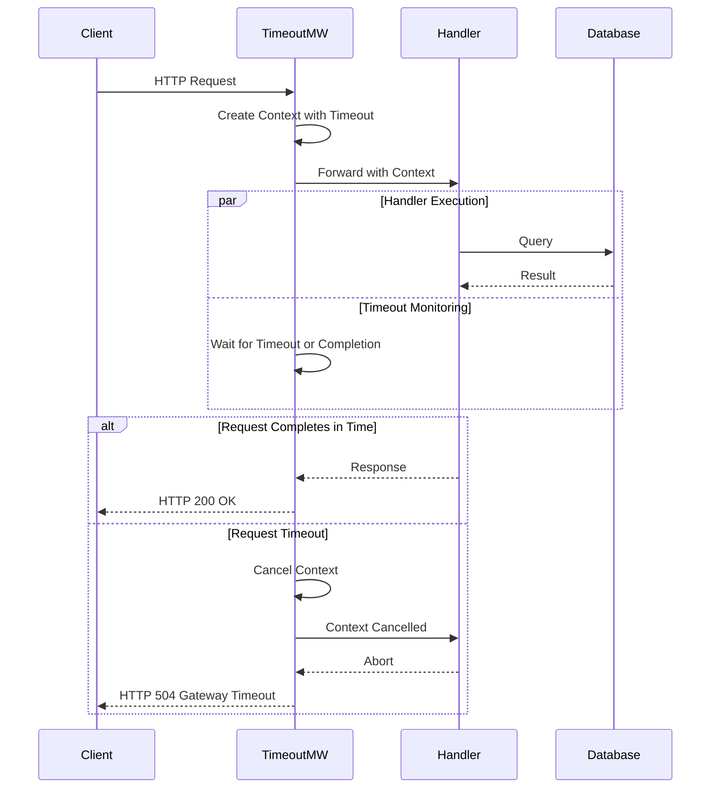

# 超时控制中间件设计

> **文档版本**: v1.0  
> **创建日期**: 2025-10-21  
> **最后更新**: 2025-10-21  
> **状态**: ✅ 设计完成

---

## 1. 需求概述

### 1.1 功能描述

超时控制中间件为青羽后端提供HTTP请求超时管理能力，防止长时间运行的请求占用系统资源，确保系统响应性和稳定性。

### 1.2 业务价值

- **系统稳定性**：防止慢查询、死锁导致的资源耗尽
- **用户体验**：避免用户长时间等待
- **资源保护**：及时释放超时请求占用的资源
- **SLA保障**：确保服务响应时间在可接受范围内

### 1.3 应用场景

- **API超时控制**：限制API请求最大执行时间
- **数据库查询超时**：防止慢查询阻塞
- **外部服务调用超时**：防止第三方服务不可用影响系统
- **长时间计算超时**：AI生成、大数据分析等
- **文件上传超时**：大文件上传时间限制

---

## 2. 架构设计

### 2.1 超时控制层级

```
┌─────────────────────────────────────────┐
│         超时控制体系                      │
├─────────────────────────────────────────┤
│  第一层：网关/负载均衡器超时              │
│  - Nginx/ALB超时设置                     │
│  - 通常: 60-120秒                        │
│  └─────────────────────────────────────┘
│              ↓                           │
│  第二层：HTTP Server超时（Gin）           │
│  ┌─────────────────────────────────┐   │
│  │ Timeout Middleware              │   │
│  │ - 请求总超时时间                │   │
│  │ - 路由级超时配置                │   │
│  │ - Context with Timeout          │   │
│  └─────────────────────────────────┘   │
│              ↓                           │
│  第三层：业务逻辑超时                     │
│  - Service层超时控制                     │
│  - 数据库查询超时                        │
│  - 外部API调用超时                       │
│  └─────────────────────────────────────┘
└─────────────────────────────────────────┘
```

### 2.2 超时处理流程



### 2.3 TimeoutWriter设计

```
┌────────────────────────────────────┐
│       TimeoutWriter                │
├────────────────────────────────────┤
│  嵌入: gin.ResponseWriter          │
│                                    │
│  字段:                              │
│  - mu sync.Mutex                   │
│  - timedOut bool                   │
│  - written bool                    │
│  - statusCode int                  │
│  - body bytes.Buffer               │
│                                    │
│  方法:                              │
│  - Write([]byte) (int, error)      │
│  - WriteHeader(int)                │
│  - isTimedOut() bool               │
│  - flush()                         │
└────────────────────────────────────┘
```

---

## 3. 详细设计

### 3.1 核心数据结构

```go
// 超时配置
type TimeoutConfig struct {
    Timeout          time.Duration                `json:"timeout" yaml:"timeout"`                     // 全局超时时间
    PathTimeouts     map[string]time.Duration     `json:"path_timeouts" yaml:"path_timeouts"`         // 路径级超时
    OnTimeout        func(*gin.Context)           `json:"-" yaml:"-"`                                 // 超时回调
    SkipPaths        []string                     `json:"skip_paths" yaml:"skip_paths"`               // 跳过的路径
    ErrorMessage     string                       `json:"error_message" yaml:"error_message"`         // 超时错误消息
    StatusCode       int                          `json:"status_code" yaml:"status_code"`             // 超时状态码
    EnableMetrics    bool                         `json:"enable_metrics" yaml:"enable_metrics"`       // 是否启用指标
}

// TimeoutWriter - 支持超时的ResponseWriter
type TimeoutWriter struct {
    gin.ResponseWriter
    
    mu          sync.Mutex
    timedOut    bool           // 是否已超时
    written     bool           // 是否已写入响应
    statusCode  int            // HTTP状态码
    body        bytes.Buffer   // 响应体缓冲
}
```

### 3.2 默认配置

```go
// 实现文件：timeout.go

func DefaultTimeoutConfig() TimeoutConfig {
    return TimeoutConfig{
        Timeout:       30 * time.Second,  // 默认30秒
        PathTimeouts:  make(map[string]time.Duration),
        SkipPaths:     []string{},
        ErrorMessage:  "Request timeout",
        StatusCode:    http.StatusGatewayTimeout, // 504
        EnableMetrics: true,
    }
}

// 常用超时配置
var (
    // 短超时（快速API）
    ShortTimeout = 5 * time.Second
    
    // 中等超时（普通API）
    MediumTimeout = 30 * time.Second
    
    // 长超时（复杂查询、文件处理）
    LongTimeout = 2 * time.Minute
    
    // 超长超时（AI生成、大数据分析）
    ExtraLongTimeout = 5 * time.Minute
)
```

### 3.3 超时中间件实现

```go
// 实现文件：timeout.go

func Timeout(timeout time.Duration) gin.HandlerFunc {
    config := DefaultTimeoutConfig()
    config.Timeout = timeout
    return TimeoutWithConfig(config)
}

func TimeoutWithConfig(config TimeoutConfig) gin.HandlerFunc {
    return func(c *gin.Context) {
        // 1. 检查是否跳过超时控制
        if shouldSkip(c.Request.URL.Path, config.SkipPaths) {
            c.Next()
            return
        }
        
        // 2. 获取路径特定的超时时间
        timeout := getTimeout(c.Request.URL.Path, config)
        
        // 3. 创建带超时的Context
        ctx, cancel := context.WithTimeout(c.Request.Context(), timeout)
        defer cancel()
        
        // 4. 替换Context
        c.Request = c.Request.WithContext(ctx)
        
        // 5. 创建TimeoutWriter
        tw := &TimeoutWriter{
            ResponseWriter: c.Writer,
            statusCode:     http.StatusOK,
        }
        c.Writer = tw
        
        // 6. 在goroutine中执行处理器
        finished := make(chan struct{})
        panicChan := make(chan interface{}, 1)
        
        go func() {
            defer func() {
                if p := recover(); p != nil {
                    panicChan <- p
                }
            }()
            
            c.Next()
            close(finished)
        }()
        
        // 7. 等待完成或超时
        select {
        case <-finished:
            // 请求正常完成
            tw.flush()
            
            // 记录指标
            if config.EnableMetrics {
                recordTimeoutMetrics(c.Request.URL.Path, false, timeout)
            }
            
        case p := <-panicChan:
            // 发生panic，重新抛出
            panic(p)
            
        case <-ctx.Done():
            // 请求超时
            tw.timeout()
            
            // 记录超时日志
            logTimeout(c, timeout)
            
            // 调用自定义超时处理
            if config.OnTimeout != nil {
                config.OnTimeout(c)
            } else {
                c.JSON(config.StatusCode, gin.H{
                    "code":    50401,
                    "message": config.ErrorMessage,
                    "timeout": timeout.String(),
                })
            }
            
            // 记录指标
            if config.EnableMetrics {
                recordTimeoutMetrics(c.Request.URL.Path, true, timeout)
            }
            
            c.Abort()
        }
    }
}

// 获取超时时间
func getTimeout(path string, config TimeoutConfig) time.Duration {
    // 1. 检查精确匹配
    if timeout, exists := config.PathTimeouts[path]; exists {
        return timeout
    }
    
    // 2. 检查模式匹配
    for pattern, timeout := range config.PathTimeouts {
        if matchPath(path, pattern) {
            return timeout
        }
    }
    
    // 3. 返回默认超时
    return config.Timeout
}

// 路径模式匹配
func matchPath(path, pattern string) bool {
    // 简单通配符匹配
    if strings.HasSuffix(pattern, "*") {
        prefix := strings.TrimSuffix(pattern, "*")
        return strings.HasPrefix(path, prefix)
    }
    return path == pattern
}

// 是否跳过超时控制
func shouldSkip(path string, skipPaths []string) bool {
    for _, skip := range skipPaths {
        if matchPath(path, skip) {
            return true
        }
    }
    return false
}
```

### 3.4 TimeoutWriter实现

```go
// 实现文件：timeout.go

func NewTimeoutWriter(w gin.ResponseWriter) *TimeoutWriter {
    return &TimeoutWriter{
        ResponseWriter: w,
        statusCode:     http.StatusOK,
    }
}

// Write - 写入响应体
func (tw *TimeoutWriter) Write(data []byte) (int, error) {
    tw.mu.Lock()
    defer tw.mu.Unlock()
    
    if tw.timedOut {
        return 0, http.ErrHandlerTimeout
    }
    
    if !tw.written {
        tw.written = true
    }
    
    // 写入到缓冲区
    return tw.body.Write(data)
}

// WriteHeader - 写入状态码
func (tw *TimeoutWriter) WriteHeader(code int) {
    tw.mu.Lock()
    defer tw.mu.Unlock()
    
    if tw.timedOut {
        return
    }
    
    tw.statusCode = code
}

// timeout - 标记为超时
func (tw *TimeoutWriter) timeout() {
    tw.mu.Lock()
    defer tw.mu.Unlock()
    
    tw.timedOut = true
}

// isTimedOut - 检查是否超时
func (tw *TimeoutWriter) isTimedOut() bool {
    tw.mu.Lock()
    defer tw.mu.Unlock()
    
    return tw.timedOut
}

// flush - 刷新缓冲区到实际ResponseWriter
func (tw *TimeoutWriter) flush() {
    tw.mu.Lock()
    defer tw.mu.Unlock()
    
    if tw.timedOut {
        return
    }
    
    // 写入状态码
    if tw.written {
        tw.ResponseWriter.WriteHeader(tw.statusCode)
        
        // 写入响应体
        tw.ResponseWriter.Write(tw.body.Bytes())
    }
}
```

---

## 4. 高级特性

### 4.1 动态超时调整

```go
// 根据请求大小动态调整超时时间
func DynamicTimeout() gin.HandlerFunc {
    return func(c *gin.Context) {
        // 获取请求体大小
        contentLength := c.Request.ContentLength
        
        var timeout time.Duration
        switch {
        case contentLength < 1024*1024: // < 1MB
            timeout = 10 * time.Second
        case contentLength < 10*1024*1024: // < 10MB
            timeout = 1 * time.Minute
        case contentLength < 100*1024*1024: // < 100MB
            timeout = 5 * time.Minute
        default:
            timeout = 10 * time.Minute
        }
        
        // 应用超时
        TimeoutWithConfig(TimeoutConfig{
            Timeout: timeout,
        })(c)
    }
}
```

### 4.2 可中断的业务逻辑

```go
// Service层支持超时中断
func (s *ProjectService) CreateProject(ctx context.Context, req *CreateProjectRequest) (*Project, error) {
    // 1. 检查context是否已取消
    select {
    case <-ctx.Done():
        return nil, ctx.Err()
    default:
    }
    
    // 2. 执行业务逻辑（带超时检查）
    project := &Project{
        Name: req.Name,
    }
    
    // 3. 数据库操作（传递ctx）
    if err := s.projectRepo.Create(ctx, project); err != nil {
        return nil, err
    }
    
    // 4. 耗时操作前检查
    select {
    case <-ctx.Done():
        // 已超时，回滚
        s.projectRepo.Delete(ctx, project.ID)
        return nil, ctx.Err()
    default:
    }
    
    // 5. 继续其他操作...
    
    return project, nil
}
```

### 4.3 流式响应超时处理

```go
// SSE/WebSocket等流式响应的超时控制
func StreamingTimeout(keepAliveInterval time.Duration) gin.HandlerFunc {
    return func(c *gin.Context) {
        // 创建带超时的context
        ctx, cancel := context.WithTimeout(c.Request.Context(), 30*time.Minute)
        defer cancel()
        
        c.Request = c.Request.WithContext(ctx)
        
        // 启动心跳检测
        ticker := time.NewTicker(keepAliveInterval)
        defer ticker.Stop()
        
        done := make(chan struct{})
        go func() {
            c.Next()
            close(done)
        }()
        
        // 等待完成或心跳
        for {
            select {
            case <-done:
                return
            case <-ticker.C:
                // 发送心跳
                if c.Writer.Written() {
                    c.Writer.Flush()
                }
            case <-ctx.Done():
                c.Abort()
                return
            }
        }
    }
}
```

---

## 5. 配置管理

### 5.1 配置文件

```yaml
# config/timeout.yaml
timeout:
  # 全局超时配置
  global:
    default: 30s
    error_message: "Request timeout"
    status_code: 504
    enable_metrics: true
  
  # 路径级超时配置
  paths:
    # 快速API
    /api/v1/health:
      timeout: 5s
    
    # 普通API
    /api/v1/projects:
      timeout: 30s
    
    # 文件上传
    /api/v1/upload:
      timeout: 5m
    
    # AI生成
    /api/v1/ai/*:
      timeout: 2m
    
    # 数据导出
    /api/v1/export/*:
      timeout: 10m
  
  # 跳过超时控制的路径
  skip_paths:
    - /api/v1/ws/*      # WebSocket
    - /api/v1/sse/*     # Server-Sent Events
    - /api/v1/stream/*  # 流式响应
  
  # 动态超时配置
  dynamic:
    enabled: true
    by_content_length:
      - max_size: 1048576      # 1MB
        timeout: 10s
      - max_size: 10485760     # 10MB
        timeout: 1m
      - max_size: 104857600    # 100MB
        timeout: 5m
```

### 5.2 配置加载

```go
type TimeoutConfigs struct {
    Global  TimeoutConfig            `yaml:"global"`
    Paths   map[string]PathTimeout   `yaml:"paths"`
    SkipPaths []string               `yaml:"skip_paths"`
}

type PathTimeout struct {
    Timeout time.Duration `yaml:"timeout"`
}

func LoadTimeoutConfig(path string) (*TimeoutConfigs, error) {
    data, err := os.ReadFile(path)
    if err != nil {
        return nil, err
    }
    
    var config TimeoutConfigs
    if err := yaml.Unmarshal(data, &config); err != nil {
        return nil, err
    }
    
    return &config, nil
}
```

---

## 6. 监控与告警

### 6.1 Prometheus指标

```go
var (
    timeoutTotal = prometheus.NewCounterVec(
        prometheus.CounterOpts{
            Name: "http_request_timeout_total",
            Help: "Total number of timed out requests",
        },
        []string{"path", "timeout"},
    )
    
    timeoutDuration = prometheus.NewHistogramVec(
        prometheus.HistogramOpts{
            Name:    "http_request_timeout_duration_seconds",
            Help:    "Request timeout duration in seconds",
            Buckets: []float64{1, 5, 10, 30, 60, 120, 300},
        },
        []string{"path"},
    )
)

func recordTimeoutMetrics(path string, timedOut bool, timeout time.Duration) {
    if timedOut {
        timeoutTotal.WithLabelValues(path, timeout.String()).Inc()
    }
    
    timeoutDuration.WithLabelValues(path).Observe(timeout.Seconds())
}
```

### 6.2 超时日志

```go
func logTimeout(c *gin.Context, timeout time.Duration) {
    logger.Warn("Request timeout",
        zap.String("path", c.Request.URL.Path),
        zap.String("method", c.Request.Method),
        zap.String("client_ip", c.ClientIP()),
        zap.Duration("timeout", timeout),
        zap.String("user_agent", c.Request.UserAgent()),
    )
}
```

### 6.3 告警规则

```yaml
# prometheus/alerts/timeout.yml
groups:
  - name: timeout
    rules:
      - alert: HighTimeoutRate
        expr: rate(http_request_timeout_total[5m]) > 0.1
        for: 5m
        labels:
          severity: warning
        annotations:
          summary: "高超时率"
          description: "5分钟内超时率超过10%"
      
      - alert: FrequentTimeout
        expr: increase(http_request_timeout_total[1h]) > 100
        for: 5m
        labels:
          severity: critical
        annotations:
          summary: "频繁超时"
          description: "1小时内超时次数超过100次"
```

---

## 7. 性能优化

### 7.1 超时检查优化

```go
// 使用单个goroutine而非每个请求一个
type TimeoutPool struct {
    timeouts chan timeoutRequest
}

type timeoutRequest struct {
    ctx     context.Context
    done    chan struct{}
    timeout time.Duration
}

func (tp *TimeoutPool) Start() {
    go func() {
        for req := range tp.timeouts {
            go tp.handleTimeout(req)
        }
    }()
}

func (tp *TimeoutPool) handleTimeout(req timeoutRequest) {
    timer := time.NewTimer(req.timeout)
    defer timer.Stop()
    
    select {
    case <-req.done:
        // 请求完成
    case <-timer.C:
        // 超时
        req.ctx.Done()
    }
}
```

### 7.2 减少内存分配

```go
// 复用TimeoutWriter
var timeoutWriterPool = sync.Pool{
    New: func() interface{} {
        return &TimeoutWriter{}
    },
}

func getTimeoutWriter(w gin.ResponseWriter) *TimeoutWriter {
    tw := timeoutWriterPool.Get().(*TimeoutWriter)
    tw.ResponseWriter = w
    tw.statusCode = http.StatusOK
    tw.timedOut = false
    tw.written = false
    tw.body.Reset()
    return tw
}

func putTimeoutWriter(tw *TimeoutWriter) {
    timeoutWriterPool.Put(tw)
}
```

---

## 8. 测试设计

### 8.1 超时测试

```go
func TestTimeout_RequestTimeout(t *testing.T) {
    gin.SetMode(gin.TestMode)
    
    router := gin.New()
    router.Use(Timeout(100 * time.Millisecond))
    router.GET("/slow", func(c *gin.Context) {
        time.Sleep(200 * time.Millisecond) // 超过超时时间
        c.JSON(200, gin.H{"status": "ok"})
    })
    
    w := httptest.NewRecorder()
    req, _ := http.NewRequest("GET", "/slow", nil)
    router.ServeHTTP(w, req)
    
    // 验证返回504超时错误
    assert.Equal(t, 504, w.Code)
}

func TestTimeout_RequestComplete(t *testing.T) {
    gin.SetMode(gin.TestMode)
    
    router := gin.New()
    router.Use(Timeout(200 * time.Millisecond))
    router.GET("/fast", func(c *gin.Context) {
        time.Sleep(50 * time.Millisecond) // 未超时
        c.JSON(200, gin.H{"status": "ok"})
    })
    
    w := httptest.NewRecorder()
    req, _ := http.NewRequest("GET", "/fast", nil)
    router.ServeHTTP(w, req)
    
    // 验证正常返回
    assert.Equal(t, 200, w.Code)
}
```

---

## 9. 使用示例

### 9.1 基本使用

```go
// router/enter.go
func InitRoutes(r *gin.Engine) {
    // 全局超时：30秒
    r.Use(middleware.Timeout(30 * time.Second))
    
    // API路由
    api := r.Group("/api/v1")
    {
        // 快速API：5秒超时
        api.GET("/health", middleware.Timeout(5*time.Second), healthApi.Check)
        
        // AI生成：2分钟超时
        aiGroup := api.Group("/ai")
        aiGroup.Use(middleware.Timeout(2 * time.Minute))
        {
            aiGroup.POST("/generate", aiApi.Generate)
        }
        
        // 文件上传：5分钟超时
        api.POST("/upload", 
            middleware.Timeout(5*time.Minute),
            uploadApi.Upload)
    }
}
```

### 9.2 路径级配置

```go
config := middleware.TimeoutConfig{
    Timeout: 30 * time.Second,
    PathTimeouts: map[string]time.Duration{
        "/api/v1/ai/*":     2 * time.Minute,
        "/api/v1/export/*": 10 * time.Minute,
        "/api/v1/health":   5 * time.Second,
    },
    SkipPaths: []string{
        "/api/v1/ws/*",
        "/api/v1/sse/*",
    },
}

router.Use(middleware.TimeoutWithConfig(config))
```

---

## 10. 最佳实践

### 10.1 超时时间建议

| 场景 | 建议超时 | 说明 |
|------|---------|------|
| 健康检查 | 1-5秒 | 快速响应 |
| 普通API | 10-30秒 | 平衡用户体验和系统稳定性 |
| 复杂查询 | 30-60秒 | 允许一定的计算时间 |
| 文件上传 | 2-5分钟 | 根据文件大小调整 |
| AI生成 | 1-5分钟 | 根据复杂度调整 |
| 导出/报表 | 5-10分钟 | 考虑异步处理 |

### 10.2 使用建议

- ✅ 为不同类型的API设置不同超时时间
- ✅ 长时间任务考虑异步处理
- ✅ 业务逻辑中检查context取消
- ✅ 数据库查询传递context
- ✅ 监控超时率，及时调整
- ❌ 不要设置过短的超时时间
- ❌ 不要忽略context.Done()信号
- ❌ 不要在超时后继续执行耗时操作

---

## 11. 关联文件

### 实现文件

- `middleware/timeout.go` - 超时控制中间件 (~210行)

### 相关设计

- [中间件总体设计](./中间件总体设计.md) - 中间件架构
- [Recovery中间件](./安全中间件设计.md#panic恢复中间件) - Panic恢复
- [限流中间件设计](./限流中间件设计.md) - 请求限流

---

**文档版本**: v1.0  
**创建时间**: 2025-10-21  
**作者**: 青羽架构组

