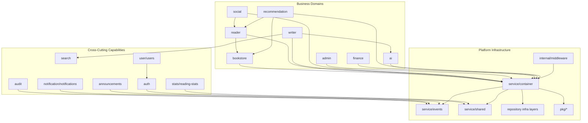

# Qingyu Backend Module Map

> Date: 2026-04-07  
> Scope: current backend code layout and runtime composition

## 1. Three-Layer Module Narrative

后端当前不是“每个模块都完全五层对齐”的纯净结构，而是三类模块并存：

1. 业务域（Business Domains）
2. 横切能力（Cross-Cutting Capabilities）
3. 平台基础设施（Platform Infrastructure）

### 1.1 Business Domains

- `bookstore`
- `reader`
- `writer`
- `social`
- `admin`
- `finance`
- `recommendation`
- `ai`

这些域大多具备 `models + repository + service + router + api/v1` 的可追踪路径，其中 `bookstore/social/ai/admin/finance/recommendation` 对齐度最高。

### 1.2 Cross-Cutting Capabilities

- `auth`
- `audit`
- `notification / notifications`
- `announcements`
- `search`
- `stats / reading-stats`
- `user / users`

这类模块通常跨多个业务域，路由与服务实现并不总是严格一一对应。

### 1.3 Platform Infrastructure

- `service/container`
- `service/events`
- `service/shared`
- `service/base`
- `service/channels`
- `service/internalapi`
- `internal/middleware`
- `repository/cache`, `repository/redis`, `repository/querybuilder`, `repository/search`
- `models/shared`, `models/dto`, `models/storage`
- `pkg/*` 通用基础设施

## 2. Alignment Snapshot

| Module | Alignment | Notes |
|---|---|---|
| `bookstore` | Strong | 标准五层路径清晰 |
| `social` | Strong | 路由/API/服务/仓储一致性高 |
| `ai` | Strong-but-heavy | 同时承担业务与平台能力 |
| `admin` | Strong | 管理域接口集中 |
| `finance` | Strong | 路由和服务边界较稳 |
| `recommendation` | Strong | 依赖 reader/bookstore 数据 |
| `writer` | Split subdomains | 复合子域，不再是单一模块 |
| `reader` | Partial drift | `reader` 与 `reading-stats` 命名分裂 |
| `notification` | Naming drift | service 单数，router/api 复数 |
| `user` | Naming drift | `models/users` vs `service/user` |
| `search` | Not pure vertical slice | 初始化和接线在 `router/enter.go` |
| `auth` / `audit` | Horizontal-style | 非独立 router slice |

## 3. Key Structural Facts

### 3.1 Writer is a composite subsystem

`writer` 当前覆盖多个子域：

- project/document lifecycle
- outline / story harness
- keyword / location / encyclopedia
- publish / stats / audit-related routes

这意味着 `writer` 应按子域治理，而不是继续当成单一服务包扩展。

### 3.2 Shared is high-risk cross-cutting layer

`service/shared` 汇集了 auth、cache、metrics、stats、storage、permission 等能力。  
复用价值高，但也最容易演化成“职责黑洞”，导致边界退化和改动扩散。

### 3.3 `router/enter.go` is a runtime orchestrator, not just route index

它不仅做路由注册，还做：

- 服务可用性判断和渐进式注册
- 搜索服务初始化
- 事件订阅接线
- 兼容路由保留

因此它是架构理解中的一级节点。

## 4. Naming Drift And Legacy Burden

| Drift | Current State | Impact |
|---|---|---|
| `notification` vs `notifications` | service/models 单数，router/api 复数 | 认知成本高，检索路径易错 |
| `user` vs `users` | service/repo/api 用单数，models 用复数目录 | 文档和代码映射易失真 |
| `stats` vs `reading-stats` | 服务实现散在 `service/reader/stats` 与 `service/shared/stats` | 路由层与服务层心智模型不一致 |
| `announcements` vs `messaging` | 公告路由独立，服务实现依附 messaging | 业务边界判断困难 |

## 5. Module Boundary Diagram

## 6. How To Read The Codebase Fast

1. 先看 [system_architecture.md](./system_architecture.md) 建立全局图。
2. 再看 [2026-04-07-backend-runtime-flow.md](./2026-04-07-backend-runtime-flow.md) 理解真实启动与请求链路。
3. 再按“业务域 / 横切能力 / 平台基础设施”在目录中定位目标模块。
