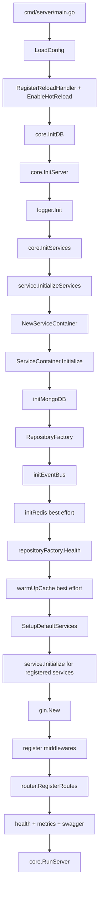
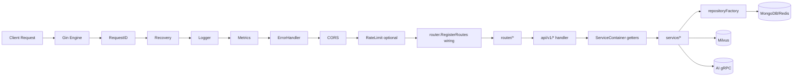

# 后端运行时架构

> 更新日期: 2026-04-07
> 关注范围: `cmd/server`、`core`、`service`、`service/container`、`router`

本文档只写“当前代码真的怎么跑”，不写理想化架构。

## 1. 入口与真实启动链路

### 1.1 主入口

- 进程入口: `cmd/server/main.go`
- 服务器装配: `core/server.go`
- 服务容器入口: `service/enter.go`
- 容器实现: `service/container/service_container.go`
- 路由总入口: `router/enter.go`

### 1.2 启动主流程

```text
cmd/server/main.go
-> config.LoadConfig()
-> config.RegisterReloadHandler()
-> config.EnableHotReload()
-> core.InitDB()               // 兼容保留，当前为 no-op
-> core.InitServer()
-> logger.Init()
-> core.InitServices()
-> service.InitializeServices()
-> container.NewServiceContainer()
-> ServiceContainer.Initialize()
-> initMongoDB()
-> NewMongoRepositoryFactoryWithClient()
-> initEventBus()
-> initRedis()                 // best effort，不阻塞启动
-> repositoryFactory.Health()
-> warmUpCache()               // best effort
-> SetupDefaultServices()
-> RegisterService(...)
-> service.Initialize(...)     // 对新注册服务再执行一轮初始化
-> gin.New()
-> 注册 builtin / ratelimit / metrics 中间件
-> router.RegisterRoutes()
-> ginSwagger + health + metrics
-> core.RunServer()
```

### 1.3 Mermaid 启动链路图



## 2. 关键运行时对象

### 2.1 全局配置

- `config.GlobalConfig`
- 在 `config.LoadConfig()` 后被后续模块广泛读取
- 配置热重载通过 `config.RegisterReloadHandler()` 和 `config.EnableHotReload()` 启用

### 2.2 全局服务容器

- `service.ServiceManager`
- 类型为 `*container.ServiceContainer`
- 路由层通过 `service.GetServiceContainer()` 读取
- 当前是全局可变单例，而不是显式依赖注入到 `router.RegisterRoutes()`

### 2.3 ServiceContainer 内部关键资源

- `mongoClient`
- `mongoDB`
- `redisClient`
- `repositoryFactory`
- `eventBus`
- `providerRegistry`
- 大量领域服务实例和 websocket hub

### 2.4 真实依赖注入方式

当前项目同时存在两种注入风格：

1. **主路径**: `ServiceContainer` 手工装配并缓存服务实例
2. **演进路径**: `ProviderRegistry` 支持声明式 provider 和依赖解析

这说明项目处于“从手工容器向 provider registry 演进”的过渡期，而不是完全 provider-first。

## 3. Gin 中间件顺序

中间件注册位于 `core.InitServer()`，顺序如下：

1. `RequestIDMiddleware`
2. `RecoveryMiddleware`
3. `LoggerMiddleware`
4. `metrics.Middleware()`
5. `ErrorHandlerMiddleware`
6. `CORSMiddleware`
7. `RateLimitMiddleware`（按配置启用）

这是当前非常关键的事实，因为日志、指标、统一错误处理和限流的先后顺序会直接影响请求观测性与错误表现。

## 4. 路由注册与请求进入业务层

### 4.1 路由总入口

- `router.RegisterRoutes(r *gin.Engine)`
- 先取全局 `ServiceContainer`
- 再创建 `/api/v1` 分组
- 按服务可用性做“渐进式注册”

### 4.2 请求主路径

```text
HTTP Request
-> Gin Engine
-> builtin/metrics/ratelimit middlewares
-> router/<domain>
-> api/v1/<domain> handler
-> service container 持有的 service
-> repositoryFactory / repository
-> MongoDB / Redis / Milvus / AI gRPC
```

### 4.3 Mermaid 请求流图



## 5. 当前真实架构特征

### 5.1 分层仍然成立

主路径仍然是：

`router -> api -> service -> repository -> data source`

这是项目最稳定的骨架。

### 5.2 但运行时编排高度集中

`router/enter.go` 当前超过千行，承担了：

- 服务可用性探测
- 路由注册
- 搜索服务初始化
- 兼容路由保留
- 多个 warning / fallback 决策

因此它不仅是“路由入口”，也是一个事实上的运行时编排层。

### 5.3 容器是单体运行时核心

`ServiceContainer` 不只是 DI 容器，还承担：

- Mongo/Redis 初始化
- EventBus 初始化
- RepositoryFactory 创建
- 服务实例缓存
- ProviderRegistry 挂载
- 基础设施健康检查

这意味着它同时具备 `bootstrap + service locator + infra manager` 三种角色。

## 6. 对架构图和理解最重要的事实

1. `core.InitDB()` 仍然在入口链上，但现在是兼容用 no-op。
2. 真实数据库初始化已经迁移到 `ServiceContainer.Initialize()`。
3. `ServiceManager` 是全局单例，路由层不是显式传参注入。
4. `router.RegisterRoutes()` 采用“渐进式注册”，服务缺失时会跳过部分路由，而不是整体失败。
5. `ProviderRegistry` 已存在，但默认服务初始化仍以手工装配为主。

## 7. 当前最值得警惕的反直觉点

### 7.1 `InitDB` 名称仍在，但不再负责真实 DB 初始化

这很容易误导后来者，也会误导基于文件名推理的 AI。

### 7.2 容器初始化与服务注册分成两段

`Initialize()` 先跑基础设施，`SetupDefaultServices()` 再装配领域服务并执行二次初始化。

这不是典型的一步式容器启动，需要在图里明确标出来。

### 7.3 路由层 silently degraded

路由注册大量使用 warning + skip 策略。启动成功不代表所有业务路由都真的可用。

### 7.4 Provider 化还未完全落地

代码里已经有 `ProviderRegistry`，但主路径仍然依赖庞大的手工 `SetupDefaultServices()`。

### 7.5 搜索服务初始化夹在路由注册期

`initSearchService()` 在 `router/enter.go` 内执行，而不是在统一 bootstrap 层完成，这是理解搜索链路时最容易忽略的结构特点。
