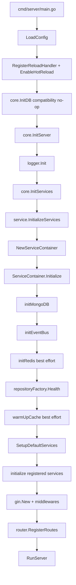
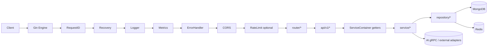

# Qingyu Backend Runtime Flow

> Date: 2026-04-07  
> Scope: `cmd/server/main.go -> core -> service/container -> router/enter.go`

本文档只描述“当前代码如何真实启动和处理请求”。

## 1. Entry Chain

### 1.1 Process entry

- `cmd/server/main.go`
- `core/init_db.go`
- `core/server.go`
- `service/enter.go`
- `service/container/service_container.go`
- `router/enter.go`

### 1.2 Startup sequence (actual)

```text
main()
-> config.LoadConfig()
-> config.RegisterReloadHandler()
-> config.EnableHotReload()
-> core.InitDB()                 // compatibility no-op
-> core.InitServer()
-> logger.Init()
-> core.InitServices()
-> service.InitializeServices()
-> NewServiceContainer()
-> ServiceContainer.Initialize()
-> initMongoDB()
-> initEventBus()
-> initRedis()                   // best effort
-> repositoryFactory.Health()
-> warmUpCache()                 // best effort
-> ServiceContainer.SetupDefaultServices()
-> (initialize newly registered services)
-> gin.New()
-> register middlewares
-> router.RegisterRoutes()
-> core.RunServer()
```

## 2. Startup Mermaid



## 3. Request Path

当前请求路径可归纳为：

```text
HTTP request
-> Gin middleware chain
-> router group registration result
-> api/v1 handler
-> service layer (from ServiceContainer)
-> repository layer
-> MongoDB/Redis/other adapters
```

中间件顺序（`core/server.go`）：

1. RequestID
2. Recovery
3. Logger
4. Metrics
5. ErrorHandler
6. CORS
7. RateLimit (if enabled)

## 4. Request Mermaid



## 5. Container Assembly Snapshot

`ServiceContainer` 同时承担：

- infra bootstrap (`MongoDB`, `Redis`, `EventBus`)
- repository factory creation
- service lifecycle and instance storage
- provider registry hosting

这意味着它不是“轻量 IoC 容器”，而是后端运行时中心。

## 6. Runtime Risks Worth Calling Out

1. `core.InitDB()` 名称仍在启动链路中，但已迁移为兼容 no-op，容易误导。
2. `router/enter.go` 过重，承担路由注册以外的搜索初始化和事件接线。
3. 路由采用渐进式注册，服务缺失时会跳过部分路由，启动成功不等于功能齐全。
4. ProviderRegistry 已存在，但默认服务装配仍大量依赖手工 `SetupDefaultServices()`。
