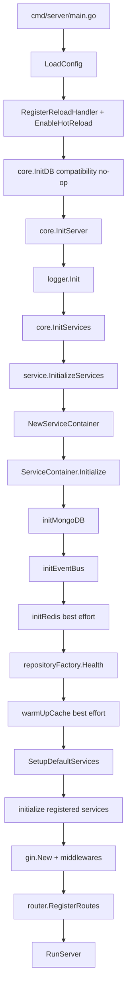
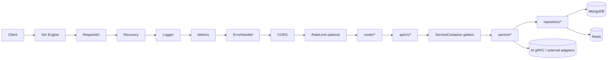

# Qingyu Backend Runtime Flow

> Date: 2026-04-07  
> Scope: `cmd/server/main.go -> core -> service/container -> router/enter.go`

## Page Role

- current-reference
- current-owner: `docs/architecture/`
- current-bounded: 当前运行时链路参考，负责启动序列、请求路径和容器装配快照说明

## Recommended Read Path

1. 先读 `README.md`。
2. 再读 `system_architecture.md` 建立总图。
3. 最后用本页确认 `main -> core -> container -> router` 的真实执行链。

## Boundary

- 本页只回答“服务如何启动、请求如何流转”，不替代模块地图和依赖规则。
- 若需要详细模块分层，请回 `2026-04-07-backend-module-map.md`；若需要实施过程，请回 `../implementation/README.md`。

## Quick Section Map

- Entry Chain
- Startup Mermaid
- Request Path
- Request Mermaid
- Container Assembly Snapshot
- Runtime Risks Worth Calling Out

## Quick Takeaways

- 本页是运行时事实参考，不是架构愿景稿。
- 读完本页可以快速定位启动链、容器装配点和请求入口。

## Skip Guide

- 只看总体架构：回 `system_architecture.md`。
- 只看分层规则：跳去 `dependency-rules.md`。

本文档只描述“当前代码如何真实启动和处理请求”。

## 1. Entry Chain

### 1.1 Process entry

- `cmd/server/main.go`
- `core/init_db.go`
- `core/server.go`
- `service/enter.go`
- `service/container/service_container.go`
- `router/enter.go`

### 1.2 Startup sequence (actual)

```text
main()
-> config.LoadConfig()
-> config.RegisterReloadHandler()
-> config.EnableHotReload()
-> core.InitDB()                 // compatibility no-op
-> core.InitServer()
-> logger.Init()
-> core.InitServices()
-> service.InitializeServices()
-> NewServiceContainer()
-> ServiceContainer.Initialize()
-> initMongoDB()
-> initEventBus()
-> initRedis()                   // best effort
-> repositoryFactory.Health()
-> warmUpCache()                 // best effort
-> ServiceContainer.SetupDefaultServices()
-> (initialize newly registered services)
-> gin.New()
-> register middlewares
-> router.RegisterRoutes()
-> core.RunServer()
```

## 2. Startup Mermaid


```mermaid
flowchart TD
    A[cmd/server/main.go] --> B[LoadConfig]
    B --> C[RegisterReloadHandler + EnableHotReload]
    C --> D[core.InitDB compatibility no-op]
    D --> E[core.InitServer]
    E --> F[logger.Init]
    F --> G[core.InitServices]
    G --> H[service.InitializeServices]
    H --> I[NewServiceContainer]
    I --> J[ServiceContainer.Initialize]
    J --> K[initMongoDB]
    K --> L[initEventBus]
    L --> M[initRedis best effort]
    M --> N[repositoryFactory.Health]
    N --> O[warmUpCache best effort]
    O --> P[SetupDefaultServices]
    P --> Q[initialize registered services]
    Q --> R[gin.New + middlewares]
    R --> S[router.RegisterRoutes]
    S --> T[RunServer]
```

## 3. Request Path

当前请求路径可归纳为：

```text
HTTP request
-> Gin middleware chain
-> router group registration result
-> api/v1 handler
-> service layer (from ServiceContainer)
-> repository layer
-> MongoDB/Redis/other adapters
```

中间件顺序（`core/server.go`）：

1. RequestID
2. Recovery
3. Logger
4. Metrics
5. ErrorHandler
6. CORS
7. RateLimit (if enabled)

## 4. Request Mermaid


```mermaid
flowchart LR
    A[Client] --> B[Gin Engine]
    B --> C[RequestID]
    C --> D[Recovery]
    D --> E[Logger]
    E --> F[Metrics]
    F --> G[ErrorHandler]
    G --> H[CORS]
    H --> I[RateLimit optional]
    I --> J[router/*]
    J --> K[api/v1/*]
    K --> L[ServiceContainer getters]
    L --> M[service/*]
    M --> N[repository/*]
    N --> O[(MongoDB)]
    N --> P[(Redis)]
    M --> Q[(AI gRPC / external adapters)]
```

## 5. Container Assembly Snapshot

`ServiceContainer` 同时承担：

- infra bootstrap (`MongoDB`, `Redis`, `EventBus`)
- repository factory creation
- service lifecycle and instance storage
- provider registry hosting

这意味着它不是“轻量 IoC 容器”，而是后端运行时中心。

## 6. Runtime Risks Worth Calling Out

1. `core.InitDB()` 名称仍在启动链路中，但已迁移为兼容 no-op，容易误导。
2. `router/enter.go` 过重，承担路由注册以外的搜索初始化和事件接线。
3. 路由采用渐进式注册，服务缺失时会跳过部分路由，启动成功不等于功能齐全。
4. ProviderRegistry 已存在，但默认服务装配仍大量依赖手工 `SetupDefaultServices()`。
