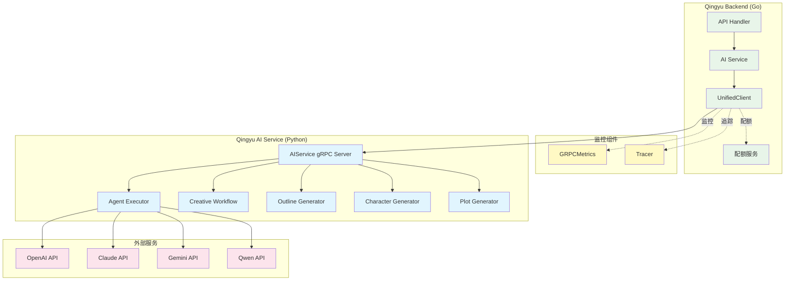
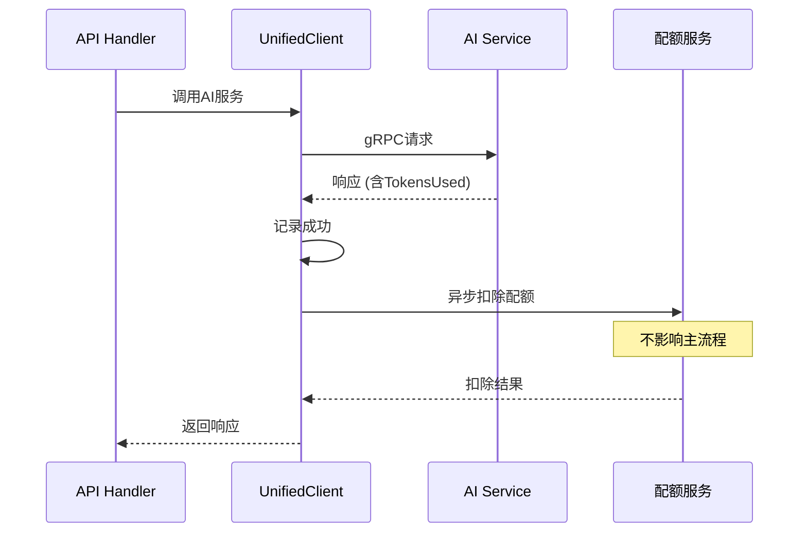

# AI服务gRPC对接文档

> **版本**: v1.0
> **创建日期**: 2026-02-27
> **最后更新**: 2026-02-27

---

## 目录

- [架构概述](#架构概述)
- [gRPC服务列表](#grpc服务列表)
- [UnifiedClient 使用指南](#unifiedclient-使用指南)
- [配额集成说明](#配额集成说明)
- [监控使用指南](#监控使用指南)
- [错误处理说明](#错误处理说明)
- [示例代码](#示例代码)

---

## 架构概述

### 系统架构



### 核心组件

| 组件 | 文件 | 职责 |
|------|------|------|
| **UnifiedClient** | `service/ai/unified_client.go` | 统一的gRPC客户端，整合所有AI服务调用 |
| **GRPCMetrics** | `service/ai/grpc_metrics.go` | gRPC调用统计和性能监控 |
| **Tracer** | `service/ai/grpc_tracing.go` | 请求追踪和调试 |
| **QuotaService** | `service/ai/quota_service.go` | AI配额管理 |
| **AIServiceConfig** | `service/ai/ai_service.go` | AI服务配置 |

### 设计原则

1. **统一接口**: 所有AI服务通过UnifiedClient调用，避免多个客户端
2. **可选监控**: 监控功能可启用/禁用，不影响主流程
3. **异步配额**: 配额扣除异步进行，不影响响应时间
4. **自动重试**: 支持可重试错误的自动重试
5. **超时控制**: 每个调用支持独立的超时设置

---

## gRPC服务列表

### 可用服务

| 服务名 | 方法 | 描述 | 超时 | 配额估算 |
|--------|------|------|------|----------|
| **ExecuteAgent** | `ExecuteAgent` | 执行AI Agent工作流 | 30s | 实际返回 |
| **GenerateOutline** | `GenerateOutline` | 生成故事大纲 | 30s | 1000 tokens |
| **GenerateCharacters** | `GenerateCharacters` | 生成角色设定 | 30s | 1500 tokens |
| **GeneratePlot** | `GeneratePlot` | 生成情节设定 | 30s | 2000 tokens |
| **ExecuteCreativeWorkflow** | `ExecuteCreativeWorkflow` | 执行完整创作工作流 | 120s | 实际返回 |
| **HealthCheck** | `HealthCheck` | 健康检查 | 5s | 0 |

### 服务常量

```go
const (
    ServiceExecuteAgent           = "ExecuteAgent"
    ServiceGenerateOutline        = "GenerateOutline"
    ServiceGenerateCharacters     = "GenerateCharacters"
    ServiceGeneratePlot           = "GeneratePlot"
    ServiceExecuteCreativeWorkflow = "ExecuteCreativeWorkflow"
    ServiceHealthCheck            = "HealthCheck"
)
```

### Proto定义

```protobuf
service AIService {
    rpc ExecuteAgent(AgentExecutionRequest) returns (AgentResponse);
    rpc GenerateOutline(OutlineRequest) returns (OutlineResponse);
    rpc GenerateCharacters(CharactersRequest) returns (CharactersResponse);
    rpc GeneratePlot(PlotRequest) returns (PlotResponse);
    rpc ExecuteCreativeWorkflow(CreativeWorkflowRequest) returns (CreativeWorkflowResponse);
    rpc HealthCheck(HealthCheckRequest) returns (HealthCheckResponse);
}
```

---

## UnifiedClient 使用指南

### 创建客户端

#### 方式1: 通过已有连接创建

```go
import (
    "Qingyu_backend/service/ai"
    "google.golang.org/grpc"
)

// 使用已有的gRPC连接
conn, err := grpc.Dial("ai-service:50051", grpc.WithTransportCredentials(insecure.NewCredentials()))
if err != nil {
    log.Fatal(err)
}

// 创建配置
config := &ai.AIServiceConfig{
    Endpoint:      "ai-service:50051",
    Timeout:       30 * time.Second,
    EnableMonitor: true, // 启用监控
}

// 创建客户端
client := ai.NewUnifiedClient(conn, config)
```

#### 方式2: 通过地址创建

```go
// 直接通过地址创建
client, err := ai.NewUnifiedClientWithAddress("ai-service:50051")
if err != nil {
    log.Fatal(err)
}
defer client.Close()
```

### 基本用法

#### 1. 执行Agent

```go
req := &ai.AgentRequest{
    WorkflowType: "chat",
    UserID:       "user123",
    Parameters: map[string]interface{}{
        "message": "你好",
        "model":   "gpt-4",
    },
}

resp, err := client.ExecuteAgent(ctx, req)
if err != nil {
    log.Printf("执行失败: %v", err)
    return
}

log.Printf("结果: %s", resp.Content)
log.Printf("使用tokens: %d", resp.TokensUsed)
```

#### 2. 生成故事大纲

```go
resp, err := client.GenerateOutline(
    ctx,
    "生成一个科幻小说大纲",
    "user123",
    "project456",
    map[string]string{
        "genre":    "科幻",
        "setting":  "未来地球",
        "tone":     "严肃",
    },
)
if err != nil {
    log.Fatal(err)
}

// 使用返回的大纲数据
outline := resp.Outline
```

#### 3. 生成角色设定

```go
resp, err := client.GenerateCharacters(
    ctx,
    "生成主要角色",
    "user123",
    "project456",
    outlineData, // 来自GenerateOutline的响应
    map[string]string{},
)
```

#### 4. 执行完整创作工作流

```go
resp, err := client.ExecuteCreativeWorkflow(
    ctx,
    "创作一篇短篇小说",
    "user123",
    "project456",
    3,                    // maxReflections
    true,                 // enableHumanReview
    map[string]string{},
)
```

### 高级功能

#### 1. 带重试的调用

```go
resp, err := client.ExecuteAgentWithRetry(ctx, req)
// 自动重试最多3次，处理临时故障
```

#### 2. 健康检查

```go
// 完整健康检查
health, err := client.HealthCheck(ctx)
if err != nil {
    log.Printf("服务不可用: %v", err)
} else {
    log.Printf("服务状态: %s", health.Status)
    log.Printf("版本: %s", health.Version)
}

// 简单健康检查
err = client.HealthCheckSimple(ctx)
if err != nil {
    log.Printf("服务不可用: %v", err)
}
```

#### 3. 超时设置

```go
// 设置全局超时
client.SetTimeout(60 * time.Second)

// 或者创建时设置
config := &ai.AIServiceConfig{
    Timeout: 60 * time.Second,
}
```

---

## 配额集成说明

### 配额服务集成

UnifiedClient支持可选的配额扣除功能，通过`QuotaServiceInterface`接口集成。

#### 配置配额服务

```go
import "Qingyu_backend/pkg/quota"

// 创建配额服务
quotaService := quota.NewService(...)

// 设置到客户端
client.SetQuotaService(quotaService)

// 启用配额扣除
client.EnableQuota()
```

#### 配额扣除流程



#### 配额计算

| 服务 | 配额计算方式 |
|------|-------------|
| ExecuteAgent | 实际返回的`TokensUsed` |
| GenerateOutline | 固定1000 tokens |
| GenerateCharacters | 固定1500 tokens |
| GeneratePlot | 固定2000 tokens |
| ExecuteCreativeWorkflow | 实际返回的`TokensUsed` |
| HealthCheck | 0 tokens |

#### 配额不足处理

配额扣除失败不会影响主流程：

```go
// 异步扣除配额
go func() {
    err := c.quotaService.ConsumeQuota(ctx, userID, tokens, service, model, requestID)
    if err != nil {
        // 记录错误但不影响响应
        logrus.WithError(err).Error("配额扣除失败")
        // 记录配额不足
        if c.enableMonitor && c.metrics != nil {
            c.metrics.RecordQuotaShortage(userID)
        }
    }
}()
```

### 配额监控

```go
// 获取配额报告
report := client.GetQuotaReport()

fmt.Printf("总消耗: %d tokens\n", report.TotalConsumed)
fmt.Printf("配额不足次数: %d\n", report.ShortageCount)

// 按服务统计
for service, tokens := range report.ByService {
    fmt.Printf("  %s: %d tokens\n", service, tokens)
}

// 按模型统计
for model, tokens := range report.ByModel {
    fmt.Printf("  %s: %d tokens\n", model, tokens)
}

// 格式化报告
fmt.Println(client.FormatQuotaReport())
```

---

## 监控使用指南

### 启用监控

```go
// 创建时启用
config := &ai.AIServiceConfig{
    EnableMonitor: true,
}
client := NewUnifiedClient(conn, config)

// 或后续启用
client.EnableMonitoring()
```

### 监控指标

#### 调用统计

```go
metrics := client.GetMetrics()

// 获取所有服务统计
allStats := metrics.GetStats()
for service, stats := range allStats {
    fmt.Printf("%s:\n", service)
    fmt.Printf("  总调用: %d\n", stats.Total)
    fmt.Printf("  成功: %d\n", stats.Success)
    fmt.Printf("  失败: %d\n", stats.Failed)
    fmt.Printf("  成功率: %.2f%%\n", stats.GetSuccessRate())
}

// 获取特定服务统计
stats, err := metrics.GetStatsByService(ServiceExecuteAgent)
```

#### 性能统计

```go
// 获取延迟统计
latency, err := metrics.GetLatencyStats(ServiceExecuteAgent)
if err == nil {
    fmt.Printf("平均延迟: %.2fms\n", latency.Average)
    fmt.Printf("最小延迟: %dms\n", latency.Min)
    fmt.Printf("最大延迟: %dms\n", latency.Max)
    fmt.Printf("P50延迟: %dms\n", latency.P50)
    fmt.Printf("P95延迟: %dms\n", latency.P95)
    fmt.Printf("P99延迟: %dms\n", latency.P99)
}

// 获取超时次数
timeouts := metrics.GetTimeoutCount(ServiceExecuteAgent)

// 获取重试次数
retries := metrics.GetRetryCount(ServiceExecuteAgent)
```

#### 请求追踪

```go
tracer := client.GetTracer()

// 获取最近的追踪记录
traces := tracer.GetRecentTraces(10)
for _, trace := range traces {
    fmt.Printf("请求ID: %s\n", trace.RequestID)
    fmt.Printf("服务: %s\n", trace.ServiceName)
    fmt.Printf("状态: %s\n", trace.Status)
    fmt.Printf("耗时: %dms\n", trace.Duration)
    if trace.Error != nil {
        fmt.Printf("错误: %v\n", trace.Error)
    }
}
```

### 生成报告

```go
// 完整统计报告
report := metrics.FormatReport()
fmt.Println(report)

// 配额报告
quotaReport := client.FormatQuotaReport()
fmt.Println(quotaReport)
```

---

## 错误处理说明

### 错误类型

#### gRPC状态码

| 状态码 | 含义 | 可重试 | 处理方式 |
|--------|------|--------|----------|
| `OK` | 成功 | - | 正常处理 |
| `Unavailable` | 服务不可用 | 是 | 自动重试 |
| `DeadlineExceeded` | 超时 | 是 | 自动重试 |
| `ResourceExhausted` | 资源耗尽 | 是 | 自动重试 |
| `Aborted` | 请求中止 | 是 | 自动重试 |
| `InvalidArgument` | 参数错误 | 否 | 返回400错误 |
| `NotFound` | 资源不存在 | 否 | 返回404错误 |
| `PermissionDenied` | 权限不足 | 否 | 返回403错误 |
| `Internal` | 内部错误 | 否 | 返回500错误 |

#### 错误处理示例

```go
resp, err := client.ExecuteAgent(ctx, req)
if err != nil {
    // 转换为适当的HTTP错误
    if strings.Contains(err.Error(), "InvalidArgument") {
        return c.JSON(http.StatusBadRequest, map[string]string{
            "error": "请求参数错误",
        })
    }

    if strings.Contains(err.Error(), "Unavailable") {
        return c.JSON(http.StatusServiceUnavailable, map[string]string{
            "error": "AI服务暂时不可用，请稍后重试",
        })
    }

    if ctx.Err() == context.DeadlineExceeded {
        return c.JSON(http.StatusGatewayTimeout, map[string]string{
            "error": "AI服务响应超时",
        })
    }

    // 默认错误
    return c.JSON(http.StatusInternalServerError, map[string]string{
        "error": "AI服务调用失败",
    })
}
```

### 自定义错误

```go
// 检查特定错误
st, ok := status.FromError(err)
if ok {
    switch st.Code() {
    case codes.Unavailable:
        // 服务不可用
    case codes.DeadlineExceeded:
        // 超时
    case codes.InvalidArgument:
        // 参数错误
    default:
        // 其他错误
    }
}
```

---

## 示例代码

### 完整示例：聊天API

```go
package ai

import (
    "context"
    "net/http"
    "time"

    "Qingyu_backend/service/ai"
    "github.com/gin-gonic/gin"
)

type ChatHandler struct {
    client *ai.UnifiedClient
}

func NewChatHandler(client *ai.UnifiedClient) *ChatHandler {
    return &ChatHandler{client: client}
}

type ChatRequest struct {
    Message string `json:"message" binding:"required"`
    Model   string `json:"model"`
}

func (h *ChatHandler) Chat(c *gin.Context) {
    var req ChatRequest
    if err := c.ShouldBindJSON(&req); err != nil {
        c.JSON(http.StatusBadRequest, gin.H{"error": err.Error()})
        return
    }

    // 获取用户ID
    userID := c.GetString("user_id")

    // 构建Agent请求
    agentReq := &ai.AgentRequest{
        WorkflowType: "chat",
        UserID:       userID,
        Parameters: map[string]interface{}{
            "message": req.Message,
            "model":   req.Model,
        },
    }

    // 调用AI服务
    ctx, cancel := context.WithTimeout(context.Background(), 30*time.Second)
    defer cancel()

    resp, err := h.client.ExecuteAgentWithRetry(ctx, agentReq)
    if err != nil {
        c.JSON(http.StatusInternalServerError, gin.H{
            "error": "AI服务调用失败",
        })
        return
    }

    // 返回响应
    c.JSON(http.StatusOK, gin.H{
        "content":     resp.Content,
        "tokens_used": resp.TokensUsed,
    })
}
```

### 监控API示例

```go
// 获取监控指标
func (h *MonitoringHandler) GetMetrics(c *gin.Context) {
    metrics := h.client.GetMetrics()

    allStats := metrics.GetStats()
    allLatency := metrics.GetAllLatencyStats()
    quotaReport := h.client.GetQuotaReport()

    c.JSON(http.StatusOK, gin.H{
        "calls":       allStats,
        "latency":     allLatency,
        "quota":       quotaReport,
    })
}

// 获取追踪记录
func (h *MonitoringHandler) GetTraces(c *gin.Context) {
    limit := 100
    if l := c.Query("limit"); l != "" {
        if parsed, err := strconv.Atoi(l); err == nil {
            limit = parsed
        }
    }

    tracer := h.client.GetTracer()
    traces := tracer.GetRecentTraces(limit)

    c.JSON(http.StatusOK, gin.H{
        "traces": traces,
    })
}
```

---

## 相关文档

- [AI模块架构](./ai_module_architecture.md)
- [配额管理](../guides/quota_management.md)
- [服务配置](../configuration/ai_service_config.md)
- [测试指南](../testing/ai_integration_test.md)

---

**维护者**: Backend AI Team
**最后更新**: 2026-02-27
