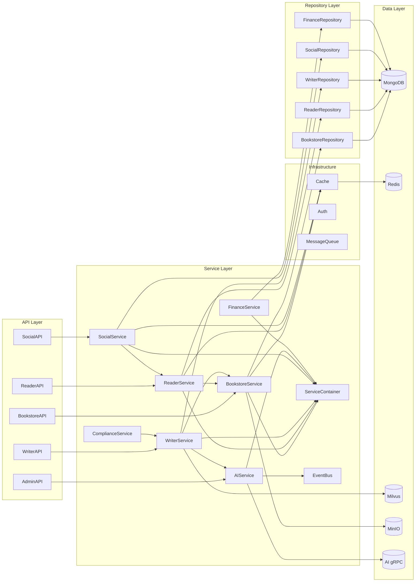
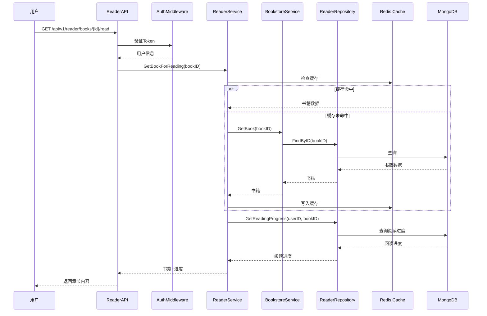
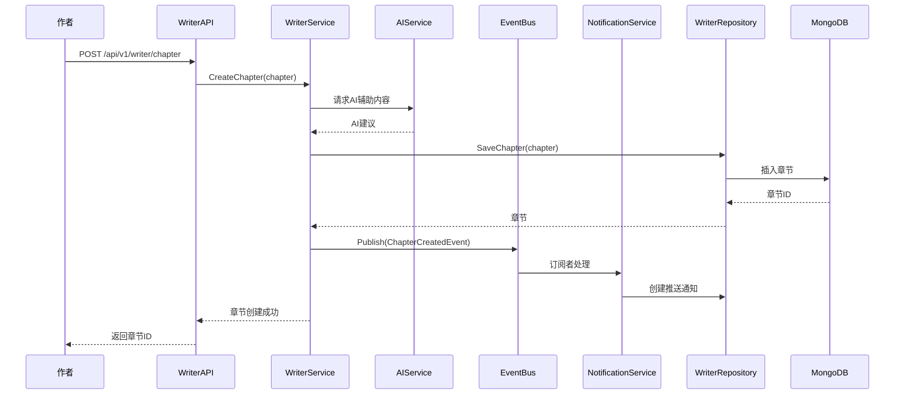
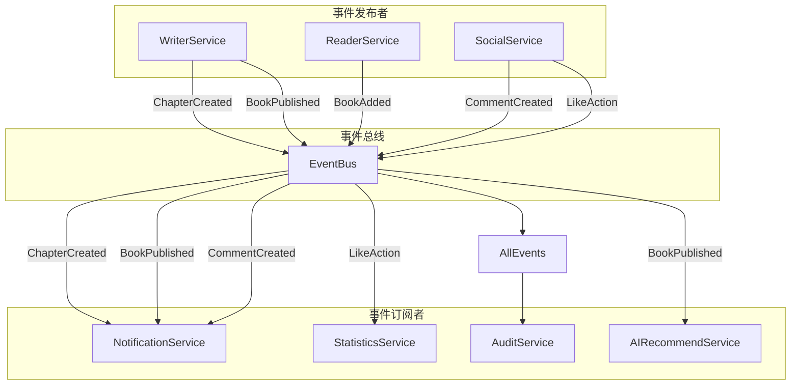

# Qingyu Backend 组件分析

## 1. 组件依赖图

### 1.1 完整依赖关系图



### 1.2 模块间依赖矩阵

|  | Bookstore | Reader | Writer | Social | AI | Finance |
|---|---|---:|---|---|---|---|
| **Bookstore** | ✓ | - | - | - | - | - |
| **Reader** | → | ✓ | - | - | - | - |
| **Writer** | → | - | ✓ | - | → | - |
| **Social** | - | → | - | ✓ | - | - |
| **AI** | - | - | - | - | ✓ | - |
| **Finance** | - | - | → | - | - | ✓ |

→ 表示依赖关系

## 2. 关键接口分析

### 2.1 核心API端点

| API路径 | 方法 | 功能 | 调用链 |
|---------|------|------|--------|
| `/api/v1/bookstore/books` | GET | 获取书籍列表 | API → BookstoreSvc → BookstoreRepo → MongoDB |
| `/api/v1/reader/history` | GET | 获取阅读历史 | API → ReaderSvc → ReaderRepo → MongoDB |
| `/api/v1/writer/chapter` | POST | 创建章节 | API → WriterSvc → WriterRepo → MongoDB |
| `/api/v1/social/comment` | POST | 发表评论 | API → SocialSvc → SocialRepo → MongoDB → EventBus |
| `/api/v1/ai/chat` | POST | AI对话 | API → AISvc → AI gRPC |

### 2.2 Service层接口

```go
// 核心服务接口示例
type BookstoreService interface {
    GetBook(ctx context.Context, id string) (*models.Book, error)
    ListBooks(ctx context.Context, filter BookFilter) ([]*models.Book, error)
    CreateBook(ctx context.Context, book *models.Book) error
    UpdateBook(ctx context.Context, id string, book *models.Book) error
    DeleteBook(ctx context.Context, id string) error
}

type ReaderService interface {
    GetReadingHistory(ctx context.Context, userID string) ([]*models.ReadingHistory, error)
    AddToBookshelf(ctx context.Context, userID, bookID string) error
    UpdateProgress(ctx context.Context, userID, bookID string, progress int) error
}
```

### 2.3 Repository层接口

```go
// Repository接口示例
type BookRepository interface {
    FindByID(ctx context.Context, id string) (*models.Book, error)
    Find(ctx context.Context, filter BookFilter) ([]*models.Book, error)
    Create(ctx context.Context, book *models.Book) error
    Update(ctx context.Context, book *models.Book) error
    Delete(ctx context.Context, id string) error
    Exists(ctx context.Context, id string) (bool, error)
}
```

## 3. 数据流分析

### 3.1 典型请求流程：读者阅读小说



### 3.2 典型请求流程：作者发布章节



### 3.3 事件流分析



## 4. 组件耦合度分析

### 4.1 高耦合组件

| 组件 | 依赖数量 | 说明 | 建议 |
|------|----------|------|------|
| **WriterService** | 5+ | 依赖Bookstore, AI, Events, Notification等 | 考虑拆分或使用领域事件 |
| **ServiceContainer** | 全部 | 集中管理所有服务 | 保持现状，但加强文档 |
| **QuotaMiddleware** | Service层 | 中间件直接依赖业务服务 | 引入抽象层 |

### 4.2 低耦合组件

| 组件 | 说明 |
|------|------|
| **BookstoreService** | 核心模块，依赖最少 |
| **Repository层** | 接口隔离良好 |

---

**文档版本**: v1.0
**最后更新**: 2026-02-07
**维护者**: yukin371
