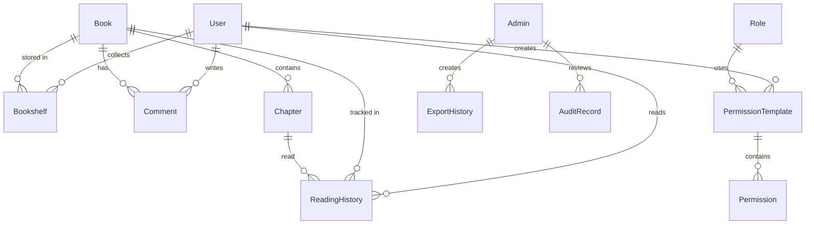

# Qingyu Backend 数据模型

## 1. 概述

本文档描述 Qingyu Backend 系统中的数据模型结构，包括所有领域模型及其关系。

## 2. 核心业务模型

### 2.1 书店模块 (Bookstore)

#### Book (书籍)
```go
type Book struct {
    ID            string    `bson:"_id"`
    Title         string    `bson:"title"`
    Author        string    `bson:"author"`
    Introduction  string    `bson:"introduction"`
    Status        string    `bson:"status"`
    WordCount     int64     `bson:"word_count"`
    ChapterCount  int       `bson:"chapter_count"`
    Price         float64   `bson:"price"`
    IsFree        bool      `bson:"is_free"`
    CreatedAt     time.Time `bson:"created_at"`
}
```

#### Chapter (章节)
```go
type Chapter struct {
    ID          string    `bson:"_id"`
    BookID      string    `bson:"book_id"`
    Title       string    `bson:"title"`
    ChapterNum  int       `bson:"chapter_num"`
    WordCount   int       `bson:"word_count"`
    Price       float64   `bson:"price"`
    IsFree      bool      `bson:"is_free"`
    PublishTime time.Time `bson:"publish_time"`
    CreatedAt   time.Time `bson:"created_at"`
}
```

### 2.2 读者模块 (Reader)

#### ReadingHistory (阅读历史)
```go
type ReadingHistory struct {
    ID         string    `bson:"_id"`
    UserID     string    `bson:"user_id"`
    BookID     string    `bson:"book_id"`
    ChapterID  string    `bson:"chapter_id"`
    ReadAt     time.Time `bson:"read_at"`
}
```

#### Bookshelf (书架)
```go
type Bookshelf struct {
    ID        string    `bson:"_id"`
    UserID    string    `bson:"user_id"`
    BookID    string    `bson:"book_id"`
    AddedAt   time.Time `bson:"added_at"`
}
```

### 2.3 作者模块 (Writer)

#### PublishedWork (发布作品)
```go
type PublishedWork struct {
    ID          string    `bson:"_id"`
    AuthorID    string    `bson:"author_id"`
    BookID      string    `bson:"book_id"`
    ChapterID   string    `bson:"chapter_id"`
    PublishTime time.Time `bson:"publish_time"`
}
```

### 2.4 社交模块 (Social)

#### Comment (评论)
```go
type Comment struct {
    ID        string    `bson:"_id"`
    UserID    string    `bson:"user_id"`
    BookID    string    `bson:"book_id"`
    Content   string    `bson:"content"`
    CreatedAt time.Time `bson:"created_at"`
}
```

## 3. 管理模块 (Admin)

### 3.1 ExportHistory (导出历史)

**位置**: `models/admin/export_history.go`

```go
type ExportHistory struct {
    ID          string     `bson:"_id,omitempty" json:"id"`
    AdminID     string     `bson:"admin_id" json:"admin_id"`
    ExportType  string     `bson:"export_type" json:"export_type"`
    Format      string     `bson:"format" json:"format"`
    RecordCount int        `bson:"record_count" json:"record_count"`
    FilePath    string     `bson:"file_path" json:"file_path"`
    FileSize    int64      `bson:"file_size" json:"file_size"`
    Status      string     `bson:"status" json:"status"`
    ErrorMsg    string     `bson:"error_msg,omitempty" json:"error_msg,omitempty"`
    CreatedAt   time.Time  `bson:"created_at" json:"created_at"`
    CompletedAt *time.Time `bson:"completed_at,omitempty" json:"completed_at,omitempty"`
}
```

**常量定义**:
- `ExportStatusPending`: "pending" - 待处理
- `ExportStatusCompleted`: "completed" - 已完成
- `ExportStatusFailed`: "failed" - 失败
- `ExportTypeBooks`: "books" - 书籍导出
- `ExportTypeChapters`: "chapters" - 章节导出
- `ExportTypeUsers`: "users" - 用户导出
- `ExportFormatCSV`: "csv" - CSV格式
- `ExportFormatExcel`: "excel" - Excel格式

## 4. 认证授权模块 (Auth)

### 4.1 PermissionTemplate (权限模板)

**位置**: `models/auth/permission_template.go`

```go
type PermissionTemplate struct {
    ID          string    `bson:"_id,omitempty" json:"id"`
    Name        string    `bson:"name" json:"name"`
    Code        string    `bson:"code" json:"code"`
    Description string    `bson:"description" json:"description"`
    Permissions []string  `bson:"permissions" json:"permissions"`
    IsSystem    bool      `bson:"is_system" json:"is_system"`
    Category    string    `bson:"category" json:"category"`
    CreatedAt   time.Time `bson:"created_at" json:"created_at"`
    UpdatedAt   time.Time `bson:"updated_at" json:"updated_at"`
    CreatedBy   string    `bson:"created_by,omitempty" json:"created_by,omitempty"`
}
```

**预定义模板代码**:
- `TemplateReader`: "template_reader" - 读者模板
- `TemplateAuthor`: "template_author" - 作者模板
- `TemplateAdmin`: "template_admin" - 管理员模板

**预定义模板分类**:
- `CategoryReader`: "reader" - 读者分类
- `CategoryAuthor`: "author" - 作者分类
- `CategoryAdmin`: "admin" - 管理员分类
- `CategoryCustom`: "custom" - 自定义分类

## 5. 审核模块 (Audit)

### 5.1 AuditRecord (审核记录)

**位置**: `models/audit/audit_record.go`

```go
type AuditRecord struct {
    ID             string       `bson:"_id,omitempty" json:"id"`
    ResourceType   string       `bson:"resource_type" json:"resource_type"`
    ResourceID     string       `bson:"resource_id" json:"resource_id"`
    Status         AuditStatus  `bson:"status" json:"status"`
    RiskLevel      RiskLevel    `bson:"risk_level" json:"risk_level"`
    ReviewResult   string       `bson:"review_result,omitempty" json:"review_result,omitempty"`
    ReviewedBy     string       `bson:"reviewed_by,omitempty" json:"reviewed_by,omitempty"`
    ReviewedAt     *time.Time   `bson:"reviewed_at,omitempty" json:"reviewed_at,omitempty"`
    CreatedAt      time.Time    `bson:"created_at" json:"created_at"`
}
```

## 6. 数据模型关系图



## 7. 索引设计

### 7.1 ExportHistory 索引
```javascript
{
  "admin_id": 1,
  "created_at": -1
}

{
  "export_type": 1,
  "created_at": -1
}

{
  "status": 1
}
```

### 7.2 PermissionTemplate 索引
```javascript
{
  "code": 1
}, { unique: true }

{
  "category": 1,
  "created_at": -1
}

{
  "is_system": 1
}
```

### 7.3 AuditRecord 索引
```javascript
{
  "resource_type": 1,
  "resource_id": 1
}

{
  "status": 1,
  "created_at": -1
}

{
  "risk_level": 1,
  "created_at": -1
}
```

---

**文档版本**: v1.0
**最后更新**: 2026-02-27
**维护者**: yukin371
