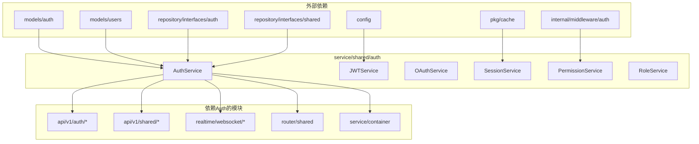
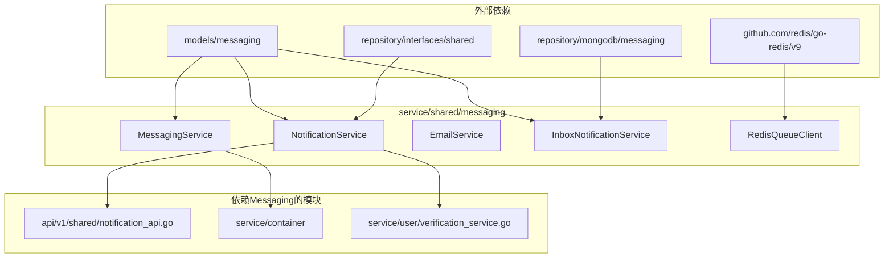

# 模块依赖分析

**分析日期**: 2026-02-09
**目的**: 为模块迁移准备依赖关系图谱，识别迁移风险

---

## 概述

本文档分析 `service/shared/auth` 和 `service/shared/messaging` 模块的依赖关系，为模块迁移提供决策依据。

---

## 1. Auth模块依赖分析

### 1.1 模块结构

```
service/shared/auth/
├── auth_service.go              # 核心认证服务
├── interfaces.go                # 接口定义
├── jwt_service.go               # JWT服务
├── oauth_service.go             # OAuth服务
├── session_service.go           # 会话服务
├── permission_service.go        # 权限服务
├── role_service.go              # 角色服务
├── password_validator.go        # 密码验证器
├── redis_adapter.go             # Redis适配器
├── memory_blacklist.go          # 内存黑名单(降级)
└── *_test.go                    # 测试文件
```

### 1.2 Auth模块的依赖（输入）

```
service/shared/auth 依赖:
├── Qingyu_backend/service/interfaces/user  ← userServiceInterface
├── Qingyu_backend/models/auth              ← authModel
├── Qingyu_backend/models/users             ← usersModel
├── Qingyu_backend/repository/interfaces/auth   ← authRepo
├── Qingyu_backend/repository/interfaces/shared  ← sharedRepo
├── Qingyu_backend/config                   ← JWT配置
├── Qingyu_backend/internal/middleware/auth  ← 权限定义
├── Qingyu_backend/pkg/cache                ← Redis客户端
├── golang.org/x/oauth2                     ← OAuth库
└── github.com/golang-jwt/jwt/v4            ← JWT库
```

### 1.3 依赖Auth的模块（输出）

```
以下模块依赖 service/shared/auth:
├── api/v1/auth/auth_api.go          ← 认证API
├── api/v1/auth/oauth_api.go         ← OAuth API
├── api/v1/shared/auth_api.go        ← 共享认证API
├── api/v1/shared/oauth_api.go       ← 共享OAuth API
├── realtime/websocket/messaging_hub.go    ← 消息中心
├── realtime/websocket/notification_hub.go ← 通知中心
├── router/shared/shared_router.go    ← 路由
├── service/container/service_container.go ← 服务容器
└── service/interfaces/shared/adapters.go  ← 适配器
```

### 1.4 依赖关系图



---

## 2. Messaging模块依赖分析

### 2.1 模块结构

```
service/shared/messaging/
├── interfaces.go                      # 接口定义
├── messaging_service.go               # 消息队列服务
├── notification_service.go            # 通知服务
├── notification_service_complete.go   # 完整通知服务
├── email_service.go                   # 邮件服务
├── inbox_notification_service.go      # 站内通知服务
└── redis_queue_client.go              # Redis队列客户端
```

### 2.2 Messaging模块的依赖（输入）

```
service/shared/messaging 依赖:
├── Qingyu_backend/models/messaging        ← messagingModel
├── Qingyu_backend/repository/mongodb/messaging  ← messagingRepo
├── Qingyu_backend/repository/interfaces/shared  ← sharedRepo
└── github.com/redis/go-redis/v9           ← Redis客户端
```

### 2.3 依赖Messaging的模块（输出）

```
以下模块依赖 service/shared/messaging:
├── api/v1/shared/notification_api.go    ← 通知API
├── service/container/service_container.go  ← 服务容器
└── service/user/verification_service.go  ← 用户验证服务
```

### 2.4 依赖关系图



---

## 3. 迁移风险识别

### 3.1 高风险项

| 风险 | 影响 | 缓解措施 |
|------|------|---------|
| **API层直接依赖** | api/v1/* 直接导入shared路径 | 使用兼容层重新导出 |
| **服务容器依赖** | service_container.go 注册服务 | 更新注册路径，保持接口不变 |
| **循环依赖风险** | auth ↔ user → auth | 通过Port接口解耦 |
| **WebSocket实时功能** | messaging_hub依赖auth | 保持兼容层直到迁移完成 |

### 3.2 中风险项

| 风险 | 影响 | 缓解措施 |
|------|------|---------|
| **配置文件引用** | config包引用auth模型 | 保持models路径不变 |
| **Repository层依赖** | repository/interfaces/auth | 同步移动或创建Port接口 |
| **中间件依赖** | internal/middleware/auth | 使用Port接口解耦 |

### 3.3 低风险项

| 风险 | 影响 | 缓解措施 |
|------|------|---------|
| **测试文件** | 测试import路径变更 | 批量更新import |
| **文档引用** | 文档中的路径示例 | 迁移后更新文档 |

---

## 4. 迁移影响范围

### 4.1 Auth模块迁移影响

**需要更新的文件数量**: 约10个

**关键更新点**:
1. **api/v1/auth/** (2个文件)
   - `auth_api.go`: 更新import路径
   - `oauth_api.go`: 更新import路径

2. **api/v1/shared/** (2个文件)
   - `auth_api.go`: 更新import路径
   - `oauth_api.go`: 更新import路径

3. **service/container/** (1个文件)
   - `service_container.go`: 更新服务注册路径

4. **service/interfaces/shared/** (1个文件)
   - `adapters.go`: 更新适配器import路径

5. **realtime/websocket/** (2个文件)
   - `messaging_hub.go`: 更新import路径
   - `notification_hub.go`: 更新import路径

6. **router/shared/** (1个文件)
   - `shared_router.go`: 更新import路径

### 4.2 Messaging模块迁移影响

**需要更新的文件数量**: 约3个

**关键更新点**:
1. **api/v1/shared/** (1个文件)
   - `notification_api.go`: 更新import路径

2. **service/container/** (1个文件)
   - `service_container.go`: 更新服务注册路径

3. **service/user/** (1个文件)
   - `verification_service.go`: 更新import路径

---

## 5. 关键依赖路径

### 5.1 Auth关键路径

```
api/v1/auth/auth_api.go
  → service/shared/auth.AuthService
    → repository/interfaces/auth.AuthRepository
    → models/auth.User

service/container/service_container.go
  → service/shared/auth.AuthService
    → config.JWTConfigEnhanced
```

### 5.2 Messaging关键路径

```
api/v1/shared/notification_api.go
  → service/shared/messaging.NotificationService
    → repository/mongodb/messaging.MessagingRepository
    → models/messaging.NotificationDelivery
```

---

## 6. 循环依赖分析

### 6.1 潜在循环依赖

```
service/shared/auth
  → service/interfaces/user  (依赖注入)
    → service/shared/auth    (可能循环)

service/shared/messaging
  → service/user/verification_service (直接导入)
    → service/shared/messaging (可能循环)
```

### 6.2 解决方案

1. **使用Port接口解耦**
   - 创建 `service/interfaces/user` Port接口
   - Auth模块通过接口依赖User，而非直接导入

2. **事件驱动解耦**
   - Messaging使用消息队列而非直接调用
   - User服务监听消息而非导入Messaging

---

## 7. 迁移建议

### 7.1 迁移顺序

**推荐顺序**: Auth → Messaging

**理由**:
1. Auth是核心模块，影响最广
2. Auth迁移完成后，迁移路径更清晰
3. Messaging影响较小，可作为验证案例

### 7.2 迁移策略

1. **创建兼容层** (必须)
   ```
   service/auth/_migration/shared_compat.go
   ```
   重新导出所有公共符号，保持向后兼容

2. **分阶段更新**
   - Phase 1: 创建新模块 + 兼容层
   - Phase 2: 更新service/container
   - Phase 3: 更新api层
   - Phase 4: 更新其他依赖
   - Phase 5: 移除兼容层

3. **测试验证**
   - 每个阶段后运行完整测试套件
   - 性能基准测试对比
   - 手动测试关键功能

---

## 8. 验收标准

### 8.1 迁移完成标准

- [ ] 所有测试通过
- [ ] API功能正常
- [ ] 性能无明显下降
- [ ] 文档已更新
- [ ] 依赖检查无违规

### 8.2 兼容层移除标准

- [ ] 所有代码迁移到新import路径
- [ ] CI规则更新，禁止旧路径
- [ ] 文档更新完成
- [ ] 稳定运行一段时间后

---

**维护**: 随模块迁移持续更新
**审查**: 每次迁移前审查依赖关系
