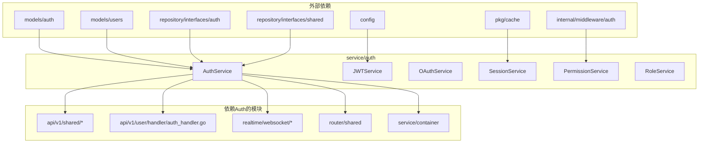
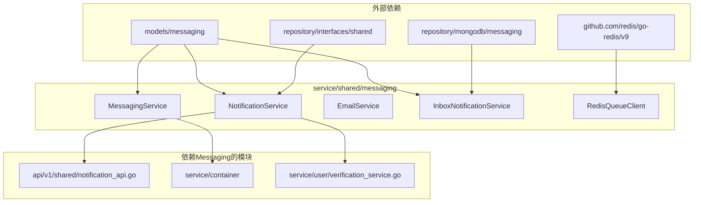

# 模块依赖分析

**初始分析日期**: 2026-02-09
**最后更新**: 2026-04-19
**目的**: 记录 shared 相关模块迁移中的关键依赖关系，并标记哪些结论仍然有效

---

## 概述

本文档最初用于分析 `service/shared/auth` 和 `service/shared/messaging` 的迁移风险。

当前口径：
- Auth 相关内容已按 2026-04-19 的运行态更新
- Messaging 相关内容主要保留历史迁移背景，不作为新增 owner 的依据

---

## 1. Auth 模块依赖分析（当前运行态）

### 1.1 当前模块结构

```
service/auth/
├── auth_service.go              # 核心认证服务
├── interfaces.go                # 接口定义
├── jwt_service.go               # JWT服务
├── oauth_service.go             # OAuth服务
├── session_service.go           # 会话服务
├── permission_service.go        # 权限服务
├── role_service.go              # 角色服务
├── password_validator.go        # 密码验证器
├── redis_adapter.go             # Redis适配器
├── memory_blacklist.go          # 内存黑名单(降级)
└── *_test.go                    # 测试文件
```

### 1.2 Auth 模块的依赖（输入）

```
service/auth 依赖:
├── Qingyu_backend/repository/interfaces/user     ← userRepo
├── Qingyu_backend/repository/interfaces/auth     ← authRepo
├── Qingyu_backend/models/auth                    ← authModel
├── Qingyu_backend/models/users                   ← usersModel
├── Qingyu_backend/config                         ← JWT配置
├── Qingyu_backend/internal/middleware/auth       ← 权限定义/RBAC
├── Qingyu_backend/pkg/cache                      ← Redis客户端
├── golang.org/x/oauth2                           ← OAuth库
└── github.com/golang-jwt/jwt/v4                  ← JWT库
```

### 1.3 依赖 Auth 的模块（输出）

```
以下模块依赖 service/auth:
├── api/v1/shared/auth_api.go                 ← 标准认证 HTTP owner
├── api/v1/shared/oauth_api.go                ← 标准 OAuth HTTP owner
├── api/v1/shared/auth_helpers.go             ← 共享认证 helper
├── api/v1/user/handler/auth_handler.go       ← 用户域兼容认证入口
├── api/v1/admin/permission_template_api.go   ← 管理端权限模板 API
├── realtime/websocket/messaging_hub.go       ← 消息中心
├── realtime/websocket/notification_hub.go    ← 通知中心
├── router/shared/shared_router.go            ← shared 路由注册
├── router/user/user_router.go                ← user 路由注册
├── service/container/service_container.go    ← 服务容器
└── service/interfaces/shared/adapters.go     ← 适配器
```

### 1.4 依赖关系图


```mermaid
graph TD
    subgraph "外部依赖"
        A[models/auth]
        B[models/users]
        C[repository/interfaces/auth]
        D[repository/interfaces/shared]
        E[config]
        F[internal/middleware/auth]
        G[pkg/cache]
    end

    subgraph "service/auth"
        Auth[AuthService]
        JWT[JWTService]
        OAuth[OAuthService]
        Session[SessionService]
        Perm[PermissionService]
        Role[RoleService]
    end

    subgraph "依赖Auth的模块"
        API1[api/v1/shared/*]
        API2[api/v1/user/handler/auth_handler.go]
        WS1[realtime/websocket/*]
        Router[router/shared]
        Container[service/container]
    end

    A --> Auth
    B --> Auth
    C --> Auth
    D --> Auth
    E --> JWT
    F --> Perm
    G --> Session

    Auth --> Container
    Auth --> API1
    Auth --> API2
    Auth --> WS1
    Auth --> Router
```

### 1.5 当前边界结论

- `api/v1/auth/` 历史包已删除，不再是 Go 包 owner
- 标准认证/OAuth HTTP owner 已收敛到 `api/v1/shared/*`
- `api/v1/user/handler/auth_handler.go` 只保留用户域兼容入口，不能机械合并到 shared
- `service/auth` 已直接依赖 `UserRepository`，不再通过 `UserService` 形成循环依赖

---

## 2. Messaging模块依赖分析

### 2.1 模块结构

```
service/shared/messaging/
├── interfaces.go                      # 接口定义
├── messaging_service.go               # 消息队列服务
├── notification_service.go            # 通知服务
├── notification_service_complete.go   # 完整通知服务
├── email_service.go                   # 邮件服务
├── inbox_notification_service.go      # 站内通知服务
└── redis_queue_client.go              # Redis队列客户端
```

### 2.2 Messaging模块的依赖（输入）

```
service/shared/messaging 依赖:
├── Qingyu_backend/models/messaging        ← messagingModel
├── Qingyu_backend/repository/mongodb/messaging  ← messagingRepo
├── Qingyu_backend/repository/interfaces/shared  ← sharedRepo
└── github.com/redis/go-redis/v9           ← Redis客户端
```

### 2.3 依赖Messaging的模块（输出）

```
以下模块依赖 service/shared/messaging:
├── api/v1/shared/notification_api.go    ← 通知API
├── service/container/service_container.go  ← 服务容器
└── service/user/verification_service.go  ← 用户验证服务
```

### 2.4 依赖关系图


```mermaid
graph TD
    subgraph "外部依赖"
        A[models/messaging]
        B[repository/mongodb/messaging]
        C[repository/interfaces/shared]
        D[github.com/redis/go-redis/v9]
    end

    subgraph "service/shared/messaging"
        Msg[MessagingService]
        Notif[NotificationService]
        Email[EmailService]
        Inbox[InboxNotificationService]
        Queue[RedisQueueClient]
    end

    subgraph "依赖Messaging的模块"
        API1[api/v1/shared/notification_api.go]
        Container[service/container]
        Verify[service/user/verification_service.go]
    end

    A --> Msg
    A --> Notif
    A --> Inbox
    B --> Inbox
    C --> Notif
    D --> Queue

    Msg --> Container
    Notif --> API1
    Notif --> Verify
```

---

## 3. 迁移风险识别

### 3.1 高风险项

| 风险 | 影响 | 缓解措施 |
|------|------|---------|
| **兼容入口语义差异** | `api/v1/user/handler/auth_handler.go` 与 `api/v1/shared/*` 不完全等价 | 先统一响应/错误口径，再考虑收薄 |
| **脚本/文档误恢复旧 owner** | 历史文档仍可能指向 `api/v1/auth` | 持续清理活跃文档和检查脚本 |
| **WebSocket实时功能** | messaging_hub / notification_hub 依赖 auth | 调整时必须补 compile-only 与定向验证 |
| **历史说明漂移** | 部分文档/说明仍可能把 `verification_service` 视为持有 auth 侧依赖 | 与活跃 roadmap、模块分析和实现同步收口，避免旧说明误导后续改动 |

### 3.2 中风险项

| 风险 | 影响 | 缓解措施 |
|------|------|---------|
| **配置文件引用** | config包引用auth模型 | 保持models路径不变 |
| **Repository层依赖** | repository/interfaces/auth | 同步移动或创建Port接口 |
| **中间件依赖** | internal/middleware/auth | 使用Port接口解耦 |

### 3.3 低风险项

| 风险 | 影响 | 缓解措施 |
|------|------|---------|
| **测试文件** | 测试import路径变更 | 批量更新import |
| **文档引用** | 文档中的路径示例 | 迁移后更新文档 |

---

## 4. 迁移影响范围

### 4.1 Auth 模块迁移影响（已完成主链收口）

**当前仍需关注的文件数量**: 少量文档/兼容入口

**关键更新点**:
1. **api/v1/shared/**
   - 标准认证/OAuth HTTP owner
   - 共享 helper 的唯一归口

2. **api/v1/user/handler/**
   - 保留兼容入口
   - 不得直接按 shared 语义替换

3. **service/container/**
   - 维持 `service/auth` 注入链

4. **文档与检查脚本**
   - 不再将 `api/v1/auth/` 写成活跃 owner

### 4.2 Messaging模块迁移影响

**需要更新的文件数量**: 约3个

**关键更新点**:
1. **api/v1/shared/** (1个文件)
   - `notification_api.go`: 更新import路径

2. **service/container/** (1个文件)
   - `service_container.go`: 更新服务注册路径

3. **service/user/** (1个文件)
   - `verification_service.go`: 更新import路径

---

## 5. 关键依赖路径

### 5.1 Auth 关键路径

```
api/v1/shared/auth_api.go
  → service/auth.AuthService
    → repository/interfaces/auth.AuthRepository
    → repository/interfaces/user.UserRepository

service/container/service_container.go
  → service/auth.AuthService
    → config.JWTConfigEnhanced
```

### 5.2 Messaging关键路径

```
api/v1/shared/notification_api.go
  → service/shared/messaging.NotificationService
    → repository/mongodb/messaging.MessagingRepository
    → models/messaging.NotificationDelivery
```

---

## 6. 循环依赖分析

### 6.1 当前仍需关注的耦合点

```
service/auth
  → repository/interfaces/user
  → repository/interfaces/auth

api/v1/user/handler/auth_handler.go
  → service/auth
  ↔ 与 api/v1/shared/* 存在兼容语义差异
```

### 6.2 解决方案

1. **兼容入口继续隔离**
   - `user` 兼容入口只做兼容语义，不承担标准 owner 角色

2. **文档与检查脚本持续收口**
   - 先清理活跃文档、README、白名单
   - archive/历史报告保持留痕，不做批量重写

---

## 7. 迁移建议

### 7.1 迁移顺序

**推荐顺序**: 活跃文档/脚本 → 兼容入口设计 → 历史归档按需整理

**理由**:
1. Auth是核心模块，影响最广
2. Auth迁移完成后，迁移路径更清晰
3. Messaging影响较小，可作为验证案例

### 7.2 迁移策略

1. **创建兼容层** (必须)
   ```
   service/auth/_migration/shared_compat.go
   ```
   重新导出所有公共符号，保持向后兼容

2. **分阶段更新**
   - Phase 1: 创建新模块 + 兼容层
   - Phase 2: 更新service/container
   - Phase 3: 更新api层
   - Phase 4: 更新其他依赖
   - Phase 5: 移除兼容层

3. **测试验证**
   - 每个阶段后运行完整测试套件
   - 性能基准测试对比
   - 手动测试关键功能

---

## 8. 验收标准

### 8.1 迁移完成标准

- [ ] 所有测试通过
- [ ] API功能正常
- [ ] 性能无明显下降
- [ ] 文档已更新
- [ ] 依赖检查无违规

### 8.2 兼容层移除标准

- [ ] 所有代码迁移到新import路径
- [ ] CI规则更新，禁止旧路径
- [ ] 文档更新完成
- [ ] 稳定运行一段时间后

---

**维护**: 随模块迁移持续更新
**审查**: 每次迁移前审查依赖关系
