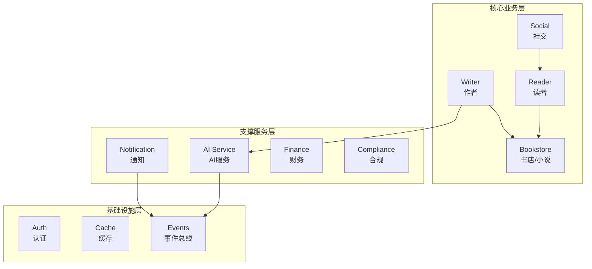
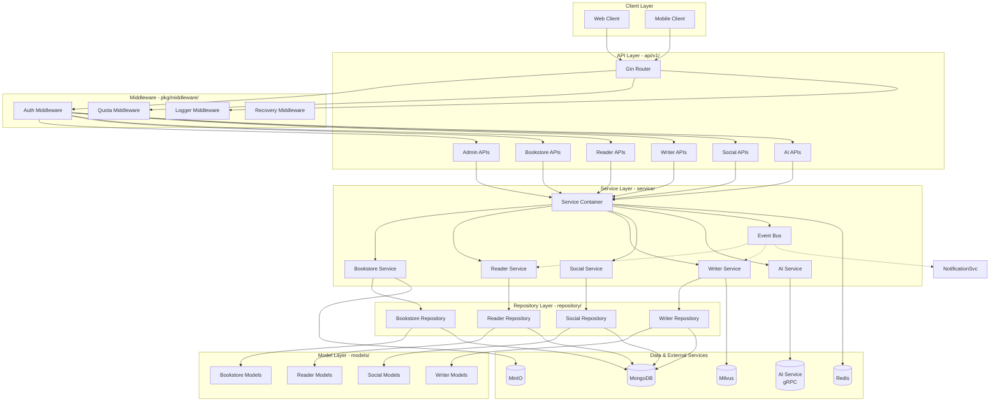

# Qingyu Backend 系统架构

## 1. 架构概览

Qingyu Backend 采用经典的分层架构设计，结合依赖注入和事件驱动模式，构建了一个模块化、可扩展的小说创作平台后端服务。

### 1.1 技术栈
- **语言**: Go 1.x
- **Web框架**: Gin
- **数据库**: MongoDB (主数据), Redis (缓存), Milvus (向量), MinIO (对象存储)
- **外部服务**: AI Service (gRPC)

### 1.2 核心设计模式
- **分层架构**: API → Service → Repository → Model
- **依赖注入**: Service Container统一管理服务生命周期
- **接口隔离**: Repository接口与实现分离
- **事件驱动**: 内置事件总线实现模块解耦

## 2. 分层结构

### 2.1 API层 (`api/v1/`)

API层负责处理HTTP请求和响应，按业务领域划分为以下模块：

| 模块 | 职责 | 主要文件 |
|------|------|----------|
| `admin` | 后台管理功能 | admin_api.go, dashboard_api.go |
| `ai` | AI服务集成 | ai_api.go, chat_api.go |
| `bookstore` | 书店/小说管理 | bookstore_api.go, book_detail_api.go |
| `reader` | 读者功能 | reading_history_api.go, bookshelf_api.go |
| `social` | 社交功能 | comment_api.go, like_api.go, follow_api.go |
| `writer` | 作者功能 | editor_api.go, publish_api.go, statistics_api.go |
| `notification` | 通知系统 | notification_api.go |
| `finance` | 财务功能 | finance_api.go |
| `compliance` | 合规审核 | compliance_api.go |

### 2.2 Service层 (`service/`)

Service层实现业务逻辑，包含以下核心组件：

| 组件 | 职责 |
|------|------|
| `container/` | 依赖注入容器，管理所有服务生命周期 |
| `events/` | 事件总线，支持发布-订阅模式 |
| `bookstore/` | 书店业务服务 |
| `reader/` | 读者业务服务 |
| `social/` | 社交业务服务 |
| `writer/` | 作者业务服务 |
| `ai/` | AI服务集成 |
| `shared/` | 共享服务（auth, cache, messaging等） |

### 2.3 Repository层 (`repository/`)

Repository层负责数据访问，采用接口与实现分离的设计：

```
repository/
├── interfaces/      # 接口定义
│   ├── bookstore/
│   ├── reader/
│   ├── social/
│   └── writer/
└── mongodb/         # MongoDB实现
    ├── bookstore/
    ├── reader/
    ├── social/
    └── writer/
```

### 2.4 Model层 (`models/`)

数据模型定义，按业务领域组织：

```
models/
├── bookstore/       # 书店相关模型
├── reader/          # 读者相关模型
├── social/          # 社交相关模型
├── writer/          # 作者相关模型
├── admin/           # 管理相关模型
└── shared/          # 共享模型
```

## 3. 模块划分

### 3.1 业务模块依赖关系



### 3.2 模块职责说明

| 模块 | 核心职责 | 依赖模块 |
|------|----------|----------|
| **Bookstore** | 小说/书籍管理、章节管理、分类标签 | - |
| **Reader** | 阅读历史、书架、阅读进度 | Bookstore |
| **Writer** | 编辑器、发布管理、统计分析 | Bookstore, AI |
| **Social** | 评论、点赞、关注 | Reader |
| **AI** | AI对话、智能推荐 | Events |
| **Notification** | 消息通知 | Events |
| **Finance** | 财务结算、收益管理 | Writer |
| **Compliance** | 内容审核 | Writer, Bookstore |

## 4. 系统架构图



## 5. 关键设计决策

### 5.1 依赖注入容器
使用 `service/container/service_container.go` 统一管理所有服务的初始化和生命周期，支持：
- 延迟初始化
- 可选服务（渐进式注册）
- 服务间依赖管理

### 5.2 接口隔离
Repository层定义接口契约，具体实现在 `repository/mongodb/` 中，便于：
- 单元测试Mock
- 未来切换存储实现

### 5.3 事件驱动
内置事件总线 (`service/events/`) 实现模块间解耦，典型事件：
- 章节发布事件
- 用户注册事件
- 评论创建事件

---

**文档版本**: v1.0
**最后更新**: 2026-02-07
**维护者**: yukin371
