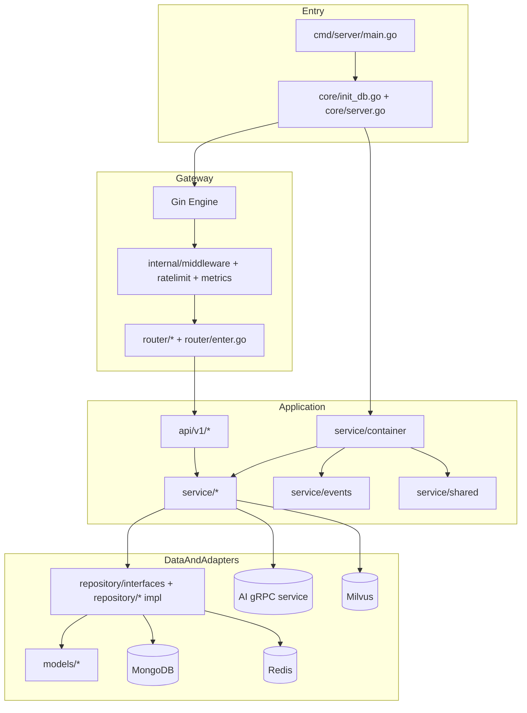
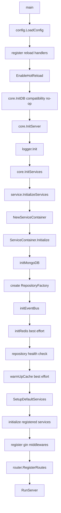
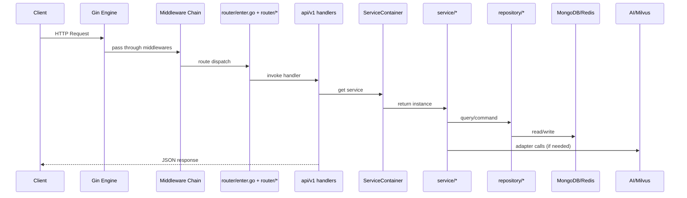

# Qingyu Backend System Architecture

> Version: 2026-04-07 refresh  
> Positioning: current architecture baseline for onboarding and AI context building

## 1. What This Document Is

这份文档描述当前代码库的真实架构，不是理想态蓝图。  
重点回答四个问题：

1. 主要层级和模块边界是什么
2. 服务如何启动
3. 请求如何进入业务层
4. 哪些结构是当前主要风险点

## 2. Current Layered Boundaries

后端主路径仍是：

`router -> api/v1 -> service -> repository -> data adapters`

但运行时编排并不只在 `core`，`router/enter.go` 与 `service/container` 都承担了系统级装配职责。

### 2.1 Layer and module boundary diagram

```mermaid
graph TD
    subgraph Entry
        CMD[cmd/server/main.go]
        CORE[core/init_db.go + core/server.go]
    end

    subgraph Gateway
        GIN[Gin Engine]
        MIDDLEWARE[internal/middleware + ratelimit + metrics]
        ROUTER[router/* + router/enter.go]
    end

    subgraph Application
        API[api/v1/*]
        SERVICE[service/*]
        CONTAINER[service/container]
        EVENTS[service/events]
        SHARED[service/shared]
    end

    subgraph DataAndAdapters
        REPO[repository/interfaces + repository/* impl]
        MODELS[models/*]
        MONGO[(MongoDB)]
        REDIS[(Redis)]
        AI[(AI gRPC service)]
        MILVUS[(Milvus)]
    end

    CMD --> CORE
    CORE --> CONTAINER
    CORE --> GIN
    GIN --> MIDDLEWARE
    MIDDLEWARE --> ROUTER
    ROUTER --> API
    API --> SERVICE
    SERVICE --> REPO
    REPO --> MODELS
    REPO --> MONGO
    REPO --> REDIS
    SERVICE --> AI
    SERVICE --> MILVUS
    CONTAINER --> EVENTS
    CONTAINER --> SHARED
    CONTAINER --> SERVICE
```

## 3. Startup Initialization Flow

真实启动入口在 `cmd/server/main.go`，顺序特征：

- 先配配置与热重载
- `InitDB` 保留但已 no-op
- 通过 `InitServices` 初始化 `ServiceContainer`
- `ServiceContainer` 完成基础设施与服务装配
- 再创建 Gin、注册中间件、注册路由

### 3.1 Startup mermaid

```mermaid
flowchart TD
    A[main] --> B[config.LoadConfig]
    B --> C[register reload handlers]
    C --> D[EnableHotReload]
    D --> E[core.InitDB compatibility no-op]
    E --> F[core.InitServer]
    F --> G[logger.Init]
    G --> H[core.InitServices]
    H --> I[service.InitializeServices]
    I --> J[NewServiceContainer]
    J --> K[ServiceContainer.Initialize]
    K --> L[initMongoDB]
    L --> M[create RepositoryFactory]
    M --> N[initEventBus]
    N --> O[initRedis best effort]
    O --> P[repository health check]
    P --> Q[warmUpCache best effort]
    Q --> R[SetupDefaultServices]
    R --> S[initialize registered services]
    S --> T[register gin middlewares]
    T --> U[router.RegisterRoutes]
    U --> V[RunServer]
```

## 4. Request Handling Flow

请求路径中的关键事实：

- 中间件顺序固定且影响行为
- 路由由 `router/enter.go` 统一编排
- handler 从全局 `ServiceContainer` 获取服务实例
- `router/enter.go` 内部包含搜索初始化、事件订阅、兼容路由保留逻辑

### 4.1 Request mermaid

```mermaid
sequenceDiagram
    participant Client
    participant Gin as Gin Engine
    participant MW as Middleware Chain
    participant Router as router/enter.go + router/*
    participant API as api/v1 handlers
    participant Container as ServiceContainer
    participant Service as service/*
    participant Repo as repository/*
    participant DB as MongoDB/Redis
    participant Ext as AI/Milvus

    Client->>Gin: HTTP Request
    Gin->>MW: pass through middlewares
    MW->>Router: route dispatch
    Router->>API: invoke handler
    API->>Container: get service
    Container->>Service: return instance
    Service->>Repo: query/command
    Repo->>DB: read/write
    Service->>Ext: adapter calls (if needed)
    API-->>Client: JSON response
```

## 5. Module Reality (not idealized)

### 5.1 Well-aligned domains

- `bookstore`
- `social`
- `ai`
- `admin`
- `finance`
- `recommendation`

### 5.2 Complex or drift-prone areas

- `writer`: 复合子域（project/document/outline/story_harness/publish/stats）
- `shared`: 高风险横切层（auth/cache/metrics/stats/storage 等聚合）
- `search`: 初始化和接线位于 `router/enter.go`，不是纯 vertical slice
- `stats`: `stats` 与 `reading-stats` 命名和分层拆分
- `notification`: service 单数、router/api 复数
- `user`: `models/users` vs `service/user` 命名漂移
- `auth/audit`: 更偏横切能力，不是完整独立 router slice

## 6. Architecture Risk Markers

1. `router/enter.go` 过重，承担运行时编排职责，修改风险集中。
2. `service/container` 角色叠加（DI + infra bootstrap + service locator），边界扩张风险高。
3. 渐进式路由注册提高韧性，但也让“服务启动成功”与“功能完整可用”脱钩。
4. `shared` 聚合能力持续增多，需防止职责坍缩。

## 7. Companion Docs

- Runtime chain details: [2026-04-07-backend-runtime-flow.md](./2026-04-07-backend-runtime-flow.md)
- Module layering details: [2026-04-07-backend-module-map.md](./2026-04-07-backend-module-map.md)
- Dependency constraints: [dependency-rules.md](./dependency-rules.md)
