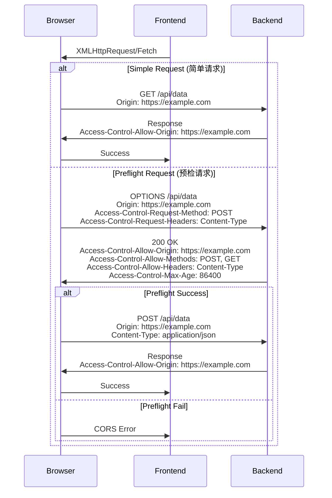

# CORS中间件设计

> **文档版本**: v1.0  
> **创建日期**: 2025-10-21  
> **最后更新**: 2025-10-21  
> **状态**: ✅ 设计完成

---

## 1. 需求概述

### 1.1 功能描述

CORS（Cross-Origin Resource Sharing，跨域资源共享）中间件为青羽后端提供跨域请求处理能力，允许前端应用从不同域名访问API，同时确保跨域访问的安全性。

### 1.2 业务价值

- **前后端分离支持**：支持前端和后端部署在不同域名
- **多端应用支持**：支持Web、移动端、桌面端等多端访问
- **开发便利性**：简化本地开发环境配置
- **安全控制**：精确控制跨域访问权限，防止CSRF攻击

### 1.3 应用场景

- **前后端分离架构**：前端（example.com）访问后端（api.example.com）
- **多域名部署**：支持多个前端域名访问同一后端
- **本地开发**：localhost开发环境访问测试/生产API
- **移动应用**：原生应用内嵌WebView访问API
- **第三方集成**：允许授权的第三方应用访问API

---

## 2. CORS原理

### 2.1 同源策略 (Same-Origin Policy)

浏览器的安全机制，限制不同源之间的资源访问。

**同源定义**：协议、域名、端口完全相同

```
https://example.com:443/api/users  ← 源
│      │         │        │   │
协议   域名      端口     路径

同源示例：
✅ https://example.com:443/api/projects  ← 同源
❌ http://example.com:443/api/users      ← 协议不同
❌ https://api.example.com:443/api/users ← 域名不同
❌ https://example.com:8080/api/users    ← 端口不同
```

### 2.2 CORS工作流程



### 2.3 简单请求 vs 预检请求

**简单请求**（不触发预检）：
- 方法：GET、HEAD、POST
- 头：Accept、Accept-Language、Content-Language、Content-Type（仅限：application/x-www-form-urlencoded、multipart/form-data、text/plain）

**预检请求**（需要OPTIONS预检）：
- 其他HTTP方法：PUT、DELETE、PATCH等
- 自定义头：Authorization、X-Custom-Header等
- Content-Type：application/json等

---

## 3. 详细设计

### 3.1 核心数据结构

```go
// CORS配置
type CORSConfig struct {
    AllowOrigins     []string      `json:"allow_origins" yaml:"allow_origins"`         // 允许的源
    AllowMethods     []string      `json:"allow_methods" yaml:"allow_methods"`         // 允许的HTTP方法
    AllowHeaders     []string      `json:"allow_headers" yaml:"allow_headers"`         // 允许的请求头
    ExposeHeaders    []string      `json:"expose_headers" yaml:"expose_headers"`       // 暴露的响应头
    AllowCredentials bool          `json:"allow_credentials" yaml:"allow_credentials"` // 是否允许携带凭证
    MaxAge           time.Duration `json:"max_age" yaml:"max_age"`                     // 预检结果缓存时间
    AllowWildcard    bool          `json:"allow_wildcard" yaml:"allow_wildcard"`       // 是否允许通配符
    AllowOriginFunc  func(string) bool `json:"-" yaml:"-"`                            // 自定义源验证函数
}
```

### 3.2 默认配置

```go
// 实现文件：cors.go

// 默认CORS配置（安全的默认值）
func DefaultCORSConfig() CORSConfig {
    return CORSConfig{
        AllowOrigins: []string{}, // 默认不允许任何跨域
        AllowMethods: []string{
            http.MethodGet,
            http.MethodPost,
            http.MethodPut,
            http.MethodPatch,
            http.MethodDelete,
            http.MethodHead,
            http.MethodOptions,
        },
        AllowHeaders: []string{
            "Origin",
            "Content-Type",
            "Accept",
            "Authorization",
            "X-Requested-With",
        },
        ExposeHeaders: []string{
            "Content-Length",
            "Content-Type",
        },
        AllowCredentials: true,                // 允许携带Cookie等凭证
        MaxAge:           12 * time.Hour,      // 预检结果缓存12小时
        AllowWildcard:    false,               // 不允许通配符（安全考虑）
    }
}

// 开发环境宽松配置
func DevelopmentCORSConfig() CORSConfig {
    return CORSConfig{
        AllowOrigins: []string{
            "http://localhost:3000",
            "http://localhost:8080",
            "http://127.0.0.1:3000",
        },
        AllowMethods: []string{"*"},          // 允许所有方法
        AllowHeaders: []string{"*"},          // 允许所有头
        ExposeHeaders: []string{
            "Content-Length",
            "Content-Type",
            "X-Total-Count",
        },
        AllowCredentials: true,
        MaxAge:           24 * time.Hour,
        AllowWildcard:    true,
    }
}

// 生产环境严格配置
func ProductionCORSConfig() CORSConfig {
    return CORSConfig{
        AllowOrigins: []string{
            "https://qingyu.com",
            "https://www.qingyu.com",
            "https://app.qingyu.com",
        },
        AllowMethods: []string{
            http.MethodGet,
            http.MethodPost,
            http.MethodPut,
            http.MethodDelete,
            http.MethodPatch,
        },
        AllowHeaders: []string{
            "Origin",
            "Content-Type",
            "Accept",
            "Authorization",
        },
        ExposeHeaders: []string{
            "Content-Length",
        },
        AllowCredentials: true,
        MaxAge:           12 * time.Hour,
        AllowWildcard:    false,  // 生产环境禁用通配符
    }
}
```

### 3.3 CORS中间件实现

```go
// 实现文件：cors.go

// 简单CORS中间件
func CORS() gin.HandlerFunc {
    return CORSWithConfig(DefaultCORSConfig())
}

// 带配置的CORS中间件
func CORSWithConfig(config CORSConfig) gin.HandlerFunc {
    return func(c *gin.Context) {
        origin := c.Request.Header.Get("Origin")
        
        // 1. 检查Origin是否允许
        if origin == "" {
            // 同源请求，无需CORS处理
            c.Next()
            return
        }
        
        allowed := isOriginAllowed(origin, config)
        if !allowed {
            // Origin不在白名单中，拒绝跨域请求
            c.AbortWithStatusJSON(http.StatusForbidden, gin.H{
                "code":    40311,
                "message": "跨域请求被拒绝",
                "origin":  origin,
            })
            return
        }
        
        // 2. 设置CORS响应头
        c.Writer.Header().Set("Access-Control-Allow-Origin", origin)
        
        if config.AllowCredentials {
            c.Writer.Header().Set("Access-Control-Allow-Credentials", "true")
        }
        
        if len(config.ExposeHeaders) > 0 {
            c.Writer.Header().Set(
                "Access-Control-Expose-Headers",
                strings.Join(config.ExposeHeaders, ", "),
            )
        }
        
        // 3. 处理预检请求 (OPTIONS)
        if c.Request.Method == http.MethodOptions {
            handlePreflightRequest(c, config)
            return
        }
        
        c.Next()
    }
}

// 检查Origin是否允许
func isOriginAllowed(origin string, config CORSConfig) bool {
    // 1. 使用自定义验证函数
    if config.AllowOriginFunc != nil {
        return config.AllowOriginFunc(origin)
    }
    
    // 2. 检查白名单
    for _, allowed := range config.AllowOrigins {
        if allowed == "*" && config.AllowWildcard {
            return true
        }
        
        if allowed == origin {
            return true
        }
        
        // 支持通配符子域名: *.example.com
        if strings.HasPrefix(allowed, "*.") {
            domain := strings.TrimPrefix(allowed, "*.")
            if strings.HasSuffix(origin, domain) {
                return true
            }
        }
    }
    
    return false
}

// 处理预检请求
func handlePreflightRequest(c *gin.Context, config CORSConfig) {
    // 检查请求的方法是否允许
    requestMethod := c.Request.Header.Get("Access-Control-Request-Method")
    if !isMethodAllowed(requestMethod, config.AllowMethods) {
        c.AbortWithStatus(http.StatusForbidden)
        return
    }
    
    // 检查请求的头是否允许
    requestHeaders := c.Request.Header.Get("Access-Control-Request-Headers")
    if requestHeaders != "" {
        headers := strings.Split(requestHeaders, ",")
        for i, header := range headers {
            headers[i] = strings.TrimSpace(header)
        }
        
        if !areHeadersAllowed(headers, config.AllowHeaders) {
            c.AbortWithStatus(http.StatusForbidden)
            return
        }
        
        c.Writer.Header().Set(
            "Access-Control-Allow-Headers",
            strings.Join(headers, ", "),
        )
    }
    
    // 设置允许的方法
    c.Writer.Header().Set(
        "Access-Control-Allow-Methods",
        strings.Join(config.AllowMethods, ", "),
    )
    
    // 设置预检结果缓存时间
    if config.MaxAge > 0 {
        c.Writer.Header().Set(
            "Access-Control-Max-Age",
            fmt.Sprintf("%.0f", config.MaxAge.Seconds()),
        )
    }
    
    c.AbortWithStatus(http.StatusNoContent)
}

// 检查方法是否允许
func isMethodAllowed(method string, allowedMethods []string) bool {
    for _, allowed := range allowedMethods {
        if allowed == "*" || allowed == method {
            return true
        }
    }
    return false
}

// 检查头是否允许
func areHeadersAllowed(headers []string, allowedHeaders []string) bool {
    // 如果允许所有头
    for _, allowed := range allowedHeaders {
        if allowed == "*" {
            return true
        }
    }
    
    // 逐个检查
    for _, header := range headers {
        allowed := false
        for _, allowedHeader := range allowedHeaders {
            if strings.EqualFold(header, allowedHeader) {
                allowed = true
                break
            }
        }
        if !allowed {
            return false
        }
    }
    
    return true
}
```

---

## 4. 安全设计

### 4.1 Origin白名单管理

```go
// Origin白名单管理器
type OriginWhitelist struct {
    origins map[string]bool
    mu      sync.RWMutex
}

func NewOriginWhitelist(origins []string) *OriginWhitelist {
    ow := &OriginWhitelist{
        origins: make(map[string]bool),
    }
    
    for _, origin := range origins {
        ow.Add(origin)
    }
    
    return ow
}

// 添加允许的源
func (ow *OriginWhitelist) Add(origin string) {
    ow.mu.Lock()
    defer ow.mu.Unlock()
    ow.origins[origin] = true
}

// 移除源
func (ow *OriginWhitelist) Remove(origin string) {
    ow.mu.Lock()
    defer ow.mu.Unlock()
    delete(ow.origins, origin)
}

// 检查源是否允许
func (ow *OriginWhitelist) IsAllowed(origin string) bool {
    ow.mu.RLock()
    defer ow.mu.RUnlock()
    return ow.origins[origin]
}

// 使用白名单的CORS中间件
func CORSWithWhitelist(whitelist *OriginWhitelist) gin.HandlerFunc {
    config := DefaultCORSConfig()
    config.AllowOriginFunc = whitelist.IsAllowed
    return CORSWithConfig(config)
}
```

### 4.2 防止CSRF攻击

```go
// CORS + CSRF防护
func SecureCORS() gin.HandlerFunc {
    return func(c *gin.Context) {
        origin := c.Request.Header.Get("Origin")
        
        // 1. CORS检查
        if origin != "" && !isOriginAllowed(origin, config) {
            c.AbortWithStatusJSON(http.StatusForbidden, gin.H{
                "code":    40312,
                "message": "跨域请求被拒绝",
            })
            return
        }
        
        // 2. 对于修改性请求（POST/PUT/DELETE），检查Referer
        if isModifyingMethod(c.Request.Method) {
            referer := c.Request.Header.Get("Referer")
            if referer == "" || !isRefererTrusted(referer) {
                c.AbortWithStatusJSON(http.StatusForbidden, gin.H{
                    "code":    40313,
                    "message": "Referer验证失败",
                })
                return
            }
        }
        
        // 3. 应用CORS
        CORSWithConfig(config)(c)
    }
}

func isModifyingMethod(method string) bool {
    return method == http.MethodPost ||
           method == http.MethodPut ||
           method == http.MethodDelete ||
           method == http.MethodPatch
}

func isRefererTrusted(referer string) bool {
    trustedDomains := []string{
        "https://qingyu.com",
        "https://www.qingyu.com",
        "https://app.qingyu.com",
    }
    
    for _, domain := range trustedDomains {
        if strings.HasPrefix(referer, domain) {
            return true
        }
    }
    
    return false
}
```

### 4.3 避免通配符风险

```go
// ⚠️ 危险：允许所有源 + 允许凭证
// 这会导致任何网站都能携带用户Cookie访问API
func InsecureCORS() gin.HandlerFunc {
    return func(c *gin.Context) {
        c.Writer.Header().Set("Access-Control-Allow-Origin", "*")
        c.Writer.Header().Set("Access-Control-Allow-Credentials", "true") // ❌ 错误！
        c.Next()
    }
}

// ✅ 安全：明确指定允许的源
func SecureCORS() gin.HandlerFunc {
    return CORSWithConfig(CORSConfig{
        AllowOrigins: []string{
            "https://qingyu.com",
            "https://app.qingyu.com",
        },
        AllowCredentials: true, // ✅ 正确：仅允许指定源携带凭证
    })
}
```

---

## 5. 配置管理

### 5.1 配置文件

```yaml
# config/cors.yaml
cors:
  # 开发环境
  development:
    allow_origins:
      - "http://localhost:3000"
      - "http://localhost:8080"
      - "http://127.0.0.1:3000"
    allow_methods:
      - "GET"
      - "POST"
      - "PUT"
      - "DELETE"
      - "PATCH"
      - "OPTIONS"
    allow_headers:
      - "*"
    expose_headers:
      - "Content-Length"
      - "Content-Type"
      - "X-Total-Count"
    allow_credentials: true
    max_age: 24h
    allow_wildcard: true
  
  # 测试环境
  staging:
    allow_origins:
      - "https://test.qingyu.com"
      - "https://staging.qingyu.com"
    allow_methods:
      - "GET"
      - "POST"
      - "PUT"
      - "DELETE"
      - "PATCH"
      - "OPTIONS"
    allow_headers:
      - "Origin"
      - "Content-Type"
      - "Accept"
      - "Authorization"
      - "X-Requested-With"
    expose_headers:
      - "Content-Length"
      - "Content-Type"
    allow_credentials: true
    max_age: 12h
    allow_wildcard: false
  
  # 生产环境
  production:
    allow_origins:
      - "https://qingyu.com"
      - "https://www.qingyu.com"
      - "https://app.qingyu.com"
      - "https://mobile.qingyu.com"
    allow_methods:
      - "GET"
      - "POST"
      - "PUT"
      - "DELETE"
      - "PATCH"
    allow_headers:
      - "Origin"
      - "Content-Type"
      - "Accept"
      - "Authorization"
    expose_headers:
      - "Content-Length"
    allow_credentials: true
    max_age: 12h
    allow_wildcard: false
```

### 5.2 环境变量支持

```go
// 从环境变量读取CORS配置
func LoadCORSConfigFromEnv() CORSConfig {
    config := DefaultCORSConfig()
    
    // 从环境变量读取允许的源（逗号分隔）
    if origins := os.Getenv("CORS_ALLOW_ORIGINS"); origins != "" {
        config.AllowOrigins = strings.Split(origins, ",")
    }
    
    // 从环境变量读取允许的方法
    if methods := os.Getenv("CORS_ALLOW_METHODS"); methods != "" {
        config.AllowMethods = strings.Split(methods, ",")
    }
    
    // 从环境变量读取允许凭证
    if credentials := os.Getenv("CORS_ALLOW_CREDENTIALS"); credentials == "false" {
        config.AllowCredentials = false
    }
    
    return config
}

// 使用示例：
// export CORS_ALLOW_ORIGINS="https://qingyu.com,https://app.qingyu.com"
// export CORS_ALLOW_METHODS="GET,POST,PUT,DELETE"
// export CORS_ALLOW_CREDENTIALS="true"
```

---

## 6. 监控与日志

### 6.1 CORS请求日志

```go
// 记录CORS请求
func CORSWithLogging() gin.HandlerFunc {
    return func(c *gin.Context) {
        origin := c.Request.Header.Get("Origin")
        
        if origin != "" {
            // 记录跨域请求
            logger.Info("CORS请求",
                zap.String("origin", origin),
                zap.String("method", c.Request.Method),
                zap.String("path", c.Request.URL.Path),
                zap.String("client_ip", c.ClientIP()),
            )
        }
        
        // 应用CORS
        CORSWithConfig(config)(c)
        
        // 记录CORS响应
        if origin != "" {
            allowedOrigin := c.Writer.Header().Get("Access-Control-Allow-Origin")
            if allowedOrigin == "" {
                logger.Warn("CORS请求被拒绝",
                    zap.String("origin", origin),
                    zap.String("path", c.Request.URL.Path),
                )
            }
        }
    }
}
```

### 6.2 Prometheus指标

```go
// CORS指标
var (
    corsRequestTotal = prometheus.NewCounterVec(
        prometheus.CounterOpts{
            Name: "cors_request_total",
            Help: "Total number of CORS requests",
        },
        []string{"origin", "result"},
    )
    
    corsPreflightTotal = prometheus.NewCounterVec(
        prometheus.CounterOpts{
            Name: "cors_preflight_total",
            Help: "Total number of CORS preflight requests",
        },
        []string{"origin", "method"},
    )
)

// 记录CORS指标
func recordCORSMetrics(origin string, allowed bool, isPreflight bool) {
    result := "allowed"
    if !allowed {
        result = "denied"
    }
    
    corsRequestTotal.WithLabelValues(origin, result).Inc()
    
    if isPreflight {
        corsPreflightTotal.WithLabelValues(origin, "OPTIONS").Inc()
    }
}
```

---

## 7. 测试设计

### 7.1 单元测试

```go
func TestCORS_SimpleRequest(t *testing.T) {
    gin.SetMode(gin.TestMode)
    
    config := CORSConfig{
        AllowOrigins: []string{"https://example.com"},
        AllowCredentials: true,
    }
    
    router := gin.New()
    router.Use(CORSWithConfig(config))
    router.GET("/test", func(c *gin.Context) {
        c.JSON(200, gin.H{"status": "ok"})
    })
    
    w := httptest.NewRecorder()
    req, _ := http.NewRequest("GET", "/test", nil)
    req.Header.Set("Origin", "https://example.com")
    router.ServeHTTP(w, req)
    
    assert.Equal(t, 200, w.Code)
    assert.Equal(t, "https://example.com", w.Header().Get("Access-Control-Allow-Origin"))
    assert.Equal(t, "true", w.Header().Get("Access-Control-Allow-Credentials"))
}

func TestCORS_PreflightRequest(t *testing.T) {
    gin.SetMode(gin.TestMode)
    
    config := CORSConfig{
        AllowOrigins: []string{"https://example.com"},
        AllowMethods: []string{"POST", "GET"},
        AllowHeaders: []string{"Content-Type", "Authorization"},
    }
    
    router := gin.New()
    router.Use(CORSWithConfig(config))
    router.POST("/test", func(c *gin.Context) {
        c.JSON(200, gin.H{"status": "ok"})
    })
    
    w := httptest.NewRecorder()
    req, _ := http.NewRequest("OPTIONS", "/test", nil)
    req.Header.Set("Origin", "https://example.com")
    req.Header.Set("Access-Control-Request-Method", "POST")
    req.Header.Set("Access-Control-Request-Headers", "Content-Type, Authorization")
    router.ServeHTTP(w, req)
    
    assert.Equal(t, 204, w.Code)
    assert.Equal(t, "https://example.com", w.Header().Get("Access-Control-Allow-Origin"))
    assert.Contains(t, w.Header().Get("Access-Control-Allow-Methods"), "POST")
}

func TestCORS_DeniedOrigin(t *testing.T) {
    gin.SetMode(gin.TestMode)
    
    config := CORSConfig{
        AllowOrigins: []string{"https://example.com"},
    }
    
    router := gin.New()
    router.Use(CORSWithConfig(config))
    router.GET("/test", func(c *gin.Context) {
        c.JSON(200, gin.H{"status": "ok"})
    })
    
    w := httptest.NewRecorder()
    req, _ := http.NewRequest("GET", "/test", nil)
    req.Header.Set("Origin", "https://malicious.com")
    router.ServeHTTP(w, req)
    
    assert.Equal(t, 403, w.Code)
}
```

---

## 8. 使用示例

### 8.1 基本使用

```go
// router/enter.go
func InitRoutes(r *gin.Engine) {
    // 应用CORS中间件
    r.Use(middleware.CORS())
    
    // 或使用自定义配置
    corsConfig := middleware.ProductionCORSConfig()
    r.Use(middleware.CORSWithConfig(corsConfig))
}
```

### 8.2 多环境配置

```go
// 根据环境加载不同的CORS配置
func InitCORS(env string) gin.HandlerFunc {
    var config middleware.CORSConfig
    
    switch env {
    case "development":
        config = middleware.DevelopmentCORSConfig()
    case "staging":
        config = loadCORSConfigFromFile("config/cors_staging.yaml")
    case "production":
        config = middleware.ProductionCORSConfig()
    default:
        config = middleware.DefaultCORSConfig()
    }
    
    return middleware.CORSWithConfig(config)
}
```

---

## 9. 最佳实践

### 9.1 安全建议

1. ✅ **明确指定允许的源**：不要使用通配符`*`
2. ✅ **限制允许的方法**：只允许必需的HTTP方法
3. ✅ **限制允许的头**：只允许必需的请求头
4. ✅ **谨慎使用AllowCredentials**：只在必要时启用
5. ❌ **不要同时使用`*`和Credentials**：这是不安全的配置

### 9.2 性能优化

1. ✅ **设置MaxAge**：减少预检请求频率
2. ✅ **使用白名单缓存**：提高Origin验证速度
3. ✅ **避免复杂的Origin验证逻辑**：保持简单高效

### 9.3 开发建议

1. ✅ **开发环境使用宽松配置**：便于本地开发
2. ✅ **生产环境使用严格配置**：确保安全
3. ✅ **记录CORS拒绝日志**：便于调试
4. ✅ **提供清晰的错误信息**：帮助前端开发者定位问题

---

## 10. 常见问题

### 10.1 CORS预检请求失败

**问题**：浏览器发送OPTIONS请求返回403
**原因**：后端未正确处理预检请求
**解决**：确保CORS中间件在认证中间件之前

```go
// ❌ 错误：CORS在认证之后
router.Use(middleware.JWTAuth())
router.Use(middleware.CORS())

// ✅ 正确：CORS在认证之前
router.Use(middleware.CORS())
router.Use(middleware.JWTAuth())
```

### 10.2 凭证无法携带

**问题**：前端设置了`credentials: 'include'`但Cookie未发送
**原因**：后端未设置`Access-Control-Allow-Credentials: true`
**解决**：启用`AllowCredentials`并明确指定Origin

```go
config := CORSConfig{
    AllowOrigins:     []string{"https://example.com"}, // 不能用 "*"
    AllowCredentials: true,
}
```

### 10.3 自定义头被拒绝

**问题**：前端发送自定义头（如`X-Custom-Token`）被CORS拒绝
**原因**：自定义头未在`AllowHeaders`中声明
**解决**：添加自定义头到配置

```go
config := CORSConfig{
    AllowHeaders: []string{
        "Origin",
        "Content-Type",
        "Authorization",
        "X-Custom-Token", // 添加自定义头
    },
}
```

---

## 11. 关联文件

### 实现文件

- `middleware/cors.go` - CORS中间件实现 (~80行)

### 相关设计

- [中间件总体设计](./中间件总体设计.md) - 中间件架构
- [安全中间件设计](./安全中间件设计.md) - CSRF防护
- [认证中间件设计](./认证中间件设计.md) - JWT认证

---

**文档版本**: v1.0  
**创建时间**: 2025-10-21  
**作者**: 青羽架构组

