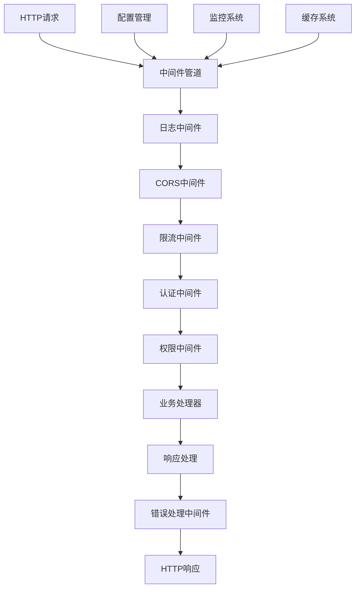
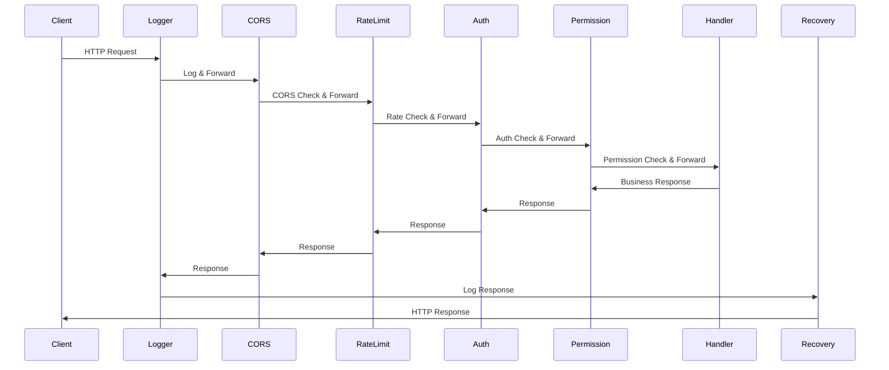

# 中间件总体设计

## 1. 需求概述

### 1.1 功能描述
中间件系统为青羽后端提供统一的请求处理管道，包括认证、日志记录、跨域处理、限流、错误处理等横切关注点，确保系统的安全性、可观测性和稳定性。

### 1.2 业务价值
- **横切关注点分离**：将通用功能从业务逻辑中分离，提高代码复用性
- **统一处理流程**：标准化请求处理流程，确保一致性
- **系统安全保障**：提供多层安全防护机制
- **运维可观测性**：提供全面的监控和日志记录能力
- **性能优化**：通过缓存、限流等机制优化系统性能

### 1.3 用户场景
- **API请求处理**：所有HTTP请求都经过中间件管道处理
- **安全防护**：防止恶意请求和未授权访问
- **性能监控**：实时监控系统性能和健康状态
- **错误处理**：统一处理和记录系统错误
- **跨域支持**：支持前端跨域访问

### 1.4 功能边界
- **包含**：请求预处理、响应后处理、错误处理、性能监控
- **不包含**：业务逻辑处理、数据持久化、外部服务调用

## 2. 架构设计

### 2.1 整体架构



### 2.2 中间件分层

#### 基础设施层
- **日志中间件**：请求响应日志记录
- **监控中间件**：性能指标收集
- **错误处理中间件**：统一错误处理和恢复

#### 安全层
- **CORS中间件**：跨域资源共享控制
- **限流中间件**：请求频率限制
- **认证中间件**：用户身份验证
- **权限中间件**：访问权限控制

#### 业务层
- **缓存中间件**：响应缓存处理
- **压缩中间件**：响应内容压缩
- **版本控制中间件**：API版本管理

### 2.3 执行顺序



### 2.4 技术选型
- **Web框架**：Gin（高性能HTTP框架）
- **配置管理**：Viper（配置文件管理）
- **日志系统**：Zap（高性能结构化日志）
- **监控系统**：Prometheus（指标收集）
- **缓存系统**：Redis（分布式缓存）
- **限流算法**：Token Bucket（令牌桶算法）

## 3. 详细设计

### 3.1 中间件管理器

```go
// 中间件管理器接口
type MiddlewareManager interface {
    Register(name string, middleware gin.HandlerFunc) error
    Unregister(name string) error
    GetMiddleware(name string) (gin.HandlerFunc, error)
    ListMiddlewares() []string
    ApplyMiddlewares(engine *gin.Engine) error
}

// 中间件配置
type MiddlewareConfig struct {
    Name     string                 `json:"name" yaml:"name"`
    Enabled  bool                   `json:"enabled" yaml:"enabled"`
    Priority int                    `json:"priority" yaml:"priority"`
    Config   map[string]interface{} `json:"config" yaml:"config"`
    Paths    []string               `json:"paths" yaml:"paths"`
    Methods  []string               `json:"methods" yaml:"methods"`
}

// 中间件注册表
type MiddlewareRegistry struct {
    middlewares map[string]*MiddlewareInfo
    configs     map[string]*MiddlewareConfig
    mu          sync.RWMutex
}

type MiddlewareInfo struct {
    Name        string
    Handler     gin.HandlerFunc
    Priority    int
    Description string
    Version     string
}
```

### 3.2 中间件工厂

```go
// 中间件工厂接口
type MiddlewareFactory interface {
    CreateMiddleware(config *MiddlewareConfig) (gin.HandlerFunc, error)
    GetSupportedTypes() []string
    ValidateConfig(config *MiddlewareConfig) error
}

// 具体工厂实现
type ConcreteMiddlewareFactory struct {
    creators map[string]MiddlewareCreator
}

type MiddlewareCreator func(config *MiddlewareConfig) (gin.HandlerFunc, error)

// 注册中间件创建器
func (f *ConcreteMiddlewareFactory) RegisterCreator(name string, creator MiddlewareCreator) {
    f.creators[name] = creator
}

// 创建中间件实例
func (f *ConcreteMiddlewareFactory) CreateMiddleware(config *MiddlewareConfig) (gin.HandlerFunc, error) {
    creator, exists := f.creators[config.Name]
    if !exists {
        return nil, fmt.Errorf("unknown middleware type: %s", config.Name)
    }
    
    if err := f.ValidateConfig(config); err != nil {
        return nil, fmt.Errorf("invalid config for %s: %w", config.Name, err)
    }
    
    return creator(config)
}
```

### 3.3 中间件链构建器

```go
// 中间件链构建器
type MiddlewareChainBuilder struct {
    middlewares []*MiddlewareInfo
    factory     MiddlewareFactory
}

func NewMiddlewareChainBuilder(factory MiddlewareFactory) *MiddlewareChainBuilder {
    return &MiddlewareChainBuilder{
        middlewares: make([]*MiddlewareInfo, 0),
        factory:     factory,
    }
}

func (b *MiddlewareChainBuilder) Add(config *MiddlewareConfig) error {
    if !config.Enabled {
        return nil
    }
    
    middleware, err := b.factory.CreateMiddleware(config)
    if err != nil {
        return err
    }
    
    info := &MiddlewareInfo{
        Name:     config.Name,
        Handler:  middleware,
        Priority: config.Priority,
    }
    
    b.middlewares = append(b.middlewares, info)
    return nil
}

func (b *MiddlewareChainBuilder) Build() []gin.HandlerFunc {
    // 按优先级排序
    sort.Slice(b.middlewares, func(i, j int) bool {
        return b.middlewares[i].Priority < b.middlewares[j].Priority
    })
    
    handlers := make([]gin.HandlerFunc, len(b.middlewares))
    for i, middleware := range b.middlewares {
        handlers[i] = middleware.Handler
    }
    
    return handlers
}
```

### 3.4 路由组中间件配置

```go
// 路由组中间件配置
type RouteGroupConfig struct {
    Path        string              `json:"path" yaml:"path"`
    Middlewares []MiddlewareConfig  `json:"middlewares" yaml:"middlewares"`
    Routes      []RouteConfig       `json:"routes" yaml:"routes"`
}

type RouteConfig struct {
    Method      string             `json:"method" yaml:"method"`
    Path        string             `json:"path" yaml:"path"`
    Handler     string             `json:"handler" yaml:"handler"`
    Middlewares []MiddlewareConfig `json:"middlewares" yaml:"middlewares"`
}

// 路由配置应用器
func ApplyRouteConfig(engine *gin.Engine, config *RouteGroupConfig, factory MiddlewareFactory) error {
    // 创建路由组
    group := engine.Group(config.Path)
    
    // 应用组级中间件
    builder := NewMiddlewareChainBuilder(factory)
    for _, middlewareConfig := range config.Middlewares {
        if err := builder.Add(&middlewareConfig); err != nil {
            return err
        }
    }
    
    middlewares := builder.Build()
    group.Use(middlewares...)
    
    // 应用路由级中间件
    for _, routeConfig := range config.Routes {
        routeBuilder := NewMiddlewareChainBuilder(factory)
        for _, middlewareConfig := range routeConfig.Middlewares {
            if err := routeBuilder.Add(&middlewareConfig); err != nil {
                return err
            }
        }
        
        routeMiddlewares := routeBuilder.Build()
        handler := getHandler(routeConfig.Handler) // 获取业务处理器
        
        // 组合中间件和处理器
        handlers := append(routeMiddlewares, handler)
        
        // 注册路由
        switch strings.ToUpper(routeConfig.Method) {
        case "GET":
            group.GET(routeConfig.Path, handlers...)
        case "POST":
            group.POST(routeConfig.Path, handlers...)
        case "PUT":
            group.PUT(routeConfig.Path, handlers...)
        case "DELETE":
            group.DELETE(routeConfig.Path, handlers...)
        default:
            return fmt.Errorf("unsupported HTTP method: %s", routeConfig.Method)
        }
    }
    
    return nil
}
```

## 4. 核心中间件设计

### 4.1 日志中间件

```go
// 日志中间件配置
type LoggerMiddlewareConfig struct {
    Level            string        `json:"level" yaml:"level"`
    Format           string        `json:"format" yaml:"format"`
    EnableReqBody    bool          `json:"enable_req_body" yaml:"enable_req_body"`
    EnableRespBody   bool          `json:"enable_resp_body" yaml:"enable_resp_body"`
    MaxBodySize      int           `json:"max_body_size" yaml:"max_body_size"`
    SlowThreshold    time.Duration `json:"slow_threshold" yaml:"slow_threshold"`
    SkipPaths        []string      `json:"skip_paths" yaml:"skip_paths"`
}

// 创建日志中间件
func CreateLoggerMiddleware(config *MiddlewareConfig) (gin.HandlerFunc, error) {
    var loggerConfig LoggerMiddlewareConfig
    if err := mapstructure.Decode(config.Config, &loggerConfig); err != nil {
        return nil, err
    }
    
    return LoggerWithConfig(loggerConfig), nil
}
```

### 4.2 CORS中间件

```go
// CORS中间件配置
type CORSMiddlewareConfig struct {
    AllowOrigins     []string      `json:"allow_origins" yaml:"allow_origins"`
    AllowMethods     []string      `json:"allow_methods" yaml:"allow_methods"`
    AllowHeaders     []string      `json:"allow_headers" yaml:"allow_headers"`
    ExposeHeaders    []string      `json:"expose_headers" yaml:"expose_headers"`
    AllowCredentials bool          `json:"allow_credentials" yaml:"allow_credentials"`
    MaxAge           time.Duration `json:"max_age" yaml:"max_age"`
}

// 创建CORS中间件
func CreateCORSMiddleware(config *MiddlewareConfig) (gin.HandlerFunc, error) {
    var corsConfig CORSMiddlewareConfig
    if err := mapstructure.Decode(config.Config, &corsConfig); err != nil {
        return nil, err
    }
    
    return cors.New(cors.Config{
        AllowOrigins:     corsConfig.AllowOrigins,
        AllowMethods:     corsConfig.AllowMethods,
        AllowHeaders:     corsConfig.AllowHeaders,
        ExposeHeaders:    corsConfig.ExposeHeaders,
        AllowCredentials: corsConfig.AllowCredentials,
        MaxAge:           corsConfig.MaxAge,
    }), nil
}
```

### 4.3 限流中间件

```go
// 限流中间件配置
type RateLimitMiddlewareConfig struct {
    RequestsPerSecond int           `json:"requests_per_second" yaml:"requests_per_second"`
    RequestsPerMinute int           `json:"requests_per_minute" yaml:"requests_per_minute"`
    RequestsPerHour   int           `json:"requests_per_hour" yaml:"requests_per_hour"`
    BurstSize         int           `json:"burst_size" yaml:"burst_size"`
    KeyFunc           string        `json:"key_func" yaml:"key_func"`
    SkipSuccessful    bool          `json:"skip_successful" yaml:"skip_successful"`
    SkipFailedRequest bool          `json:"skip_failed_request" yaml:"skip_failed_request"`
}

// 创建限流中间件
func CreateRateLimitMiddleware(config *MiddlewareConfig) (gin.HandlerFunc, error) {
    var rateLimitConfig RateLimitMiddlewareConfig
    if err := mapstructure.Decode(config.Config, &rateLimitConfig); err != nil {
        return nil, err
    }
    
    limiter := rate.NewLimiter(
        rate.Limit(rateLimitConfig.RequestsPerSecond),
        rateLimitConfig.BurstSize,
    )
    
    return func(c *gin.Context) {
        key := getKeyFromRequest(c, rateLimitConfig.KeyFunc)
        
        if !limiter.Allow() {
            c.JSON(http.StatusTooManyRequests, gin.H{
                "code":    42901,
                "message": "请求过于频繁，请稍后再试",
                "timestamp": time.Now().Unix(),
            })
            c.Abort()
            return
        }
        
        c.Next()
    }, nil
}
```

### 4.4 认证中间件

```go
// 认证中间件配置
type AuthMiddlewareConfig struct {
    JWTSecret       string        `json:"jwt_secret" yaml:"jwt_secret"`
    TokenExpiry     time.Duration `json:"token_expiry" yaml:"token_expiry"`
    SkipPaths       []string      `json:"skip_paths" yaml:"skip_paths"`
    RequiredClaims  []string      `json:"required_claims" yaml:"required_claims"`
    EnableRefresh   bool          `json:"enable_refresh" yaml:"enable_refresh"`
}

// 创建认证中间件
func CreateAuthMiddleware(config *MiddlewareConfig) (gin.HandlerFunc, error) {
    var authConfig AuthMiddlewareConfig
    if err := mapstructure.Decode(config.Config, &authConfig); err != nil {
        return nil, err
    }
    
    return AuthMiddlewareWithConfig(authConfig), nil
}
```

## 5. 配置管理

### 5.1 配置文件结构

```yaml
# middleware.yaml
middlewares:
  # 全局中间件配置
  global:
    - name: logger
      enabled: true
      priority: 1
      config:
        level: info
        format: json
        enable_req_body: false
        enable_resp_body: false
        slow_threshold: 200ms
        skip_paths:
          - /health
          - /metrics
    
    - name: cors
      enabled: true
      priority: 2
      config:
        allow_origins: ["*"]
        allow_methods: ["GET", "POST", "PUT", "DELETE", "OPTIONS"]
        allow_headers: ["*"]
        allow_credentials: true
        max_age: 12h
    
    - name: rate_limit
      enabled: true
      priority: 3
      config:
        requests_per_second: 100
        requests_per_minute: 1000
        burst_size: 200
        key_func: ip
    
    - name: recovery
      enabled: true
      priority: 999
      config:
        enable_stack_trace: true
        enable_logging: true

  # 路由组配置
  route_groups:
    - path: /api/v1/public
      middlewares:
        - name: logger
          enabled: true
          priority: 1
        - name: cors
          enabled: true
          priority: 2
      
    - path: /api/v1/auth
      middlewares:
        - name: logger
          enabled: true
          priority: 1
        - name: cors
          enabled: true
          priority: 2
        - name: auth
          enabled: true
          priority: 3
          config:
            jwt_secret: ${JWT_SECRET}
            token_expiry: 24h
            skip_paths: ["/api/v1/auth/login", "/api/v1/auth/register"]
    
    - path: /api/v1/admin
      middlewares:
        - name: logger
          enabled: true
          priority: 1
        - name: cors
          enabled: true
          priority: 2
        - name: auth
          enabled: true
          priority: 3
        - name: permission
          enabled: true
          priority: 4
          config:
            required_roles: ["admin"]
```

### 5.2 配置加载器

```go
// 配置加载器
type ConfigLoader struct {
    configPath string
    viper      *viper.Viper
}

func NewConfigLoader(configPath string) *ConfigLoader {
    v := viper.New()
    v.SetConfigFile(configPath)
    v.AutomaticEnv()
    
    return &ConfigLoader{
        configPath: configPath,
        viper:      v,
    }
}

func (l *ConfigLoader) LoadConfig() (*MiddlewareSystemConfig, error) {
    if err := l.viper.ReadInConfig(); err != nil {
        return nil, fmt.Errorf("failed to read config file: %w", err)
    }
    
    var config MiddlewareSystemConfig
    if err := l.viper.Unmarshal(&config); err != nil {
        return nil, fmt.Errorf("failed to unmarshal config: %w", err)
    }
    
    return &config, nil
}

// 热重载配置
func (l *ConfigLoader) WatchConfig(callback func(*MiddlewareSystemConfig)) {
    l.viper.WatchConfig()
    l.viper.OnConfigChange(func(e fsnotify.Event) {
        config, err := l.LoadConfig()
        if err != nil {
            log.Printf("Failed to reload config: %v", err)
            return
        }
        callback(config)
    })
}
```

### 5.3 环境变量支持

```go
// 环境变量配置
const (
    EnvLogLevel          = "LOG_LEVEL"
    EnvJWTSecret         = "JWT_SECRET"
    EnvCORSAllowOrigins  = "CORS_ALLOW_ORIGINS"
    EnvRateLimitRPS      = "RATE_LIMIT_RPS"
    EnvMiddlewareConfig  = "MIDDLEWARE_CONFIG_PATH"
)

// 环境变量解析器
func ParseEnvConfig() map[string]interface{} {
    config := make(map[string]interface{})
    
    if logLevel := os.Getenv(EnvLogLevel); logLevel != "" {
        config["log_level"] = logLevel
    }
    
    if jwtSecret := os.Getenv(EnvJWTSecret); jwtSecret != "" {
        config["jwt_secret"] = jwtSecret
    }
    
    if corsOrigins := os.Getenv(EnvCORSAllowOrigins); corsOrigins != "" {
        config["cors_allow_origins"] = strings.Split(corsOrigins, ",")
    }
    
    if rateLimitRPS := os.Getenv(EnvRateLimitRPS); rateLimitRPS != "" {
        if rps, err := strconv.Atoi(rateLimitRPS); err == nil {
            config["rate_limit_rps"] = rps
        }
    }
    
    return config
}
```

## 6. 监控和指标

### 6.1 中间件指标

```go
// 中间件指标收集器
type MiddlewareMetrics struct {
    requestsTotal     *prometheus.CounterVec
    requestDuration   *prometheus.HistogramVec
    requestsInFlight  *prometheus.GaugeVec
    errorsTotal       *prometheus.CounterVec
    middlewareLatency *prometheus.HistogramVec
}

func NewMiddlewareMetrics() *MiddlewareMetrics {
    return &MiddlewareMetrics{
        requestsTotal: prometheus.NewCounterVec(
            prometheus.CounterOpts{
                Name: "http_requests_total",
                Help: "Total number of HTTP requests",
            },
            []string{"method", "path", "status_code", "middleware"},
        ),
        
        requestDuration: prometheus.NewHistogramVec(
            prometheus.HistogramOpts{
                Name:    "http_request_duration_seconds",
                Help:    "HTTP request duration in seconds",
                Buckets: prometheus.DefBuckets,
            },
            []string{"method", "path", "middleware"},
        ),
        
        requestsInFlight: prometheus.NewGaugeVec(
            prometheus.GaugeOpts{
                Name: "http_requests_in_flight",
                Help: "Current number of HTTP requests being processed",
            },
            []string{"middleware"},
        ),
        
        errorsTotal: prometheus.NewCounterVec(
            prometheus.CounterOpts{
                Name: "http_errors_total",
                Help: "Total number of HTTP errors",
            },
            []string{"method", "path", "status_code", "middleware"},
        ),
        
        middlewareLatency: prometheus.NewHistogramVec(
            prometheus.HistogramOpts{
                Name:    "middleware_latency_seconds",
                Help:    "Middleware processing latency in seconds",
                Buckets: []float64{0.001, 0.005, 0.01, 0.025, 0.05, 0.1, 0.25, 0.5, 1.0},
            },
            []string{"middleware"},
        ),
    }
}

// 指标中间件
func MetricsMiddleware(metrics *MiddlewareMetrics) gin.HandlerFunc {
    return func(c *gin.Context) {
        start := time.Now()
        path := c.Request.URL.Path
        method := c.Request.Method
        
        // 增加正在处理的请求数
        metrics.requestsInFlight.WithLabelValues("metrics").Inc()
        defer metrics.requestsInFlight.WithLabelValues("metrics").Dec()
        
        c.Next()
        
        // 计算处理时间
        duration := time.Since(start).Seconds()
        statusCode := strconv.Itoa(c.Writer.Status())
        
        // 记录指标
        metrics.requestsTotal.WithLabelValues(method, path, statusCode, "metrics").Inc()
        metrics.requestDuration.WithLabelValues(method, path, "metrics").Observe(duration)
        
        // 记录错误
        if c.Writer.Status() >= 400 {
            metrics.errorsTotal.WithLabelValues(method, path, statusCode, "metrics").Inc()
        }
    }
}
```

### 6.2 健康检查

```go
// 健康检查中间件
type HealthCheckConfig struct {
    Path     string `json:"path" yaml:"path"`
    Detailed bool   `json:"detailed" yaml:"detailed"`
}

func HealthCheckMiddleware(config HealthCheckConfig) gin.HandlerFunc {
    return func(c *gin.Context) {
        if c.Request.URL.Path == config.Path {
            status := gin.H{
                "status":    "healthy",
                "timestamp": time.Now().Unix(),
                "version":   getVersion(),
            }
            
            if config.Detailed {
                status["details"] = gin.H{
                    "database":    checkDatabase(),
                    "redis":       checkRedis(),
                    "external_api": checkExternalAPI(),
                    "memory":      getMemoryUsage(),
                    "goroutines":  runtime.NumGoroutine(),
                }
            }
            
            c.JSON(http.StatusOK, status)
            c.Abort()
            return
        }
        
        c.Next()
    }
}
```

## 7. 错误处理和恢复

### 7.1 统一错误处理

```go
// 错误处理中间件
type ErrorHandlerConfig struct {
    EnableStackTrace bool   `json:"enable_stack_trace" yaml:"enable_stack_trace"`
    EnableLogging    bool   `json:"enable_logging" yaml:"enable_logging"`
    LogLevel         string `json:"log_level" yaml:"log_level"`
}

func ErrorHandlerMiddleware(config ErrorHandlerConfig) gin.HandlerFunc {
    return gin.CustomRecovery(func(c *gin.Context, recovered interface{}) {
        var err error
        
        switch x := recovered.(type) {
        case string:
            err = errors.New(x)
        case error:
            err = x
        default:
            err = fmt.Errorf("unknown panic: %v", x)
        }
        
        // 记录错误日志
        if config.EnableLogging {
            fields := []zap.Field{
                zap.String("request_id", c.GetString("request_id")),
                zap.String("method", c.Request.Method),
                zap.String("path", c.Request.URL.Path),
                zap.String("client_ip", c.ClientIP()),
                zap.Error(err),
            }
            
            if config.EnableStackTrace {
                fields = append(fields, zap.String("stack", string(debug.Stack())))
            }
            
            logger.Error("Panic recovered", fields...)
        }
        
        // 返回错误响应
        c.JSON(http.StatusInternalServerError, gin.H{
            "code":      50000,
            "message":   "服务器内部错误",
            "timestamp": time.Now().Unix(),
            "request_id": c.GetString("request_id"),
        })
        
        c.Abort()
    })
}
```

### 7.2 业务错误处理

```go
// 业务错误类型
type BusinessError struct {
    Code    int    `json:"code"`
    Message string `json:"message"`
    Details string `json:"details,omitempty"`
}

func (e *BusinessError) Error() string {
    return e.Message
}

// 业务错误处理中间件
func BusinessErrorHandlerMiddleware() gin.HandlerFunc {
    return func(c *gin.Context) {
        c.Next()
        
        // 检查是否有错误
        if len(c.Errors) > 0 {
            err := c.Errors.Last().Err
            
            switch e := err.(type) {
            case *BusinessError:
                c.JSON(http.StatusBadRequest, gin.H{
                    "code":      e.Code,
                    "message":   e.Message,
                    "details":   e.Details,
                    "timestamp": time.Now().Unix(),
                    "request_id": c.GetString("request_id"),
                })
            default:
                c.JSON(http.StatusInternalServerError, gin.H{
                    "code":      50000,
                    "message":   "服务器内部错误",
                    "timestamp": time.Now().Unix(),
                    "request_id": c.GetString("request_id"),
                })
            }
            
            c.Abort()
        }
    }
}
```

## 8. 性能优化

### 8.1 中间件性能优化

```go
// 性能优化配置
type PerformanceConfig struct {
    EnableGzip       bool `json:"enable_gzip" yaml:"enable_gzip"`
    EnableCache      bool `json:"enable_cache" yaml:"enable_cache"`
    EnablePooling    bool `json:"enable_pooling" yaml:"enable_pooling"`
    MaxConcurrency   int  `json:"max_concurrency" yaml:"max_concurrency"`
}

// 对象池优化
var (
    requestInfoPool = sync.Pool{
        New: func() interface{} {
            return &RequestInfo{}
        },
    }
    
    responseInfoPool = sync.Pool{
        New: func() interface{} {
            return &ResponseInfo{}
        },
    }
)

// 获取请求信息对象
func getRequestInfo() *RequestInfo {
    return requestInfoPool.Get().(*RequestInfo)
}

// 释放请求信息对象
func putRequestInfo(info *RequestInfo) {
    // 重置对象
    *info = RequestInfo{}
    requestInfoPool.Put(info)
}
```

### 8.2 缓存中间件

```go
// 缓存中间件配置
type CacheMiddlewareConfig struct {
    TTL         time.Duration `json:"ttl" yaml:"ttl"`
    MaxSize     int           `json:"max_size" yaml:"max_size"`
    KeyPrefix   string        `json:"key_prefix" yaml:"key_prefix"`
    CacheHeader bool          `json:"cache_header" yaml:"cache_header"`
}

// 缓存中间件
func CacheMiddleware(config CacheMiddlewareConfig) gin.HandlerFunc {
    cache := cache.New(config.TTL, config.TTL*2)
    
    return func(c *gin.Context) {
        // 只缓存GET请求
        if c.Request.Method != "GET" {
            c.Next()
            return
        }
        
        // 生成缓存键
        key := generateCacheKey(c, config.KeyPrefix)
        
        // 检查缓存
        if cached, found := cache.Get(key); found {
            if response, ok := cached.(*CachedResponse); ok {
                // 设置响应头
                for k, v := range response.Headers {
                    c.Header(k, v)
                }
                
                if config.CacheHeader {
                    c.Header("X-Cache", "HIT")
                }
                
                c.Data(response.StatusCode, response.ContentType, response.Body)
                c.Abort()
                return
            }
        }
        
        // 创建响应写入器
        writer := &cacheResponseWriter{
            ResponseWriter: c.Writer,
            body:          &bytes.Buffer{},
        }
        c.Writer = writer
        
        c.Next()
        
        // 缓存响应
        if writer.Status() == 200 {
            response := &CachedResponse{
                StatusCode:  writer.Status(),
                ContentType: writer.Header().Get("Content-Type"),
                Headers:     make(map[string]string),
                Body:        writer.body.Bytes(),
            }
            
            // 复制响应头
            for k, v := range writer.Header() {
                if len(v) > 0 {
                    response.Headers[k] = v[0]
                }
            }
            
            cache.Set(key, response, config.TTL)
            
            if config.CacheHeader {
                c.Header("X-Cache", "MISS")
            }
        }
    }
}

type CachedResponse struct {
    StatusCode  int               `json:"status_code"`
    ContentType string            `json:"content_type"`
    Headers     map[string]string `json:"headers"`
    Body        []byte            `json:"body"`
}
```

## 9. 测试设计

### 9.1 中间件测试框架

```go
// 中间件测试工具
type MiddlewareTestSuite struct {
    engine  *gin.Engine
    factory MiddlewareFactory
}

func NewMiddlewareTestSuite() *MiddlewareTestSuite {
    gin.SetMode(gin.TestMode)
    engine := gin.New()
    factory := NewConcreteMiddlewareFactory()
    
    return &MiddlewareTestSuite{
        engine:  engine,
        factory: factory,
    }
}

func (suite *MiddlewareTestSuite) TestMiddleware(config *MiddlewareConfig, testCases []TestCase) error {
    middleware, err := suite.factory.CreateMiddleware(config)
    if err != nil {
        return err
    }
    
    // 设置测试路由
    suite.engine.Use(middleware)
    suite.engine.GET("/test", func(c *gin.Context) {
        c.JSON(200, gin.H{"message": "success"})
    })
    
    // 执行测试用例
    for _, testCase := range testCases {
        w := httptest.NewRecorder()
        req := httptest.NewRequest(testCase.Method, testCase.Path, testCase.Body)
        
        // 设置请求头
        for k, v := range testCase.Headers {
            req.Header.Set(k, v)
        }
        
        suite.engine.ServeHTTP(w, req)
        
        // 验证响应
        if w.Code != testCase.ExpectedStatus {
            return fmt.Errorf("expected status %d, got %d", testCase.ExpectedStatus, w.Code)
        }
        
        if testCase.ExpectedBody != "" {
            if !strings.Contains(w.Body.String(), testCase.ExpectedBody) {
                return fmt.Errorf("expected body to contain %s", testCase.ExpectedBody)
            }
        }
    }
    
    return nil
}

type TestCase struct {
    Name           string            `json:"name"`
    Method         string            `json:"method"`
    Path           string            `json:"path"`
    Headers        map[string]string `json:"headers"`
    Body           io.Reader         `json:"body"`
    ExpectedStatus int               `json:"expected_status"`
    ExpectedBody   string            `json:"expected_body"`
}
```

### 9.2 集成测试

```go
func TestMiddlewareChain(t *testing.T) {
    // 创建测试配置
    configs := []*MiddlewareConfig{
        {
            Name:     "logger",
            Enabled:  true,
            Priority: 1,
            Config: map[string]interface{}{
                "level": "info",
            },
        },
        {
            Name:     "cors",
            Enabled:  true,
            Priority: 2,
            Config: map[string]interface{}{
                "allow_origins": []string{"*"},
            },
        },
        {
            Name:     "auth",
            Enabled:  true,
            Priority: 3,
            Config: map[string]interface{}{
                "jwt_secret": "test_secret",
            },
        },
    }
    
    // 构建中间件链
    factory := NewConcreteMiddlewareFactory()
    builder := NewMiddlewareChainBuilder(factory)
    
    for _, config := range configs {
        err := builder.Add(config)
        assert.NoError(t, err)
    }
    
    middlewares := builder.Build()
    assert.Len(t, middlewares, 3)
    
    // 测试中间件链
    engine := gin.New()
    engine.Use(middlewares...)
    engine.GET("/test", func(c *gin.Context) {
        c.JSON(200, gin.H{"message": "success"})
    })
    
    // 测试请求
    w := httptest.NewRecorder()
    req := httptest.NewRequest("GET", "/test", nil)
    req.Header.Set("Authorization", "Bearer valid_token")
    
    engine.ServeHTTP(w, req)
    
    assert.Equal(t, 200, w.Code)
}
```

## 10. 部署和运维

### 10.1 部署配置

```yaml
# docker-compose.yml
version: '3.8'
services:
  qingyu-backend:
    image: qingyu/backend:latest
    ports:
      - "8080:8080"
    environment:
      - LOG_LEVEL=info
      - JWT_SECRET=${JWT_SECRET}
      - CORS_ALLOW_ORIGINS=https://qingyu.example.com
      - RATE_LIMIT_RPS=100
      - MIDDLEWARE_CONFIG_PATH=/app/config/middleware.yaml
    volumes:
      - ./config/middleware.yaml:/app/config/middleware.yaml
      - ./logs:/app/logs
    depends_on:
      - redis
      - mongodb
    
  redis:
    image: redis:7-alpine
    ports:
      - "6379:6379"
    
  mongodb:
    image: mongo:6
    ports:
      - "27017:27017"
    environment:
      - MONGO_INITDB_ROOT_USERNAME=admin
      - MONGO_INITDB_ROOT_PASSWORD=${MONGO_PASSWORD}
```

### 10.2 监控配置

```yaml
# prometheus.yml
global:
  scrape_interval: 15s

scrape_configs:
  - job_name: 'qingyu-backend'
    static_configs:
      - targets: ['localhost:8080']
    metrics_path: /metrics
    scrape_interval: 5s

rule_files:
  - "alert_rules.yml"

alerting:
  alertmanagers:
    - static_configs:
        - targets:
          - alertmanager:9093
```

### 10.3 告警规则

```yaml
# alert_rules.yml
groups:
  - name: middleware_alerts
    rules:
      - alert: HighErrorRate
        expr: rate(http_errors_total[5m]) > 0.1
        for: 2m
        labels:
          severity: warning
        annotations:
          summary: "High error rate detected"
          description: "Error rate is {{ $value }} errors per second"
      
      - alert: HighLatency
        expr: histogram_quantile(0.95, rate(http_request_duration_seconds_bucket[5m])) > 1
        for: 5m
        labels:
          severity: warning
        annotations:
          summary: "High latency detected"
          description: "95th percentile latency is {{ $value }} seconds"
      
      - alert: MiddlewareDown
        expr: up{job="qingyu-backend"} == 0
        for: 1m
        labels:
          severity: critical
        annotations:
          summary: "Middleware service is down"
          description: "The middleware service has been down for more than 1 minute"
```

### 10.4 日志配置

```yaml
# logging.yaml
version: 1
disable_existing_loggers: false

formatters:
  json:
    format: '{"timestamp": "%(asctime)s", "level": "%(levelname)s", "logger": "%(name)s", "message": "%(message)s"}'
  
handlers:
  console:
    class: logging.StreamHandler
    level: INFO
    formatter: json
    stream: ext://sys.stdout
  
  file:
    class: logging.handlers.RotatingFileHandler
    level: INFO
    formatter: json
    filename: /app/logs/middleware.log
    maxBytes: 104857600  # 100MB
    backupCount: 10

loggers:
  middleware:
    level: INFO
    handlers: [console, file]
    propagate: false

root:
  level: INFO
  handlers: [console, file]
```

## 11. 最佳实践

### 11.1 中间件设计原则
- **单一职责**：每个中间件只负责一个特定功能
- **无状态设计**：中间件应该是无状态的，便于水平扩展
- **错误处理**：优雅处理错误，不影响其他中间件
- **性能优先**：最小化中间件对请求处理的影响
- **可配置性**：提供灵活的配置选项

### 11.2 执行顺序最佳实践
1. **日志中间件**：最先执行，记录所有请求
2. **错误恢复中间件**：第二执行，捕获所有panic
3. **CORS中间件**：处理跨域请求
4. **限流中间件**：控制请求频率
5. **认证中间件**：验证用户身份
6. **权限中间件**：检查访问权限
7. **缓存中间件**：处理响应缓存
8. **压缩中间件**：压缩响应内容

### 11.3 性能优化建议
- **使用对象池**：减少内存分配和GC压力
- **异步处理**：非关键路径使用异步处理
- **缓存策略**：合理使用缓存减少重复计算
- **批量处理**：批量处理日志和指标
- **连接复用**：复用数据库和Redis连接

### 11.4 安全最佳实践
- **输入验证**：验证所有输入参数
- **输出编码**：对输出内容进行适当编码
- **敏感信息保护**：不在日志中记录敏感信息
- **访问控制**：实施最小权限原则
- **安全头部**：设置适当的安全HTTP头部

## 12. 总结

中间件系统是青羽后端的核心基础设施，提供了统一的请求处理管道和横切关注点处理能力。通过模块化设计、配置化管理和监控集成，确保了系统的安全性、可观测性和可维护性。

### 12.1 核心特性
- **模块化架构**：支持插件式中间件扩展
- **配置化管理**：灵活的配置和热重载
- **性能优化**：最小化对请求处理的影响
- **全面监控**：完整的指标收集和告警
- **安全保障**：多层安全防护机制

### 12.2 技术优势
- **高性能**：基于Gin框架的高性能HTTP处理
- **可扩展**：支持自定义中间件开发
- **可观测**：完整的日志、指标和链路追踪
- **可维护**：清晰的代码结构和文档
- **可部署**：支持容器化和云原生部署

### 12.3 未来规划
- **微服务支持**：支持服务网格和分布式追踪
- **AI集成**：集成AI能力进行智能监控和优化
- **云原生**：深度集成Kubernetes和云平台
- **性能提升**：持续优化性能和资源使用
- **生态扩展**：构建丰富的中间件生态系统