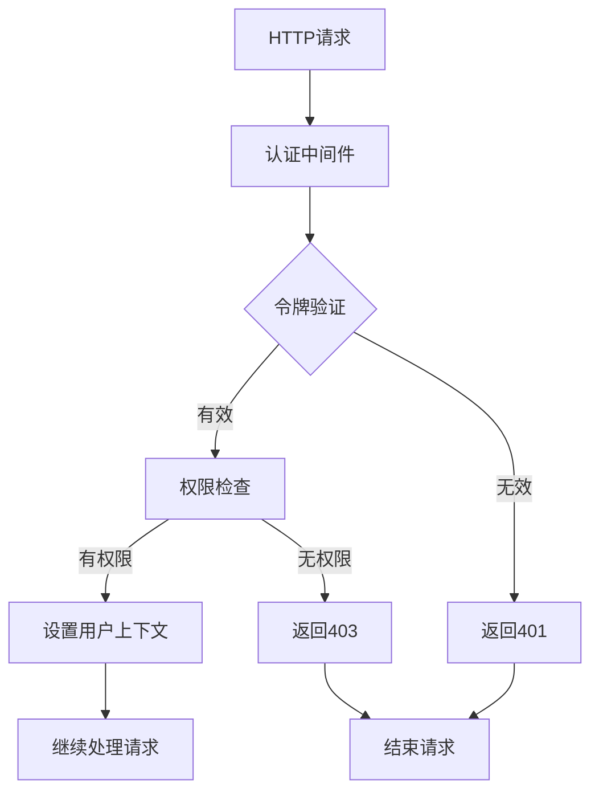

# 认证中间件设计

## 1. 需求概述

### 1.1 功能描述
认证中间件负责验证用户身份、检查访问权限、管理用户会话，确保API接口的安全访问。

### 1.2 业务价值
- **安全保障**：防止未授权访问，保护系统资源
- **用户体验**：提供无缝的身份验证体验
- **权限控制**：实现细粒度的权限管理
- **会话管理**：维护用户登录状态和会话信息

### 1.3 用户场景
- **用户登录**：验证用户凭据，生成访问令牌
- **API访问**：验证请求中的JWT令牌
- **权限检查**：验证用户是否有权限访问特定资源
- **会话续期**：自动刷新即将过期的令牌

### 1.4 功能边界
- **包含**：JWT验证、权限检查、令牌刷新、用户上下文设置
- **不包含**：用户注册、密码重置、第三方登录集成

## 2. 架构设计

### 2.1 整体架构



### 2.2 模块划分
- **JWT验证模块**：解析和验证JWT令牌
- **权限检查模块**：验证用户权限
- **用户上下文模块**：设置请求上下文中的用户信息
- **令牌刷新模块**：处理令牌自动刷新

### 2.3 数据流向
1. 从HTTP请求头中提取Authorization令牌
2. 解析JWT令牌，验证签名和有效期
3. 从令牌中提取用户信息
4. 检查用户权限（可选）
5. 将用户信息设置到请求上下文
6. 继续处理后续请求

### 2.4 技术选型
- **JWT库**：github.com/golang-jwt/jwt/v5
- **加密算法**：HS256（HMAC SHA-256）
- **存储**：内存缓存 + Redis（可选）
- **配置管理**：环境变量 + 配置文件

## 3. 详细设计

### 3.1 Router层设计
- **路由分组**：/api/v1/*
- **中间件**：认证中间件应用于需要认证的路由组
- **路径规范**：支持路径级别的权限控制
- **参数处理**：从Authorization头中提取Bearer令牌

```go
// 路由配置示例
func SetupAuthRoutes(r *gin.Engine) {
    api := r.Group("/api/v1")
    
    // 公开路由（无需认证）
    public := api.Group("/auth")
    {
        public.POST("/login", authAPI.Login)
        public.POST("/register", authAPI.Register)
    }
    
    // 需要认证的路由
    protected := api.Group("/")
    protected.Use(middleware.AuthMiddleware())
    {
        protected.GET("/profile", userAPI.GetProfile)
        protected.PUT("/profile", userAPI.UpdateProfile)
    }
    
    // 需要管理员权限的路由
    admin := api.Group("/admin")
    admin.Use(middleware.AuthMiddleware(), middleware.RequireRole("admin"))
    {
        admin.GET("/users", adminAPI.ListUsers)
    }
}
```

### 3.2 API层设计
- **接口定义**：中间件不直接提供API接口
- **请求验证**：验证Authorization头格式
- **响应格式**：统一的错误响应格式
- **错误处理**：401未认证、403无权限、500服务器错误

### 3.3 Service层设计
- **业务流程**：JWT生成、验证、刷新
- **数据处理**：用户信息提取和验证
- **依赖服务**：用户服务、权限服务
- **异常处理**：令牌过期、签名无效、用户不存在

```go
// JWT服务接口
type JWTService interface {
    GenerateToken(userID string, username string, roles []string) (string, error)
    ValidateToken(tokenString string) (*Claims, error)
    RefreshToken(tokenString string) (string, error)
    RevokeToken(tokenString string) error
}

// 权限服务接口
type PermissionService interface {
    CheckPermission(userID string, resource string, action string) bool
    GetUserRoles(userID string) ([]string, error)
    HasRole(userID string, role string) bool
}
```

### 3.4 Model层设计
- **数据模型**：JWT Claims结构体
- **数据库映射**：用户权限映射表
- **约束规则**：令牌有效期、用户状态检查
- **索引设计**：用户ID索引、角色索引

```go
// JWT Claims结构
type Claims struct {
    UserID   string   `json:"user_id"`
    Username string   `json:"username"`
    Roles    []string `json:"roles"`
    jwt.RegisteredClaims
}

// 用户权限模型
type UserPermission struct {
    ID       primitive.ObjectID `bson:"_id,omitempty" json:"id"`
    UserID   string            `bson:"user_id" json:"userId"`
    Resource string            `bson:"resource" json:"resource"`
    Actions  []string          `bson:"actions" json:"actions"`
    CreatedAt time.Time        `bson:"created_at" json:"createdAt"`
    UpdatedAt time.Time        `bson:"updated_at" json:"updatedAt"`
}
```

## 4. 数据设计

### 4.1 数据模型

#### JWT配置模型
```go
type JWTConfig struct {
    SecretKey       string        `json:"secret_key"`
    AccessTokenTTL  time.Duration `json:"access_token_ttl"`
    RefreshTokenTTL time.Duration `json:"refresh_token_ttl"`
    Issuer          string        `json:"issuer"`
    Algorithm       string        `json:"algorithm"`
}
```

#### 令牌黑名单模型
```go
type TokenBlacklist struct {
    ID        primitive.ObjectID `bson:"_id,omitempty" json:"id"`
    Token     string            `bson:"token" json:"token"`
    UserID    string            `bson:"user_id" json:"userId"`
    ExpiresAt time.Time         `bson:"expires_at" json:"expiresAt"`
    CreatedAt time.Time         `bson:"created_at" json:"createdAt"`
}
```

### 4.2 数据关系
- **用户-权限**：一对多关系
- **用户-角色**：多对多关系
- **角色-权限**：多对多关系

### 4.3 索引策略
```go
// 用户权限索引
db.user_permissions.createIndex({"user_id": 1})
db.user_permissions.createIndex({"resource": 1, "user_id": 1})

// 令牌黑名单索引
db.token_blacklist.createIndex({"token": 1}, {"unique": true})
db.token_blacklist.createIndex({"expires_at": 1}, {"expireAfterSeconds": 0})
```

### 4.4 数据迁移
- **版本1.0**：基础JWT认证
- **版本1.1**：添加权限控制
- **版本1.2**：添加令牌黑名单

## 5. 接口设计

### 5.1 中间件接口

#### AuthMiddleware - 基础认证中间件
```go
func AuthMiddleware() gin.HandlerFunc {
    return func(c *gin.Context) {
        // 获取Authorization头
        authHeader := c.GetHeader("Authorization")
        if authHeader == "" {
            c.JSON(401, gin.H{
                "code": 40001,
                "message": "缺少认证令牌",
                "timestamp": time.Now().Unix(),
            })
            c.Abort()
            return
        }

        // 解析Bearer令牌
        tokenString := strings.TrimPrefix(authHeader, "Bearer ")
        if tokenString == authHeader {
            c.JSON(401, gin.H{
                "code": 40002,
                "message": "令牌格式错误",
                "timestamp": time.Now().Unix(),
            })
            c.Abort()
            return
        }

        // 验证令牌
        claims, err := jwtService.ValidateToken(tokenString)
        if err != nil {
            c.JSON(401, gin.H{
                "code": 40003,
                "message": "令牌无效或已过期",
                "timestamp": time.Now().Unix(),
            })
            c.Abort()
            return
        }

        // 设置用户上下文
        c.Set("userID", claims.UserID)
        c.Set("username", claims.Username)
        c.Set("roles", claims.Roles)
        
        c.Next()
    }
}
```

#### OptionalAuthMiddleware - 可选认证中间件
```go
func OptionalAuthMiddleware() gin.HandlerFunc {
    return func(c *gin.Context) {
        authHeader := c.GetHeader("Authorization")
        if authHeader != "" {
            tokenString := strings.TrimPrefix(authHeader, "Bearer ")
            if claims, err := jwtService.ValidateToken(tokenString); err == nil {
                c.Set("userID", claims.UserID)
                c.Set("username", claims.Username)
                c.Set("roles", claims.Roles)
            }
        }
        c.Next()
    }
}
```

#### RequireRole - 角色权限中间件
```go
func RequireRole(requiredRole string) gin.HandlerFunc {
    return func(c *gin.Context) {
        roles, exists := c.Get("roles")
        if !exists {
            c.JSON(403, gin.H{
                "code": 40301,
                "message": "权限不足",
                "timestamp": time.Now().Unix(),
            })
            c.Abort()
            return
        }

        userRoles := roles.([]string)
        hasRole := false
        for _, role := range userRoles {
            if role == requiredRole {
                hasRole = true
                break
            }
        }

        if !hasRole {
            c.JSON(403, gin.H{
                "code": 40302,
                "message": "需要" + requiredRole + "权限",
                "timestamp": time.Now().Unix(),
            })
            c.Abort()
            return
        }

        c.Next()
    }
}
```

### 5.2 错误处理

#### 错误码定义
| 错误码 | HTTP状态码 | 错误信息 | 说明 |
|--------|------------|----------|------|
| 40001 | 401 | 缺少认证令牌 | Authorization头为空 |
| 40002 | 401 | 令牌格式错误 | 不是Bearer令牌格式 |
| 40003 | 401 | 令牌无效或已过期 | JWT验证失败 |
| 40004 | 401 | 用户不存在 | 令牌中的用户ID无效 |
| 40301 | 403 | 权限不足 | 用户无访问权限 |
| 40302 | 403 | 需要特定角色权限 | 缺少必要的角色 |
| 50001 | 500 | 认证服务异常 | JWT服务内部错误 |

### 5.3 性能要求
- **响应时间**：中间件处理时间 < 10ms
- **并发支持**：支持1000+并发请求
- **内存使用**：单个请求内存占用 < 1KB
- **CPU使用**：JWT验证CPU占用 < 1%

## 6. 安全设计

### 6.1 权限控制
- **基于角色的访问控制（RBAC）**：用户-角色-权限三层模型
- **资源级权限**：支持细粒度的资源访问控制
- **动态权限检查**：实时验证用户权限状态

### 6.2 数据安全
- **JWT签名**：使用HMAC SHA-256算法签名
- **密钥管理**：定期轮换JWT密钥
- **敏感信息**：不在JWT中存储敏感数据

### 6.3 输入验证
- **令牌格式验证**：严格验证Bearer令牌格式
- **签名验证**：验证JWT签名完整性
- **时间验证**：检查令牌有效期和时间戳

### 6.4 审计日志
```go
// 认证事件日志
type AuthEvent struct {
    EventType string    `json:"event_type"` // login, logout, access_denied
    UserID    string    `json:"user_id"`
    IP        string    `json:"ip"`
    UserAgent string    `json:"user_agent"`
    Resource  string    `json:"resource"`
    Timestamp time.Time `json:"timestamp"`
    Success   bool      `json:"success"`
    Reason    string    `json:"reason,omitempty"`
}
```

## 7. 测试设计

### 7.1 测试策略
- **单元测试**：JWT生成、验证、权限检查
- **集成测试**：中间件与路由集成
- **安全测试**：令牌伪造、权限绕过测试
- **性能测试**：高并发认证性能

### 7.2 测试用例

#### 单元测试用例
```go
func TestAuthMiddleware_ValidToken(t *testing.T) {
    // 测试有效令牌
    token, _ := jwtService.GenerateToken("user123", "testuser", []string{"user"})
    
    w := httptest.NewRecorder()
    c, _ := gin.CreateTestContext(w)
    c.Request = httptest.NewRequest("GET", "/test", nil)
    c.Request.Header.Set("Authorization", "Bearer "+token)
    
    AuthMiddleware()(c)
    
    assert.Equal(t, 200, w.Code)
    assert.Equal(t, "user123", c.GetString("userID"))
}

func TestAuthMiddleware_InvalidToken(t *testing.T) {
    // 测试无效令牌
    w := httptest.NewRecorder()
    c, _ := gin.CreateTestContext(w)
    c.Request = httptest.NewRequest("GET", "/test", nil)
    c.Request.Header.Set("Authorization", "Bearer invalid_token")
    
    AuthMiddleware()(c)
    
    assert.Equal(t, 401, w.Code)
}
```

### 7.3 性能测试
- **基准测试**：JWT验证性能基准
- **压力测试**：高并发认证压力测试
- **内存测试**：内存泄漏检测

### 7.4 安全测试
- **令牌伪造测试**：尝试伪造JWT令牌
- **权限绕过测试**：尝试绕过权限检查
- **时间攻击测试**：令牌时间相关攻击

## 8. 部署和运维

### 8.1 部署方案
- **配置管理**：通过环境变量配置JWT密钥
- **密钥轮换**：支持热更新JWT密钥
- **高可用**：支持多实例部署

### 8.2 监控指标
```go
// 认证指标
type AuthMetrics struct {
    TotalRequests     int64 `json:"total_requests"`
    SuccessfulAuths   int64 `json:"successful_auths"`
    FailedAuths       int64 `json:"failed_auths"`
    TokenValidations  int64 `json:"token_validations"`
    PermissionChecks  int64 `json:"permission_checks"`
    AverageLatency    int64 `json:"average_latency_ms"`
}
```

### 8.3 日志策略
- **结构化日志**：使用JSON格式记录认证事件
- **日志级别**：INFO（成功认证）、WARN（认证失败）、ERROR（系统错误）
- **日志轮转**：按日期和大小轮转日志文件

### 8.4 故障处理
- **JWT密钥泄露**：立即轮换密钥，撤销所有令牌
- **认证服务异常**：降级到基础认证模式
- **性能问题**：启用令牌缓存，减少验证开销

## 9. 风险评估

### 9.1 技术风险
- **JWT密钥泄露**：定期轮换密钥，使用强随机密钥
- **令牌劫持**：使用HTTPS传输，设置合理的过期时间
- **性能瓶颈**：实现令牌缓存，优化验证算法

### 9.2 业务风险
- **权限配置错误**：实现权限配置审核机制
- **用户锁定**：提供紧急解锁机制
- **会话管理**：实现会话超时和强制登出

### 9.3 安全风险
- **暴力破解**：实现登录频率限制
- **权限提升**：严格验证权限变更
- **会话固定**：每次登录生成新的会话ID

## 10. 实施计划

### 10.1 开发阶段
- **第1周**：基础JWT认证中间件开发
- **第2周**：权限检查和角色管理
- **第3周**：令牌刷新和黑名单机制
- **第4周**：测试和性能优化

### 10.2 测试阶段
- **单元测试**：覆盖率 > 90%
- **集成测试**：与现有系统集成测试
- **安全测试**：渗透测试和安全审计
- **性能测试**：压力测试和性能调优

### 10.3 上线计划
- **灰度发布**：先在测试环境验证
- **分批上线**：按模块逐步启用认证
- **监控告警**：实时监控认证成功率
- **回滚方案**：准备快速回滚机制

### 10.4 后续优化
- **性能优化**：基于监控数据优化性能
- **功能增强**：支持多因子认证
- **安全加固**：定期安全审计和加固
- **用户体验**：优化认证流程和错误提示