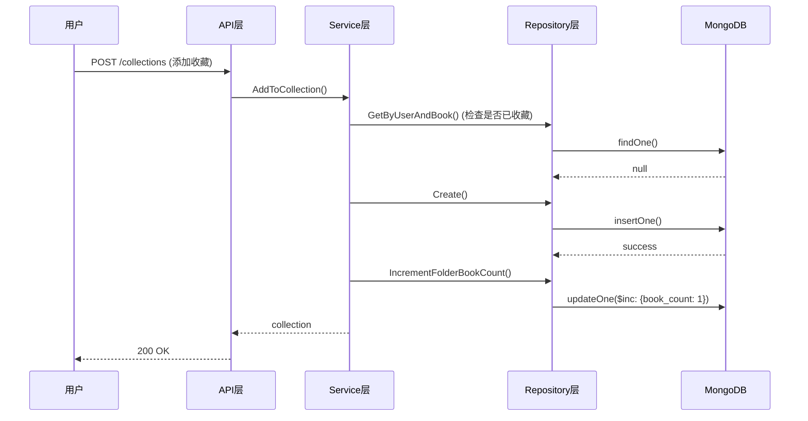

# 收藏系统设计文档

**版本**: v1.0  
**创建日期**: 2025-10-25  
**最后更新**: 2025-10-25

---

## 一、系统背景

### 1.1 设计目标

实现独立的收藏系统，与书架功能分离，支持：
- 收藏书籍管理（添加、取消、更新）
- 收藏夹分类管理
- 标签组织
- 收藏分享（公开收藏）

### 1.2 功能区分

| 功能 | 书架（Bookshelf） | 收藏（Collection） |
|-----|------------------|-------------------|
| 用途 | 正在阅读/计划阅读 | 喜欢的书籍 |
| 进度追踪 | ✅ 有 | ❌ 无 |
| 分类管理 | ❌ 简单（未读完/已读完） | ✅ 收藏夹+标签 |
| 笔记 | ❌ 无 | ✅ 有 |
| 分享 | ❌ 私有 | ✅ 可公开 |
| 数据量 | 小（几十本） | 大（数百本） |

---

## 二、数据模型设计

### 2.1 收藏记录（Collection）

```go
type Collection struct {
    ID        primitive.ObjectID `bson:"_id,omitempty" json:"id"`
    UserID    string             `bson:"user_id" json:"user_id"`
    BookID    string             `bson:"book_id" json:"book_id"`
    FolderID  string             `bson:"folder_id,omitempty" json:"folder_id,omitempty"`
    Tags      []string           `bson:"tags" json:"tags"`
    Note      string             `bson:"note" json:"note"`
    IsPublic  bool               `bson:"is_public" json:"is_public"`
    CreatedAt time.Time          `bson:"created_at" json:"created_at"`
    UpdatedAt time.Time          `bson:"updated_at" json:"updated_at"`
}
```

**字段说明**：

| 字段 | 类型 | 说明 |
|-----|------|------|
| `ID` | ObjectID | 收藏记录ID |
| `UserID` | string | 用户ID |
| `BookID` | string | 书籍ID |
| `FolderID` | string | 收藏夹ID（可选） |
| `Tags` | []string | 标签列表 |
| `Note` | string | 收藏笔记（最多500字） |
| `IsPublic` | bool | 是否公开（分享） |
| `CreatedAt` | time.Time | 收藏时间 |
| `UpdatedAt` | time.Time | 更新时间 |

### 2.2 收藏夹（CollectionFolder）

```go
type CollectionFolder struct {
    ID          primitive.ObjectID `bson:"_id,omitempty" json:"id"`
    UserID      string             `bson:"user_id" json:"user_id"`
    Name        string             `bson:"name" json:"name"`
    Description string             `bson:"description" json:"description"`
    BookCount   int                `bson:"book_count" json:"book_count"`
    IsPublic    bool               `bson:"is_public" json:"is_public"`
    CreatedAt   time.Time          `bson:"created_at" json:"created_at"`
    UpdatedAt   time.Time          `bson:"updated_at" json:"updated_at"`
}
```

**字段说明**：

| 字段 | 类型 | 说明 |
|-----|------|------|
| `ID` | ObjectID | 收藏夹ID |
| `UserID` | string | 用户ID |
| `Name` | string | 收藏夹名称（1-50字） |
| `Description` | string | 收藏夹描述（最多200字） |
| `BookCount` | int | 收藏书籍数量 |
| `IsPublic` | bool | 是否公开 |
| `CreatedAt` | time.Time | 创建时间 |
| `UpdatedAt` | time.Time | 更新时间 |

---

## 三、MongoDB索引设计

### 3.1 Collection集合索引

```javascript
// 1. 防重索引：用户不能重复收藏同一本书
db.collections.createIndex(
  { user_id: 1, book_id: 1 },
  { unique: true }
)

// 2. 用户收藏列表查询（按收藏时间排序）
db.collections.createIndex(
  { user_id: 1, created_at: -1 }
)

// 3. 收藏夹下的收藏查询
db.collections.createIndex(
  { user_id: 1, folder_id: 1, created_at: -1 }
)

// 4. 公开收藏查询
db.collections.createIndex(
  { is_public: 1, created_at: -1 }
)

// 5. 标签查询
db.collections.createIndex(
  { user_id: 1, tags: 1 }
)
```

### 3.2 CollectionFolder集合索引

```javascript
// 1. 用户收藏夹列表
db.collection_folders.createIndex(
  { user_id: 1, created_at: -1 }
)

// 2. 公开收藏夹查询
db.collection_folders.createIndex(
  { is_public: 1, book_count: -1 }
)
```

---

## 四、Repository层设计

### 4.1 接口定义

**文件**: `repository/interfaces/reading/collection_repository.go`

```go
type CollectionRepository interface {
    // ========== 收藏管理 ==========
    // Create 创建收藏
    Create(ctx context.Context, collection *Collection) error
    
    // GetByID 根据ID获取收藏
    GetByID(ctx context.Context, id string) (*Collection, error)
    
    // GetByUserAndBook 根据用户ID和书籍ID获取收藏
    GetByUserAndBook(ctx context.Context, userID, bookID string) (*Collection, error)
    
    // GetCollectionsByUser 获取用户的收藏列表
    GetCollectionsByUser(ctx context.Context, userID string, folderID string, page, size int) ([]*Collection, int64, error)
    
    // GetCollectionsByTag 根据标签获取收藏
    GetCollectionsByTag(ctx context.Context, userID string, tag string, page, size int) ([]*Collection, int64, error)
    
    // Update 更新收藏
    Update(ctx context.Context, id string, updates map[string]interface{}) error
    
    // Delete 删除收藏
    Delete(ctx context.Context, id string) error
    
    // ========== 收藏夹管理 ==========
    // CreateFolder 创建收藏夹
    CreateFolder(ctx context.Context, folder *CollectionFolder) error
    
    // GetFolderByID 根据ID获取收藏夹
    GetFolderByID(ctx context.Context, id string) (*CollectionFolder, error)
    
    // GetFoldersByUser 获取用户的收藏夹列表
    GetFoldersByUser(ctx context.Context, userID string) ([]*CollectionFolder, error)
    
    // UpdateFolder 更新收藏夹
    UpdateFolder(ctx context.Context, id string, updates map[string]interface{}) error
    
    // DeleteFolder 删除收藏夹
    DeleteFolder(ctx context.Context, id string) error
    
    // IncrementFolderBookCount 增加收藏夹书籍数量
    IncrementFolderBookCount(ctx context.Context, folderID string) error
    
    // DecrementFolderBookCount 减少收藏夹书籍数量
    DecrementFolderBookCount(ctx context.Context, folderID string) error
    
    // ========== 公开收藏 ==========
    // GetPublicCollections 获取公开收藏列表
    GetPublicCollections(ctx context.Context, page, size int) ([]*Collection, int64, error)
    
    // GetPublicFolders 获取公开收藏夹列表
    GetPublicFolders(ctx context.Context, page, size int) ([]*CollectionFolder, int64, error)
    
    // ========== 统计 ==========
    // CountUserCollections 统计用户收藏数
    CountUserCollections(ctx context.Context, userID string) (int64, error)
    
    // Health 健康检查
    Health(ctx context.Context) error
}
```

### 4.2 MongoDB实现要点

**文件**: `repository/mongodb/reading/collection_repository_mongo.go`

**关键功能**：

1. **防重机制**: 利用MongoDB唯一索引`{user_id, book_id}`防止重复收藏
2. **收藏夹计数**: 添加/删除收藏时自动更新收藏夹`book_count`
3. **软删除**: 删除收藏不物理删除，标记`deleted_at`字段
4. **批量查询**: 支持按收藏夹、标签过滤

---

## 五、Service层设计

### 5.1 接口定义

**文件**: `service/reading/collection_service.go`

```go
type CollectionService interface {
    // ========== 收藏管理 ==========
    // AddToCollection 添加收藏
    AddToCollection(ctx context.Context, userID, bookID, folderID, note string, tags []string) (*Collection, error)
    
    // RemoveFromCollection 取消收藏
    RemoveFromCollection(ctx context.Context, userID, collectionID string) error
    
    // UpdateCollection 更新收藏
    UpdateCollection(ctx context.Context, userID, collectionID string, updates map[string]interface{}) error
    
    // GetUserCollections 获取用户收藏列表
    GetUserCollections(ctx context.Context, userID, folderID string, page, size int) ([]*Collection, int64, error)
    
    // GetCollectionsByTag 根据标签获取收藏
    GetCollectionsByTag(ctx context.Context, userID, tag string, page, size int) ([]*Collection, int64, error)
    
    // IsCollected 检查是否已收藏
    IsCollected(ctx context.Context, userID, bookID string) (bool, error)
    
    // ========== 收藏夹管理 ==========
    // CreateFolder 创建收藏夹
    CreateFolder(ctx context.Context, userID, name, description string, isPublic bool) (*CollectionFolder, error)
    
    // GetUserFolders 获取用户收藏夹列表
    GetUserFolders(ctx context.Context, userID string) ([]*CollectionFolder, error)
    
    // UpdateFolder 更新收藏夹
    UpdateFolder(ctx context.Context, userID, folderID string, updates map[string]interface{}) error
    
    // DeleteFolder 删除收藏夹
    DeleteFolder(ctx context.Context, userID, folderID string) error
    
    // ========== 收藏分享 ==========
    // ShareCollection 分享收藏
    ShareCollection(ctx context.Context, userID, collectionID string) error
    
    // UnshareCollection 取消分享
    UnshareCollection(ctx context.Context, userID, collectionID string) error
    
    // GetPublicCollections 获取公开收藏列表
    GetPublicCollections(ctx context.Context, page, size int) ([]*Collection, int64, error)
    
    // ========== 统计 ==========
    // GetUserCollectionStats 获取用户收藏统计
    GetUserCollectionStats(ctx context.Context, userID string) (map[string]interface{}, error)
}
```

### 5.2 业务逻辑

**核心功能**：

1. **参数验证**
   - 收藏夹名称：1-50字
   - 笔记：最多500字
   - 标签：最多10个，每个最多20字

2. **权限控制**
   - 只能管理自己的收藏和收藏夹
   - 删除收藏夹时检查是否有收藏

3. **事件发布**
   - `CollectionAddedEvent` - 添加收藏
   - `CollectionRemovedEvent` - 取消收藏
   - `FolderCreatedEvent` - 创建收藏夹

4. **关联操作**
   - 添加收藏时更新收藏夹计数
   - 删除收藏时更新收藏夹计数
   - 删除收藏夹时移除收藏的folder_id

---

## 六、API层设计

### 6.1 API端点

**文件**: `api/v1/reader/collection_api.go`

#### 收藏管理

```
POST   /api/v1/reader/collections         - 添加收藏
GET    /api/v1/reader/collections         - 获取收藏列表
GET    /api/v1/reader/collections/:id     - 获取收藏详情
PUT    /api/v1/reader/collections/:id     - 更新收藏
DELETE /api/v1/reader/collections/:id     - 取消收藏

GET    /api/v1/reader/collections/check/:bookId - 检查是否已收藏
GET    /api/v1/reader/collections/tags/:tag     - 根据标签获取收藏
```

#### 收藏夹管理

```
POST   /api/v1/reader/collections/folders        - 创建收藏夹
GET    /api/v1/reader/collections/folders        - 获取收藏夹列表
GET    /api/v1/reader/collections/folders/:id    - 获取收藏夹详情
PUT    /api/v1/reader/collections/folders/:id    - 更新收藏夹
DELETE /api/v1/reader/collections/folders/:id    - 删除收藏夹
```

#### 公开收藏

```
GET    /api/v1/reader/collections/public         - 获取公开收藏列表
POST   /api/v1/reader/collections/:id/share      - 分享收藏
DELETE /api/v1/reader/collections/:id/share      - 取消分享

GET    /api/v1/reader/collections/folders/public - 获取公开收藏夹列表
```

#### 统计

```
GET    /api/v1/reader/collections/stats          - 获取收藏统计
```

### 6.2 请求/响应示例

#### 添加收藏

**请求**:
```http
POST /api/v1/reader/collections
Authorization: Bearer <token>
Content-Type: application/json

{
  "book_id": "507f1f77bcf86cd799439011",
  "folder_id": "507f1f77bcf86cd799439012",
  "note": "这本书太好了，强烈推荐！",
  "tags": ["玄幻", "热血", "推荐"],
  "is_public": true
}
```

**响应**:
```json
{
  "code": 200,
  "message": "添加收藏成功",
  "data": {
    "id": "507f1f77bcf86cd799439013",
    "user_id": "507f1f77bcf86cd799439010",
    "book_id": "507f1f77bcf86cd799439011",
    "folder_id": "507f1f77bcf86cd799439012",
    "note": "这本书太好了，强烈推荐！",
    "tags": ["玄幻", "热血", "推荐"],
    "is_public": true,
    "created_at": "2025-10-25T10:30:00Z",
    "updated_at": "2025-10-25T10:30:00Z"
  }
}
```

#### 创建收藏夹

**请求**:
```http
POST /api/v1/reader/collections/folders
Authorization: Bearer <token>
Content-Type: application/json

{
  "name": "我的最爱",
  "description": "收藏的经典作品",
  "is_public": true
}
```

**响应**:
```json
{
  "code": 200,
  "message": "创建收藏夹成功",
  "data": {
    "id": "507f1f77bcf86cd799439012",
    "user_id": "507f1f77bcf86cd799439010",
    "name": "我的最爱",
    "description": "收藏的经典作品",
    "book_count": 0,
    "is_public": true,
    "created_at": "2025-10-25T10:25:00Z",
    "updated_at": "2025-10-25T10:25:00Z"
  }
}
```

---

## 七、使用场景

### 7.1 基础收藏流程



### 7.2 收藏夹管理流程

1. **创建收藏夹**: 用户创建收藏夹 "我的最爱"
2. **添加收藏**: 将书籍添加到收藏夹，`book_count++`
3. **更新收藏**: 修改收藏笔记、标签
4. **取消收藏**: 从收藏夹移除，`book_count--`
5. **删除收藏夹**: 清空收藏夹后删除

### 7.3 分享流程

1. **设置公开**: 用户将收藏设置为`is_public=true`
2. **生成分享链接**: `/collections/public?user=xxx&folder=xxx`
3. **浏览公开收藏**: 其他用户访问公开收藏列表
4. **取消分享**: 设置`is_public=false`

---

## 八、性能优化

### 8.1 查询优化

- **索引覆盖**: 使用复合索引加速查询
- **分页查询**: 限制每页最多100条
- **计数缓存**: 收藏夹`book_count`冗余字段避免COUNT查询

### 8.2 缓存策略（Redis）

```
# 用户收藏夹列表（1小时）
Key: collection:folders:{user_id}
Value: JSON数组

# 用户收藏数统计（1小时）
Key: collection:count:{user_id}
Value: 数字

# 公开收藏列表（10分钟）
Key: collection:public:page:{page}
Value: JSON数组
```

---

## 九、安全性设计

### 9.1 权限控制

- ✅ 只能管理自己的收藏和收藏夹
- ✅ 删除收藏夹时检查是否为空
- ✅ 公开收藏可被所有人查看（只读）

### 9.2 参数验证

```go
// 收藏夹名称
Name: min=1, max=50

// 收藏夹描述
Description: max=200

// 收藏笔记
Note: max=500

// 标签
Tags: max=10, each tag max=20
```

---

## 十、测试计划

### 10.1 单元测试

**Repository层**:
- 创建收藏（成功/重复）
- 查询收藏（按用户/收藏夹/标签）
- 更新收藏
- 删除收藏
- 收藏夹CRUD
- 收藏夹计数正确性

**Service层**:
- 添加收藏（参数验证/权限控制）
- 收藏夹管理
- 分享功能
- 统计计算

### 10.2 集成测试

- 完整收藏流程（添加→更新→删除）
- 收藏夹管理流程
- 并发收藏冲突处理
- 分享功能测试

---

## 十一、已知限制和后续优化

### 11.1 当前限制

1. **无缓存**: 暂未实现Redis缓存
2. **无全文搜索**: 笔记和标签不支持全文搜索
3. **无批量操作**: 不支持批量添加/删除收藏

### 11.2 后续优化

1. **Redis缓存接入**（P1）
2. **全文搜索**（P2）- 使用Elasticsearch
3. **批量操作**（P2）
4. **收藏统计**（P2）- 收藏热度排行
5. **推荐算法**（P3）- 基于收藏的推荐

---

## 十二、参考资料

- **架构规范**: `doc/architecture/架构设计规范.md`
- **Repository规范**: `doc/architecture/repository层设计规范.md`
- **API规范**: `doc/api/API设计规范.md`

---

**最后更新**: 2025-10-25  
**维护者**: 青羽后端架构团队

