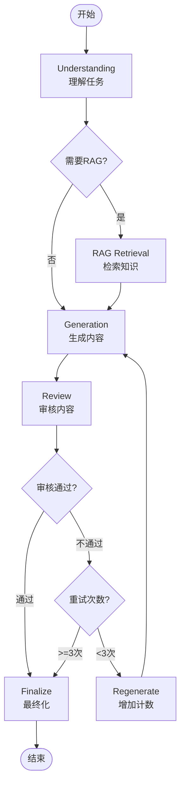

# Quick Start Guide - Phase 3 Agent MVP

**目标**: 快速启动和测试Creative Agent工作流

---

## 前置要求

1. **Python 3.11+**
2. **Go Backend** 运行在 `http://localhost:8080`
3. **OpenAI API Key** 或兼容的LLM服务

---

## 步骤1：安装依赖

```bash
cd python_ai_service

# 使用Poetry（推荐）
poetry install

# 或使用pip
pip install -r requirements.txt
```

---

## 步骤2：配置环境变量

```bash
# 创建.env文件
cp .env.example .env

# 编辑.env，配置必要参数
cat > .env << EOF
# OpenAI配置
OPENAI_API_KEY=sk-your-api-key-here
OPENAI_BASE_URL=https://api.openai.com/v1
DEFAULT_LLM_MODEL=gpt-4-turbo-preview

# Go Backend配置
GO_BACKEND_URL=http://localhost:8080
GO_BACKEND_GRPC_URL=localhost:50052

# 服务配置
GRPC_PORT=50052
REST_PORT=8000

# 日志配置
LOG_LEVEL=INFO
DEBUG=false
EOF
```

---

## 步骤3：测试Agent服务

### Python直接调用

创建测试脚本 `test_agent.py`:

```python
import asyncio
from services.agent_service import AgentService

async def main():
    # 初始化服务
    agent_service = AgentService()
    await agent_service.initialize()
    
    # 执行创作任务
    result = await agent_service.execute(
        agent_type="creative",
        task="续写一段武侠小说，描述主角李逍遥初遇赵灵儿的场景，风格要古典优美",
        context={
            "constraints": {
                "字数": 500,
                "风格": "武侠",
                "类型": "续写"
            }
        },
        tools=["rag_tool"],  # 可选："character_tool", "outline_tool"
        user_id="test-user-001",
        project_id="test-project-001",
    )
    
    # 打印结果
    print("=" * 80)
    print("生成内容:")
    print("=" * 80)
    print(result.output)
    print("\n" + "=" * 80)
    print("元数据:")
    print("=" * 80)
    print(f"状态: {result.status}")
    print(f"Token使用: {result.metadata.get('tokens_used', 0)}")
    print(f"重试次数: {result.metadata.get('retry_count', 0)}")
    print(f"审核分数: {result.metadata.get('review_score', 0)}")
    print(f"推理步骤: {len(result.reasoning)}")
    
    # 关闭服务
    await agent_service.close()

if __name__ == "__main__":
    asyncio.run(main())
```

运行测试：

```bash
python test_agent.py
```

---

## 步骤4：启动gRPC服务

```bash
# 启动Python AI服务
python -m src.main

# 或使用uvicorn
uvicorn src.main:app --host 0.0.0.0 --port 8000 --reload
```

服务将监听：
- **gRPC**: `0.0.0.0:50052`
- **REST API**: `http://0.0.0.0:8000`
- **API文档**: `http://localhost:8000/docs`

---

## 步骤5：从Go调用Agent

在Go后端中调用Python Agent：

```go
package main

import (
    "context"
    "log"
    
    pb "your-project/pkg/grpc/ai_service"
    "google.golang.org/grpc"
)

func main() {
    // 连接Python AI服务
    conn, err := grpc.Dial("localhost:50052", grpc.WithInsecure())
    if err != nil {
        log.Fatal(err)
    }
    defer conn.Close()
    
    client := pb.NewAIServiceClient(conn)
    
    // 调用ExecuteAgent
    resp, err := client.ExecuteAgent(context.Background(), &pb.AgentExecutionRequest{
        WorkflowType: "creative",
        Task: "续写一段武侠小说场景",
        Context: `{"constraints": {"字数": 500, "风格": "武侠"}}`,
        Tools: []string{"rag_tool"},
        UserId: "user-123",
        ProjectId: "proj-456",
    })
    
    if err != nil {
        log.Fatal(err)
    }
    
    log.Printf("执行状态: %s", resp.Status)
    log.Printf("生成内容: %s", resp.Result)
    log.Printf("Token使用: %d", resp.TokensUsed)
}
```

---

## 步骤6：验证健康状态

### REST API检查

```bash
# 健康检查
curl http://localhost:8000/api/v1/health

# Agent服务健康检查
curl http://localhost:8000/api/v1/agents/health
```

### gRPC检查

使用`grpcurl`工具：

```bash
# 列出服务
grpcurl -plaintext localhost:50052 list

# 调用健康检查
grpcurl -plaintext localhost:50052 ai_service.AIService/HealthCheck
```

---

## 常见问题

### Q1: ImportError: No module named 'langchain'

**解决**: 安装LangChain依赖

```bash
pip install langchain langchain-core langchain-openai langgraph
```

### Q2: OpenAI API调用失败

**检查**:
1. API Key是否正确
2. BASE_URL是否配置
3. 网络连接是否正常

### Q3: Go API客户端连接失败

**检查**:
1. Go Backend是否运行
2. URL配置是否正确：`http://localhost:8080`
3. 端口是否被占用

### Q4: RAG检索返回空结果

**说明**: 
- RAG系统需要预先索引数据
- 如果项目中没有设定数据，RAG会跳过
- 不影响Agent核心流程

---

## 工作流可视化

Creative Agent工作流程：



---

## 下一步

1. **集成测试**: 编写完整的测试用例
2. **性能优化**: 调整LLM参数和超时设置
3. **扩展工具**: 添加LocationTool、TimelineTool
4. **工作流扩展**: 实现OutlineAgent、A2A Pipeline

---

**更新时间**: 2025-10-28  
**版本**: MVP v1.0

