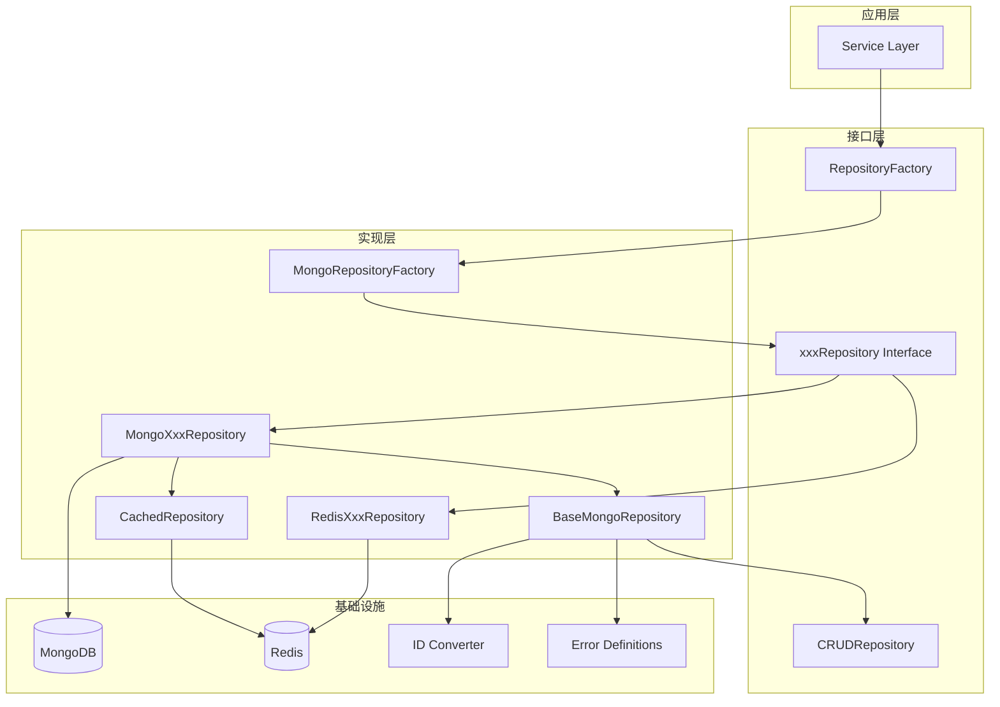
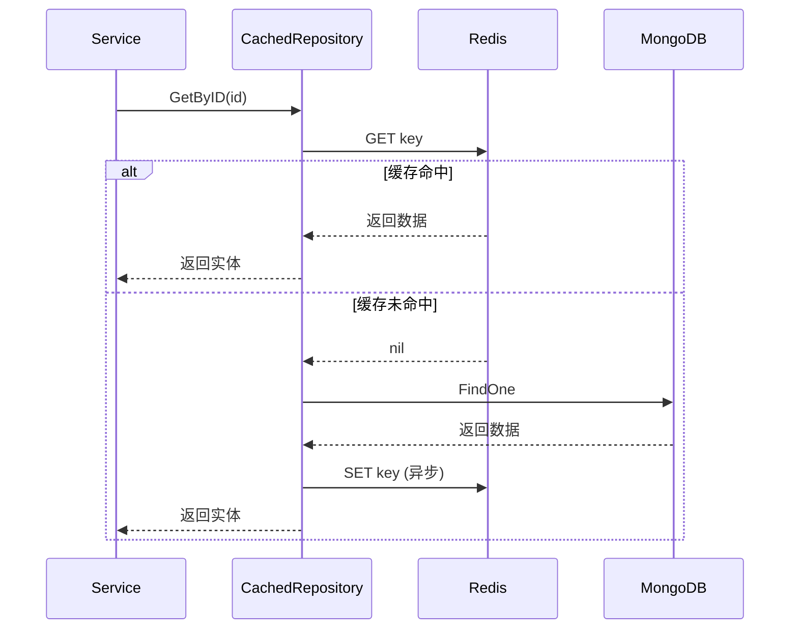
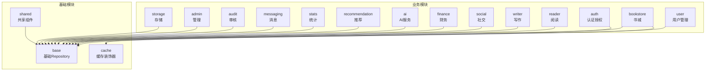

# Repository 层架构设计文档

## 概述

Repository 层是 Qingyu 后端架构中的数据访问层，负责封装所有数据库操作，为上层 Service 提供统一的数据访问接口。本层采用接口-实现分离的设计模式，支持多种数据源（MongoDB、Redis）和缓存策略。

## 设计理念

### 核心原则

1. **接口隔离**: 所有 Repository 接口定义在 `interfaces/` 目录，实现类在 `mongodb/`、`redis/` 等目录
2. **依赖倒置**: Service 层依赖接口而非具体实现，便于测试和替换数据源
3. **单一职责**: 每个 Repository 只负责一种实体的数据操作
4. **代码复用**: 通过 `BaseMongoRepository` 提供通用的 CRUD 操作

### 分层架构



## 模块结构详解

### 1. 接口层 (interfaces/)

接口层定义了所有 Repository 的契约，按业务领域划分子目录。

#### 1.1 目录划分

| 目录 | 职责 | 主要接口 |
|------|------|----------|
| `admin/` | 管理后台 | AuditRepository, AdminLogRepository |
| `ai/` | AI 服务 | QuotaRepository |
| `audit/` | 内容审核 | SensitiveWordRepository, AuditRecordRepository |
| `auth/` | 认证授权 | RoleRepository, OAuthRepository, PermissionRepository |
| `bookstore/` | 书城功能 | BookRepository, ChapterRepository, CategoryRepository |
| `finance/` | 财务相关 | WalletRepository, MembershipRepository |
| `infrastructure/` | 基础接口 | CRUDRepository, Filter, Pagination |
| `messaging/` | 消息系统 | MessageRepository, AnnouncementRepository |
| `notification/` | 通知推送 | NotificationRepository |
| `reader/` | 阅读功能 | ReadingProgressRepository, BookmarkRepository |
| `recommendation/` | 推荐系统 | BehaviorRepository, ProfileRepository |
| `social/` | 社交功能 | FollowRepository, LikeRepository, BookListRepository |
| `stats/` | 统计分析 | ChapterStatsRepository, BookStatsRepository |
| `storage/` | 文件存储 | StorageRepository |
| `user/` | 用户管理 | UserRepository |
| `writer/` | 写作功能 | ProjectRepository, DocumentRepository, CharacterRepository |

#### 1.2 基础接口设计

```go
// CRUDRepository - 通用 CRUD 接口
type CRUDRepository[T any, ID comparable] interface {
    Create(ctx context.Context, entity T) error
    GetByID(ctx context.Context, id ID) (T, error)
    Update(ctx context.Context, id ID, updates map[string]interface{}) error
    Delete(ctx context.Context, id ID) error
    List(ctx context.Context, filter Filter) ([]T, error)
    Count(ctx context.Context, filter Filter) (int64, error)
    Exists(ctx context.Context, id ID) (bool, error)
}

// BatchRepository - 批量操作接口
type BatchRepository[T any, ID comparable] interface {
    BatchCreate(ctx context.Context, entities []T) error
    BatchUpdate(ctx context.Context, ids []ID, updates map[string]interface{}) error
    BatchDelete(ctx context.Context, ids []ID) error
}
```

#### 1.3 工厂接口

`RepositoryFactory` 定义了创建所有 Repository 实例的方法：

```go
type RepositoryFactory interface {
    // 用户相关
    CreateUserRepository() UserRepository
    CreateRoleRepository() RoleRepository

    // 书城相关
    CreateBookRepository() BookRepository
    CreateCategoryRepository() CategoryRepository
    // ... 更多方法

    // 基础设施方法
    Health(ctx context.Context) error
    Close() error
    GetDatabaseType() string
    GetDatabase() *mongo.Database
}
```

### 2. 实现层 (mongodb/)

#### 2.1 BaseMongoRepository

基类提供通用的 ID 转换和 CRUD 方法：

```go
type BaseMongoRepository struct {
    db         *mongo.Database
    collection *mongo.Collection
}

// ID 转换方法
func (b *BaseMongoRepository) ParseID(id string) (primitive.ObjectID, error)
func (b *BaseMongoRepository) ParseIDs(ids []string) ([]primitive.ObjectID, error)
func (b *BaseMongoRepository) IDToHex(id primitive.ObjectID) string
func (b *BaseMongoRepository) IDsToHex(ids []primitive.ObjectID) []string
func (b *BaseMongoRepository) IsValidID(id string) bool
func (b *BaseMongoRepository) GenerateID() string

// 通用 CRUD 方法
func (b *BaseMongoRepository) FindByID(ctx context.Context, id string, result interface{}) error
func (b *BaseMongoRepository) UpdateByID(ctx context.Context, id string, update bson.M) error
func (b *BaseMongoRepository) DeleteByID(ctx context.Context, id string) error
func (b *BaseMongoRepository) Create(ctx context.Context, document interface{}) error
func (b *BaseMongoRepository) Find(ctx context.Context, filter bson.M, results interface{}, opts ...*options.FindOptions) error
func (b *BaseMongoRepository) Count(ctx context.Context, filter bson.M) (int64, error)
func (b *BaseMongoRepository) Exists(ctx context.Context, id string) (bool, error)
```

#### 2.2 实现类结构

每个实现类通过嵌入 `BaseMongoRepository` 继承基础能力：

```go
type MongoBookRepository struct {
    *BaseMongoRepository
    client *mongo.Client
}

func NewMongoBookRepository(client *mongo.Client, dbName string) *MongoBookRepository {
    db := client.Database(dbName)
    return &MongoBookRepository{
        BaseMongoRepository: NewBaseMongoRepository(db, "books"),
        client:              client,
    }
}
```

#### 2.3 MongoRepositoryFactory

工厂类负责创建所有 MongoDB Repository 实例：

```go
type MongoRepositoryFactory struct {
    client   *mongo.Client
    db       *mongo.Database
    database *mongo.Database
    config   *config.MongoDBConfig
}

// 创建工厂
func NewMongoRepositoryFactory(config *config.MongoDBConfig) (*MongoRepositoryFactory, error)
func NewMongoRepositoryFactoryWithClient(client *mongo.Client, db *mongo.Database) *MongoRepositoryFactory

// 创建各个 Repository（示例）
func (f *MongoRepositoryFactory) CreateUserRepository() UserRepository
func (f *MongoRepositoryFactory) CreateBookRepository() BookRepository
// ... 更多方法
```

### 3. 缓存层 (cache/)

#### 3.1 CachedRepository

使用装饰器模式为 Repository 添加缓存能力：

```go
type CachedRepository[T Cacheable] struct {
    base    Repository[T]
    client  *redis.Client
    ttl     time.Duration
    prefix  string
    enabled bool
    breaker *gobreaker.CircuitBreaker
    config  *CacheConfig
}
```

#### 3.2 缓存策略



#### 3.3 缓存特性

| 特性 | 说明 |
|------|------|
| **双删策略** | 更新/删除时延迟二次删除缓存，防止脏读 |
| **空值缓存** | 缓存不存在的记录，防止缓存穿透 |
| **熔断降级** | Redis 故障时自动降级到直连数据库 |
| **指标收集** | 记录缓存命中率、操作延迟等指标 |

#### 3.4 缓存配置

```go
type CacheConfig struct {
    Enabled           bool               // 总开关
    DoubleDeleteDelay time.Duration      // 双删策略延迟（默认 1s）
    NullCacheTTL      time.Duration      // 空值缓存 TTL（默认 30s）
    NullCachePrefix   string             // 空值缓存前缀（默认 "@@NULL@@"）
    BreakerSettings   gobreaker.Settings // 熔断器设置
}
```

### 4. ID 转换工具 (id_converter.go)

提供 string ID 与 MongoDB ObjectID 之间的转换：

```go
// 统一 ID 解析函数（推荐使用）
func ParseID(id string) (primitive.ObjectID, error)        // 必需 ID，空字符串报错
func ParseOptionalID(id string) (*primitive.ObjectID, error) // 可选 ID，空字符串返回 nil
func ParseIDs(ids []string) ([]primitive.ObjectID, error)    // 批量解析
func ParseOptionalIDs(ids []string) ([]primitive.ObjectID, error) // 批量可选解析

// 兼容旧代码的转换函数
func StringToObjectId(id string) (primitive.ObjectID, error)
func ObjectIdToString(id primitive.ObjectID) string
func StringSliceToObjectIDSlice(ids []string) ([]primitive.ObjectID, error)
func ObjectIDSliceToStringSlice(ids []primitive.ObjectID) []string

// 错误判断
func IsIDError(err error) bool
```

### 5. 错误定义 (errors.go)

```go
var (
    ErrEmptyID         = errors.New("ID cannot be empty")
    ErrInvalidIDFormat = errors.New("invalid ID format")
)
```

### 6. 查询构建器 (querybuilder/)

用于构建复杂的 MongoDB 查询条件：

```go
type MongoQueryBuilder struct {
    filter bson.M
    sort   bson.D
    skip   int64
    limit  int64
}

func NewMongoQueryBuilder() *MongoQueryBuilder
func (b *MongoQueryBuilder) Where(field string, value interface{}) *MongoQueryBuilder
func (b *MongoQueryBuilder) In(field string, values ...interface{}) *MongoQueryBuilder
func (b *MongoQueryBuilder) Sort(field string, ascending bool) *MongoQueryBuilder
func (b *MongoQueryBuilder) Paginate(page, pageSize int) *MongoQueryBuilder
func (b *MongoQueryBuilder) Build() (bson.M, *options.FindOptions)
```

## 模块间依赖关系



## 使用示例

### 1. 创建 Repository 实例

```go
// 通过工厂创建
factory, err := mongodb.NewMongoRepositoryFactory(config)
if err != nil {
    return err
}

bookRepo := factory.CreateBookRepository()
userRepo := factory.CreateUserRepository()
```

### 2. 实现新的 Repository

```go
// 1. 定义接口 (interfaces/mydomain/entity_repository.go)
type EntityRepository interface {
    GetByID(ctx context.Context, id string) (*Entity, error)
    Create(ctx context.Context, entity *Entity) error
    // ... 其他方法
}

// 2. 实现类 (mongodb/mydomain/entity_repository_mongo.go)
type MongoEntityRepository struct {
    *base.BaseMongoRepository
}

func NewMongoEntityRepository(db *mongo.Database) *MongoEntityRepository {
    return &MongoEntityRepository{
        BaseMongoRepository: base.NewBaseMongoRepository(db, "entities"),
    }
}

func (r *MongoEntityRepository) GetByID(ctx context.Context, id string) (*Entity, error) {
    var entity Entity
    err := r.FindByID(ctx, id, &entity)
    if err != nil {
        return nil, err
    }
    return &entity, nil
}

// 3. 添加到工厂 (mongodb/factory.go)
func (f *MongoRepositoryFactory) CreateEntityRepository() EntityRepository {
    return NewMongoEntityRepository(f.database)
}
```

### 3. 使用缓存装饰器

```go
// 创建基础 Repository
baseRepo := NewMongoBookRepository(client, dbName)

// 创建缓存装饰器
cachedRepo := cache.NewCachedRepository(
    baseRepo,
    redisClient,
    30*time.Minute,  // TTL
    "book",          // key 前缀
    &cache.CacheConfig{
        Enabled:           true,
        DoubleDeleteDelay: 1 * time.Second,
        NullCacheTTL:      30 * time.Second,
    },
)

// 使用（与普通 Repository 相同）
book, err := cachedRepo.GetByID(ctx, bookID)
```

## 最佳实践

1. **始终使用工厂创建实例**: 确保连接池复用和配置统一
2. **继承 BaseMongoRepository**: 利用基类的 ID 转换和通用方法
3. **缓存热点数据**: 使用 CachedRepository 装饰器为高频访问数据添加缓存
4. **统一错误处理**: 使用 `errors.go` 中定义的错误类型
5. **遵循命名规范**: 保持代码风格一致，便于维护

## 扩展指南

### 添加新的数据源支持

1. 在 `interfaces/` 中定义接口（如果不存在）
2. 创建新的实现目录（如 `postgres/`）
3. 实现具体的 Repository 类
4. 创建对应的工厂类实现 `RepositoryFactory` 接口

### 添加新的缓存策略

1. 在 `cache/` 目录下创建新的装饰器
2. 实现 `Repository[T]` 接口
3. 在构造函数中接收底层 Repository
