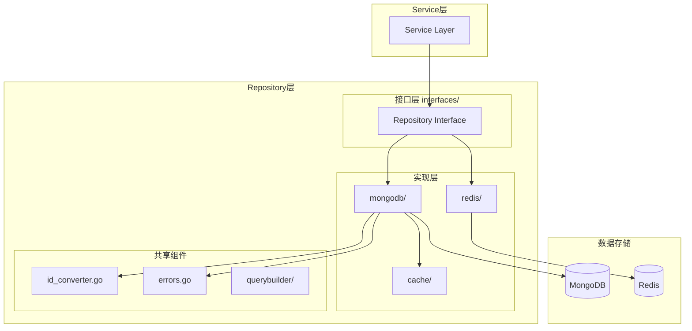
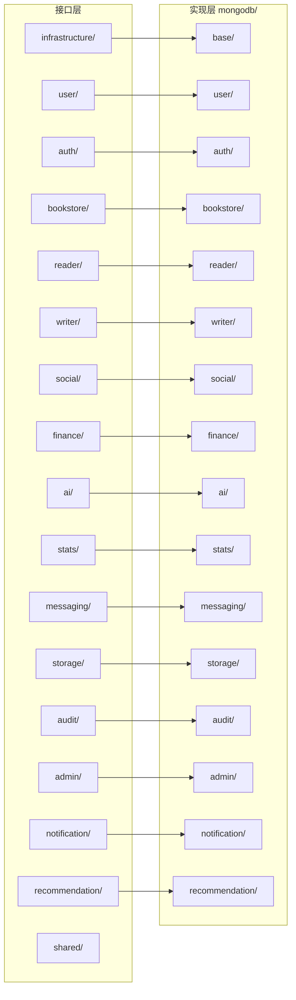
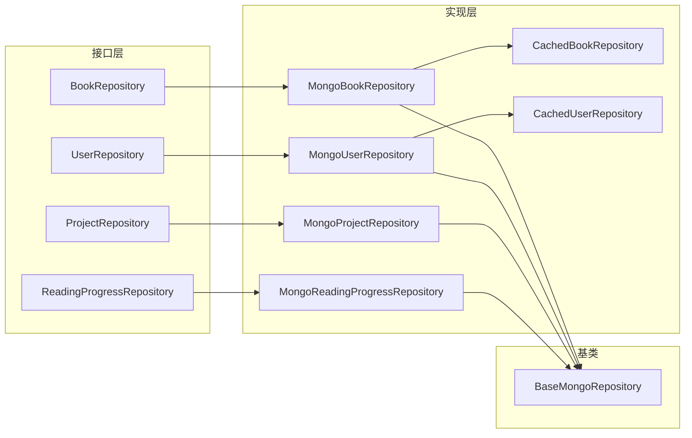

# Repository 层快速参考

## 职责

封装数据库操作，提供 CRUD 接口，处理 ID 转换和缓存策略。

## 整体架构



## 分层设计



## 目录结构

```
repository/
├── cache/                  # 缓存层（装饰器模式）
│   ├── cached_repository.go    # 缓存装饰器实现
│   └── metrics.go              # 缓存指标收集
├── interfaces/             # 接口定义层
│   ├── admin/              # 管理后台接口
│   ├── ai/                 # AI 服务接口
│   ├── audit/              # 审核相关接口
│   ├── auth/               # 认证授权接口
│   ├── bookstore/          # 书城相关接口
│   ├── finance/            # 财务相关接口
│   ├── infrastructure/     # 基础接口（CRUD/Filter）
│   ├── messaging/          # 消息通知接口
│   ├── notification/       # 通知推送接口
│   ├── reader/             # 阅读相关接口
│   ├── recommendation/     # 推荐系统接口
│   ├── shared/             # 共享接口（兼容层）
│   ├── social/             # 社交功能接口
│   ├── stats/              # 统计相关接口
│   ├── storage/            # 存储相关接口
│   ├── user/               # 用户相关接口
│   ├── writer/             # 写作相关接口
│   └── RepoFactory_interface.go  # 工厂接口
├── mongodb/                # MongoDB 实现
│   ├── base/               # 基础 Repository
│   ├── admin/              # 管理后台实现
│   ├── ai/                 # AI 服务实现
│   ├── audit/              # 审核相关实现
│   ├── auth/               # 认证授权实现
│   ├── bookstore/          # 书城相关实现
│   ├── finance/            # 财务相关实现
│   ├── messaging/          # 消息通知实现
│   ├── notification/       # 通知推送实现
│   ├── reader/             # 阅读相关实现
│   ├── recommendation/     # 推荐系统实现
│   ├── shared/             # 共享实现
│   ├── social/             # 社交功能实现
│   ├── stats/              # 统计相关实现
│   ├── storage/            # 存储相关实现
│   ├── user/               # 用户相关实现
│   ├── writer/             # 写作相关实现
│   └── factory.go          # Repository 工厂
├── querybuilder/           # 查询构建器
│   └── mongo_query_builder.go
├── redis/                  # Redis 实现
│   └── token_blacklist_repository_redis.go
├── errors.go               # 错误定义
└── id_converter.go         # ID 转换工具
```

## 接口-实现关系



## 命名规范

| 类型 | 规范 | 示例 |
|------|------|------|
| 接口文件 | 实体名 + `Repository_interface.go` | `BookRepository_interface.go` |
| MongoDB 实现 | 实体名 + `_repository_mongo.go` | `book_repository_mongo.go` |
| 接口名 | 实体名 + `Repository` | `BookRepository` |
| 实现名 | `Mongo` + 接口名 | `MongoBookRepository` |

## 方法命名

| 操作 | 命名 | 示例 |
|------|------|------|
| 创建 | `Create` | `Create(ctx, book)` |
| 按ID查询 | `GetByID` | `GetByID(ctx, id)` |
| 按条件查询 | `GetBy` + 条件 | `GetByCategory(ctx, categoryID)` |
| 列表查询 | `List` | `List(ctx, filter)` |
| 更新 | `Update` | `Update(ctx, id, updates)` |
| 删除 | `Delete` | `Delete(ctx, id)` |
| 统计 | `Count` + 条件 | `CountByStatus(ctx, status)` |

## ID 转换

```go
// 必需ID（空字符串报错）
oid, err := repository.ParseID(id)
if err != nil {
    return nil, err
}

// 可选ID（空字符串返回nil）
oid, err := repository.ParseOptionalID(id)

// 批量解析
oids, err := repository.ParseIDs(ids)
```

## 返回值规范

| 场景 | 返回值 |
|------|--------|
| 单条查询 | `(*Entity, error)` - 未找到返回 `nil, nil` |
| 列表查询 | `([]*Entity, error)` - 空列表返回 `[]*Entity{}, nil` |
| 更新/删除 | `error` - 包含 "not found" 错误 |

## 快速示例

```go
// 定义接口
type BookRepository interface {
    base.CRUDRepository[*bookstore.Book, string]
    GetByCategory(ctx context.Context, categoryID string, limit, offset int) ([]*bookstore.Book, error)
    CountByStatus(ctx context.Context, status bookstore.BookStatus) (int64, error)
}

// 实现结构体
type MongoBookRepository struct {
    *base.BaseMongoRepository
    client *mongo.Client
}

// 使用基类方法
func (r *MongoBookRepository) GetByID(ctx context.Context, id string) (*bookstore.Book, error) {
    oid, err := r.ParseID(id)  // 使用基类的ID转换
    if err != nil {
        return nil, err
    }
    var book bookstore.Book
    err = r.GetCollection().FindOne(ctx, bson.M{"_id": oid}).Decode(&book)
    return &book, nil
}
```

## 禁止事项

- 在 Repository 中写业务逻辑
- 直接返回 HTTP 错误
- 查询时忽略错误处理
- 硬编码查询条件
- 调用 Service 层

## 详见

- 完整设计文档: [docs/standards/layer-repository.md](../docs/standards/layer-repository.md)
- 架构详细说明: [ARCHITECTURE.md](./ARCHITECTURE.md)
