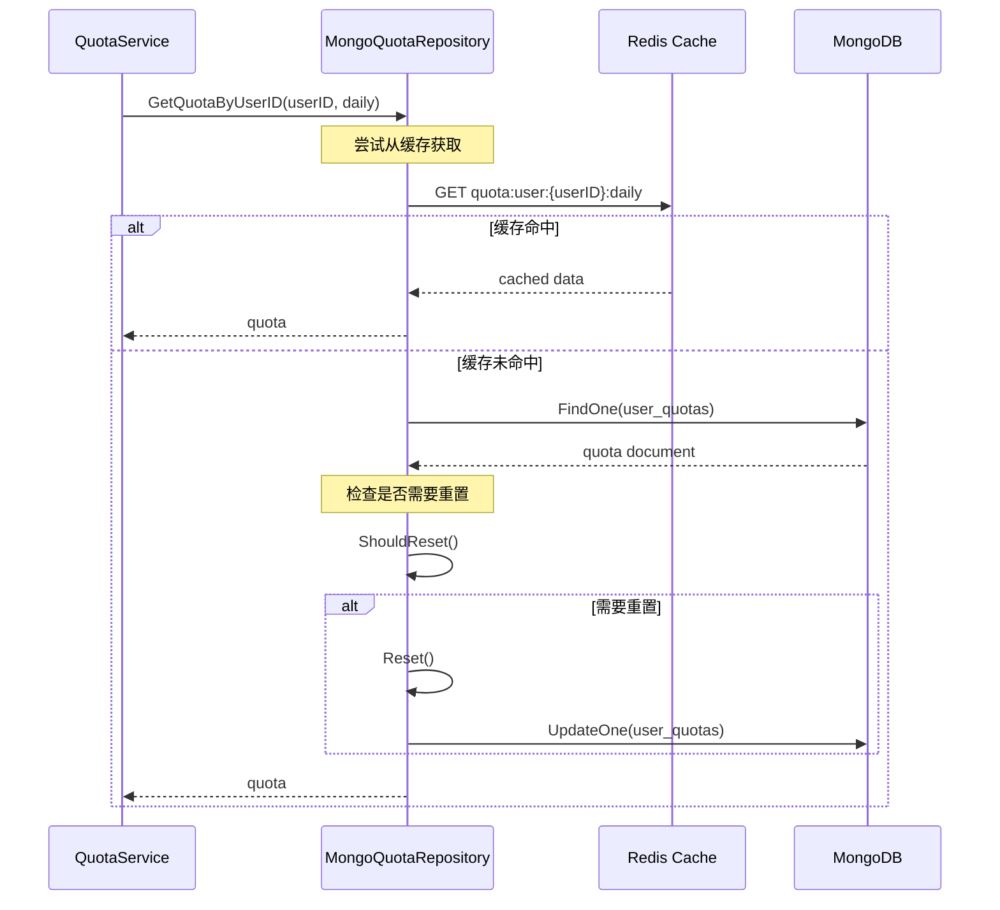
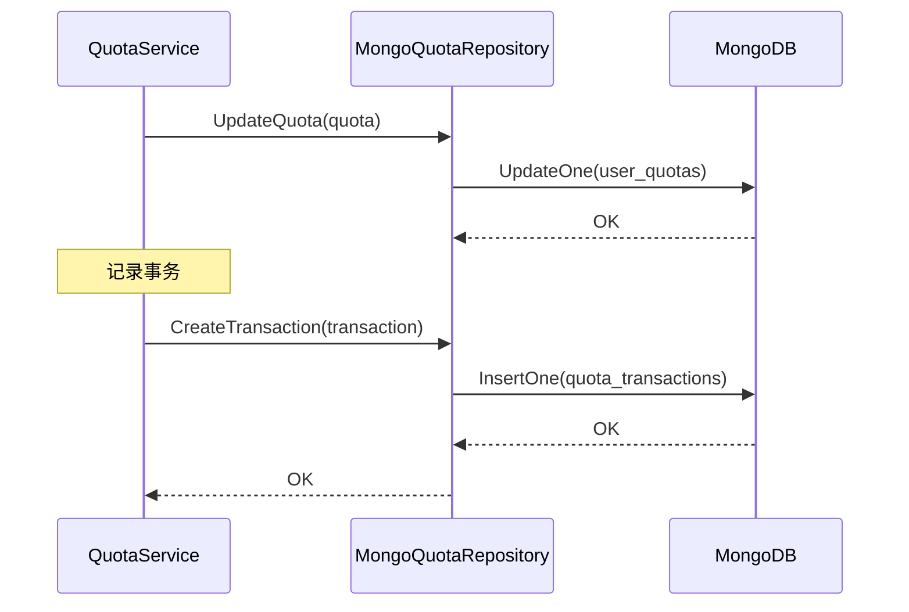
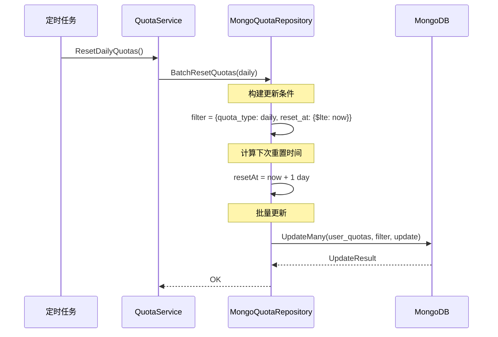

# AI 配额 MongoDB Repository

AI 配额数据的 MongoDB 持久化层，实现 `QuotaRepository` 接口，提供用户配额管理与事务记录功能。

## 架构概览

```mermaid
graph TB
    subgraph "Service Layer"
        QuotaService[QuotaService<br/>配额服务]
    end

    subgraph "Repository Interface"
        QuotaRepoInterface[QuotaRepository<br/>接口定义]
    end

    subgraph "MongoDB Implementation"
        MongoQuotaRepo[MongoQuotaRepository]
        QuotaCollection[(user_quotas<br/>Collection)]
        TransactionCollection[(quota_transactions<br/>Collection)]
    end

    subgraph "MongoDB"
        MongoDB[(MongoDB Database)]
    end

    QuotaService --> QuotaRepoInterface
    QuotaRepoInterface --> MongoQuotaRepo
    MongoQuotaRepo --> QuotaCollection
    MongoQuotaRepo --> TransactionCollection
    QuotaCollection --> MongoDB
    TransactionCollection --> MongoDB
```

## 核心类型

### MongoQuotaRepository

配额仓库的 MongoDB 实现，管理两个集合：

| 集合 | 说明 |
|------|------|
| `user_quotas` | 用户配额记录 |
| `quota_transactions` | 配额事务日志 |

```go
type MongoQuotaRepository struct {
    quotaCollection       *mongo.Collection
    transactionCollection *mongo.Collection
}
```

## 接口方法

### 配额管理

| 方法 | 说明 |
|------|------|
| `CreateQuota(ctx, quota)` | 创建配额记录 |
| `GetQuotaByUserID(ctx, userID, quotaType)` | 根据用户ID和类型获取配额 |
| `UpdateQuota(ctx, quota)` | 更新配额 |
| `DeleteQuota(ctx, userID, quotaType)` | 删除配额 |
| `GetAllQuotasByUserID(ctx, userID)` | 获取用户所有配额 |

### 批量操作

| 方法 | 说明 |
|------|------|
| `BatchResetQuotas(ctx, quotaType)` | 批量重置指定类型的配额 |

### 事务记录

| 方法 | 说明 |
|------|------|
| `CreateTransaction(ctx, transaction)` | 创建配额事务记录 |
| `GetTransactionsByUserID(ctx, userID, limit, offset)` | 分页获取用户事务记录 |
| `GetTransactionsByTimeRange(ctx, userID, start, end)` | 按时间范围获取事务 |

### 统计查询

| 方法 | 说明 |
|------|------|
| `GetQuotaStatistics(ctx, userID)` | 获取配额统计信息 |
| `GetTotalConsumption(ctx, userID, quotaType, start, end)` | 获取指定时间段的总消费量 |
| `Health(ctx)` | 健康检查 |

## 配额管理流程

### 配额查询流程



### 配额消费流程



### 批量重置流程



## 配额统计

`GetQuotaStatistics` 返回以下统计信息：

```go
type QuotaStatistics struct {
    UserID            string         // 用户ID
    TotalQuota        int            // 总配额
    UsedQuota         int            // 已用配额
    RemainingQuota    int            // 剩余配额
    UsagePercentage   float64        // 使用百分比
    TotalTransactions int            // 总交易次数
    DailyAverage      float64        // 日均消费（最近30天）
    QuotaByType       map[string]int // 按类型统计
    QuotaByService    map[string]int // 按服务统计
}
```

统计实现逻辑：

1. 获取用户所有配额记录
2. 汇总计算总配额、已用、剩余
3. 计算使用百分比
4. 查询事务记录进行服务维度统计
5. 计算最近30天的日均消费

## 数据模型

### UserQuota 集合结构

```javascript
{
    "_id": ObjectId("..."),
    "user_id": "user123",
    "quota_type": "daily",           // daily | monthly
    "total_quota": 10000,
    "used_quota": 3500,
    "remaining_quota": 6500,
    "status": "active",              // active | exhausted | suspended
    "reset_at": ISODate("2024-01-02T00:00:00Z"),
    "metadata": {
        "user_role": "author",
        "membership_level": "pro",
        "total_consumptions": 150,
        "average_per_day": 500
    },
    "created_at": ISODate("2024-01-01T00:00:00Z"),
    "updated_at": ISODate("2024-01-01T12:00:00Z")
}
```

### QuotaTransaction 集合结构

```javascript
{
    "_id": ObjectId("..."),
    "user_id": "user123",
    "quota_type": "daily",
    "amount": 100,
    "type": "consume",               // consume | restore | recharge
    "service": "text-generation",
    "model": "gpt-4",
    "request_id": "req_abc123",
    "description": "消费100配额用于text-generation服务",
    "before_balance": 6600,
    "after_balance": 6500,
    "timestamp": ISODate("2024-01-01T12:00:00Z")
}
```

## 索引建议

```javascript
// user_quotas 集合
db.user_quotas.createIndex({ "user_id": 1, "quota_type": 1 }, { unique: true })
db.user_quotas.createIndex({ "quota_type": 1, "reset_at": 1 })

// quota_transactions 集合
db.quota_transactions.createIndex({ "user_id": 1, "timestamp": -1 })
db.quota_transactions.createIndex({ "user_id": 1, "quota_type": 1, "type": 1, "timestamp": 1 })
```

## 错误处理

| 错误 | 说明 |
|------|------|
| `ErrQuotaNotFound` | 配额记录不存在 |
| `ErrDuplicateQuota` | 配额记录已存在（重复创建） |

## 使用示例

### 创建配额仓库

```go
// 通过 Factory 创建
factory := repository.NewMongoRepositoryFactory(db)
quotaRepo := factory.NewQuotaRepository()

// 直接创建
quotaRepo := ai.NewMongoQuotaRepository(db)
```

### 配额查询

```go
// 获取用户日配额
quota, err := quotaRepo.GetQuotaByUserID(ctx, userID, aiModels.QuotaTypeDaily)

// 获取用户所有配额
quotas, err := quotaRepo.GetAllQuotasByUserID(ctx, userID)

// 获取配额统计
stats, err := quotaRepo.GetQuotaStatistics(ctx, userID)
```

### 事务记录

```go
// 查询用户事务历史
transactions, err := quotaRepo.GetTransactionsByUserID(ctx, userID, 100, 0)

// 查询指定时间范围的事务
start := time.Now().AddDate(0, 0, -30)
end := time.Now()
transactions, err := quotaRepo.GetTransactionsByTimeRange(ctx, userID, start, end)

// 查询总消费量
total, err := quotaRepo.GetTotalConsumption(ctx, userID, aiModels.QuotaTypeDaily, start, end)
```

### 批量重置

```go
// 重置所有日配额（定时任务调用）
err := quotaRepo.BatchResetQuotas(ctx, aiModels.QuotaTypeDaily)

// 重置所有月配额
err := quotaRepo.BatchResetQuotas(ctx, aiModels.QuotaTypeMonthly)
```

## 注意事项

1. **自动重置**: `GetQuotaByUserID` 会自动检查并重置过期的配额
2. **事务一致性**: 配额更新和事务记录应在服务层保证原子性
3. **缓存失效**: 更新配额后需由服务层清除 Redis 缓存
4. **批量操作**: `BatchResetQuotas` 使用 `UpdateMany` 提高效率
5. **统计聚合**: `GetTotalConsumption` 使用 MongoDB 聚合管道
