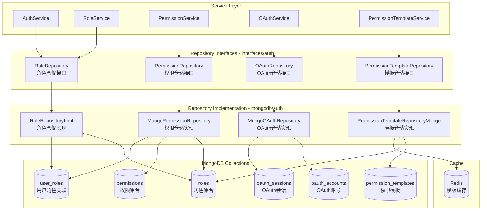
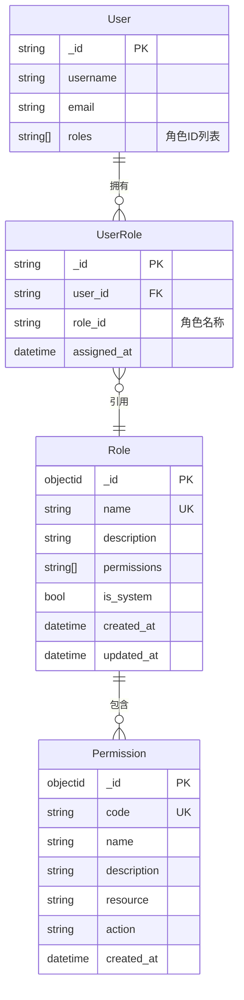

# Auth Repository 模块

## 模块职责

**Auth Repository（认证仓储）**模块提供认证和授权相关的数据持久化操作，包括角色管理、权限管理、OAuth账号管理和权限模板管理。

## 架构图



## 核心 Repository 列表

### RoleRepository（角色仓储）

**接口文件**: `repository/interfaces/auth/role_repository.go`
**实现文件**: `role_repository_mongo.go`

角色和用户角色关联的数据访问。

| 方法 | 职责 |
|------|------|
| `CreateRole` | 创建角色 |
| `GetRole` | 根据ID获取角色 |
| `GetRoleByName` | 根据名称获取角色 |
| `UpdateRole` | 更新角色 |
| `DeleteRole` | 删除角色（系统角色不可删除） |
| `ListRoles` | 列出所有角色 |
| `AssignUserRole` | 为用户分配角色 |
| `RemoveUserRole` | 移除用户角色 |
| `GetUserRoles` | 获取用户所有角色 |
| `HasUserRole` | 检查用户是否有指定角色 |
| `GetRolePermissions` | 获取角色权限列表 |
| `GetUserPermissions` | 获取用户所有权限（角色并集） |
| `Health` | 健康检查 |

**MongoDB集合**: `roles`, `users`

### PermissionRepository（权限仓储）

**接口文件**: `repository/interfaces/auth/permission_repository.go`
**实现文件**: `permission_repository_mongo.go`

权限和角色的完整CRUD操作。

| 方法 | 职责 |
|------|------|
| `GetAllPermissions` | 获取所有权限 |
| `GetPermissionByCode` | 根据代码获取权限 |
| `CreatePermission` | 创建权限 |
| `UpdatePermission` | 更新权限 |
| `DeletePermission` | 删除权限 |
| `GetAllRoles` | 获取所有角色 |
| `GetRoleByID` | 根据ID获取角色 |
| `GetRoleByName` | 根据名称获取角色 |
| `CreateRole` | 创建角色 |
| `UpdateRole` | 更新角色 |
| `DeleteRole` | 删除角色 |
| `AssignPermissionToRole` | 为角色分配权限 |
| `RemovePermissionFromRole` | 移除角色权限 |
| `GetRolePermissions` | 获取角色权限详情 |
| `GetUserRoles` | 获取用户角色名称列表 |
| `AssignRoleToUser` | 为用户分配角色 |
| `RemoveRoleFromUser` | 移除用户角色 |
| `ClearUserRoles` | 清除用户所有角色 |
| `UserHasPermission` | 检查用户权限 |
| `UserHasAnyPermission` | 检查用户是否有任意权限 |
| `UserHasAllPermissions` | 检查用户是否有所有权限 |
| `GetUserPermissions` | 获取用户权限详情 |

**MongoDB集合**: `permissions`, `roles`, `user_roles`

### OAuthRepository（OAuth仓储）

**接口文件**: `repository/interfaces/auth/oauth_repository.go`
**实现文件**: `oauth_repository_mongo.go`

OAuth账号和会话的数据访问。

| 方法 | 职责 |
|------|------|
| `FindByProviderAndProviderID` | 根据提供商和用户ID查找账号 |
| `FindByUserID` | 查找用户的所有OAuth账号 |
| `FindByID` | 根据ID查找账号 |
| `Create` | 创建OAuth账号 |
| `Update` | 更新OAuth账号 |
| `Delete` | 删除OAuth账号 |
| `UpdateLastLogin` | 更新最后登录时间 |
| `UpdateTokens` | 更新访问令牌 |
| `SetPrimaryAccount` | 设置主账号 |
| `GetPrimaryAccount` | 获取用户主账号 |
| `CountByUserID` | 统计用户OAuth账号数量 |
| `CreateSession` | 创建OAuth会话 |
| `FindSessionByID` | 根据ID查找会话 |
| `FindSessionByState` | 根据state查找会话 |
| `DeleteSession` | 删除会话 |
| `CleanupExpiredSessions` | 清理过期会话 |

**MongoDB集合**: `oauth_accounts`, `oauth_sessions`

### PermissionTemplateRepository（权限模板仓储）

**接口文件**: `repository/interfaces/auth/permission_template_repository.go`
**实现文件**: `permission_template_repository_mongo.go`

权限模板的数据访问，支持Redis缓存。

| 方法 | 职责 |
|------|------|
| `CreateTemplate` | 创建模板 |
| `GetTemplateByID` | 根据ID获取模板 |
| `GetTemplateByCode` | 根据代码获取模板 |
| `UpdateTemplate` | 更新模板 |
| `DeleteTemplate` | 删除模板（系统模板不可删除） |
| `ListTemplates` | 列出所有模板 |
| `ListTemplatesByCategory` | 按分类列出模板 |
| `ApplyTemplateToRole` | 应用模板到角色 |
| `GetSystemTemplates` | 获取系统模板 |
| `InitializeSystemTemplates` | 初始化系统预设模板 |
| `Health` | 健康检查 |

**MongoDB集合**: `permission_templates`, `roles`
**Redis缓存**: 模板详情和列表缓存

## 权限模型（RBAC）

### 数据模型关系



### 权限格式

权限使用 `资源:操作` 格式：

| 权限代码 | 说明 |
|---------|------|
| `book.read` | 阅读书籍 |
| `book.write` | 编辑书籍 |
| `book.delete` | 删除书籍 |
| `book.review` | 审核书籍 |
| `user.read` | 查看用户 |
| `user.write` | 编辑用户 |
| `user.delete` | 删除用户 |
| `admin.access` | 访问管理后台 |
| `admin.manage` | 系统管理 |
| `*` 或 `*:*` | 超级管理员（所有权限） |

### 通配符支持

- `*` 或 `*:*` - 完全通配符，匹配所有权限
- `book.*` - 匹配所有 book 相关权限（如 `book.read`, `book.write`）
- `user:*` - 匹配所有 user 相关权限

### 预定义角色

| 角色名 | 说明 | 典型权限 |
|-------|------|---------|
| `admin` | 系统管理员 | 所有权限 |
| `editor` | 内容编辑 | book.*, document.*, comment.* |
| `author` | 作者 | book.read, book.write, document.* |
| `reader` | 读者 | book.read, document.read, comment.read |

### 系统权限模板

| 模板代码 | 说明 | 权限列表 |
|---------|------|---------|
| `template_reader` | 读者模板 | book.read, document.read, comment.read |
| `template_author` | 作者模板 | book.read/write/review, document.read/write, comment.read/write, wallet.read |
| `template_admin` | 管理员模板 | 所有权限 |

## MongoDB集合设计

### roles 集合

```javascript
{
    "_id": ObjectId("..."),
    "name": "author",
    "description": "作者角色",
    "permissions": ["book.read", "book.write", "document.*"],
    "is_system": false,
    "created_at": ISODate("..."),
    "updated_at": ISODate("...")
}
```

**索引**:
- `name` (唯一索引)

### permissions 集合

```javascript
{
    "_id": ObjectId("..."),
    "code": "book.write",
    "name": "编辑书籍",
    "description": "允许创建和编辑书籍",
    "resource": "book",
    "action": "write",
    "created_at": ISODate("...")
}
```

**索引**:
- `code` (唯一索引)

### user_roles 集合

```javascript
{
    "_id": ObjectId("..."),
    "user_id": ObjectId("..."),
    "role_id": "author",  // 存储角色名称
    "assigned_at": ISODate("...")
}
```

**索引**:
- `user_id`
- `{user_id, role_id}` (唯一索引)

### oauth_accounts 集合

```javascript
{
    "_id": ObjectId("..."),
    "user_id": "user_object_id",
    "provider": "google",
    "provider_user_id": "google_user_123",
    "email": "user@gmail.com",
    "username": "user123",
    "avatar": "https://...",
    "access_token": "ya29...",
    "refresh_token": "refresh...",
    "token_expires_at": ISODate("..."),
    "is_primary": true,
    "last_login_at": ISODate("..."),
    "created_at": ISODate("..."),
    "updated_at": ISODate("...")
}
```

**索引**:
- `{provider, provider_user_id}` (唯一索引)
- `user_id`
- `{user_id, is_primary}`

### oauth_sessions 集合

```javascript
{
    "_id": ObjectId("..."),
    "state": "random_state_string",
    "provider": "google",
    "redirect_uri": "https://...",
    "link_mode": false,
    "user_id": "optional_user_id",
    "expires_at": ISODate("..."),
    "created_at": ISODate("...")
}
```

**索引**:
- `state` (唯一索引, TTL 600秒)
- `expires_at`

### permission_templates 集合

```javascript
{
    "_id": ObjectId("..."),
    "name": "作者模板",
    "code": "template_author",
    "description": "作者角色默认权限模板",
    "permissions": ["book.read", "book.write", ...],
    "is_system": true,
    "category": "author",
    "created_at": ISODate("..."),
    "updated_at": ISODate("...")
}
```

**索引**:
- `code` (唯一索引)
- `category`
- `is_system`

## 使用示例

### 创建角色仓储

```go
import (
    "Qingyu_backend/repository/mongodb/auth"
)

// 创建角色仓储
roleRepo := auth.NewRoleRepository(db)

// 创建权限仓储
permRepo := auth.NewMongoPermissionRepository(db)

// 创建OAuth仓储
oauthRepo := auth.NewMongoOAuthRepository(db)

// 创建权限模板仓储
templateRepo := auth.NewPermissionTemplateRepositoryMongo(client, database, redisClient)
```

### 角色管理

```go
// 创建角色
role := &authModel.Role{
    Name:        "moderator",
    Description: "版主角色",
    Permissions: []string{"comment.delete", "user.warn"},
}
err := roleRepo.CreateRole(ctx, role)

// 获取角色
role, err := roleRepo.GetRole(ctx, roleID)

// 分配用户角色
err := roleRepo.AssignUserRole(ctx, userID, roleID)

// 获取用户权限
permissions, err := roleRepo.GetUserPermissions(ctx, userID)
```

### OAuth账号管理

```go
// 查找OAuth账号
account, err := oauthRepo.FindByProviderAndProviderID(ctx, "google", "google_user_123")

// 创建OAuth账号
account := &authModel.OAuthAccount{
    UserID:         userID,
    Provider:       "google",
    ProviderUserID: "google_user_123",
    Email:          "user@gmail.com",
    IsPrimary:      true,
}
err := oauthRepo.Create(ctx, account)

// 设置主账号
err := oauthRepo.SetPrimaryAccount(ctx, userID, accountID)
```

### 权限模板管理

```go
// 创建模板
template := &authModel.PermissionTemplate{
    Name:        "自定义模板",
    Code:        "custom_template",
    Permissions: []string{"book.read", "comment.write"},
    Category:    "custom",
}
err := templateRepo.CreateTemplate(ctx, template)

// 应用模板到角色
err := templateRepo.ApplyTemplateToRole(ctx, templateID, roleID)

// 初始化系统模板
err := templateRepo.InitializeSystemTemplates(ctx)
```

## 向后兼容

为了保持向后兼容性，模块提供了兼容别名：

```go
// repository/mongodb/auth/role_repository_mongo.go
func NewRoleRepository(db *mongo.Database) authInterface.RoleRepository {
    return &MongoRoleRepository{db: db}
}
```

新代码应使用 `RoleRepository` 和 `NewRoleRepository`。

## 相关文档

- [Auth Service](../../../service/auth/README.md)
- [认证模块设计](../../../docs/design/modules/01-auth/README.md)
- [Repository接口定义](../interfaces/auth/)

---

**版本**: v1.0.0
**更新日期**: 2026-03-22
