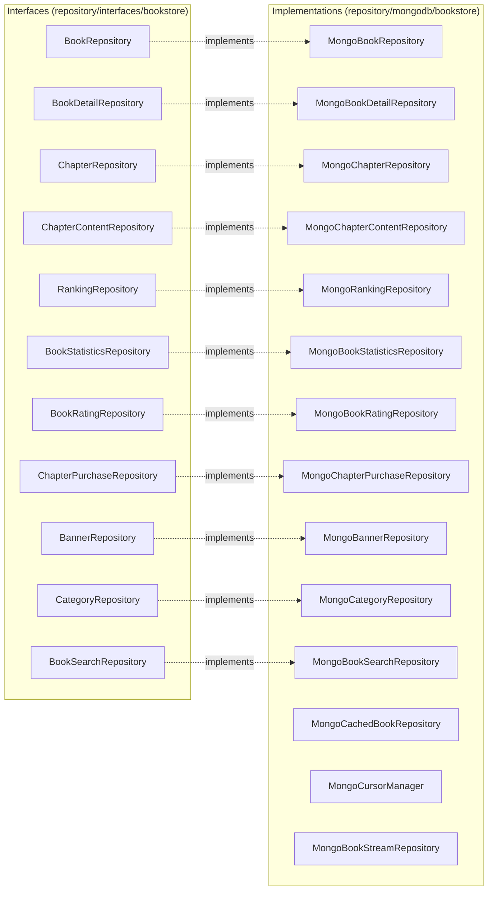

# Bookstore MongoDB Repository

书城模块的 MongoDB 数据访问层，提供书籍、章节、榜单、评分等数据的持久化存储和查询。

## 模块职责

Repository 层负责与 MongoDB 数据库的直接交互，提供数据的 CRUD 操作、复杂查询、事务支持等功能，是 Service 层与数据库之间的桥梁。

## 架构图

```mermaid
graph TB
    subgraph "Service Layer"
        BS[BookstoreService]
        BDS[BookDetailService]
        CS[ChapterService]
        RS[RankingService]
        BSS[BookStatisticsService]
        BRS[BookRatingService]
        CPS[ChapterPurchaseService]
        BnS[BannerService]
    end

    subgraph "Repository Interfaces"
        BRI[BookRepository]
        BDRI[BookDetailRepository]
        CRI[ChapterRepository]
        CCRI[ChapterContentRepository]
        RRI[RankingRepository]
        BSRI[BookStatisticsRepository]
        BRRI[BookRatingRepository]
        CPRI[ChapterPurchaseRepository]
        BnRI[BannerRepository]
        CtRI[CategoryRepository]
    end

    subgraph "MongoDB Implementations"
        MBR[MongoBookRepository]
        MBD[MongoBookDetailRepository]
        MC[MongoChapterRepository]
        MCC[MongoChapterContentRepository]
        MR[MongoRankingRepository]
        MBS[MongoBookStatisticsRepository]
        MBR2[MongoBookRatingRepository]
        MCP[MongoChapterPurchaseRepository]
        MBn[MongoBannerRepository]
        MCt[MongoCategoryRepository]
        MBSR[MongoBookSearchRepository]
        MBLQ[MongoBookListQueryRepository]
        MBM[MongoBookManagementRepository]
        MBD2[MongoBookDataMutationRepository]
        MBDS[MongoBookDataStatisticsRepository]
        MC2[MongoCachedBookRepository]
        MCM[MongoCursorManager]
        MBSR2[MongoBookStreamRepository]
    end

    subgraph "MongoDB"
        DB[(MongoDB)]
    end

    BS --> BRI
    BDS --> BDRI
    CS --> CRI
    CS --> CCRI
    RS --> RRI
    BSS --> BSRI
    BRS --> BRRI
    CPS --> CPRI
    BnS --> BnRI

    BRI --> MBR
    BDRI --> MBD
    CRI --> MC
    CCRI --> MCC
    RRI --> MR
    BSRI --> MBS
    BRRI --> MBR2
    CPRI --> MCP
    BnRI --> MBn
    CtRI --> MCt

    MBR --> DB
    MBD --> DB
    MC --> DB
    MCC --> DB
    MR --> DB
    MBS --> DB
    MBR2 --> DB
    MCP --> DB
    MBn --> DB
    MCt --> DB
```

## 接口-实现关系图

## 核心 Repository 列表

### BookRepository (MongoBookRepository)
书籍基础仓储，提供书籍列表展示和基础管理功能。

**核心方法:**
| 方法 | 说明 |
|-----|------|
| `Create()` / `GetByID()` / `Update()` / `Delete()` | 基础 CRUD |
| `GetByCategory()` | 按分类查询 |
| `GetByAuthorID()` | 按作者查询 |
| `GetHotBooks()` | 热门书籍（按浏览量） |
| `GetNewReleases()` | 新书上架 |
| `GetFreeBooks()` | 免费书籍 |
| `GetFeatured()` | 精选书籍 |
| `Search()` / `SearchWithFilter()` | 书籍搜索 |
| `CountByFilter()` | 条件统计 |
| `BatchUpdateStatus()` | 批量更新状态 |
| `GetYears()` / `GetTags()` | 元数据查询 |

### BookDetailRepository (MongoBookDetailRepository)
书籍详情仓储，专注于详情页面的完整信息管理。

**核心方法:**
| 方法 | 说明 |
|-----|------|
| `GetByTitle()` / `GetByISBN()` | 唯一字段查询 |
| `GetByAuthor()` / `GetByAuthorID()` | 作者相关查询 |
| `GetByCategory()` / `GetByTags()` | 分类/标签查询 |
| `SearchByFilter()` | 高级过滤搜索 |
| `IncrementViewCount()` / `IncrementLikeCount()` | 统计递增 |
| `UpdateRating()` | 更新评分 |
| `BatchUpdateStatus()` / `BatchUpdateTags()` | 批量操作 |

### ChapterRepository (MongoChapterRepository)
章节元数据仓储，管理章节基本信息。

**核心方法:**
| 方法 | 说明 |
|-----|------|
| `GetByBookID()` | 按书籍获取章节列表 |
| `GetByBookIDAndChapterNum()` | 获取指定章节 |
| `GetFreeChapters()` / `GetPaidChapters()` | 免费/付费章节 |
| `GetPreviousChapter()` / `GetNextChapter()` | 章节导航 |
| `CountByBookID()` / `CountFreeChapters()` | 章节统计 |
| `GetTotalWordCount()` | 总字数统计 |
| `BatchUpdatePrice()` | 批量更新价格 |
| `DeleteByBookID()` | 删除书籍所有章节 |

### ChapterContentRepository (MongoChapterContentRepository)
章节内容仓储，管理章节正文内容（分离存储）。

**核心方法:**
| 方法 | 说明 |
|-----|------|
| `GetByChapterID()` | 获取章节聚合内容 |
| `ListByChapterID()` | 获取段落列表 |
| `UpdateContent()` | 更新章节内容 |

### RankingRepository (MongoRankingRepository)
榜单仓储，管理各类排行榜数据。

**核心方法:**
| 方法 | 说明 |
|-----|------|
| `GetByType()` / `GetByTypeWithBooks()` | 按类型获取榜单 |
| `GetByBookID()` | 获取书籍排名 |
| `UpsertRankingItem()` / `BatchUpsertRankingItems()` | 更新榜单项 |
| `DeleteByTypeAndPeriod()` | 删除过期榜单 |
| `GetBooksForRanking()` | 获取原始数据（供计算） |

### BookStatisticsRepository (MongoBookStatisticsRepository)
书籍统计仓储，管理浏览量、收藏量、热度等统计数据。

**核心方法:**
| 方法 | 说明 |
|-----|------|
| `GetByBookID()` | 获取书籍统计 |
| `GetTopViewed()` / `GetTopFavorited()` / `GetTopRated()` | 排行榜数据 |
| `GetHottest()` / `GetTrendingBooks()` | 热门/趋势书籍 |
| `IncrementViewCount()` / `IncrementFavoriteCount()` | 统计递增 |
| `UpdateHotScore()` | 更新热度分数 |
| `GetAggregatedStatistics()` | 聚合统计 |

### BookRatingRepository (MongoBookRatingRepository)
书籍评分仓储，管理用户评分和评论。

**核心方法:**
| 方法 | 说明 |
|-----|------|
| `GetByBookIDAndUserID()` | 获取用户评分 |
| `GetByBookID()` | 获取书籍所有评分 |
| `GetAverageRating()` / `GetRatingDistribution()` | 评分统计 |
| `IncrementLikes()` / `DecrementLikes()` | 点赞操作 |
| `BatchDelete()` | 批量删除 |

### ChapterPurchaseRepository (MongoChapterPurchaseRepository)
章节购买记录仓储，管理用户的购买历史。

**核心方法:**
| 方法 | 说明 |
|-----|------|
| `GetByUserAndChapter()` | 检查章节购买 |
| `GetByUser()` / `GetByUserAndBook()` | 购买记录查询 |
| `CheckUserPurchasedChapter()` | 购买权限检查 |
| `GetPurchasedChapterIDs()` | 已购章节列表 |

### BannerRepository (MongoBannerRepository)
Banner 仓储，管理首页轮播图。

**核心方法:**
| 方法 | 说明 |
|-----|------|
| `GetActive()` | 获取激活的 Banner |
| `GetByTargetType()` | 按目标类型查询 |
| `IncrementClickCount()` | 点击计数 |

### CategoryRepository (MongoCategoryRepository)
分类仓储，管理书籍分类层级。

**核心方法:**
| 方法 | 说明 |
|-----|------|
| `GetRootCategories()` | 获取根分类 |
| `GetCategoryTree()` | 获取分类树 |
| `GetChildren()` / `GetAncestors()` / `GetDescendants()` | 层级操作 |

## 数据模型说明

### 集合映射

| Repository | MongoDB Collection | 主模型 |
|-----------|-------------------|--------|
| BookRepository | `books` | `Book` |
| BookDetailRepository | `books` | `BookDetail` |
| ChapterRepository | `chapters` | `Chapter` |
| ChapterContentRepository | `chapter_contents` | `ChapterContent` |
| RankingRepository | `rankings` | `RankingItem` |
| BookStatisticsRepository | `book_statistics` | `BookStatistics` |
| BookRatingRepository | `book_ratings` | `BookRating` |
| ChapterPurchaseRepository | `chapter_purchases` | `ChapterPurchase` |
| BannerRepository | `banners` | `Banner` |
| CategoryRepository | `categories` | `Category` |

### 查询优化策略

1. **索引策略**
   - `books`: `_id`, `author_id`, `category_ids`, `status`, `view_count`
   - `chapters`: `_id`, `book_id` + `chapter_num` (复合索引)
   - `rankings`: `type` + `period` (复合索引)

2. **分页查询**
   - 使用 `limit` + `offset` 实现传统分页
   - 支持游标分页（StreamRepository）

3. **批量操作**
   - 使用 `UpdateMany` 批量更新
   - 使用 `InsertMany` 批量插入

## 文件列表

| 文件 | 职责 |
|-----|------|
| `bookstore_repository_mongo.go` | 书籍基础仓储 |
| `book_detail_repository_mongo.go` | 书籍详情仓储 |
| `chapter_repository_mongo.go` | 章节元数据仓储 |
| `chapter_content_repository_mongo.go` | 章节内容仓储 |
| `ranking_repository_mongo.go` | 榜单仓储 |
| `book_statistics_repository_mongo.go` | 书籍统计仓储 |
| `book_rating_repository_mongo.go` | 评分仓储 |
| `chapter_purchase_repository_mongo.go` | 购买记录仓储 |
| `banner_repository_mongo.go` | Banner 仓储 |
| `category_repository_mongo.go` | 分类仓储 |
| `book_search_repository_mongo.go` | 书籍搜索仓储 |
| `book_list_query_repository_mongo.go` | 列表查询仓储 |
| `book_management_repository_mongo.go` | 书籍管理仓储 |
| `book_data_mutation_repository_mongo.go` | 数据变更仓储 |
| `book_data_statistics_repository_mongo.go` | 数据统计仓储 |
| `cached_book_repository.go` | 带缓存的书籍仓储 |
| `cursor_manager.go` | 游标管理器 |
| `book_stream_repository.go` | 流式查询仓储 |
| `performance_optimization.go` | 性能优化工具 |
