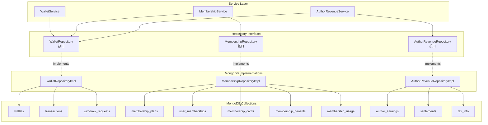
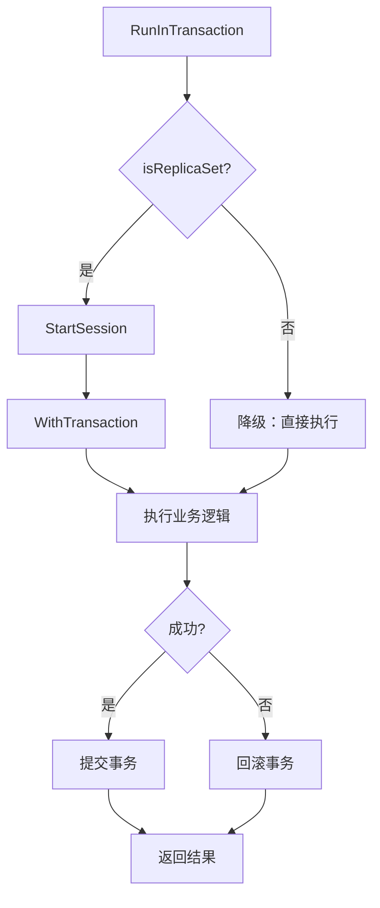

# Finance Repository 模块

提供金融相关数据持久化的 MongoDB 实现，包括钱包、会员、作者收入等核心仓储。

## 架构概览



## 核心 Repository 列表

### 1. WalletRepositoryImpl

**文件**: `wallet_repository_mongo.go`

**职责**: 钱包、交易记录、提现申请的数据持久化

**管理的 Collection**:
| Collection | 说明 |
|------------|------|
| `wallets` | 用户钱包 |
| `transactions` | 交易记录 |
| `withdraw_requests` | 提现申请 |

**核心方法**:

#### 钱包管理

| 方法 | 说明 |
|------|------|
| `CreateWallet(ctx, wallet)` | 创建钱包 |
| `GetWallet(ctx, userID)` | 根据用户ID获取钱包 |
| `UpdateWallet(ctx, walletID, updates)` | 更新钱包信息 |
| `UpdateBalance(ctx, userID, amount)` | 原子更新余额 |
| `UpdateBalanceWithCheck(ctx, userID, amount)` | 带余额验证的原子更新 |

#### 交易管理

| 方法 | 说明 |
|------|------|
| `CreateTransaction(ctx, transaction)` | 创建交易记录 |
| `GetTransaction(ctx, transactionID)` | 获取交易记录 |
| `ListTransactions(ctx, filter)` | 查询交易列表 |
| `CountTransactions(ctx, filter)` | 统计交易数量 |

#### 提现管理

| 方法 | 说明 |
|------|------|
| `CreateWithdrawRequest(ctx, request)` | 创建提现申请 |
| `GetWithdrawRequest(ctx, requestID)` | 获取提现申请 |
| `UpdateWithdrawRequest(ctx, requestID, updates)` | 更新提现申请 |
| `ListWithdrawRequests(ctx, filter)` | 查询提现列表 |
| `CountWithdrawRequests(ctx, filter)` | 统计提现数量 |

#### 事务与健康检查

| 方法 | 说明 |
|------|------|
| `RunInTransaction(ctx, fn)` | 在事务中执行操作 |
| `Health(ctx)` | 健康检查 |

---

### 2. MembershipRepositoryImpl

**文件**: `membership_repository_impl.go`

**职责**: 会员套餐、用户会员、会员卡、会员权益的数据持久化

**管理的 Collection**:
| Collection | 说明 |
|------------|------|
| `membership_plans` | 会员套餐 |
| `user_memberships` | 用户会员 |
| `membership_cards` | 会员卡 |
| `membership_benefits` | 会员权益 |
| `membership_usage` | 权益使用记录 |

**核心方法**:

#### 套餐管理

| 方法 | 说明 |
|------|------|
| `CreatePlan(ctx, plan)` | 创建套餐 |
| `GetPlan(ctx, planID)` | 获取套餐 |
| `GetPlanByType(ctx, planType)` | 根据类型获取套餐 |
| `ListPlans(ctx, enabledOnly)` | 列出套餐 |
| `UpdatePlan(ctx, planID, updates)` | 更新套餐 |
| `DeletePlan(ctx, planID)` | 删除套餐 |

#### 用户会员管理

| 方法 | 说明 |
|------|------|
| `CreateMembership(ctx, membership)` | 创建会员 |
| `GetMembership(ctx, userID)` | 获取用户会员 |
| `GetMembershipByID(ctx, membershipID)` | 根据ID获取会员 |
| `UpdateMembership(ctx, membershipID, updates)` | 更新会员 |
| `DeleteMembership(ctx, membershipID)` | 删除会员 |
| `ListMemberships(ctx, filter, page, pageSize)` | 列出会员 |

#### 会员卡管理

| 方法 | 说明 |
|------|------|
| `CreateMembershipCard(ctx, card)` | 创建会员卡 |
| `GetMembershipCard(ctx, cardID)` | 获取会员卡 |
| `GetMembershipCardByCode(ctx, code)` | 根据卡密获取会员卡 |
| `UpdateMembershipCard(ctx, cardID, updates)` | 更新会员卡 |
| `ListMembershipCards(ctx, filter, page, pageSize)` | 列出会员卡 |
| `CountMembershipCards(ctx, filter)` | 统计会员卡 |
| `BatchCreateMembershipCards(ctx, cards)` | 批量创建会员卡 |

#### 会员权益管理

| 方法 | 说明 |
|------|------|
| `CreateBenefit(ctx, benefit)` | 创建权益 |
| `GetBenefit(ctx, benefitID)` | 获取权益 |
| `GetBenefitByCode(ctx, code)` | 根据代码获取权益 |
| `ListBenefits(ctx, level, enabledOnly)` | 列出权益 |
| `UpdateBenefit(ctx, benefitID, updates)` | 更新权益 |
| `DeleteBenefit(ctx, benefitID)` | 删除权益 |

#### 权益使用情况

| 方法 | 说明 |
|------|------|
| `CreateUsage(ctx, usage)` | 创建使用记录 |
| `GetUsage(ctx, userID, benefitCode)` | 获取使用记录 |
| `UpdateUsage(ctx, usageID, updates)` | 更新使用记录 |
| `ListUsages(ctx, userID)` | 列出使用记录 |

---

### 3. AuthorRevenueRepositoryImpl

**文件**: `author_revenue_repository_impl.go`

**职责**: 作者收入、提现申请、结算、税务信息的数据持久化

**管理的 Collection**:
| Collection | 说明 |
|------------|------|
| `author_earnings` | 作者收入记录 |
| `withdrawal_requests` | 作者提现申请 |
| `settlements` | 结算记录 |
| `revenue_details` | 收入明细 |
| `revenue_statistics` | 收入统计 |
| `tax_info` | 税务信息 |

**核心方法**:

#### 收入记录管理

| 方法 | 说明 |
|------|------|
| `CreateEarning(ctx, earning)` | 创建收入记录 |
| `GetEarning(ctx, earningID)` | 获取收入记录 |
| `ListEarnings(ctx, filter, page, pageSize)` | 列出收入记录 |
| `UpdateEarning(ctx, earningID, updates)` | 更新收入记录 |
| `BatchUpdateEarnings(ctx, earningIDs, updates)` | 批量更新收入记录 |
| `GetEarningsByAuthor(ctx, authorID, page, pageSize)` | 获取作者收入 |
| `GetEarningsByBook(ctx, bookID, page, pageSize)` | 获取书籍收入 |

#### 提现申请管理

| 方法 | 说明 |
|------|------|
| `CreateWithdrawalRequest(ctx, request)` | 创建提现申请 |
| `GetWithdrawalRequest(ctx, requestID)` | 获取提现申请 |
| `ListWithdrawalRequests(ctx, filter, page, pageSize)` | 列出提现申请 |
| `UpdateWithdrawalRequest(ctx, requestID, updates)` | 更新提现申请 |
| `GetUserWithdrawalRequests(ctx, userID, page, pageSize)` | 获取用户提现申请 |

#### 结算管理

| 方法 | 说明 |
|------|------|
| `CreateSettlement(ctx, settlement)` | 创建结算记录 |
| `GetSettlement(ctx, settlementID)` | 获取结算记录 |
| `ListSettlements(ctx, filter, page, pageSize)` | 列出结算记录 |
| `UpdateSettlement(ctx, settlementID, updates)` | 更新结算记录 |
| `GetAuthorSettlements(ctx, authorID, page, pageSize)` | 获取作者结算 |
| `GetPendingSettlements(ctx)` | 获取待结算记录 |

#### 收入统计

| 方法 | 说明 |
|------|------|
| `GetRevenueStatistics(ctx, authorID, period, limit)` | 获取收入统计 |
| `CreateRevenueStatistics(ctx, statistics)` | 创建收入统计 |
| `UpdateRevenueStatistics(ctx, statisticsID, updates)` | 更新收入统计 |

#### 收入明细

| 方法 | 说明 |
|------|------|
| `GetRevenueDetails(ctx, authorID, page, pageSize)` | 获取收入明细 |
| `GetRevenueDetailByBook(ctx, authorID, bookID)` | 获取书籍收入明细 |
| `CreateRevenueDetail(ctx, detail)` | 创建收入明细 |
| `UpdateRevenueDetail(ctx, detailID, updates)` | 更新收入明细 |

#### 税务信息

| 方法 | 说明 |
|------|------|
| `CreateTaxInfo(ctx, taxInfo)` | 创建税务信息 |
| `GetTaxInfo(ctx, userID)` | 获取税务信息 |
| `UpdateTaxInfo(ctx, userID, updates)` | 更新税务信息 |

## 事务处理

### 事务支持检测

`WalletRepositoryImpl` 实现了事务支持检测：

```go
// isReplicaSet 检查 MongoDB 是否是副本集（支持事务）
func (r *WalletRepositoryImpl) isReplicaSet(ctx context.Context) bool {
    // 通过 isMaster 命令检测是否存在 setName
    // 副本集有 setName，单节点没有
}
```

### 事务执行流程



### 降级模式

当 MongoDB 为单节点（非副本集）时，系统自动降级为无事务模式：

```go
func (r *WalletRepositoryImpl) RunInTransaction(ctx context.Context, fn func(context.Context) error) error {
    if !r.isReplicaSet(ctx) {
        // 降级模式：直接执行操作，不使用事务
        return fn(ctx)
    }
    // 副本集模式：使用事务
    // ...
}
```

## 接口定义位置

| Repository 接口 | 定义文件 |
|----------------|----------|
| `WalletRepository` | `repository/interfaces/finance/wallet_repository.go` |
| `MembershipRepository` | `repository/interfaces/finance/membership_repository.go` |
| `AuthorRevenueRepository` | `repository/interfaces/finance/author_revenue_repository.go` |

## 过滤器结构

### TransactionFilter

```go
type TransactionFilter struct {
    UserID    string    // 用户ID
    Type      string    // 交易类型
    Status    string    // 交易状态
    StartDate time.Time // 开始日期
    EndDate   time.Time // 结束日期
    Limit     int64     // 限制数量
    Offset    int64     // 偏移量
}
```

### WithdrawFilter

```go
type WithdrawFilter struct {
    UserID    string    // 用户ID
    Status    string    // 提现状态
    StartDate time.Time // 开始日期
    EndDate   time.Time // 结束日期
    Limit     int64     // 限制数量
    Offset    int64     // 偏移量
}
```

## 使用示例

### 创建 Repository

```go
// 创建数据库连接
client, _ := mongo.Connect(ctx, options.Client().ApplyURI(uri))
db := client.Database("qingyu")

// 创建各 Repository
walletRepo := finance.NewWalletRepository(db)
membershipRepo := finance.NewMembershipRepository(db)
revenueRepo := finance.NewAuthorRevenueRepository(db)
```

### 使用事务

```go
err := walletRepo.RunInTransaction(ctx, func(txCtx context.Context) error {
    // 在事务中执行多个操作
    if err := walletRepo.UpdateBalance(txCtx, userID, -amount); err != nil {
        return err
    }
    if err := walletRepo.CreateTransaction(txCtx, transaction); err != nil {
        return err
    }
    return nil
})
```

### 原子余额更新

```go
// 直接更新（用于充值等安全操作）
err := walletRepo.UpdateBalance(ctx, userID, 1000)

// 带验证更新（用于扣款，防止负数余额）
err := walletRepo.UpdateBalanceWithCheck(ctx, userID, -500)
if err != nil {
    // 可能是余额不足
}
```

## 注意事项

1. **事务降级**：单节点 MongoDB 自动降级为无事务模式，适合开发环境
2. **余额安全**：使用 `UpdateBalanceWithCheck` 确保扣款时余额不会变为负数
3. **时间戳自动管理**：所有 Repository 实现自动管理 `created_at` 和 `updated_at`
4. **ID 生成**：MongoDB ObjectID 在插入时自动生成
5. **分页查询**：List 方法支持分页，返回数据列表和总数
