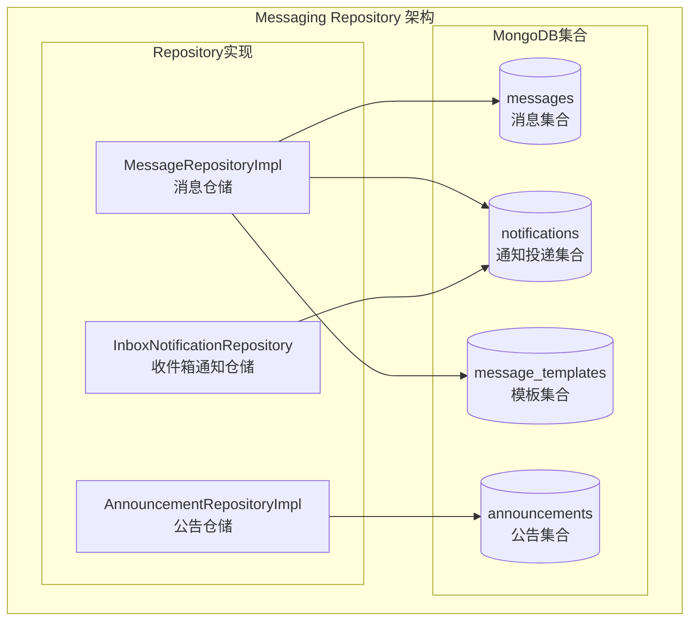

# Messaging Repository 模块 - 消息存储层

## 模块职责

**Messaging Repository 模块**负责消息、通知投递和模板数据的持久化存储，提供消息管理、通知投递记录和消息模板的CRUD操作。

## 架构图



## 核心 Repository 列表

### 1. MessageRepositoryImpl (message_repository_mongo.go)

**职责**: 消息和通知投递的核心存储操作

**核心方法**:
- `CreateMessage` - 创建消息
- `GetMessage` - 获取消息
- `UpdateMessage` - 更新消息
- `DeleteMessage` - 删除消息
- `ListMessages` - 列出消息
- `CountMessages` - 统计消息数量
- `CreateNotification` - 创建通知投递记录
- `GetNotification` - 获取通知投递
- `UpdateNotification` - 更新通知投递
- `ListNotifications` - 列出通知投递
- `MarkAsRead` - 标记已读
- `MarkMultipleAsRead` - 批量标记已读
- `GetUnreadCount` - 获取未读数
- `CreateTemplate` - 创建消息模板
- `GetTemplate` - 获取模板
- `GetTemplateByName` - 按名称获取模板
- `ListTemplates` - 列出模板

### 2. AnnouncementRepositoryImpl (announcement_repository_mongo.go)

**职责**: 系统公告的存储操作

**核心方法**:
- `Create` - 创建公告
- `GetByID` - 根据ID获取公告
- `Update` - 更新公告
- `Delete` - 删除公告
- `List` - 列出公告
- `Count` - 统计公告数量
- `GetEffective` - 获取有效公告
- `BatchUpdateStatus` - 批量更新状态
- `BatchDelete` - 批量删除
- `IncrementViewCount` - 增加查看次数

### 3. InboxNotificationRepository (inbox_notification_repository.go)

**职责**: 收件箱通知的存储操作

**核心方法**:
- 收件箱通知的CRUD操作
- 收件箱消息管理

## 依赖关系

### 依赖的模块
- `models/messaging` - 消息数据模型
- `repository/interfaces/messaging` - 消息仓储接口

### 被依赖的模块
- `service/messaging` - 消息服务层

## 数据模型

### Message (消息)
```go
type Message struct {
    ID        primitive.ObjectID `bson:"_id"`
    Topic     string             `bson:"topic"`
    Content   string             `bson:"content"`
    Status    MessageStatus      `bson:"status"`
    CreatedAt time.Time          `bson:"created_at"`
    UpdatedAt time.Time          `bson:"updated_at"`
}
```

### NotificationDelivery (通知投递)
```go
type NotificationDelivery struct {
    ID             primitive.ObjectID `bson:"_id"`
    NotificationID string             `bson:"notification_id"`
    UserID         string             `bson:"user_id"`
    Type           NotificationType   `bson:"type"`
    Status         DeliveryStatus     `bson:"status"`
    IsRead         bool               `bson:"is_read"`
    ReadAt         *time.Time         `bson:"read_at,omitempty"`
    CreatedAt      time.Time          `bson:"created_at"`
}
```

### MessageTemplate (消息模板)
```go
type MessageTemplate struct {
    ID        primitive.ObjectID `bson:"_id"`
    Name      string             `bson:"name"`
    Type      TemplateType       `bson:"type"`
    Subject   string             `bson:"subject"`
    Content   string             `bson:"content"`
    IsActive  bool               `bson:"is_active"`
    CreatedAt time.Time          `bson:"created_at"`
    UpdatedAt time.Time          `bson:"updated_at"`
}
```

### Announcement (公告)
```go
type Announcement struct {
    ID         primitive.ObjectID  `bson:"_id"`
    Title      string              `bson:"title"`
    Content    string              `bson:"content"`
    Type       AnnouncementType    `bson:"type"`
    Priority   int                 `bson:"priority"`
    IsActive   bool                `bson:"is_active"`
    StartTime  *time.Time          `bson:"start_time,omitempty"`
    EndTime    *time.Time          `bson:"end_time,omitempty"`
    TargetRole string              `bson:"target_role"`
    ViewCount  int64               `bson:"view_count"`
    CreatedBy  string              `bson:"created_by"`
    CreatedAt  time.Time           `bson:"created_at"`
    UpdatedAt  time.Time           `bson:"updated_at"`
}
```

## MongoDB 索引

```javascript
// messages 集合索引
db.messages.createIndex({ "created_at": -1 })
db.messages.createIndex({ "topic": 1 })

// notifications 集合索引
db.notifications.createIndex({ "user_id": 1, "created_at": -1 })
db.notifications.createIndex({ "user_id": 1, "is_read": 1 })

// announcements 集合索引
db.announcements.createIndex({ "is_active": 1, "start_time": 1, "end_time": 1 })
db.announcements.createIndex({ "target_role": 1 })

// message_templates 集合索引
db.message_templates.createIndex({ "name": 1 }, { unique: true })
db.message_templates.createIndex({ "type": 1, "is_active": 1 })
```

---

**版本**: v1.0
**更新日期**: 2026-03-22
**维护者**: Messaging Repository模块开发组
