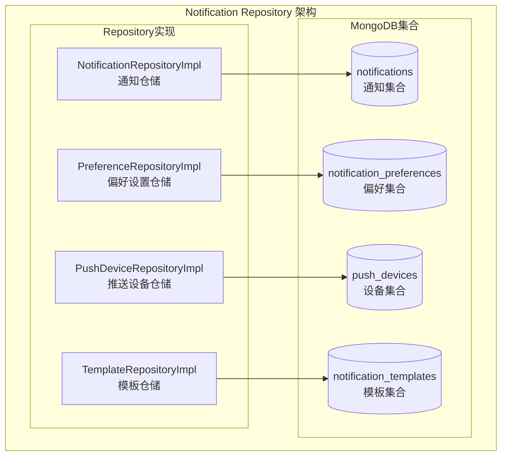

# Notification Repository 模块 - 通知存储层

## 模块职责

**Notification Repository 模块**负责通知数据的持久化存储，提供通知的CRUD操作、批量处理和统计查询功能。

## 架构图



## 核心 Repository 列表

### 1. NotificationRepositoryImpl (notification_repository_impl.go)

**职责**: 通知的核心存储操作

**核心方法**:
- `Create` - 创建通知
- `GetByID` - 根据ID获取通知
- `Update` - 更新通知
- `Delete` - 删除通知
- `List` - 获取通知列表（支持过滤和分页）
- `Count` - 统计通知数量
- `BatchMarkAsRead` - 批量标记已读
- `MarkAllAsReadForUser` - 标记用户所有通知已读
- `BatchDelete` - 批量删除
- `DeleteAllForUser` - 删除用户所有通知
- `CountUnread` - 统计未读数量
- `GetStats` - 获取通知统计（按类型、优先级）
- `GetUnreadByType` - 获取指定类型的未读通知
- `DeleteExpired` - 删除过期通知
- `DeleteOldNotifications` - 删除旧通知
- `DeleteReadForUser` - 删除用户已读通知

### 2. PreferenceRepositoryImpl (preference_repository_impl.go)

**职责**: 用户通知偏好设置的存储

**核心方法**:
- 获取/设置用户通知偏好
- 管理通知渠道开关
- 管理通知类型订阅

### 3. PushDeviceRepositoryImpl (push_device_repository_impl.go)

**职责**: 推送设备Token的管理

**核心方法**:
- 注册设备Token
- 更新设备信息
- 删除设备Token
- 获取用户所有设备

### 4. TemplateRepositoryImpl (template_repository_impl.go)

**职责**: 通知模板的存储管理

**核心方法**:
- 创建/获取/更新/删除模板
- 按类型获取模板列表
- 模板激活状态管理

## 依赖关系

### 依赖的模块
- `models/notification` - 通知数据模型
- `repository/interfaces/notification` - 通知仓储接口

### 被依赖的模块
- `service/notification` - 通知服务层

## 数据模型

### Notification (通知)
```go
type Notification struct {
    ID        primitive.ObjectID    `bson:"_id"`
    UserID    string                `bson:"user_id"`
    Type      NotificationType      `bson:"type"`
    Title     string                `bson:"title"`
    Content   string                `bson:"content"`
    Priority  NotificationPriority  `bson:"priority"`
    Read      bool                  `bson:"read"`
    ReadAt    *time.Time            `bson:"read_at,omitempty"`
    Data      map[string]interface{} `bson:"data,omitempty"`
    ExpiresAt *time.Time            `bson:"expires_at,omitempty"`
    CreatedAt time.Time             `bson:"created_at"`
    UpdatedAt time.Time             `bson:"updated_at"`
}
```

### NotificationFilter (查询过滤器)
```go
type NotificationFilter struct {
    UserID    *string                `json:"user_id"`
    Type      *NotificationType      `json:"type"`
    Read      *bool                  `json:"read"`
    Priority  *NotificationPriority  `json:"priority"`
    StartDate *time.Time             `json:"start_date"`
    EndDate   *time.Time             `json:"end_date"`
    Keyword   *string                `json:"keyword"`
    SortBy    string                 `json:"sort_by"`
    SortOrder string                 `json:"sort_order"`
    Limit     int                    `json:"limit"`
    Offset    int                    `json:"offset"`
}
```

### NotificationStats (统计数据)
```go
type NotificationStats struct {
    TotalCount     int64                       `json:"total_count"`
    UnreadCount    int64                       `json:"unread_count"`
    TypeCounts     map[NotificationType]int64  `json:"type_counts"`
    PriorityCounts map[NotificationPriority]int64 `json:"priority_counts"`
}
```

## MongoDB 索引

```javascript
// notifications 集合索引
db.notifications.createIndex({ "user_id": 1, "created_at": -1 })
db.notifications.createIndex({ "user_id": 1, "read": 1 })
db.notifications.createIndex({ "type": 1 })
db.notifications.createIndex({ "expires_at": 1 }, { expireAfterSeconds: 0 })
```

---

**版本**: v1.0
**更新日期**: 2026-03-22
**维护者**: Notification Repository模块开发组
