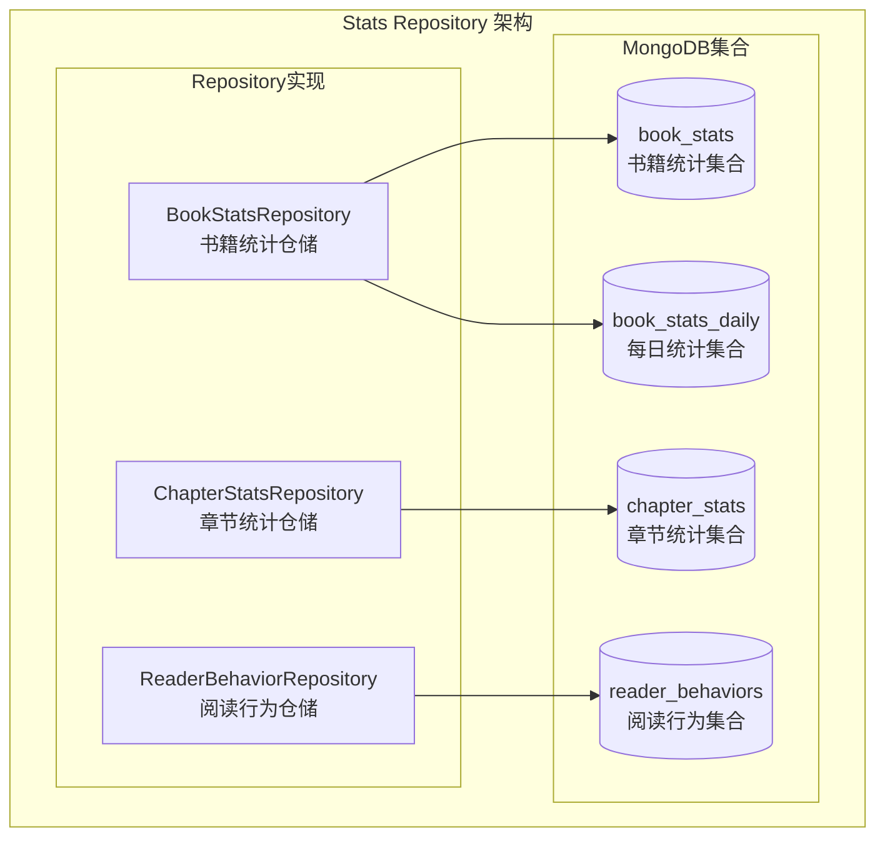

# Stats Repository 模块 - 统计数据存储层

## 模块职责

**Stats Repository 模块**负责统计数据的持久化存储，提供书籍统计、章节统计和用户阅读行为的存储与查询功能。

## 架构图



## 核心 Repository 列表

### 1. MongoBookStatsRepository (book_stats_repository_mongo.go)

**职责**: 书籍统计数据的存储操作，包括汇总统计和每日统计

**核心方法**:
- `Create` - 创建书籍统计
- `GetByID` - 根据ID获取统计
- `Update` - 更新统计
- `Delete` - 删除统计
- `GetByBookID` - 根据书籍ID获取统计
- `GetByAuthorID` - 根据作者ID获取统计列表
- `GetByDateRange` - 根据日期范围获取统计
- `CreateDailyStats` - 创建每日统计
- `GetDailyStats` - 获取指定日期统计
- `GetDailyStatsRange` - 获取日期范围统计
- `GetRevenueBreakdown` - 获取收入细分
- `CalculateTotalRevenue` - 计算总收入
- `CalculateRevenueByType` - 按类型计算收入
- `AnalyzeViewTrend` - 分析阅读量趋势
- `AnalyzeRevenueTrend` - 分析收入趋势
- `CalculateAvgCompletionRate` - 计算平均完读率
- `CalculateAvgDropOffRate` - 计算平均跳出率
- `CalculateAvgReadingDuration` - 计算平均阅读时长
- `GetTopBooksByViews` - 获取阅读量最高作品
- `GetTopBooksByRevenue` - 获取收入最高作品
- `GetTopBooksByCompletion` - 获取完读率最高作品
- `BatchCreate` - 批量创建
- `CountByAuthor` - 按作者统计数量

### 2. ChapterStatsRepository (chapter_stats_repository_mongo.go)

**职责**: 章节统计数据的存储操作

**核心方法**:
- 章节阅读统计
- 章节收入统计
- 章节跳出率统计

### 3. ReaderBehaviorRepository (reader_behavior_repository_mongo.go)

**职责**: 用户阅读行为数据的存储操作

**核心方法**:
- 记录用户阅读行为
- 查询用户行为历史
- 行为统计分析

## 依赖关系

### 依赖的模块
- `models/stats` - 统计数据模型
- `repository/interfaces/stats` - 统计仓储接口
- `repository/interfaces/infrastructure` - 基础设施接口

### 被依赖的模块
- `service/bookstore` - 书城服务层
- `service/shared/stats` - 统计服务层
- `service/admin` - 管理员统计服务

## 数据模型

### BookStats (书籍统计)
```go
type BookStats struct {
    ID                  string    `bson:"_id"`
    BookID              string    `bson:"book_id"`
    AuthorID            string    `bson:"author_id"`
    StatDate            time.Time `bson:"stat_date"`
    TotalViews          int64     `bson:"total_views"`
    DailyViews          int64     `bson:"daily_views"`
    TotalCollections    int64     `bson:"total_collections"`
    DailyCollections    int64     `bson:"daily_collections"`
    TotalRevenue        float64   `bson:"total_revenue"`
    DailyRevenue        float64   `bson:"daily_revenue"`
    ChapterRevenue      float64   `bson:"chapter_revenue"`
    SubscribeRevenue    float64   `bson:"subscribe_revenue"`
    RewardRevenue       float64   `bson:"reward_revenue"`
    AvgCompletionRate   float64   `bson:"avg_completion_rate"`
    AvgDropOffRate      float64   `bson:"avg_drop_off_rate"`
    AvgReadingDuration  float64   `bson:"avg_reading_duration"`
    CreatedAt           time.Time `bson:"created_at"`
    UpdatedAt           time.Time `bson:"updated_at"`
}
```

### BookStatsDaily (每日统计)
```go
type BookStatsDaily struct {
    ID               string    `bson:"_id"`
    BookID           string    `bson:"book_id"`
    Date             time.Time `bson:"date"`
    DailyViews       int64     `bson:"daily_views"`
    DailyCollections int64     `bson:"daily_collections"`
    DailyRevenue     float64   `bson:"daily_revenue"`
    NewReaders       int64     `bson:"new_readers"`
    ActiveReaders    int64     `bson:"active_readers"`
    CreatedAt        time.Time `bson:"created_at"`
    UpdatedAt        time.Time `bson:"updated_at"`
}
```

### RevenueBreakdown (收入细分)
```go
type RevenueBreakdown struct {
    BookID           string    `json:"book_id"`
    ChapterRevenue   float64   `json:"chapter_revenue"`
    SubscribeRevenue float64   `json:"subscribe_revenue"`
    RewardRevenue    float64   `json:"reward_revenue"`
    TotalRevenue     float64   `json:"total_revenue"`
    StartDate        time.Time `json:"start_date"`
    EndDate          time.Time `json:"end_date"`
}
```

### TopChapters (热门章节)
```go
type TopChapters struct {
    BookID           string                     `json:"book_id"`
    MostViewed       []*ChapterStatsAggregate   `json:"most_viewed"`
    HighestRevenue   []*ChapterStatsAggregate   `json:"highest_revenue"`
    LowestCompletion []*ChapterStatsAggregate   `json:"lowest_completion"`
    HighestDropOff   []*ChapterStatsAggregate   `json:"highest_drop_off"`
}
```

## 趋势分析常量

```go
const (
    TrendUp     = "up"     // 上升趋势
    TrendDown   = "down"   // 下降趋势
    TrendStable = "stable" // 稳定趋势
)
```

## MongoDB 索引

```javascript
// book_stats 集合索引
db.book_stats.createIndex({ "book_id": 1, "stat_date": -1 })
db.book_stats.createIndex({ "author_id": 1, "total_views": -1 })
db.book_stats.createIndex({ "total_views": -1 })
db.book_stats.createIndex({ "total_revenue": -1 })
db.book_stats.createIndex({ "avg_completion_rate": -1 })

// book_stats_daily 集合索引
db.book_stats_daily.createIndex({ "book_id": 1, "date": 1 })
db.book_stats_daily.createIndex({ "date": 1 })

// chapter_stats 集合索引
db.chapter_stats.createIndex({ "chapter_id": 1 })
db.chapter_stats.createIndex({ "book_id": 1, "views": -1 })

// reader_behaviors 集合索引
db.reader_behaviors.createIndex({ "user_id": 1, "created_at": -1 })
db.reader_behaviors.createIndex({ "book_id": 1 })
```

## 聚合查询示例

### 收入细分聚合
```javascript
db.book_stats.aggregate([
    { $match: { book_id: "xxx", stat_date: { $gte: startDate, $lte: endDate } } },
    { $group: {
        _id: null,
        chapter_revenue: { $sum: "$chapter_revenue" },
        subscribe_revenue: { $sum: "$subscribe_revenue" },
        reward_revenue: { $sum: "$reward_revenue" },
        total_revenue: { $sum: "$total_revenue" }
    }}
])
```

### 平均完读率聚合
```javascript
db.book_stats.aggregate([
    { $match: { book_id: "xxx" } },
    { $group: {
        _id: null,
        avg_completion_rate: { $avg: "$avg_completion_rate" }
    }}
])
```

---

**版本**: v1.0
**更新日期**: 2026-03-22
**维护者**: Stats Repository模块开发组
