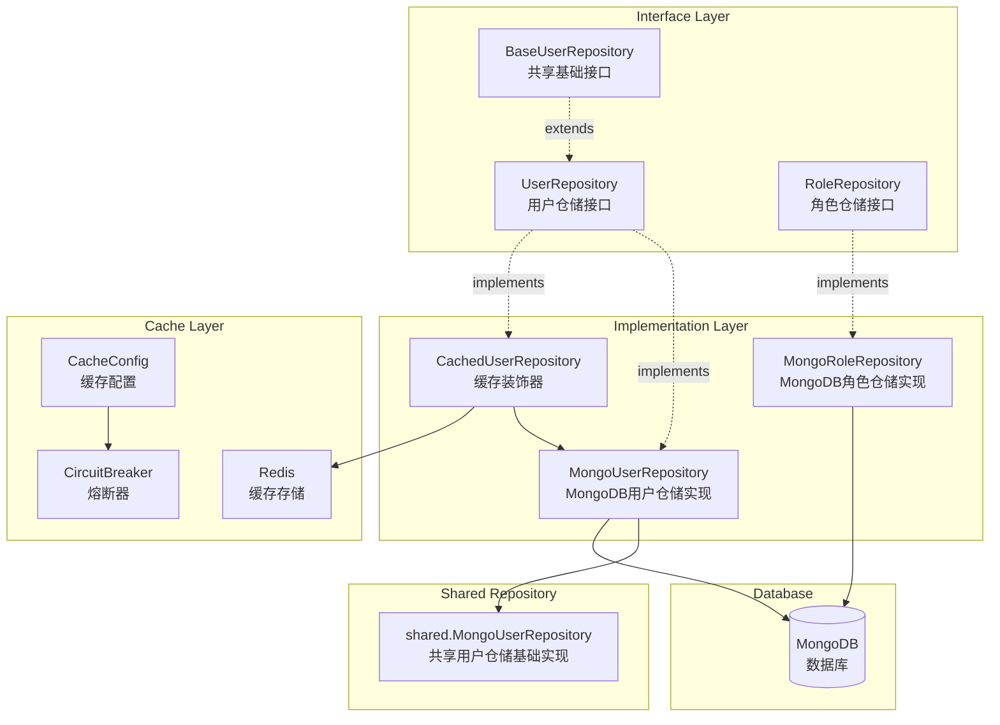
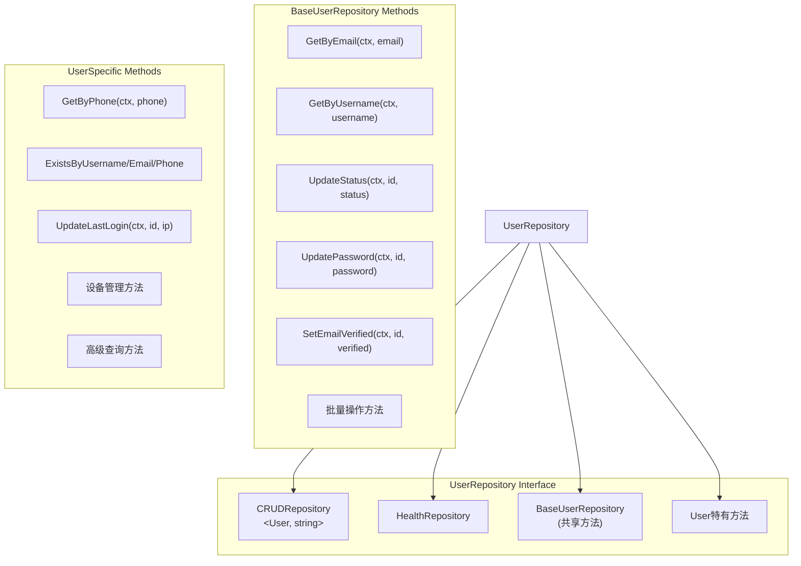
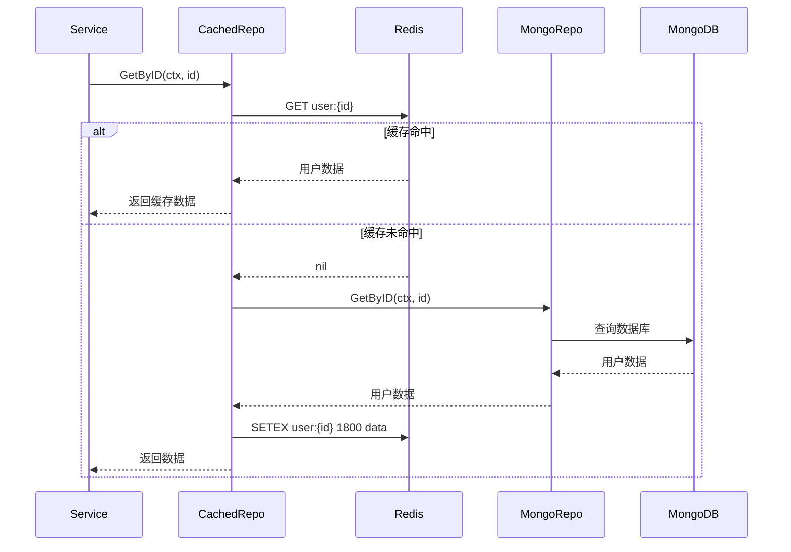

# User Repository 模块架构文档

用户仓储模块，提供用户和角色数据的 MongoDB 存储实现，包含缓存装饰器。

## 架构图



## 接口层次结构



## 核心 Repository 列表

### MongoUserRepository - 用户仓储实现

MongoDB 用户数据访问实现，组合使用 `shared.MongoUserRepository` 提供基础功能。

#### 继承的基础方法（通过 BaseUserRepository）

| 方法 | 说明 |
|------|------|
| `Create(ctx, user)` | 创建用户 |
| `GetByID(ctx, id)` | 根据ID获取用户 |
| `Update(ctx, id, updates)` | 更新用户信息 |
| `Delete(ctx, id)` | 软删除用户 |
| `GetByEmail(ctx, email)` | 根据邮箱获取用户 |
| `GetByUsername(ctx, username)` | 根据用户名获取用户 |
| `UpdateStatus(ctx, id, status)` | 更新用户状态 |
| `UpdatePassword(ctx, id, hashedPassword)` | 更新密码 |
| `SetEmailVerified(ctx, id, verified)` | 设置邮箱验证状态 |
| `BatchUpdateStatus(ctx, ids, status)` | 批量更新状态 |
| `BatchDelete(ctx, ids)` | 批量删除 |
| `CountByStatus(ctx, status)` | 按状态统计 |
| `CountByRole(ctx, role)` | 按角色统计 |

#### User 模块特有方法

| 方法 | 说明 |
|------|------|
| `GetByPhone(ctx, phone)` | 根据手机号获取用户 |
| `ExistsByUsername(ctx, username)` | 检查用户名是否存在 |
| `ExistsByEmail(ctx, email)` | 检查邮箱是否存在 |
| `ExistsByPhone(ctx, phone)` | 检查手机号是否存在 |
| `UpdateLastLogin(ctx, id, ip)` | 更新最后登录时间和IP |
| `UpdatePasswordByEmail(ctx, email, password)` | 根据邮箱更新密码 |
| `GetActiveUsers(ctx, limit)` | 获取活跃用户列表 |
| `GetUsersByRole(ctx, role, limit)` | 根据角色获取用户列表 |
| `SetPhoneVerified(ctx, id, verified)` | 设置手机验证状态 |
| `UnbindEmail(ctx, id)` | 解绑邮箱 |
| `UnbindPhone(ctx, id)` | 解绑手机 |
| `DeleteDevice(ctx, userID, deviceID)` | 删除设备（占位） |
| `GetDevices(ctx, userID)` | 获取设备列表（占位） |
| `FindWithFilter(ctx, filter)` | 高级过滤查询 |
| `SearchUsers(ctx, keyword, limit)` | 关键词搜索用户 |
| `Transaction(ctx, user, fn)` | 执行事务操作 |
| `HardDelete(ctx, id)` | 硬删除用户 |

### MongoRoleRepository - 角色仓储实现

MongoDB 角色数据访问实现。

| 方法 | 说明 |
|------|------|
| `Create(ctx, role)` | 创建角色 |
| `GetByID(ctx, id)` | 根据ID获取角色 |
| `Update(ctx, id, updates)` | 更新角色信息 |
| `Delete(ctx, id)` | 删除角色 |
| `GetByName(ctx, name)` | 根据名称获取角色 |
| `GetDefaultRole(ctx)` | 获取默认角色 |
| `ExistsByName(ctx, name)` | 检查角色名是否存在 |
| `ListAllRoles(ctx)` | 列出所有角色 |
| `ListDefaultRoles(ctx)` | 列出默认角色 |
| `GetRolePermissions(ctx, roleID)` | 获取角色权限列表 |
| `UpdateRolePermissions(ctx, roleID, permissions)` | 更新角色权限 |
| `AddPermission(ctx, roleID, permission)` | 添加权限 |
| `RemovePermission(ctx, roleID, permission)` | 移除权限 |
| `CountByName(ctx, name)` | 按名称统计 |

## 缓存装饰器说明

### CachedUserRepository

为 `MongoUserRepository` 添加 Redis 缓存层的装饰器实现。



### 缓存配置

```go
CacheConfig{
    Enabled:           true,
    DoubleDeleteDelay: 1 * time.Second,  // 双删延迟
    NullCacheTTL:      30 * time.Second, // 空值缓存时间
    NullCachePrefix:   "@@NULL@@",       // 空值缓存前缀
}
```

### 熔断器配置

```go
BreakerSettings{
    Name:        "user-cache-breaker",
    MaxRequests: 3,              // 半开状态最大请求数
    Interval:    10 * time.Second,
    Timeout:     30 * time.Second,
    ReadyToTrip: func(counts) bool {
        // 失败率 >= 60% 且请求数 >= 3 时触发熔断
        return counts.Requests >= 3 &&
               failureRatio >= 0.6
    },
}
```

### 缓存方法

| 方法 | 缓存策略 |
|------|----------|
| `GetByID` | 读缓存，未命中则查库并写入缓存 |
| `Create` | 直接写库，不缓存 |
| `Update` | 写库后删除缓存 |
| `Delete` | 删除库数据并删除缓存 |
| `Exists` | 检查缓存是否存在 |

### 使用方式

```go
// 创建基础仓储
baseRepo := NewMongoUserRepository(db)

// 包装缓存装饰器
cachedRepo := WrapUserRepositoryWithCache(baseRepo, redisClient)

// 使用缓存仓储（透明缓存）
user, err := cachedRepo.GetByID(ctx, userID)
```

## 接口定义位置

接口定义位于 `repository/interfaces/user/` 目录:

| 文件 | 内容 |
|------|------|
| `UserRepository_interface.go` | UserRepository 接口、UserFilter、配置类型 |
| `RoleRepository_interface.go` | RoleRepository 接口 |
| `base_user_repository.go` | BaseUserRepository 共享基础接口 |

## 错误类型

Repository 层使用统一的错误类型:

| 错误类型 | 说明 |
|----------|------|
| `ErrorTypeNotFound` | 资源未找到 |
| `ErrorTypeDuplicate` | 重复键冲突 |
| `ErrorTypeValidation` | 数据验证失败 |
| `ErrorTypeConnection` | 数据库连接失败 |
| `ErrorTypeTimeout` | 操作超时 |
| `ErrorTypeInternal` | 内部错误 |
| `ErrorTypeTransaction` | 事务错误 |

## 文件结构

```
repository/mongodb/user/
├── user_repository_mongo.go      # MongoDB用户仓储实现
├── role_repository_mongo.go      # MongoDB角色仓储实现
├── cached_user_repository.go     # 缓存装饰器实现
├── user_repository_test.go       # 用户仓储测试
├── role_repository_test.go       # 角色仓储测试
└── cached_user_repository_test.go # 缓存装饰器测试
```

## 设计模式

### 装饰器模式

`CachedUserRepository` 使用装饰器模式为 `MongoUserRepository` 添加缓存功能:

- 透明缓存：调用方无需感知缓存存在
- 可插拔：缓存层可独立开关
- 单一职责：缓存逻辑与数据访问逻辑分离

### 组合模式

`MongoUserRepository` 组合使用 `shared.MongoUserRepository`:

- 复用共享的基础实现
- 添加 user 模块特有方法
- 保持接口兼容性

### 工厂模式

通过 `NewMongoUserRepository` 和 `WrapUserRepositoryWithCache` 工厂函数创建实例:

- 隐藏实现细节
- 统一初始化逻辑
- 便于依赖注入
