# Writer Repository 模块

写作工作台数据持久化层，基于 MongoDB 实现，提供项目、文档、角色、地点、时间线等实体的数据访问能力。

## 模块职责

Writer Repository 负责管理与写作工作台相关的所有数据持久化操作，封装 MongoDB 的具体实现细节，为 Service 层提供统一的数据访问接口。

## 架构图

```mermaid
graph TB
    subgraph "Repository 接口层 (interfaces/writer/)"
        PI[ProjectRepository]
        DI[DocumentRepository]
        DCI[DocumentContentRepository]
        CI[CharacterRepository]
        LI[LocationRepository]
        TI[TimelineRepository]
        TEI[TimelineEventRepository]
        CmI[CommentRepository]
        OI[OutlineRepository]
        TmI[TemplateRepository]
        BrI[BatchOperationRepository]
        OLI[OperationLogRepository]
    end

    subgraph "MongoDB 实现层 (mongodb/writer/)"
        PM[MongoProjectRepository]
        DM[MongoDocumentRepository]
        DCM[MongoDocumentContentRepository]
        CM[MongoCharacterRepository]
        LM[MongoLocationRepository]
        TM[MongoTimelineRepository]
        CmM[MongoCommentRepository]
        OM[MongoOutlineRepository]
        TmM[MongoTemplateRepository]
        BrM[MongoBatchOperationRepository]
        OLM[OperationLogRepository]
        PUM[MongoPublicationRepository]
    end

    subgraph "基础设施"
        Base[BaseMongoRepository]
        MDB[(MongoDB)]
    end

    PI --> PM
    DI --> DM
    DCI --> DCM
    CI --> CM
    LI --> LM
    TI --> TM
    CmI --> CmM
    OI --> OM
    TmI --> TmM
    BrI --> BrM

    PM --> Base
    DM --> Base
    DCM --> Base
    CM --> Base
    LM --> Base
    TM --> Base
    CmM --> Base
    OM --> Base
    TmM --> Base
    BrM --> Base

    Base --> MDB
```



## 核心 Repository 列表

### 项目与文档

| Repository | 接口定义 | 职责 |
|------------|----------|------|
| `MongoProjectRepository` | `ProjectRepository` | 项目 CRUD、按作者查询、软删除/恢复、统计 |
| `MongoDocumentRepository` | `DocumentRepository` | 文档 CRUD、树形查询、批量操作、软删除 |
| `MongoDocumentContentRepository` | `DocumentContentRepository` | 文档内容存储、版本控制、GridFS 大文件支持 |

### 创作素材

| Repository | 接口定义 | 职责 |
|------------|----------|------|
| `MongoCharacterRepository` | `CharacterRepository` | 角色卡 CRUD、角色关系管理、按项目查询 |
| `MongoLocationRepository` | `LocationRepository` | 地点 CRUD、层级关系、地点关系管理 |
| `MongoTimelineRepository` | `TimelineRepository` | 时间线 CRUD、事件关联 |
| `MongoOutlineRepository` | `OutlineRepository` | 大纲管理 |

### 协作与批注

| Repository | 接口定义 | 职责 |
|------------|----------|------|
| `MongoCommentRepository` | `CommentRepository` | 批注/评论 CRUD、线程管理、统计分析 |

### 发布与导出

| Repository | 接口定义 | 职责 |
|------------|----------|------|
| `MongoPublicationRepository` | `PublicationRepository` | 发布记录管理、状态追踪 |

### 其他

| Repository | 接口定义 | 职责 |
|------------|----------|------|
| `MongoTemplateRepository` | `TemplateRepository` | 文档模板管理 |
| `MongoBatchOperationRepository` | `BatchOperationRepository` | 批量操作记录 |
| `OperationLogRepository` | - | 操作日志记录 |

## 接口方法概览

### ProjectRepository

```go
type ProjectRepository interface {
    // 基础 CRUD
    Create(ctx context.Context, project *writer.Project) error
    GetByID(ctx context.Context, id string) (*writer.Project, error)
    Update(ctx context.Context, id string, updates map[string]interface{}) error
    Delete(ctx context.Context, id string) error
    List(ctx context.Context, filter Filter) ([]*writer.Project, error)

    // 项目特定查询
    GetListByOwnerID(ctx context.Context, ownerID string, limit, offset int64) ([]*writer.Project, error)
    GetByOwnerAndStatus(ctx context.Context, ownerID, status string, limit, offset int64) ([]*writer.Project, error)
    UpdateByOwner(ctx context.Context, projectID, ownerID string, updates map[string]interface{}) error
    IsOwner(ctx context.Context, projectID, ownerID string) (bool, error)

    // 删除恢复
    SoftDelete(ctx context.Context, projectID, ownerID string) error
    HardDelete(ctx context.Context, projectID string) error
    Restore(ctx context.Context, projectID, ownerID string) error

    // 统计
    CountByOwner(ctx context.Context, ownerID string) (int64, error)
    CountByStatus(ctx context.Context, status string) (int64, error)

    // 事务
    CreateWithTransaction(ctx context.Context, project *writer.Project, callback func(ctx context.Context) error) error
}
```

### DocumentRepository

```go
type DocumentRepository interface {
    // 基础 CRUD
    Create(ctx context.Context, document *writer.Document) error
    GetByID(ctx context.Context, id string) (*writer.Document, error)
    Update(ctx context.Context, id string, updates map[string]interface{}) error
    Delete(ctx context.Context, id string) error

    // 文档特定查询
    GetByProjectID(ctx context.Context, projectID string, limit, offset int64) ([]*writer.Document, error)
    GetByProjectAndType(ctx context.Context, projectID, documentType string, limit, offset int64) ([]*writer.Document, error)
    GetByIDs(ctx context.Context, ids []string) ([]*writer.Document, error)

    // 项目关联操作
    UpdateByProject(ctx context.Context, documentID, projectID string, updates map[string]interface{}) error
    SoftDelete(ctx context.Context, documentID, projectID string) error
    IsProjectMember(ctx context.Context, documentID, projectID string) (bool, error)

    // 统计
    CountByProject(ctx context.Context, projectID string) (int64, error)
}
```

### DocumentContentRepository

```go
type DocumentContentRepository interface {
    // 基础 CRUD
    Create(ctx context.Context, content *writer.DocumentContent) error
    GetByDocumentID(ctx context.Context, documentID string) (*writer.DocumentContent, error)
    Update(ctx context.Context, id string, updates map[string]interface{}) error

    // 版本控制
    UpdateWithVersion(ctx context.Context, documentID string, updates map[string]interface{}, expectedVersion int) error

    // 批量操作
    BatchUpdateContent(ctx context.Context, updates map[string]string) error

    // 统计
    GetContentStats(ctx context.Context, documentID string) (wordCount, charCount int, err error)

    // 大文件支持
    StoreToGridFS(ctx context.Context, documentID string, content []byte) (gridFSID string, err error)
    LoadFromGridFS(ctx context.Context, gridFSID string) (content []byte, err error)
}
```

## 版本控制相关说明

### 乐观锁机制

`DocumentContentRepository` 实现了乐观锁版本控制：

1. **版本字段**：每个 `DocumentContent` 包含 `version` 字段
2. **条件更新**：`UpdateWithVersion` 方法验证 `expectedVersion` 匹配当前版本
3. **冲突错误**：版本不匹配时返回 `ErrOptimisticLockConflict`

```go
// 乐观锁更新示例
err := repo.UpdateWithVersion(ctx, documentID, updates, expectedVersion)
if errors.Is(err, writerRepo.ErrOptimisticLockConflict) {
    // 处理版本冲突
}
```

### 软删除机制

项目与文档采用软删除策略：

- **删除**：设置 `deleted_at` 字段为当前时间
- **恢复**：清除 `deleted_at` 字段
- **查询**：默认过滤 `deleted_at != nil` 的记录
- **硬删除**：物理删除（仅用于清理）

### 事务支持

关键操作支持 MongoDB 事务：

```go
err := repo.CreateWithTransaction(ctx, project, func(ctx context.Context) error {
    // 在同一事务中执行关联操作
    return nil
})
```

## 索引管理

各 Repository 实现了 `EnsureIndexes` 方法，创建必要的查询索引：

### projects 集合

- `author_id` (单字段)
- `status` (单字段)
- `created_at` (降序)
- `author_id + status` (复合)
- `author_id + updated_at` (复合)

### documents 集合

- `project_id` (单字段)
- `project_id + parent_id` (复合)
- `project_id + level + order` (复合)
- `type` (单字段)

### characters 集合

- `project_id` (单字段)

### character_relations 集合

- `project_id` (单字段)
- `from_id + to_id` (复合)

## 错误处理

Repository 层返回标准化的错误类型：

```go
// 资源不存在
errors.NewRepositoryError(errors.RepositoryErrorNotFound, "character not found", err)

// 内部错误
errors.NewRepositoryError(errors.RepositoryErrorInternal, "create character failed", err)
```

## 继承关系

所有 MongoDB Repository 实现都继承自 `BaseMongoRepository`：

```go
type MongoProjectRepository struct {
    *base.BaseMongoRepository  // 提供 ParseID, GetCollection 等通用方法
    db *mongo.Database
}
```

BaseMongoRepository 提供的能力：
- `ParseID(id string)` - 字符串 ID 转 ObjectID
- `GetCollection()` - 获取 MongoDB Collection
- `Create`, `GetByID`, `Update`, `Delete` 等通用 CRUD
