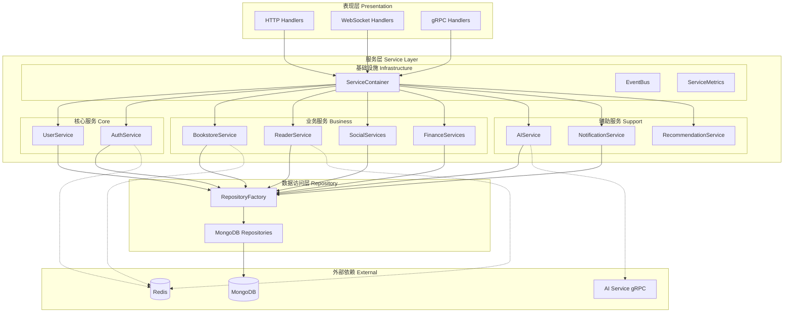
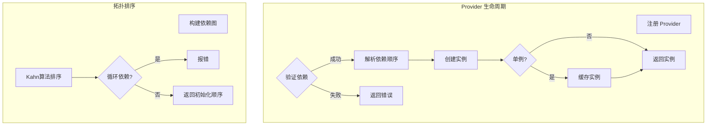
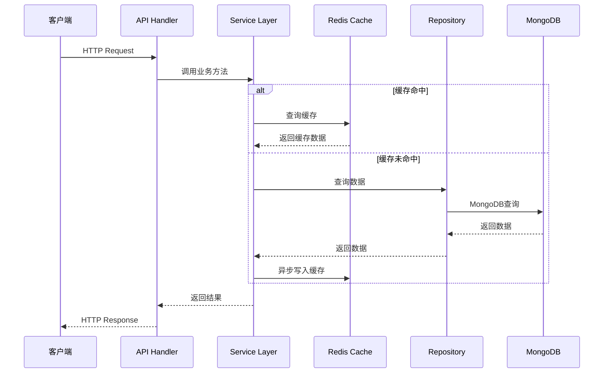
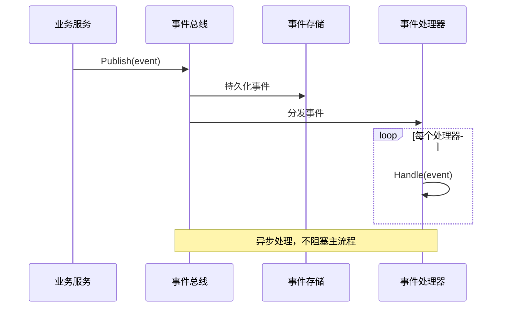
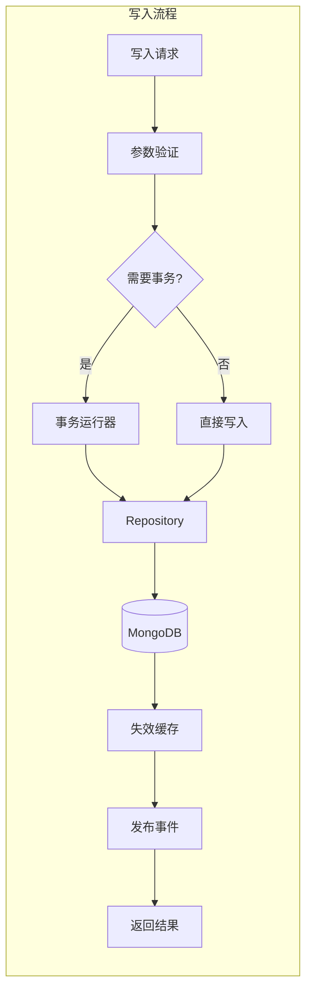
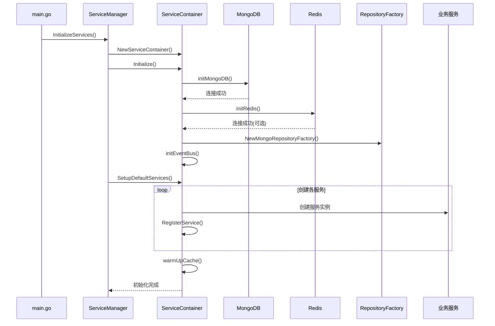
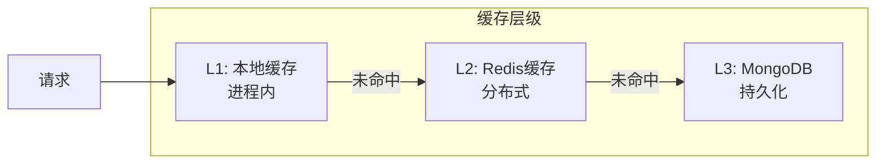

# Service 层架构详细文档

本文档详细描述 Service 层的设计理念、架构决策和实现细节。

## 目录

1. [架构概述](#架构概述)
2. [依赖注入容器设计](#依赖注入容器设计)
3. [数据流说明](#数据流说明)
4. [核心设计模式](#核心设计模式)
5. [模块间依赖关系](#模块间依赖关系)
6. [服务初始化流程](#服务初始化流程)
7. [错误处理策略](#错误处理策略)
8. [性能优化策略](#性能优化策略)

---

## 架构概述

### 分层架构



### 架构原则

1. **单一职责**：每个服务专注于一个业务领域
2. **依赖倒置**：服务依赖接口而非具体实现
3. **接口隔离**：接口按业务需求划分，避免臃肿
4. **开闭原则**：通过装饰器扩展功能，不修改原有代码

---

## 依赖注入容器设计

### ServiceContainer 结构

```go
type ServiceContainer struct {
    // 基础设施
    repositoryFactory RepositoryFactory
    eventBus          EventBus
    redisClient       RedisClient
    mongoClient       *mongo.Client
    mongoDB           *mongo.Database

    // Provider注册表（ARCH-003重构）
    providerRegistry  *ProviderRegistry

    // 服务存储
    services          map[string]BaseService
    serviceMetrics    map[string]*ServiceMetrics

    // 业务服务字段
    userService       UserService
    bookstoreService  BookstoreService
    // ... 更多服务
}
```

### Provider 注册表

Provider 模式提供声明式的服务注册和依赖管理：

```go
type Provider struct {
    // Name 服务名称，必须唯一
    Name string

    // Factory 服务工厂函数
    Factory func(*ServiceContainer) (interface{}, error)

    // Dependencies 显式声明的依赖项
    Dependencies []string

    // Singleton 是否为单例服务
    Singleton bool

    // Lazy 是否延迟初始化
    Lazy bool
}
```

### Provider 注册表特性



### Provider 使用示例

```go
// 注册通用事务 Provider
c.RegisterProvider(Provider{
    Name:      "mongoTransactionRunner",
    Singleton: true,
    Lazy:      true,
    Factory: func(container *ServiceContainer) (interface{}, error) {
        return pkgtransaction.NewMongoRunner(
            container.repositoryFactory.GetClient()
        ), nil
    },
})

// 注册钱包事务 Provider（依赖通用事务）
c.RegisterProvider(Provider{
    Name:         "walletTransactionRunner",
    Dependencies: []string{"mongoTransactionRunner"},
    Singleton:    true,
    Lazy:         true,
    Factory: func(container *ServiceContainer) (interface{}, error) {
        runner, err := container.GetProvider("mongoTransactionRunner")
        if err != nil {
            return nil, err
        }
        return financeWalletService.NewGenericTransactionRunner(
            runner.(pkgtransaction.Runner)
        ), nil
    },
})
```

### 服务获取方法

```go
// 获取服务实例
func (c *ServiceContainer) GetUserService() (UserService, error) {
    if c.userService == nil {
        return nil, fmt.Errorf("UserService未初始化")
    }
    return c.userService, nil
}

// 通过 Provider 获取服务
func (c *ServiceContainer) GetProvider(name string) (interface{}, error) {
    if c.providerRegistry == nil {
        return nil, fmt.Errorf("ProviderRegistry未初始化")
    }
    return c.providerRegistry.GetOrCreate(name, c)
}
```

---

## 数据流说明

### 请求处理流程



### 事件驱动流程



### 数据写入流程



---

## 核心设计模式

### 1. 策略模式 (缓存后端)

```go
// 缓存服务接口
type CacheService interface {
    Get(ctx context.Context, key string) ([]byte, error)
    Set(ctx context.Context, key string, value []byte, ttl time.Duration) error
    Delete(ctx context.Context, key string) error
}

// Redis 实现
type RedisCacheService struct { ... }

// 内存实现（降级方案）
type MemoryCacheService struct { ... }
```

### 2. 装饰器模式 (缓存层)

```go
// 基础服务
type BookstoreServiceImpl struct {
    bookRepo BookRepository
    // ...
}

// 缓存装饰器
type CachedBookstoreService struct {
    service BookstoreService  // 被装饰的服务
    cache   CacheService
}

func (c *CachedBookstoreService) GetHomepageData(ctx context.Context) (interface{}, error) {
    cacheKey := "qingyu:bookstore:homepage"

    // 1. 尝试从缓存获取
    if cached, err := c.cache.Get(ctx, cacheKey); err == nil {
        return cached, nil
    }

    // 2. 调用原始服务
    data, err := c.service.GetHomepageData(ctx)
    if err != nil {
        return nil, err
    }

    // 3. 异步写入缓存
    go c.cache.Set(ctx, cacheKey, data, HomepageCacheExpiration)

    return data, nil
}
```

### 3. 工厂模式 (Repository 创建)

```go
type RepositoryFactory interface {
    CreateUserRepository() UserRepository
    CreateBookRepository() BookRepository
    CreateAuthRepository() RoleRepository
    // ... 更多工厂方法
}

type MongoRepositoryFactory struct {
    client *mongo.Client
    db     *mongo.Database
}

func (f *MongoRepositoryFactory) CreateUserRepository() UserRepository {
    return NewMongoUserRepository(f.db)
}
```

### 4. 观察者模式 (事件总线)

```go
// 事件接口
type Event interface {
    GetEventType() string
    GetEventData() interface{}
    GetTimestamp() time.Time
    GetSource() string
}

// 事件处理器接口
type EventHandler interface {
    Handle(ctx context.Context, event Event) error
    GetHandlerName() string
    GetSupportedEventTypes() []string
}

// 使用示例
eventBus.Subscribe("comment.created", &NotificationHandler{})
eventBus.Publish(ctx, CommentCreatedEvent{...})
```

### 5. 适配器模式 (外部系统集成)

```go
// AI服务适配器接口
type AIAdapter interface {
    Generate(ctx context.Context, req *GenerateRequest) (*GenerateResponse, error)
}

// Phase3 gRPC 适配器
type Phase3Client struct { ... }

// 统一客户端适配器
type UnifiedClient struct { ... }
```

---

## 模块间依赖关系

### 服务依赖图

```mermaid
graph TB
    subgraph "用户域"
        User[UserService]
        Auth[AuthService]
        OAuth[OAuthService]
    end

    subgraph "内容域"
        Bookstore[BookstoreService]
        Chapter[ChapterService]
        BookDetail[BookDetailService]
        Reader[ReaderService]
        ReadingHistory[ReadingHistoryService]
    end

    subgraph "社交域"
        Comment[CommentService]
        Like[LikeService]
        Collection[CollectionService]
        Follow[FollowService]
    end

    subgraph "财务域"
        Wallet[WalletService]
        Membership[MembershipService]
        AuthorRevenue[AuthorRevenueService]
    end

    subgraph "AI域"
        AI[AIService]
        Quota[QuotaService]
        Chat[ChatService]
    end

    subgraph "通知域"
        Notification[NotificationService]
        Template[TemplateService]
        Announcement[AnnouncementService]
    end

    subgraph "基础设施"
        EventBus[EventBus]
        Redis[(Redis)]
        MongoDB[(MongoDB)]
    end

    %% 依赖关系
    Auth --> User
    OAuth --> User

    Bookstore --> Chapter
    Bookstore --> BookDetail
    Reader --> Chapter
    ReadingHistory --> Reader

    Comment --> EventBus
    Like --> EventBus
    Collection --> EventBus
    Follow --> EventBus

    Wallet --> EventBus
    Membership --> Wallet
    AuthorRevenue --> Wallet

    AI --> Quota
    Chat --> AI

    Notification --> Template
    Announcement --> Notification

    %% 缓存依赖
    Bookstore -.-> Redis
    Reader -.-> Redis
    Auth -.-> Redis

    %% 数据存储依赖
    User --> MongoDB
    Bookstore --> MongoDB
    Reader --> MongoDB
    Social --> MongoDB
    Finance --> MongoDB
```



### 服务注册顺序

```mermaid
flowchart TB
    subgraph "初始化顺序"
        A[1. MongoDB连接]
        B[2. Redis连接]
        C[3. RepositoryFactory]
        D[4. EventBus]
        E[5. UserService]
        F[6. BookstoreService]
        G[7. ReaderService]
        H[8. SocialServices]
        I[9. AuthService]
        J[10. FinanceServices]
        K[11. AIService]
        L[12. NotificationService]
        M[13. AdminService]
        N[14. 缓存预热]
    end

    A --> B --> C --> D
    D --> E --> F --> G --> H
    H --> I --> J --> K --> L --> M --> N
```



---

## 服务初始化流程

### 完整初始化流程



### 服务初始化代码示例

```go
func (c *ServiceContainer) SetupDefaultServices() error {
    // ============ 1. 创建用户服务 ============
    userRepo := c.repositoryFactory.CreateUserRepository()
    roleRepo := c.repositoryFactory.CreateAuthRepository()
    c.userService = userService.NewUserService(userRepo, roleRepo)
    c.RegisterService("UserService", c.userService)

    // ============ 2. 创建书城服务（带缓存装饰器）============
    bookRepo := c.repositoryFactory.CreateBookRepository()

    // 创建缓存服务
    var bookstoreCacheService bookstoreService.CacheService
    if c.redisClient != nil {
        bookstoreCacheService = bookstoreService.NewRedisCacheService(
            c.redisClient.GetClient().(*redis.Client),
            "qingyu:bookstore",
        )
    }

    // 创建基础服务
    baseBookstoreService := bookstoreService.NewBookstoreService(bookRepo, ...)

    // 用装饰器包装
    c.bookstoreService = bookstoreService.NewCachedBookstoreService(
        baseBookstoreService,
        bookstoreCacheService,
    )

    // ============ 3. 创建阅读器服务 ============
    progressRepo := c.repositoryFactory.CreateReadingProgressRepository()
    c.readerService = readingService.NewReaderService(
        progressRepo,
        c.eventBus,
        cacheService,
        vipService,
    )

    // ... 继续创建其他服务

    return nil
}
```

---

## 错误处理策略

### 服务错误类型

```go
const (
    ErrorTypeValidation   = "VALIDATION"    // 验证错误
    ErrorTypeBusiness     = "BUSINESS"      // 业务错误
    ErrorTypeNotFound     = "NOT_FOUND"     // 资源未找到
    ErrorTypeUnauthorized = "UNAUTHORIZED"  // 未授权
    ErrorTypeForbidden    = "FORBIDDEN"     // 禁止访问
    ErrorTypeInternal     = "INTERNAL"      // 内部错误
    ErrorTypeTimeout      = "TIMEOUT"       // 超时
    ErrorTypeExternal     = "EXTERNAL"      // 外部服务错误
)

type ServiceError struct {
    Type      string
    Message   string
    Cause     error
    Service   string
    Timestamp time.Time
}
```

### 错误处理最佳实践

```go
// 1. 包装底层错误
func (s *UserService) GetUser(ctx context.Context, id string) (*User, error) {
    user, err := s.repo.FindByID(ctx, id)
    if err != nil {
        if errors.Is(err, mongo.ErrNoDocuments) {
            return nil, NewServiceError(
                "UserService",
                ErrorTypeNotFound,
                "用户不存在",
                err,
            )
        }
        return nil, NewServiceError(
            "UserService",
            ErrorTypeInternal,
            "查询用户失败",
            err,
        )
    }
    return user, nil
}

// 2. 缓存降级
func (s *CachedBookstoreService) GetHomepageData(ctx context.Context) (interface{}, error) {
    // 缓存失败不影响业务
    cached, err := s.cache.Get(ctx, "homepage")
    if err == nil {
        return cached, nil
    }
    // 降级到原始服务
    return s.service.GetHomepageData(ctx)
}
```

---

## 性能优化策略

### 缓存策略



### 缓存预热

```go
func (c *ServiceContainer) warmUpCache(ctx context.Context) error {
    if !config.GetCacheConfig().Enabled {
        return nil
    }

    warmer := cache.NewCacheWarmer(bookRepo, userRepo, redisClient)

    // 预热热点数据
    tasks := []func(context.Context) error{
        warmer.WarmUpHomepageData,
        warmer.WarmUpRankingData,
        warmer.WarmUpPopularBooks,
    }

    for _, task := range tasks {
        go func(t func(context.Context) error) {
            t(ctx)
        }(task)
    }

    return nil
}
```

### 并发控制

```go
type ServiceContainer struct {
    mu sync.RWMutex  // 保护并发访问
    // ...
}

func (c *ServiceContainer) GetService(name string) (BaseService, error) {
    c.mu.RLock()
    defer c.mu.RUnlock()

    service, exists := c.services[name]
    if !exists {
        return nil, fmt.Errorf("服务 %s 不存在", name)
    }
    return service, nil
}
```

### 服务指标收集

```go
type ServiceMetrics struct {
    serviceName string
    version     string
    requestCount   int64
    errorCount     int64
    latency        prometheus.Histogram
}

func (m *ServiceMetrics) RecordRequest(duration time.Duration, err error) {
    atomic.AddInt64(&m.requestCount, 1)
    if err != nil {
        atomic.AddInt64(&m.errorCount, 1)
    }
    m.latency.Observe(duration.Seconds())
}
```

---

## 附录

### 服务清单

| 服务名称 | 接口类型 | 缓存支持 | 事件支持 |
|----------|----------|----------|----------|
| UserService | BaseService | 否 | 否 |
| AuthService | BaseService | 是 | 否 |
| BookstoreService | 独立接口 | 是 | 否 |
| ChapterService | 独立接口 | 是 | 否 |
| ReaderService | 独立接口 | 是 | 是 |
| CommentService | 独立接口 | 否 | 是 |
| LikeService | 独立接口 | 否 | 是 |
| CollectionService | 独立接口 | 否 | 是 |
| FollowService | 独立接口 | 否 | 是 |
| WalletService | BaseService | 否 | 是 |
| MembershipService | 独立接口 | 否 | 是 |
| AIService | BaseService | 否 | 否 |
| NotificationService | BaseService | 否 | 否 |
| AdminService | BaseService | 否 | 否 |

### 配置项

```yaml
# 服务层相关配置
service:
  cache:
    enabled: true
    default_ttl: 300s
  metrics:
    enabled: true
    endpoint: /metrics
  event:
    persistent: true
    store_collection: events
```

---

*本文档最后更新: 2026-03-22*
