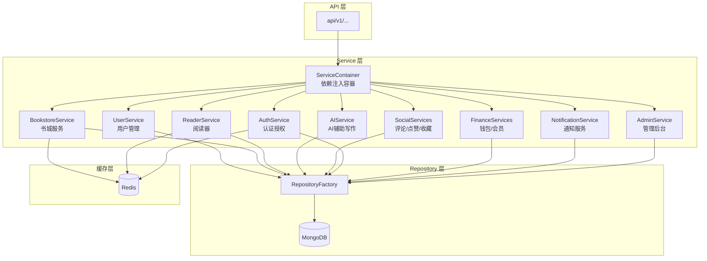
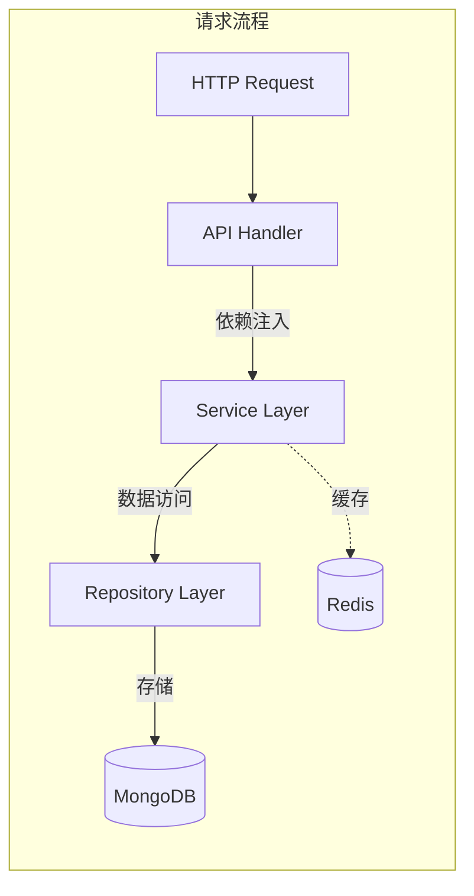
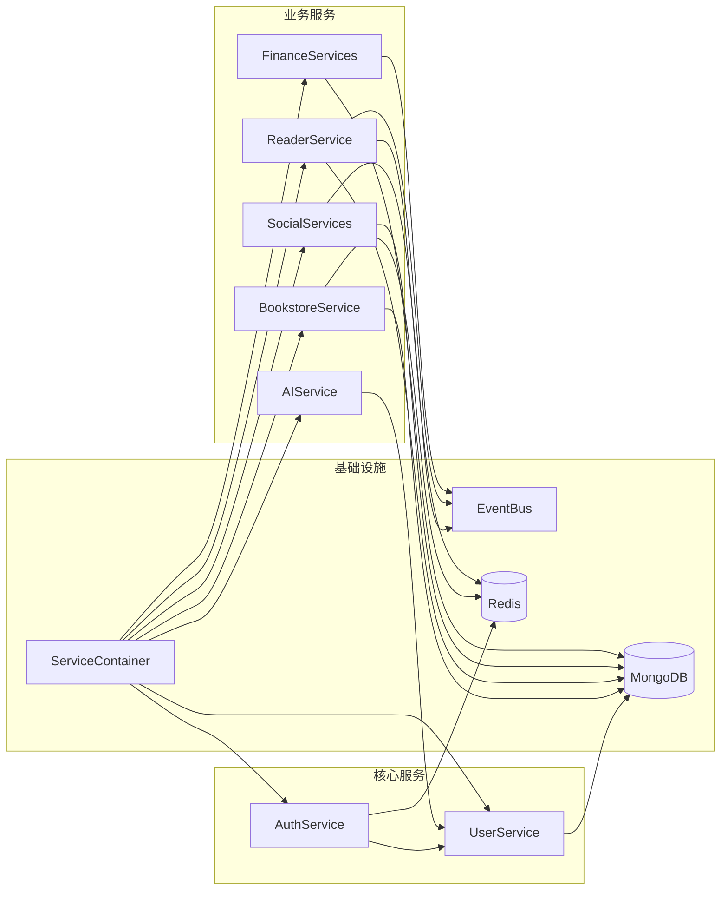
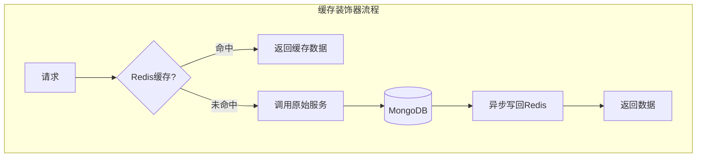
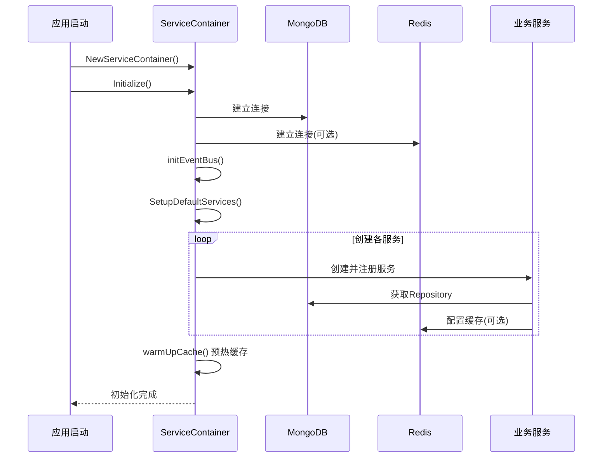

# Service 层架构文档

## 概览



## 整体架构



## 目录结构

```
service/
├── admin/              # 管理后台服务 (用户管理/内容审核/统计分析)
├── ai/                 # AI服务 (内容生成/续写/优化/配额管理)
├── audit/              # 审计服务 (内容审核/敏感词检测)
├── auth/               # 认证服务 (JWT/Session/OAuth/权限)
├── base/               # 基础服务接口 (BaseService/EventBus)
├── bookstore/          # 书城服务 (书籍/榜单/章节/评分/统计)
├── channels/           # 频道服务 (Redis消息队列)
├── container/          # 服务容器 (依赖注入/Provider注册)
├── content/            # 内容服务 (文档/进度)
├── events/             # 事件服务 (持久化事件总线)
├── finance/            # 财务服务 (钱包/会员/作者收入)
├── interfaces/         # 接口定义 (服务契约/DTO)
├── messaging/          # 消息服务 (公告)
├── notification/       # 通知服务 (站内信/推送/模板)
├── reader/             # 读者服务 (阅读进度/书签/笔记/统计)
├── recommendation/     # 推荐服务
├── search/             # 搜索服务
├── shared/             # 共享服务 (缓存/存储/指标)
├── social/             # 社交服务 (评论/点赞/收藏/关注)
├── user/               # 用户服务 (用户管理/验证/状态)
├── validation/         # 验证服务
├── writer/             # 作家服务 (写作项目/文档)
├── enter.go            # 服务入口 (全局管理器)
└── README.md           # 本文档
```

## 模块列表与核心职责

| 模块 | 核心服务 | 职责描述 |
|------|----------|----------|
| **user** | UserService | 用户CRUD、注册登录、邮箱验证、角色管理、设备管理 |
| **bookstore** | BookstoreService, ChapterService, BookDetailService | 书城首页、书籍列表、榜单、章节内容、评分统计 |
| **reader** | ReaderService, ReadingHistoryService, BookmarkService | 阅读进度、书签笔记、阅读设置、阅读统计 |
| **ai** | AIService, QuotaService, ChatService | AI内容生成、续写优化、配额管理、聊天上下文 |
| **social** | CommentService, LikeService, CollectionService, FollowService | 评论互动、点赞收藏、关注系统 |
| **auth** | AuthService, OAuthService | JWT认证、Session管理、OAuth登录、权限验证 |
| **finance** | WalletService, MembershipService, AuthorRevenueService | 钱包余额、会员订阅、作者收入分成 |
| **notification** | NotificationService, TemplateService | 站内通知、推送消息、模板管理 |
| **admin** | AdminService | 后台管理、用户统计、审核操作 |
| **shared** | StorageService, MessagingService | 文件存储、消息队列、服务指标 |
| **recommendation** | RecommendationService | 个性化推荐、书籍推荐 |

## 依赖关系概览



## 核心设计模式

### 1. 接口抽象
所有服务都定义接口，便于测试和替换：

```go
// 定义接口
type BookstoreService interface {
    GetHomepageData(ctx context.Context) (*HomepageData, error)
    GetRealtimeRanking(ctx context.Context, limit int) ([]*RankingItem, error)
    // ...
}

// 实现接口
type BookstoreServiceImpl struct { ... }
```

### 2. 装饰器模式 (缓存)
用装饰器添加缓存，不改变原实现：



### 3. 依赖注入 (DI)
在 `ServiceContainer` 统一创建和注入：

```go
// 创建缓存服务
var bookstoreCacheService bookstoreService.CacheService
if c.redisClient != nil {
    bookstoreCacheService = bookstoreService.NewRedisCacheService(redisClient, "qingyu:bookstore")
}

// 创建基础服务
baseBookstoreService := bookstoreService.NewBookstoreService(...)

// 用装饰器包装 (启用缓存)
c.bookstoreService = bookstoreService.NewCachedBookstoreService(baseBookstoreService, bookstoreCacheService)
```

### 4. 降级策略
Redis 不可用时，自动降级到 MongoDB：

```go
func (c *CachedBookstoreService) GetRealtimeRanking(ctx context.Context, limit int) ([]*RankingItem, error) {
    // 1. 尝试 Redis
    if items, err := c.cache.GetRanking(ctx, ...); err == nil {
        return items, nil
    }
    // 2. Redis 失败，降级到 MongoDB
    return c.service.GetRealtimeRanking(ctx, limit)
}
```

### 5. Provider 模式
声明式服务注册与依赖管理：

```go
Provider{
    Name:         "walletTransactionRunner",
    Dependencies: []string{"mongoTransactionRunner"},
    Singleton:    true,
    Lazy:         true,
    Factory: func(container *ServiceContainer) (interface{}, error) {
        // 创建服务实例
    },
}
```

## 缓存 Key 规范

| 服务 | Key 前缀 | 示例 |
|-----|---------|------|
| 书城 | `qingyu:bookstore:` | `qingyu:bookstore:homepage` |
| 读者 | `qingyu:reader:` | `qingyu:reader:progress:{uid}` |
| 会话 | `session:` | `session:{sessionID}` |
| Token黑名单 | `token:blacklist:` | `token:blacklist:{tokenHash}` |

## 服务生命周期



## 新服务开发指南

### 1. 定义接口
```go
// interfaces/xxx/service_interface.go
type XxxService interface {
    base.BaseService
    DoSomething(ctx context.Context, id string) (*Model, error)
}
```

### 2. 实现服务
```go
// xxx/xxx_service.go
type XxxServiceImpl struct {
    repo Repository
    cache CacheService  // 可选
}

func NewXxxService(repo Repository, cache CacheService) XxxService {
    return &XxxServiceImpl{repo: repo, cache: cache}
}
```

### 3. 注册到容器
```go
// container/service_container.go

// 1. 添加字段
type ServiceContainer struct {
    // ...
    xxxService xxxService.XxxService
}

// 2. 在 SetupDefaultServices 或新方法中创建
func (c *ServiceContainer) SetupXxxService() error {
    repo := c.repositoryFactory.CreateXxxRepository()

    // 创建缓存服务 (可选)
    var cacheService xxxService.CacheService
    if c.redisClient != nil {
        // ...
    }

    // 创建并注册
    c.xxxService = xxxService.NewXxxService(repo, cacheService)
    return nil
}
```

### 4. 注入到 API
```go
// api/v1/xxx/xxx_api.go
type XxxAPI struct {
    service xxxService.XxxService
}

func NewXxxAPI(service xxxService.XxxService) *XxxAPI {
    return &XxxAPI{service: service}
}
```

## 常见问题

### Q: 如何判断是否需要缓存?
A: 高频读取 + 计算成本高 + 数据变化不频繁 = 需要缓存

### Q: 缓存过期时间如何设置?
A: 在 `cached_bookstore_service.go` 顶部定义：
```go
const (
    HomepageCacheExpiration = 5 * time.Minute
    RankingCacheExpiration  = 10 * time.Minute
    BookCacheExpiration     = 1 * time.Hour
)
```

### Q: 如何处理缓存失败?
A: 缓存读取失败时，降级到直接查数据库，不影响业务：
```go
if items, err := c.cache.GetXxx(...); err == nil {
    return items, nil
}
// 降级: 忽略错误，继续查 DB
return c.service.GetXxx(...)
```

### Q: 如何使用 Provider 模式?
A: 使用 Provider 实现声明式依赖管理：
```go
c.RegisterProvider(Provider{
    Name:         "myService",
    Dependencies: []string{"userService", "authService"},
    Singleton:    true,
    Lazy:         true,
    Factory: func(c *ServiceContainer) (interface{}, error) {
        userSvc, _ := c.GetUserService()
        authSvc, _ := c.GetAuthService()
        return NewMyService(userSvc, authSvc), nil
    },
})
```

---

## 详见

- 详细架构文档: [ARCHITECTURE.md](./ARCHITECTURE.md)
- 完整设计文档: [docs/standards/layer-service.md](../docs/standards/layer-service.md)
