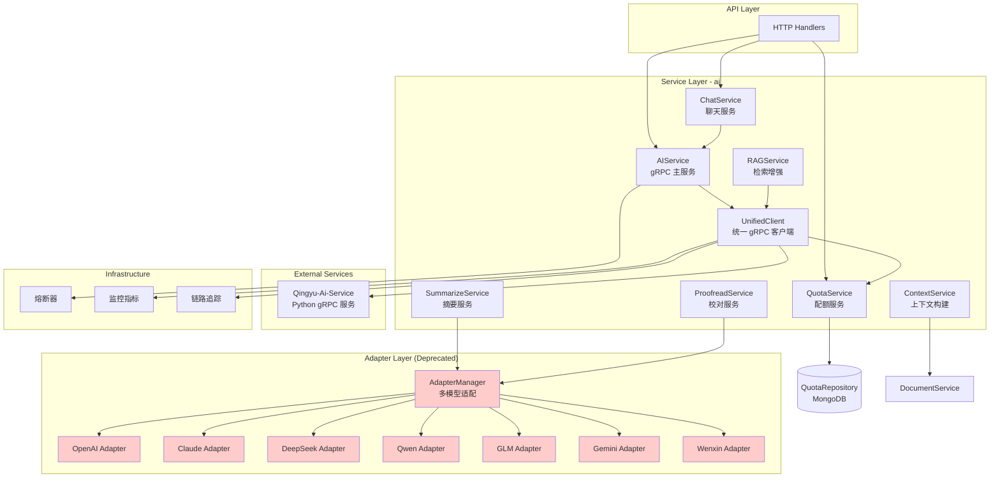
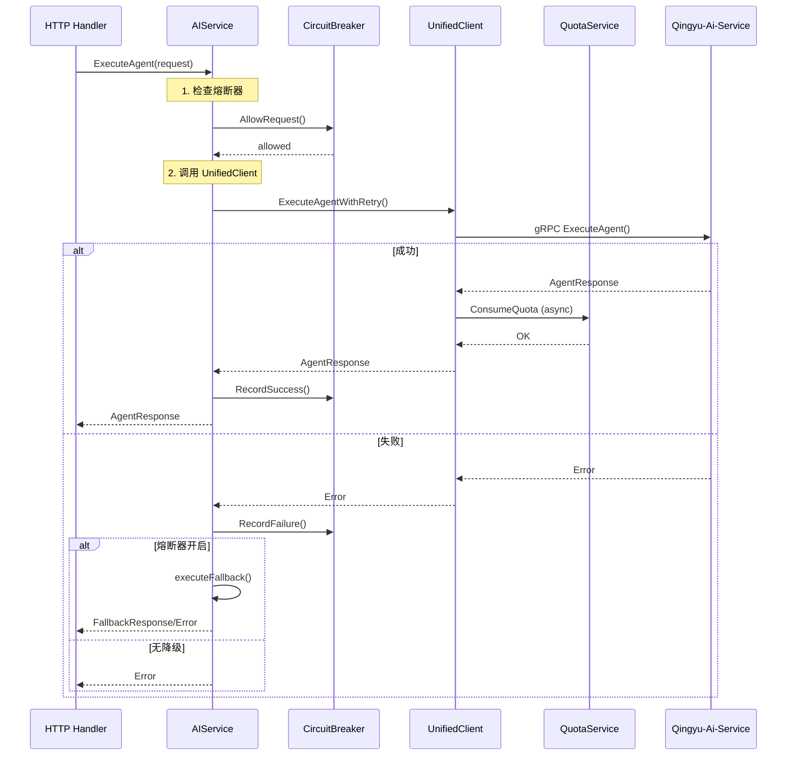
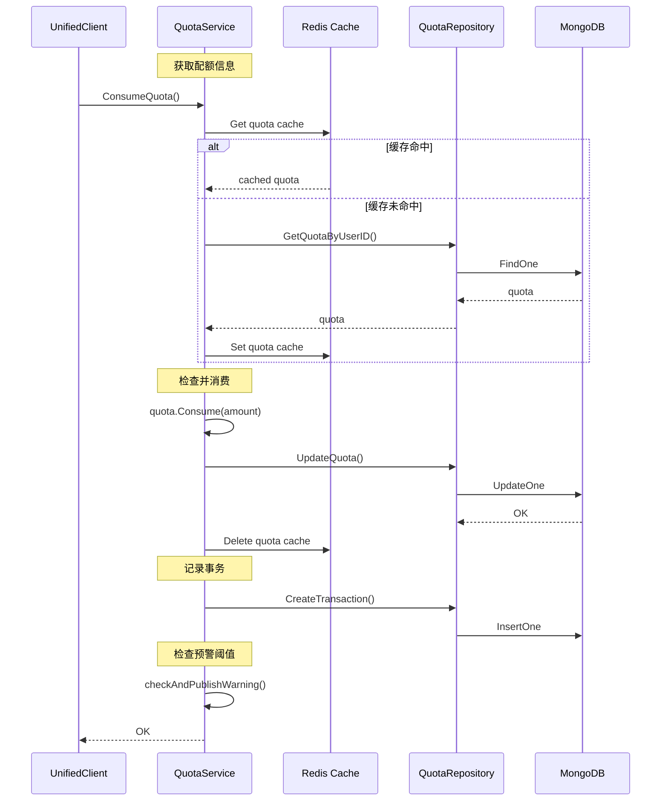
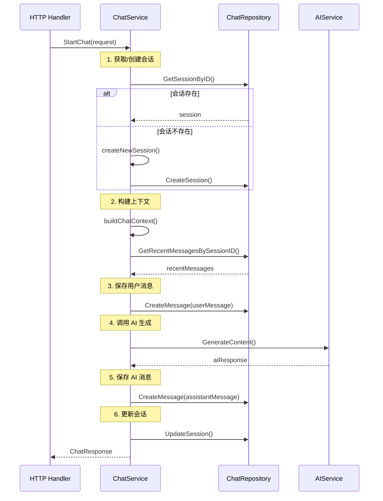

# AI 服务模块

统一的 AI 能力服务层，提供与 Qingyu-Ai-Service 的 gRPC 通信、配额管理、多模型适配及文本处理能力。

## 架构概览



> **注意**: AdapterManager 及其适配器已废弃（标记为红色），仅用于紧急降级。推荐使用 gRPC 方式调用 Qingyu-Ai-Service。

## 核心服务列表

### AIService - 主服务

| 方法 | 说明 |
|------|------|
| `ExecuteAgent` | 执行 AI Agent，支持熔断与降级 |
| `HealthCheck` | 健康检查 |
| `GetCircuitBreakerState` | 获取熔断器状态 |
| `SetFallbackAdapter` | 设置降级适配器（废弃） |

### UnifiedClient - 统一 gRPC 客户端

| 方法 | 说明 |
|------|------|
| `ExecuteAgent` | 执行 AI Agent |
| `ExecuteAgentWithRetry` | 带重试的 Agent 执行 |
| `GenerateOutline` | 生成故事大纲 |
| `GenerateCharacters` | 生成角色设定 |
| `GeneratePlot` | 生成情节设定 |
| `ExecuteCreativeWorkflow` | 执行完整创作工作流 |
| `HealthCheck` | 健康检查（完整响应） |
| `HealthCheckSimple` | 简单健康检查 |

### QuotaService - 配额服务

| 方法 | 说明 |
|------|------|
| `Check` | 检查配额是否可用 |
| `ConsumeQuota` | 消费配额 |
| `RestoreQuota` | 恢复配额（回滚用） |
| `GetQuotaInfo` | 获取配额信息（支持 Redis 缓存） |
| `InitializeUserQuota` | 初始化用户配额 |
| `RechargeQuota` | 配额充值 |
| `ResetDailyQuotas` | 重置日配额（定时任务） |

### ChatService - 聊天服务

| 方法 | 说明 |
|------|------|
| `StartChat` | 开始聊天（同步） |
| `StartChatStream` | 开始流式聊天 |
| `GetChatHistory` | 获取聊天历史 |
| `ListChatSessions` | 获取会话列表 |
| `DeleteChatSession` | 删除会话 |

### ContextService - 上下文服务

| 方法 | 说明 |
|------|------|
| `BuildContext` | 构建 AI 上下文 |
| `BuildContextWithOptions` | 根据选项构建上下文 |
| `UpdateContextWithFeedback` | 根据反馈更新上下文 |

### 其他服务

| 服务 | 职责 |
|------|------|
| `RAGService` | 检索增强生成（占位实现） |
| `SummarizeService` | 内容摘要生成 |
| `ProofreadService` | 文本校对 |
| `SensitiveWordsService` | 敏感词检测 |

## 依赖关系

```
service/ai
├── adapter/                    # 多模型适配器（废弃）
│   ├── adapter_interface.go    # AIAdapter 接口定义
│   ├── manager.go              # AdapterManager（废弃）
│   ├── openai.go               # OpenAI 适配器
│   ├── claude.go               # Claude 适配器
│   ├── deepseek_adapter.go     # DeepSeek 适配器
│   ├── qwen.go                 # 通义千问 适配器
│   ├── glm.go                  # 智谱 GLM 适配器
│   ├── gemini.go               # Gemini 适配器
│   └── wenxin.go               # 文心一言 适配器
├── dto/                        # 数据传输对象
│   ├── chat_dto.go             # 聊天 DTO
│   └── writing_assistant_dto.go # 写作助手 DTO
├── mocks/                      # Mock 实现
│   └── ai_adapter_mock.go      # 适配器 Mock
├── ai_service.go               # AIService 主服务
├── unified_client.go           # UnifiedClient 统一客户端
├── grpc_client.go              # GRPCClient（遗留）
├── grpc_metrics.go             # gRPC 监控指标
├── grpc_tracing.go             # gRPC 链路追踪
├── grpc_errors.go              # gRPC 错误处理
├── quota_service.go            # 配额服务
├── chat_service.go             # 聊天服务
├── chat_repository.go          # 聊天仓库接口
├── chat_repository_memory.go   # 聊天仓库内存实现
├── context_service.go          # 上下文服务
├── rag_service.go              # RAG 服务
├── text_service.go             # 文本服务
├── image_service.go            # 图像服务
├── summarize_service.go        # 摘要服务
├── proofread_service.go        # 校对服务
├── sensitive_words_service.go  # 敏感词服务
└── phase3_client.go            # Phase3Client（遗留）
```

### 外部依赖

- `pkg/grpc/pb` - gRPC 协议定义
- `pkg/circuitbreaker` - 熔断器
- `pkg/cache` - Redis 缓存客户端
- `pkg/quota` - 配额接口
- `repository/interfaces/ai` - 配额仓库接口
- `repository/mongodb/ai` - 配额仓库实现
- `service/interfaces/ai` - AI 服务接口定义
- `service/writer/project` - 文档服务（上下文构建）

## AI 服务调用流程

### 标准 Agent 调用流程



### 配额消费流程



### 聊天服务流程



## 配置说明

```yaml
ai:
  endpoint: "localhost:50051"     # AI 服务 gRPC 端点
  timeout: 30s                    # 请求超时
  max_retries: 3                  # 最大重试次数
  retry_delay: 1s                 # 重试延迟
  enable_fallback: false          # 启用降级（不推荐）
  enable_monitor: true            # 启用监控与追踪
```

## 迁移指南

### 从 AdapterManager 迁移到 UnifiedClient

```go
// 旧方式（废弃）
adapterManager := adapter.NewAdapterManager(cfg)
resp, err := adapterManager.AutoTextGeneration(ctx, req)

// 新方式（推荐）
client := ai.NewUnifiedClientWithAddress("localhost:50051")
resp, err := client.ExecuteAgent(ctx, &ai.AgentRequest{
    WorkflowType: "text-generation",
    Parameters:   map[string]interface{}{"prompt": "..."},
})
```

### 配额服务集成

```go
// 创建配额服务
quotaService := ai.NewQuotaServiceWithCache(quotaRepo, redisClient, eventBus)

// 设置到 UnifiedClient
client.SetQuotaService(quotaService)
client.EnableQuota()
```

## 监控指标

| 指标 | 说明 |
|------|------|
| `grpc.calls.total` | gRPC 调用总数 |
| `grpc.calls.success` | 成功调用数 |
| `grpc.calls.failed` | 失败调用数 |
| `grpc.latency` | 调用延迟 |
| `grpc.timeouts` | 超时次数 |
| `grpc.retries` | 重试次数 |
| `quota.consumed` | 配额消费量 |
| `quota.shortage` | 配额不足次数 |

## 注意事项

1. **AdapterManager 已废弃**: 仅用于紧急降级，将在 v2.0.0 移除
2. **配额服务**: 建议启用 Redis 缓存以提高性能
3. **熔断器**: 默认配置为 5 次失败后熔断，60 秒后半开
4. **重试机制**: 仅对可重试错误（Unavailable、DeadlineExceeded）进行重试
