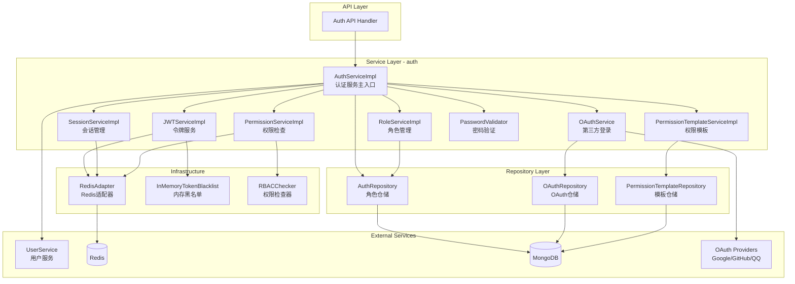
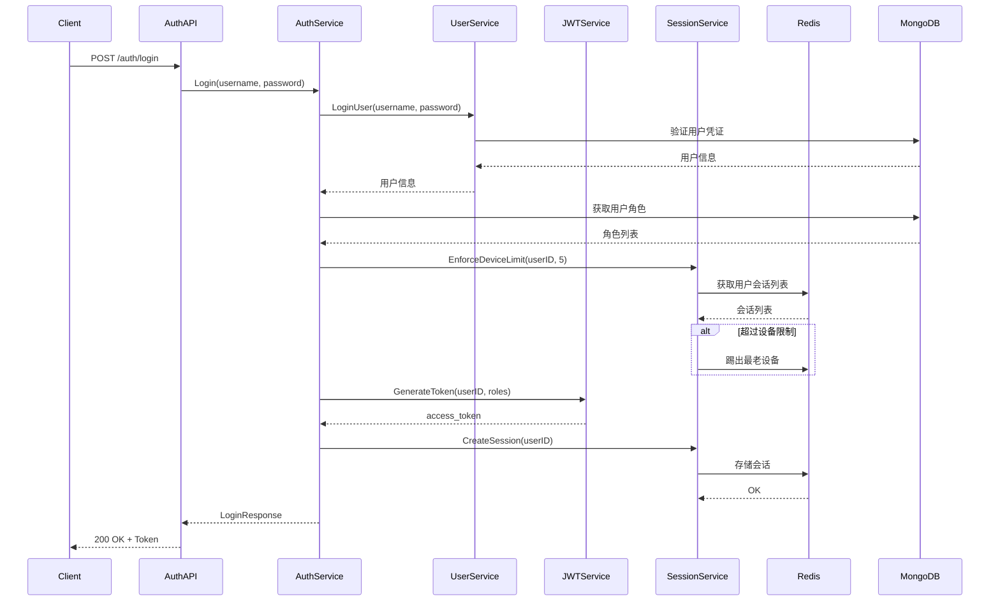
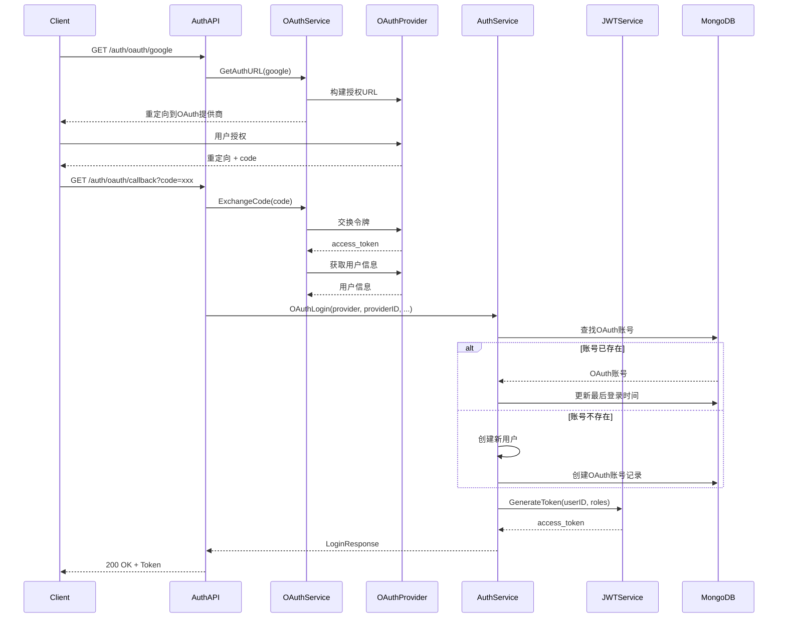
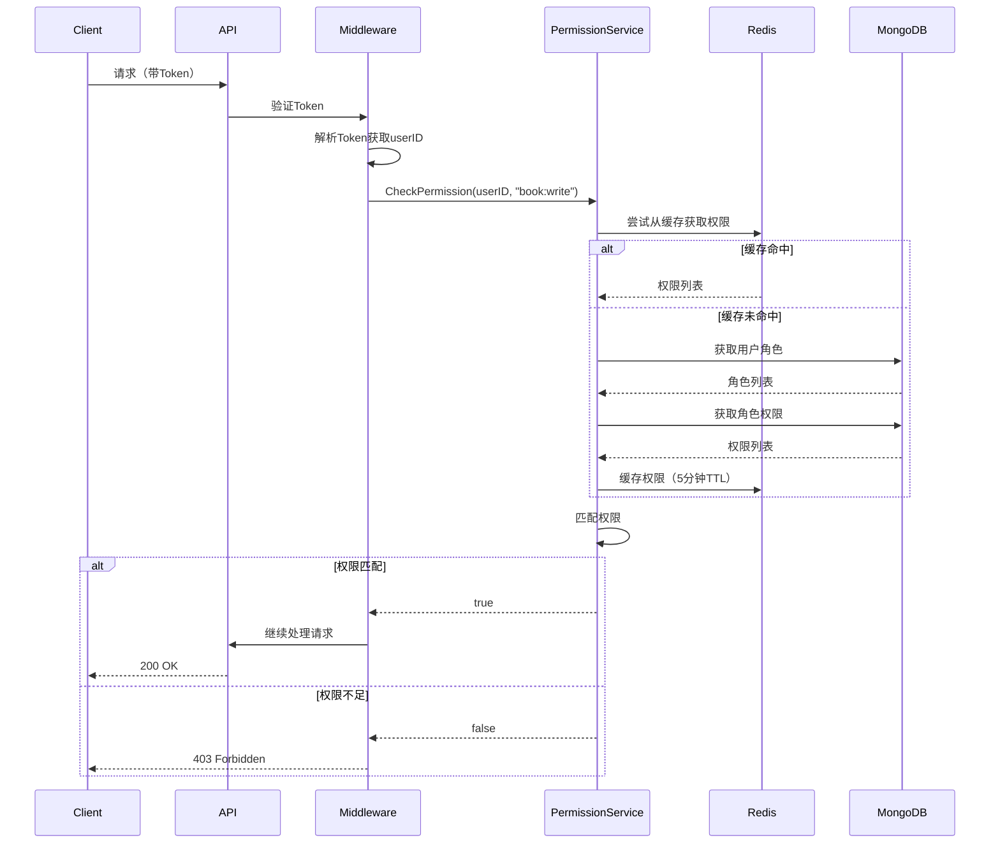

# Auth Service 模块

## 模块职责

**Auth Service（认证服务）**模块是Qingyu后端项目的核心认证授权服务，提供完整的用户认证、权限控制、会话管理和OAuth第三方登录功能。

## 架构图



## 核心服务列表

### AuthService（认证服务主入口）

**文件**: `auth_service.go`

统一认证服务入口，整合所有子服务功能。

| 方法 | 职责 |
|------|------|
| `Register` | 用户注册，创建用户并分配默认角色 |
| `Login` | 用户登录，验证凭证并生成令牌 |
| `OAuthLogin` | OAuth第三方登录 |
| `Logout` | 用户登出，撤销令牌 |
| `RefreshToken` | 刷新访问令牌 |
| `ValidateToken` | 验证令牌有效性 |
| `CheckPermission` | 检查用户权限 |
| `GetUserPermissions` | 获取用户所有权限 |
| `HasRole` | 检查用户角色 |
| `CreateRole` / `UpdateRole` / `DeleteRole` | 角色CRUD操作 |
| `AssignRole` / `RemoveRole` | 用户角色分配/移除 |

### JWTService（令牌服务）

**文件**: `jwt_service.go`

JWT令牌的生成、验证和管理。

| 方法 | 职责 |
|------|------|
| `GenerateToken` | 生成访问令牌 |
| `GenerateTokenPair` | 生成令牌对（访问+刷新） |
| `ValidateToken` | 验证令牌并返回Claims |
| `RefreshToken` | 使用刷新令牌获取新令牌 |
| `RevokeToken` | 吊销令牌（加入黑名单） |
| `IsTokenRevoked` | 检查令牌是否已吊销 |

### OAuthService（第三方登录服务）

**文件**: `oauth_service.go`

OAuth第三方登录集成。

| 方法 | 职责 |
|------|------|
| `GetAuthURL` | 获取OAuth授权URL |
| `ExchangeCode` | 交换授权码获取令牌 |
| `GetUserInfo` | 获取第三方用户信息 |
| `LinkAccount` | 绑定OAuth账号 |
| `UnlinkAccount` | 解绑OAuth账号 |
| `GetLinkedAccounts` | 获取用户绑定的所有账号 |
| `SetPrimaryAccount` | 设置主账号 |

**支持的OAuth提供商**:
- Google
- GitHub
- QQ
- 微信（预留）
- 微博（预留）

### SessionService（会话管理服务）

**文件**: `session_service.go`

用户会话的创建、管理和多端登录控制。

| 方法 | 职责 |
|------|------|
| `CreateSession` | 创建会话 |
| `GetSession` | 获取会话信息 |
| `DestroySession` | 销毁会话 |
| `RefreshSession` | 刷新会话有效期 |
| `GetUserSessions` | 获取用户所有会话 |
| `DestroyUserSessions` | 销毁用户所有会话 |
| `CheckDeviceLimit` | 检查设备数量限制 |
| `EnforceDeviceLimit` | 强制执行设备限制（FIFO踢出） |

### PermissionService（权限服务）

**文件**: `permission_service.go`

RBAC权限检查和管理。

| 方法 | 职责 |
|------|------|
| `CheckPermission` | 检查用户是否有指定权限 |
| `GetUserPermissions` | 获取用户所有权限 |
| `GetRolePermissions` | 获取角色权限 |
| `HasRole` | 检查用户角色 |
| `InvalidateUserPermissionsCache` | 清除用户权限缓存 |
| `LoadPermissionsToChecker` | 加载权限到RBAC检查器 |

### RoleService（角色服务）

**文件**: `role_service.go`

角色CRUD和权限管理。

| 方法 | 职责 |
|------|------|
| `CreateRole` | 创建角色 |
| `GetRole` | 获取角色 |
| `UpdateRole` | 更新角色 |
| `DeleteRole` | 删除角色 |
| `ListRoles` | 列出所有角色 |
| `AssignPermissions` | 为角色分配权限 |
| `RemovePermissions` | 移除角色权限 |

### PermissionTemplateService（权限模板服务）

**文件**: `permission_template_service.go`

权限模板管理，支持预定义模板快速分配权限。

| 方法 | 职责 |
|------|------|
| `CreateTemplate` | 创建权限模板 |
| `GetTemplate` / `GetTemplateByCode` | 获取模板 |
| `UpdateTemplate` | 更新模板 |
| `DeleteTemplate` | 删除模板 |
| `ListTemplates` | 列出模板 |
| `ApplyTemplate` | 应用模板到角色 |
| `InitializeSystemTemplates` | 初始化系统预设模板 |

### PasswordValidator（密码验证器）

**文件**: `password_validator.go`

密码强度验证。

| 方法 | 职责 |
|------|------|
| `ValidatePassword` | 验证密码强度 |
| `ValidatePasswordStrength` | 密码强度评分（weak/medium/strong） |
| `CheckWeakPassword` | 检查常见弱密码 |
| `GetPasswordRequirements` | 获取密码要求说明 |

## 依赖关系

### 内部依赖

| 依赖模块 | 用途 |
|---------|------|
| `service/interfaces/user` | 用户服务接口 |
| `repository/interfaces/auth` | 认证仓储接口 |
| `repository/interfaces/shared` | 共享仓储接口 |
| `models/auth` | 认证数据模型 |
| `models/users` | 用户数据模型 |
| `internal/middleware/auth` | JWT管理器和RBAC检查器 |

### 外部依赖

| 依赖 | 用途 |
|------|------|
| `go.uber.org/zap` | 日志记录 |
| `golang.org/x/oauth2` | OAuth2客户端 |
| `golang.org/x/sync/singleflight` | 缓存击穿防护 |

### 基础设施依赖

| 依赖 | 用途 |
|------|------|
| Redis | 令牌黑名单、会话存储、权限缓存 |
| MongoDB | 角色和权限持久化 |

## 认证流程

### 用户登录流程



### OAuth登录流程



### 权限检查流程



## 目录结构

```
service/auth/
├── interfaces.go                    # 服务接口定义
├── auth_service.go                  # 认证服务主实现
├── jwt_service.go                   # JWT令牌服务
├── oauth_service.go                 # OAuth第三方登录
├── session_service.go               # 会话管理
├── permission_service.go            # 权限检查服务
├── role_service.go                  # 角色管理服务
├── permission_template_service.go   # 权限模板服务
├── password_validator.go            # 密码强度验证
├── redis_adapter.go                 # Redis存储适配器
├── memory_blacklist.go              # 内存令牌黑名单（降级方案）
├── _migration/                      # 迁移兼容层
│   └── shared_compat.go
└── README.md                        # 本文档
```

## 配置说明

### JWT配置

```go
type JWTConfigEnhanced struct {
    SecretKey       string        // JWT签名密钥
    Expiration      time.Duration // 访问令牌有效期
    RefreshDuration time.Duration // 刷新令牌有效期
}
```

### OAuth配置

```go
type OAuthConfig struct {
    Enabled       bool
    ClientID      string
    ClientSecret  string
    RedirectURI   string
    Scopes        string
    AuthURL       string // 自定义端点（如QQ）
    TokenURL      string
}
```

### 会话配置

- 默认会话有效期: 24小时
- 默认最大设备数: 5台
- 分布式锁TTL: 10秒
- 清理任务间隔: 1小时

## 测试

```bash
# 运行所有auth模块测试
go test ./service/auth/...

# 运行特定服务测试
go test ./service/auth/permission_template_service_test.go

# 生成测试覆盖率报告
go test -coverprofile=coverage.out ./service/auth/...
go tool cover -html=coverage.out
```

## 相关文档

- [Auth Repository](../../repository/mongodb/auth/README.md)
- [Auth API](../../api/v1/shared/README.md)
- [认证模块设计](../../docs/design/modules/01-auth/README.md)

---

**版本**: v1.1.0
**更新日期**: 2026-03-22
