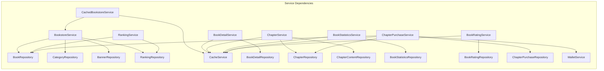

# Bookstore Service

书城业务服务层，提供书籍展示、搜索、榜单、章节管理等核心业务逻辑。

## 模块职责

书城服务层负责聚合和协调底层 Repository，提供完整的业务功能，包括首页数据聚合、榜单计算、缓存策略、章节内容管理等。

## 架构图

```mermaid
graph TB
    subgraph "Service Layer"
        BS[BookstoreService]
        CBS[CachedBookstoreService]
        BDS[BookDetailService]
        CS[ChapterService]
        RS[RankingService]
        BS2[BookStatisticsService]
        BRS[BookRatingService]
        BPS[ChapterPurchaseService]
        BnS[BannerService]
        SCS[StreamCursorCacheService]
        RSS[RankingScheduler]
    end

    subgraph "Cache Layer"
        CSvc[CacheService<br/>Redis]
    end

    subgraph "Repository Layer"
        BR[BookRepository]
        BDR[BookDetailRepository]
        CR[ChapterRepository]
        CCR[ChapterContentRepository]
        RR[RankingRepository]
        BSR[BookStatisticsRepository]
        BRR[BookRatingRepository]
        CPR[ChapterPurchaseRepository]
        BnR[BannerRepository]
        CtR[CategoryRepository]
    end

    subgraph "External Services"
        WS[WalletService]
    end

    BS --> BR
    BS --> CtR
    BS --> BnR
    BS --> RR

    CBS --> BS
    CBS --> CSvc

    BDS --> BDR
    BDS --> CSvc

    CS --> CR
    CS --> CCR
    CS --> CSvc

    RS --> RR
    RS --> BR

    BS2 --> BSR
    BS2 --> CSvc

    BRS --> BRR
    BRS --> CSvc

    BPS --> CR
    BPS --> CPR
    BPS --> BR
    BPS --> WS
    BPS --> CSvc

    BnS --> BnR

    SCS --> CSvc
    RSS --> BS
```



## 核心服务列表

### BookstoreService
书籍列表与首页聚合服务，提供书城首页、分类页面、搜索结果等列表场景的数据。

**核心方法:**
- `GetHomepageData()` - 聚合首页数据（Banner、推荐书籍、榜单等）
- `GetAllBooks()` / `GetBooksByCategory()` / `GetBooksByAuthorID()` - 列表查询
- `SearchBooks()` / `SearchBooksWithFilter()` - 书籍搜索
- `GetHotBooks()` / `GetNewReleases()` / `GetFreeBooks()` - 分类列表
- `GetSimilarBooks()` - 相似书籍推荐（四层降级策略）
- `GetRealtimeRanking()` / `GetWeeklyRanking()` / `GetMonthlyRanking()` - 榜单查询

### CachedBookstoreService
带缓存装饰的书城服务，为热点数据提供 Redis 缓存支持。

**核心方法:**
- 装饰 BookstoreService 的所有方法
- 自动处理缓存读取、设置和失效

### BookDetailService
书籍详情服务，专注于书籍详情页面的完整信息管理。

**核心方法:**
- `GetBookDetailByID()` - 获取书籍详情
- `SearchBookDetailsWithFilter()` - 高级搜索
- `GetSimilarBookDetails()` / `GetRecommendedBookDetails()` - 推荐书籍
- `IncrementViewCount()` / `IncrementLikeCount()` - 交互统计

### ChapterService
章节服务，管理章节元数据和内容。

**核心方法:**
- `GetChapterByID()` / `GetChaptersByBookID()` - 章节查询
- `GetChapterContent()` - 获取章节内容（权限检查）
- `GetPreviousChapter()` / `GetNextChapter()` - 章节导航
- `PublishChapter()` / `UnpublishChapter()` - 发布管理
- `BatchUpdateChapterPrice()` - 批量价格更新

### RankingService
榜单计算服务，提供四种榜单的计算逻辑。

**榜单类型:**
- 实时榜 (realtime) - 浏览量 70% + 点赞 30%
- 周榜 (weekly) - 浏览量 60% + 章节数 * 10
- 月榜 (monthly) - 浏览量 50% + 点赞 30% + 字数权重
- 新人榜 (newbie) - 发布 3 个月内的新书

### BookStatisticsService
书籍统计服务，管理浏览量、收藏量、评分等统计数据。

**核心方法:**
- `GetStatisticsByBookID()` - 获取书籍统计
- `GetTopViewedBooks()` / `GetHottestBooks()` - 排行榜数据
- `UpdateHotScore()` - 更新热度分数
- `GenerateDailyReport()` / `GenerateWeeklyReport()` - 统计报告

### BookRatingService
书籍评分服务，管理用户评分和评论。

**核心方法:**
- `CreateRating()` / `UpdateRating()` / `DeleteRating()` - 评分 CRUD
- `GetAverageRating()` / `GetRatingDistribution()` - 评分统计
- `LikeRating()` / `UnlikeRating()` - 评分点赞

### ChapterPurchaseService
章节购买服务，处理付费章节的购买逻辑。

**核心方法:**
- `GetChapterCatalog()` - 获取章节目录（含购买状态）
- `PurchaseChapter()` / `PurchaseChapters()` / `PurchaseBook()` - 购买操作
- `CheckChapterAccess()` - 检查访问权限

### BannerService
Banner 管理服务，处理首页轮播图。

### StreamCursorCacheService
流式游标缓存服务，支持分页游标的缓存和断点续传。

### RankingScheduler
榜单定时调度器，使用 cron 定时更新各类榜单。

**调度频率:**
- 实时榜: 每 5 分钟
- 周榜: 每小时
- 月榜/新人榜: 每天凌晨 2-3 点

## 依赖关系



## 缓存策略

### 缓存过期时间配置

| 数据类型 | 过期时间 | 说明 |
|---------|---------|------|
| 首页数据 | 5 分钟 | 高频更新 |
| 榜单数据 | 10 分钟 | 定时任务更新 |
| Banner 数据 | 30 分钟 | 低频更新 |
| 书籍详情 | 1 小时 | 中频更新 |
| 分类树 | 2 小时 | 低频更新 |
| 章节内容 | 30 分钟 | 按需更新 |
| 评分数据 | 10-30 分钟 | 用户交互后失效 |

### 缓存失效策略

1. **写失效**: 数据更新时主动清除相关缓存
2. **级联失效**: 书籍更新时清除首页、榜单、分类等相关缓存
3. **异步失效**: 使用 goroutine 异步执行缓存清除，避免阻塞主流程

### 缓存键命名规范

```
{prefix}:bookstore:{type}:{id}
{prefix}:bookstore:homepage
{prefix}:bookstore:ranking:{type}:{period}
{prefix}:bookstore:banners:active
{prefix}:bookstore:categories:tree
```

## 使用示例

```go
// 创建服务
bookstoreService := bookstore.NewBookstoreService(
    bookRepo, categoryRepo, bannerRepo, rankingRepo, collectionRepo,
)

// 添加缓存装饰
cachedService := bookstore.NewCachedBookstoreService(bookstoreService, cacheService)

// 获取首页数据
homepageData, err := cachedService.GetHomepageData(ctx)

// 搜索书籍
filter := &bookstore.BookFilter{
    Keyword: &keyword,
    Status:  &status,
    Limit:   20,
    Offset:  0,
}
books, total, err := cachedService.SearchBooksWithFilter(ctx, filter)
```

## 文件列表

| 文件 | 职责 |
|-----|------|
| `bookstore_service.go` | 书城列表服务，首页聚合 |
| `cached_bookstore_service.go` | 缓存装饰服务 |
| `bookstore_cached_service.go` | 另一套缓存策略实现 |
| `book_detail_service.go` | 书籍详情服务 |
| `chapter_service.go` | 章节管理服务 |
| `ranking_service.go` | 榜单计算服务 |
| `ranking_scheduler.go` | 榜单定时调度器 |
| `book_statistics_service.go` | 书籍统计服务 |
| `book_rating_service.go` | 评分服务 |
| `chapter_purchase_service.go` | 章节购买服务 |
| `banner_service.go` | Banner 管理服务 |
| `bookstore_stream_service.go` | 流式查询服务 |
| `stream_cursor_cache_service.go` | 游标缓存服务 |
| `cache_service.go` | Redis 缓存服务实现 |
