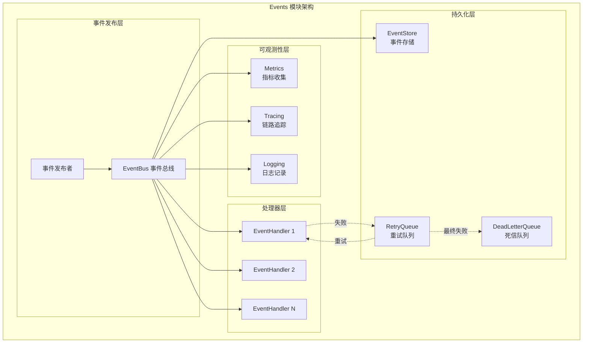

# Events 模块 - 事件系统

## 模块职责

**Events 模块**是青羽后端的核心基础设施，负责实现服务间的松耦合通信，提供事件发布订阅、持久化存储、重试机制和可观测性支持。

## 架构图



## 使用方式

### 1. 定义事件

```go
// 定义事件类型常量
const EventTypeUserRegistered = "user.registered"

// 定义事件数据结构
type UserEventData struct {
    UserID   string
    Username string
    Email    string
}

// 创建事件工厂函数
func NewUserRegisteredEvent(userID, username, email string) base.Event {
    return &base.BaseEvent{
        EventType: EventTypeUserRegistered,
        EventData: UserEventData{
            UserID:   userID,
            Username: username,
            Email:    email,
        },
        Timestamp: time.Now(),
        Source:    "UserService",
    }
}
```

### 2. 实现事件处理器

```go
type WelcomeEmailHandler struct {
    name string
}

func (h *WelcomeEmailHandler) Handle(ctx context.Context, event base.Event) error {
    // 处理事件逻辑
    data, ok := event.GetEventData().(UserEventData)
    if !ok {
        return fmt.Errorf("事件数据类型错误")
    }
    
    // 执行业务逻辑
    sendWelcomeEmail(data.Email, data.Username)
    
    return nil
}

func (h *WelcomeEmailHandler) GetHandlerName() string {
    return "WelcomeEmailHandler"
}

func (h *WelcomeEmailHandler) GetSupportedEventTypes() []string {
    return []string{EventTypeUserRegistered}
}
```

### 3. 注册事件处理器

在应用启动时注册事件处理器：

```go
// 获取EventBus
eventBus := serviceContainer.GetEventBus()

// 创建并注册处理器
welcomeHandler := events.NewWelcomeEmailHandler()
eventBus.Subscribe(events.EventTypeUserRegistered, welcomeHandler)

activityHandler := events.NewUserActivityLogHandler()
eventBus.Subscribe(events.EventTypeUserRegistered, activityHandler)
eventBus.Subscribe(events.EventTypeUserLoggedIn, activityHandler)
```

### 4. 发布事件

在Service层的业务逻辑中发布事件：

```go
// 同步发布（等待所有处理器完成）
event := events.NewUserRegisteredEvent(user.ID, user.Username, user.Email)
err := eventBus.Publish(ctx, event)

// 异步发布（不等待处理器完成）
err := eventBus.PublishAsync(ctx, event)
```

## 事件类型

### 用户相关事件

- `user.registered` - 用户注册
- `user.logged_in` - 用户登录
- `user.logged_out` - 用户登出
- `user.updated` - 用户信息更新
- `user.deleted` - 用户删除

### 阅读相关事件

- `reading.chapter_read` - 章节阅读
- `reading.bookmark_added` - 添加书签
- `reading.note_created` - 创建笔记
- `reading.progress_updated` - 进度更新
- `reading.book_completed` - 完成阅读

## 最佳实践

### 1. 事件命名规范

使用点号分隔的命名空间：`domain.action`

```
用户域：user.*
阅读域：reading.*
书城域：bookstore.*
AI域：ai.*
```

### 2. 事件数据结构

- 包含必要的业务数据
- 避免包含敏感信息
- 保持数据结构简单

### 3. 处理器设计

- 单一职责原则
- 幂等性（可以多次执行）
- 错误处理（不影响主流程）
- 异步处理长时间操作

### 4. 同步 vs 异步

**同步发布 (Publish)**：
- 需要确保处理完成
- 处理失败需要回滚
- 关键业务逻辑

**异步发布 (PublishAsync)**：
- 不影响主流程
- 可以容忍失败
- 通知、统计、日志等

## 示例场景

### 场景1：用户注册流程

```go
// UserService
func (s *UserService) RegisterUser(ctx context.Context, req *RegisterRequest) error {
    // 1. 创建用户
    user := createUser(req)
    err := s.userRepo.Create(ctx, user)
    if err != nil {
        return err
    }
    
    // 2. 发布用户注册事件
    event := events.NewUserRegisteredEvent(user.ID, user.Username, user.Email)
    s.eventBus.PublishAsync(ctx, event)
    
    return nil
}

// 事件处理器会自动:
// - 发送欢迎邮件
// - 记录用户活动
// - 更新用户统计
```

### 场景2：章节阅读统计

```go
// ReaderService
func (s *ReaderService) ReadChapter(ctx context.Context, userID, bookID, chapterID string) error {
    // 1. 记录阅读
    err := s.progressRepo.UpdateProgress(...)
    if err != nil {
        return err
    }
    
    // 2. 发布阅读事件
    event := events.NewChapterReadEvent(userID, bookID, chapterID)
    s.eventBus.PublishAsync(ctx, event)
    
    return nil
}

// 事件处理器会自动:
// - 更新书籍阅读统计
// - 更新推荐算法
// - 记录阅读行为
```

## 未来扩展

### 1. 持久化事件

将事件存储到数据库，支持事件回放和审计。

### 2. 分布式事件总线

使用消息队列（RabbitMQ, Kafka）支持跨服务通信。

### 3. 事件重试机制

对失败的事件处理器进行自动重试。

### 4. 事件监控

监控事件发布和处理的性能指标。

---

**最后更新**: 2025-10-24  
**维护者**: 青羽后端团队

