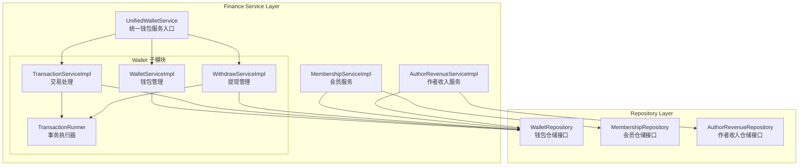
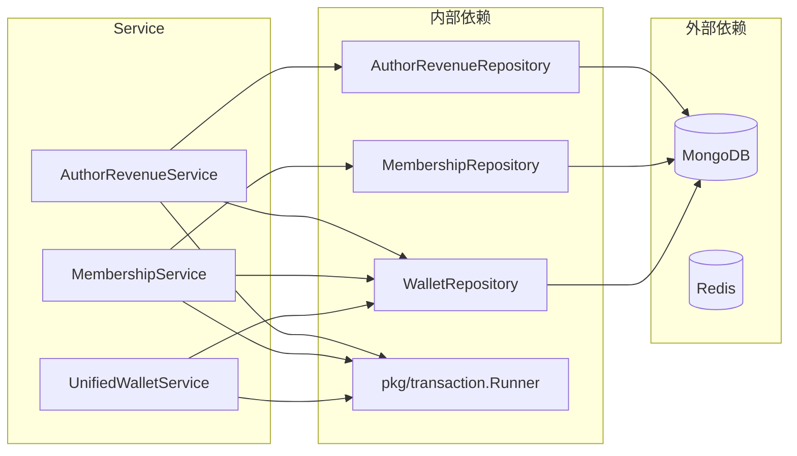
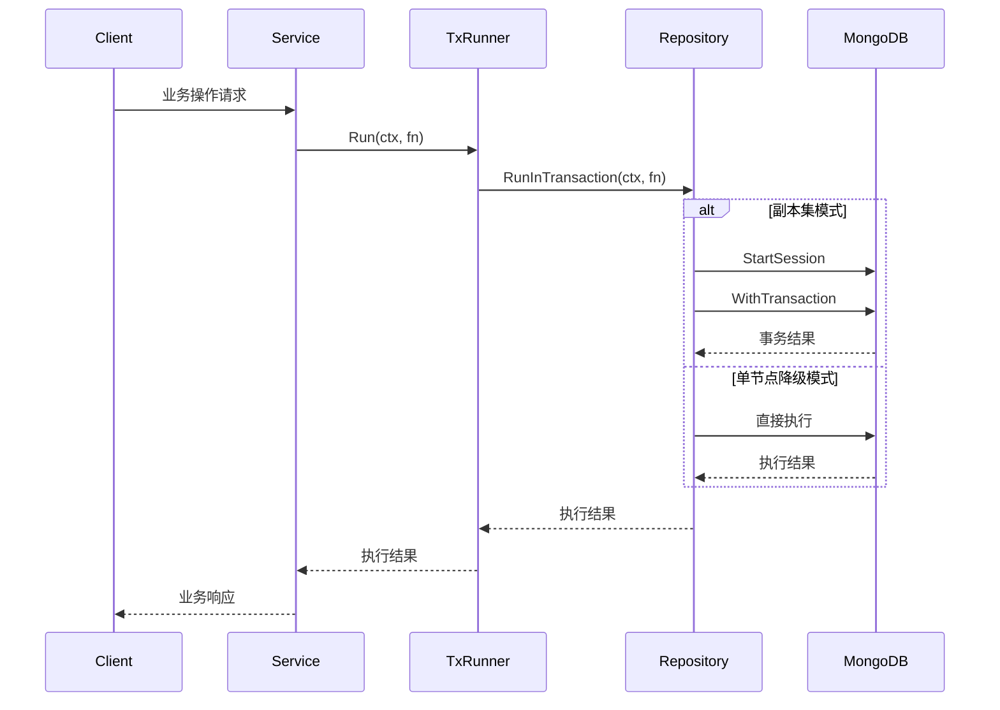
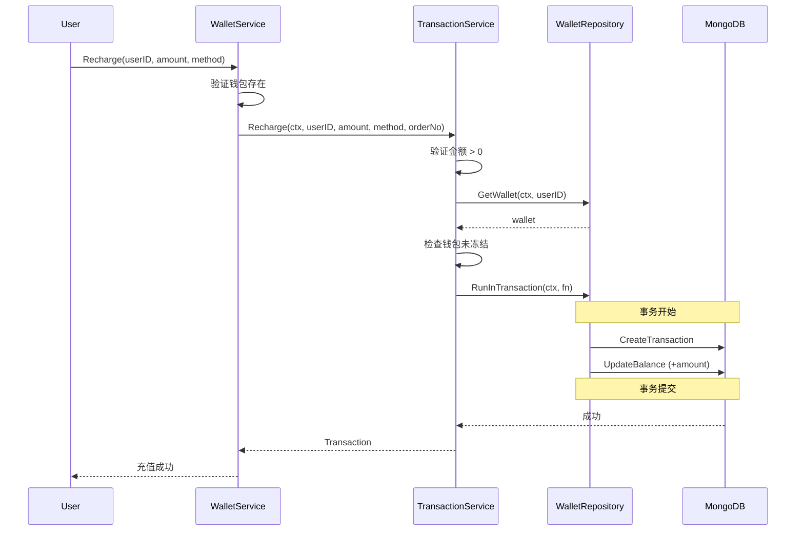
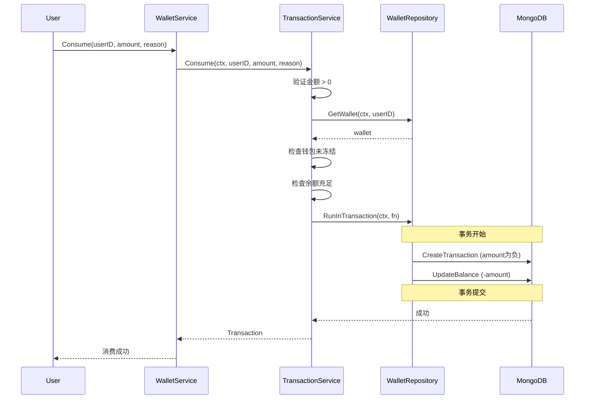
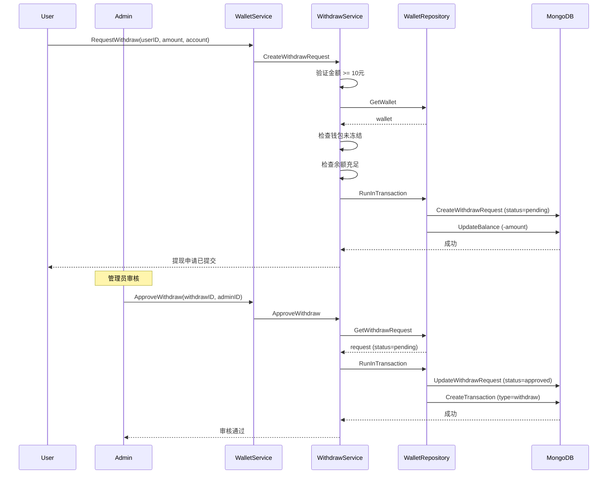
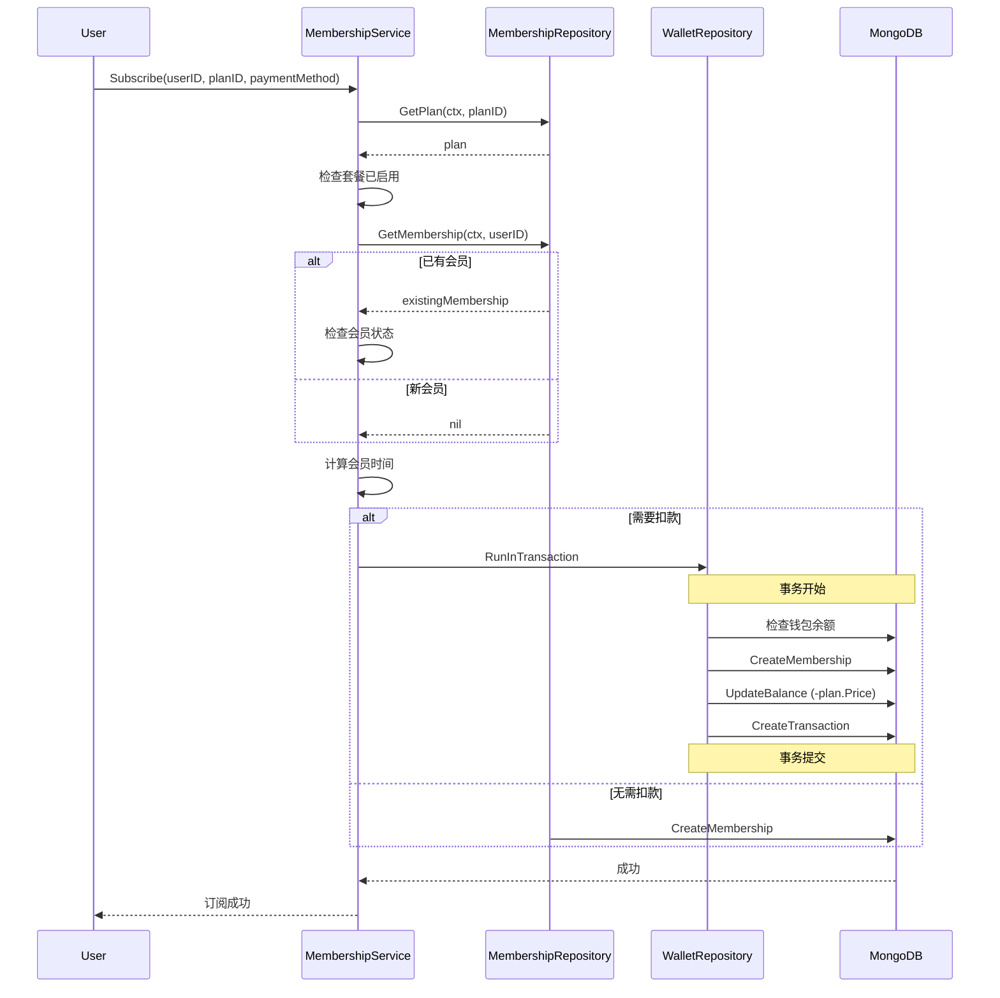

# Finance Service 模块

提供用户钱包、会员订阅、作者收入等金融相关业务逻辑的服务层实现。

## 架构概览



## 核心服务列表

### 1. 钱包服务 (Wallet)

| 服务 | 文件 | 职责 |
|------|------|------|
| `UnifiedWalletService` | `wallet/unified_wallet_service.go` | 统一入口，整合钱包、交易、提现三大功能 |
| `WalletServiceImpl` | `wallet/wallet_service.go` | 钱包基础管理：创建、查询、冻结/解冻 |
| `TransactionServiceImpl` | `wallet/transaction_service.go` | 交易处理：充值、消费、转账 |
| `WithdrawServiceImpl` | `wallet/withdraw_service.go` | 提现管理：申请、审核、处理 |
| `TransactionRunner` | `wallet/transaction_runner.go` | 事务执行器，支持降级模式 |

#### WalletService 接口方法

```go
type WalletService interface {
    // 钱包管理
    CreateWallet(ctx, userID) (*Wallet, error)
    GetWallet(ctx, userID) (*Wallet, error)
    GetBalance(ctx, userID) (int64, error)
    FreezeWallet(ctx, userID) error
    UnfreezeWallet(ctx, userID) error

    // 交易操作
    Recharge(ctx, userID, amount, method) (*Transaction, error)
    Consume(ctx, userID, amount, reason) (*Transaction, error)
    Transfer(ctx, fromUserID, toUserID, amount, reason) (*Transaction, error)

    // 交易查询
    GetTransaction(ctx, transactionID) (*Transaction, error)
    ListTransactions(ctx, userID, req) ([]*Transaction, error)

    // 提现管理
    RequestWithdraw(ctx, userID, amount, account) (*WithdrawRequest, error)
    GetWithdrawRequest(ctx, withdrawID) (*WithdrawRequest, error)
    ListWithdrawRequests(ctx, req) ([]*WithdrawRequest, error)
    ApproveWithdraw(ctx, withdrawID, adminID) error
    RejectWithdraw(ctx, withdrawID, adminID, reason) error
    ProcessWithdraw(ctx, withdrawID) error

    // 健康检查
    Health(ctx) error
}
```

### 2. 会员服务 (Membership)

| 服务 | 文件 | 职责 |
|------|------|------|
| `MembershipServiceImpl` | `membership_service.go` | 会员订阅、套餐管理、权益管理、会员卡激活 |

#### MembershipService 接口方法

```go
type MembershipService interface {
    // 套餐管理
    GetPlans(ctx) ([]*MembershipPlan, error)
    GetPlan(ctx, planID) (*MembershipPlan, error)

    // 订阅管理
    Subscribe(ctx, userID, planID, paymentMethod) (*UserMembership, error)
    GetMembership(ctx, userID) (*UserMembership, error)
    CancelMembership(ctx, userID) error
    RenewMembership(ctx, userID) (*UserMembership, error)

    // 会员权益
    GetBenefits(ctx, level) ([]*MembershipBenefit, error)
    GetUsage(ctx, userID) ([]*MembershipUsage, error)

    // 会员卡管理
    ActivateCard(ctx, userID, cardCode) (*UserMembership, error)
    ListCards(ctx, filter, page, pageSize) ([]*MembershipCard, int64, error)

    // 会员检查
    CheckMembership(ctx, userID, level) (bool, error)
    IsVIP(ctx, userID) (bool, error)
}
```

### 3. 作者收入服务 (Author Revenue)

| 服务 | 文件 | 职责 |
|------|------|------|
| `AuthorRevenueServiceImpl` | `author_revenue_service.go` | 作者收入查询、提现申请、结算管理、税务信息 |

#### AuthorRevenueService 接口方法

```go
type AuthorRevenueService interface {
    // 收入查询
    GetEarnings(ctx, authorID, page, pageSize) ([]*AuthorEarning, int64, error)
    GetBookEarnings(ctx, authorID, bookID) ([]*AuthorEarning, int64, error)
    GetRevenueDetails(ctx, authorID, page, pageSize) ([]*RevenueDetail, int64, error)
    GetRevenueStatistics(ctx, authorID, period) ([]*RevenueStatistics, error)

    // 收入记录
    CreateEarning(ctx, earning) error
    CalculateEarning(ctx, earningType, amount, authorID, bookID) (authorIncome, platformIncome, error)

    // 提现管理
    CreateWithdrawalRequest(ctx, userID, amount, method, account) (*WithdrawalRequest, error)
    GetWithdrawals(ctx, userID, page, pageSize) ([]*WithdrawalRequest, int64, error)

    // 结算管理
    GetSettlements(ctx, authorID, page, pageSize) ([]*Settlement, int64, error)
    GetSettlement(ctx, settlementID) (*Settlement, error)

    // 税务信息
    GetTaxInfo(ctx, userID) (*TaxInfo, error)
    UpdateTaxInfo(ctx, userID, taxInfo) error
}
```

## 依赖关系



## 事务处理

Finance 模块的事务处理采用分层设计：

1. **Service 层事务入口**：通过 `TransactionRunner` 接口屏蔽底层实现
2. **Repository 层事务支持**：`WalletRepository.RunInTransaction()` 提供底层事务能力
3. **降级模式**：单节点 MongoDB 不支持事务时，自动降级为顺序执行



## 核心交易流程

### 充值流程



### 消费流程



### 提现流程



### 会员订阅流程



## 数据结构

### 钱包 (Wallet)

| 字段 | 类型 | 说明 |
|------|------|------|
| `ID` | string | 钱包唯一标识 |
| `UserID` | string | 所属用户ID |
| `Balance` | int64 | 余额（分） |
| `Frozen` | bool | 是否冻结 |

### 交易记录 (Transaction)

| 字段 | 类型 | 说明 |
|------|------|------|
| `ID` | string | 交易唯一标识 |
| `UserID` | string | 用户ID |
| `Type` | string | 类型：recharge/consume/transfer_in/transfer_out |
| `Amount` | int64 | 金额（分，消费为负） |
| `Balance` | int64 | 交易后余额 |
| `RelatedUserID` | string | 关联用户ID（转账） |
| `Method` | string | 支付方式 |
| `Reason` | string | 交易原因 |
| `Status` | string | 状态：pending/success/failed |

### 提现申请 (WithdrawRequest)

| 字段 | 类型 | 说明 |
|------|------|------|
| `ID` | string | 申请唯一标识 |
| `UserID` | string | 用户ID |
| `Amount` | int64 | 提现金额（分） |
| `Account` | string | 提现账号 |
| `Status` | string | 状态：pending/approved/rejected/processed |
| `ReviewedBy` | string | 审核人ID |
| `ReviewedAt` | time.Time | 审核时间 |
| `RejectReason` | string | 拒绝原因 |

## 使用示例

### 创建钱包服务

```go
// 创建 Repository
walletRepo := finance.NewWalletRepository(db)

// 创建统一钱包服务
walletService := wallet.NewUnifiedWalletService(walletRepo)

// 或带自定义事务执行器
txRunner := wallet.NewRepositoryTransactionRunner(walletRepo)
walletService := wallet.NewUnifiedWalletServiceWithRunner(walletRepo, txRunner)
```

### 创建会员服务

```go
// 创建 Repository
membershipRepo := finance.NewMembershipRepository(db)

// 基础创建（无钱包扣款功能）
membershipService := finance.NewMembershipService(membershipRepo)

// 完整创建（支持钱包扣款）
membershipService := finance.NewMembershipServiceWithDependencies(
    membershipRepo,
    walletRepo,
    txRunner,
)
```

### 创建作者收入服务

```go
// 创建 Repository
revenueRepo := finance.NewAuthorRevenueRepository(db)

// 基础创建
revenueService := finance.NewAuthorRevenueService(revenueRepo)

// 完整创建（支持钱包交互）
revenueService := finance.NewAuthorRevenueServiceWithDependencies(
    revenueRepo,
    walletRepo,
    txRunner,
)
```

## 注意事项

1. **事务降级**：单节点 MongoDB 不支持事务，系统会自动降级为顺序执行
2. **钱包懒加载**：用户首次访问时自动创建钱包
3. **余额单位**：所有金额以"分"为单位存储，避免浮点精度问题
4. **并发安全**：余额更新使用 MongoDB 原子操作 `$inc`
5. **余额验证**：`UpdateBalanceWithCheck` 方法可防止余额变为负数
