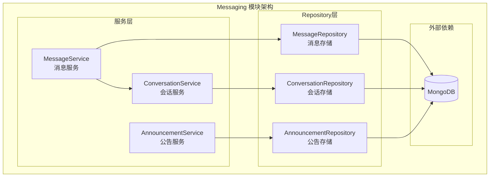

# Messaging 模块 - 消息服务

## 模块职责

**Messaging 模块**负责用户间的私信通信和系统公告管理，提供会话管理、消息收发、未读计数和公告发布等功能。

## 架构图



## 核心服务列表

### 1. MessageService (message_service.go)

**职责**: 管理私信的创建、查询和已读状态

**核心方法**:
- `GetMessages` - 获取会话消息列表
- `Create` - 创建新消息
- `MarkConversationRead` - 标记会话已读
- `GetUnreadCount` - 获取未读消息数

### 2. ConversationService (conversation_service.go)

**职责**: 管理用户会话，包括创建、查询和更新会话状态

**核心方法**:
- `Get` - 获取会话详情
- `FindByParticipants` - 根据参与者查找会话
- `Create` - 创建新会话
- `UpdateLastMessage` - 更新会话最后消息
- `IncrementUnreadCount` - 增加未读计数
- `GetConversations` - 获取用户会话列表

### 3. AnnouncementService (announcement_service.go)

**职责**: 管理系统公告的发布、查询和统计

**核心方法**:
- `GetAnnouncementByID` - 获取公告详情
- `GetAnnouncements` - 获取公告列表
- `GetEffectiveAnnouncements` - 获取有效公告
- `CreateAnnouncement` - 创建公告
- `UpdateAnnouncement` - 更新公告
- `DeleteAnnouncement` - 删除公告
- `BatchUpdateStatus` - 批量更新状态
- `BatchDelete` - 批量删除
- `IncrementViewCount` - 增加查看次数

## 依赖关系

### 依赖的模块
- `models/messaging` - 消息数据模型
- `repository/interfaces/messaging` - 消息仓储接口
- `repository` - ID解析工具

### 被依赖的模块
- `api/v1/messaging` - 消息API层
- `api/v1/admin` - 管理员公告管理

## 数据模型

### DirectMessage (私信)
```go
type DirectMessage struct {
    ID             primitive.ObjectID `bson:"_id"`
    ConversationID string             `bson:"conversation_id"`
    SenderID       string             `bson:"sender_id"`
    ReceiverID     string             `bson:"receiver_id"`
    Content        string             `bson:"content"`
    Read           bool               `bson:"read"`
    ReadAt         *time.Time         `bson:"read_at,omitempty"`
    CreatedAt      time.Time          `bson:"created_at"`
    UpdatedAt      time.Time          `bson:"updated_at"`
}
```

### Conversation (会话)
```go
type Conversation struct {
    ID             primitive.ObjectID `bson:"_id"`
    ParticipantIDs []string           `bson:"participant_ids"`
    Type           ConversationType   `bson:"type"`
    LastMessage    *LastMessageInfo   `bson:"last_message,omitempty"`
    UnreadCount    map[string]int     `bson:"unread_count"`
    IsActive       bool               `bson:"is_active"`
    IsArchived     bool               `bson:"is_archived"`
    CreatedBy      string             `bson:"created_by"`
    CreatedAt      time.Time          `bson:"created_at"`
    UpdatedAt      time.Time          `bson:"updated_at"`
}
```

### Announcement (公告)
```go
type Announcement struct {
    ID         primitive.ObjectID  `bson:"_id"`
    Title      string              `bson:"title"`
    Content    string              `bson:"content"`
    Type       AnnouncementType    `bson:"type"`
    Priority   int                 `bson:"priority"`
    IsActive   bool                `bson:"is_active"`
    StartTime  *time.Time          `bson:"start_time,omitempty"`
    EndTime    *time.Time          `bson:"end_time,omitempty"`
    TargetRole string              `bson:"target_role"`
    ViewCount  int64               `bson:"view_count"`
    CreatedBy  string              `bson:"created_by"`
    CreatedAt  time.Time           `bson:"created_at"`
    UpdatedAt  time.Time           `bson:"updated_at"`
}
```

---

**版本**: v1.0
**更新日期**: 2026-03-22
**维护者**: Messaging模块开发组
