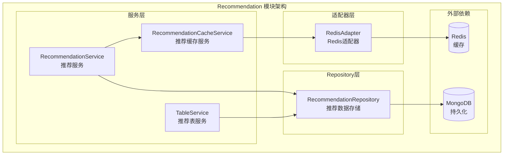

# Recommendation 模块 - 推荐服务

## 模块职责

**Recommendation 模块**负责内容推荐算法实现，提供个性化推荐、相似内容推荐、热门推荐和用户行为记录等功能。

## 架构图



## 核心服务列表

### 1. RecommendationService (recommendation_service.go)

**职责**: 核心推荐算法实现，提供各类推荐功能

**核心方法**:
- `GetPersonalizedRecommendations` - 获取个性化推荐
- `GetSimilarItems` - 获取相似内容推荐
- `GetHotItems` - 获取热门内容
- `RecordUserBehavior` - 记录用户行为
- `GetUserBehaviors` - 获取用户行为记录
- `RefreshRecommendations` - 刷新用户推荐
- `RefreshHotItems` - 刷新热门内容

### 2. RecommendationCacheService (recommendation_cache_service.go)

**职责**: 推荐结果缓存管理，提升推荐性能

**核心方法**:
- 缓存推荐结果
- 缓存失效管理
- 缓存预热

### 3. TableService (table_service.go)

**职责**: 推荐数据表管理，维护推荐索引

**核心方法**:
- 用户偏好表管理
- 内容相似度表管理
- 热门内容表管理

### 4. RedisAdapter (redis_adapter.go)

**职责**: Redis缓存适配器，提供统一的缓存接口

## 依赖关系

### 依赖的模块
- `models/recommendation` - 推荐数据模型
- `models/shared/types` - 共享类型定义
- `repository/interfaces/shared` - 推荐仓储接口

### 被依赖的模块
- `api/v1/bookstore` - 书城推荐API
- `api/v1/reader` - 阅读端推荐API

## 数据模型

### RecommendedItem (推荐项)
```go
type RecommendedItem struct {
    ItemID   string  `json:"item_id"`
    ItemType string  `json:"item_type"` // book, article, etc.
    Score    float64 `json:"score"`     // 推荐分数
    Reason   string  `json:"reason"`    // 推荐理由
    Rank     int     `json:"rank"`      // 排名
}
```

### UserBehavior (用户行为)
```go
type UserBehavior struct {
    ID         string                 `json:"id" bson:"_id,omitempty"`
    UserID     string                 `json:"user_id" bson:"user_id"`
    ItemID     string                 `json:"item_id" bson:"item_id"`
    ItemType   string                 `json:"item_type" bson:"item_type"`
    ActionType string                 `json:"action_type" bson:"action_type"` // view, click, collect, read, finish
    Duration   int64                  `json:"duration" bson:"duration"`       // 阅读时长（秒）
    Metadata   map[string]interface{} `json:"metadata,omitempty" bson:"metadata,omitempty"`
    CreatedAt  time.Time              `json:"created_at" bson:"created_at"`
}
```

## 推荐算法

### 当前实现
- **基于用户行为的推荐**: 根据用户历史行为分析偏好
- **协同过滤**: 基于相似用户的行为推荐
- **热门推荐**: 基于全局热度排序

### 计划中的算法
- 协同过滤算法（用户-用户、物品-物品）
- 内容推荐算法（基于标签、分类）
- 混合推荐算法
- A/B 测试支持
- 推荐效果评估

---

**版本**: v1.0
**更新日期**: 2026-03-22
**维护者**: Recommendation模块开发组
