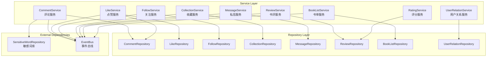
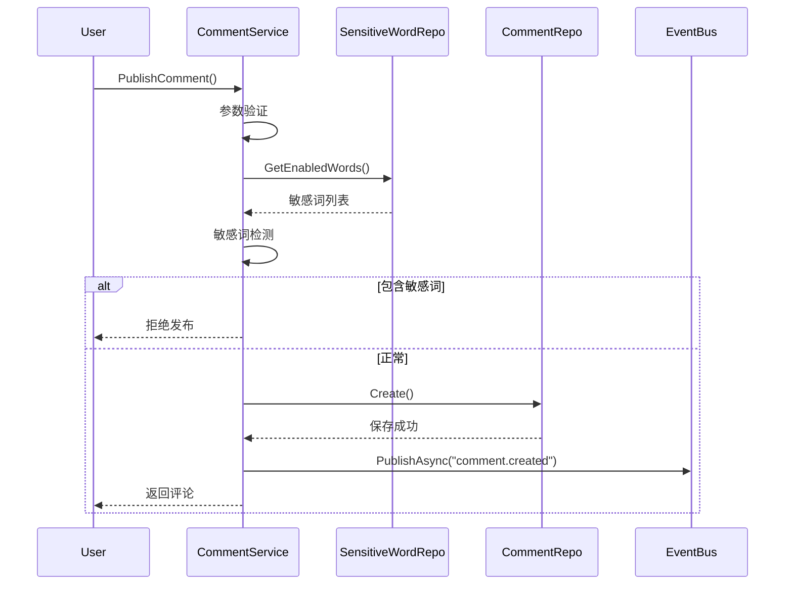
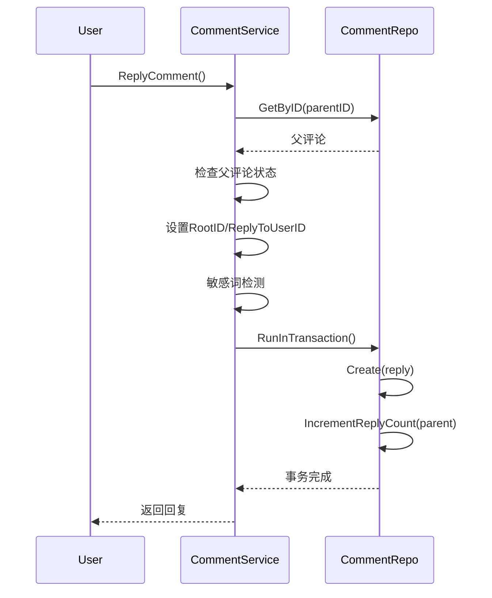
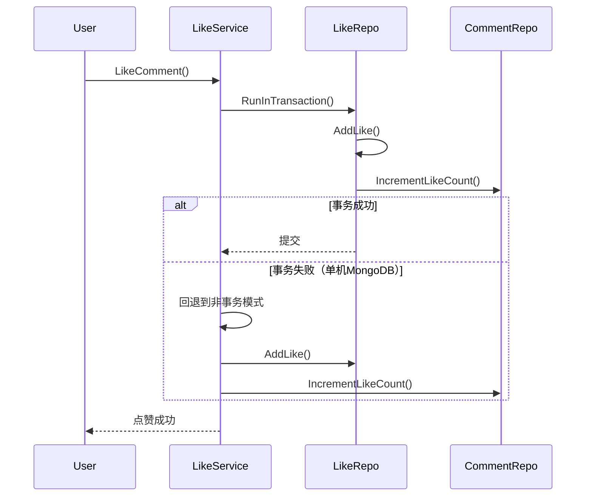
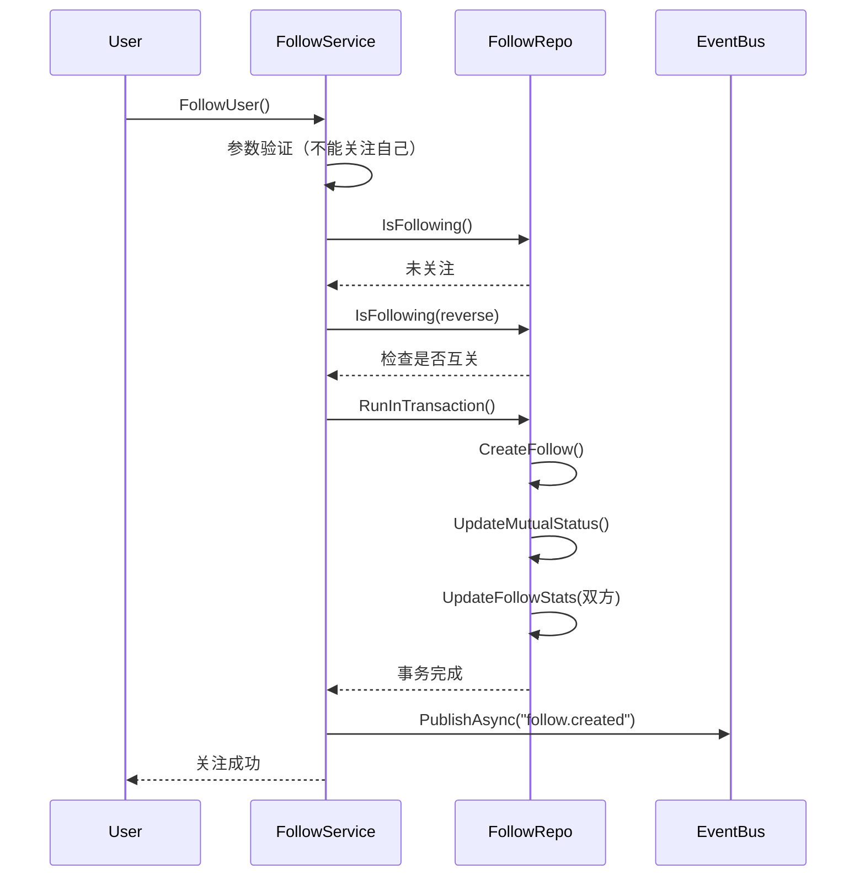
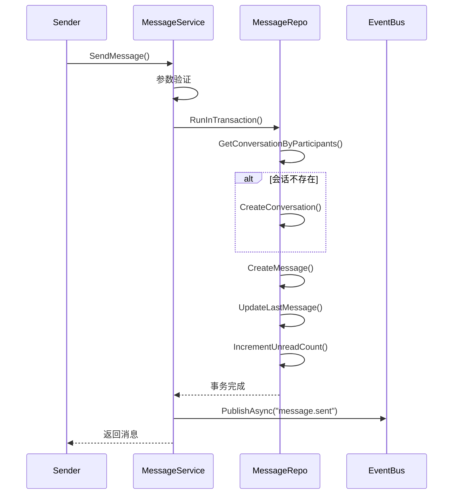

# Social Service

社交业务服务层，提供评论、点赞、关注、收藏、私信、书评、评分、书单等核心社交功能。

## 模块职责

社交服务层负责处理用户间的互动行为，包括评论发布与审核、点赞管理、关注关系维护、收藏夹管理、私信系统、书评撰写、评分统计、书单创建等功能。

## 架构图

## 核心服务列表

### 1. CommentService (评论服务)

| 方法 | 职责 |
|------|------|
| `PublishComment` | 发表评论，支持书籍/章节评论 |
| `ReplyComment` | 回复评论，支持嵌套回复 |
| `CreateTargetedComment` | 创建面向任意目标的评论，支持段落元数据 |
| `ListCommentsByFilter` | 按过滤器查询评论 |
| `GetCommentList` | 获取评论列表，支持按热度/时间排序 |
| `GetCommentDetail` | 获取评论详情 |
| `UpdateComment` | 更新评论（30分钟内可编辑） |
| `DeleteComment` | 删除评论（软删除） |
| `AutoReviewComment` | 自动审核评论，敏感词检测 |
| `GetBookCommentStats` | 获取书籍评论统计 |
| `GetCommentThread` | 获取评论线程（树状结构） |
| `GetTopComments` | 获取热门评论 |
| `GetCommentReplies` | 获取评论的所有回复 |

**依赖**: `CommentRepository`, `SensitiveWordRepository`, `EventBus`

### 2. LikeService (点赞服务)

| 方法 | 职责 |
|------|------|
| `LikeBook` | 点赞书籍 |
| `UnlikeBook` | 取消点赞书籍 |
| `GetBookLikeCount` | 获取书籍点赞数 |
| `IsBookLiked` | 检查书籍是否已点赞 |
| `LikeComment` | 点赞评论（事务更新评论点赞数） |
| `UnlikeComment` | 取消点赞评论 |
| `GetUserLikedBooks` | 获取用户点赞的书籍列表 |
| `GetUserLikedComments` | 获取用户点赞的评论列表 |
| `BatchLikeBooks` | 批量点赞书籍 |
| `GetBooksLikeCount` | 批量获取书籍点赞数 |
| `GetUserLikeStatus` | 批量检查用户点赞状态 |
| `GetUserLikeStats` | 获取用户点赞统计 |

**依赖**: `LikeRepository`, `CommentRepository`, `EventBus`

### 3. FollowService (关注服务)

| 方法 | 职责 |
|------|------|
| `FollowUser` | 关注用户，支持互关状态检测 |
| `UnfollowUser` | 取消关注用户 |
| `CheckFollowStatus` | 检查关注状态 |
| `GetFollowers` | 获取粉丝列表 |
| `GetFollowing` | 获取关注列表 |
| `GetFollowStats` | 获取关注统计 |
| `FollowAuthor` | 关注作者（支持新书通知） |
| `UnfollowAuthor` | 取消关注作者 |
| `GetFollowingAuthors` | 获取关注的作者列表 |

**依赖**: `FollowRepository`, `EventBus`

### 4. CollectionService (收藏服务)

| 方法 | 职责 |
|------|------|
| `AddToCollection` | 添加收藏到收藏夹 |
| `RemoveFromCollection` | 取消收藏 |
| `UpdateCollection` | 更新收藏（笔记、标签、收藏夹） |
| `GetUserCollections` | 获取用户收藏列表 |
| `GetCollectionsByTag` | 根据标签获取收藏 |
| `IsCollected` | 检查是否已收藏 |
| `CreateFolder` | 创建收藏夹 |
| `GetUserFolders` | 获取用户收藏夹列表 |
| `UpdateFolder` | 更新收藏夹 |
| `DeleteFolder` | 删除收藏夹（需先清空） |
| `ShareCollection` | 分享收藏 |
| `GetUserCollectionStats` | 获取用户收藏统计 |
| `ShareCollectionWithURL` | 分享收藏并返回分享链接 |
| `GetSharedCollection` | 根据分享ID获取收藏详情 |

**依赖**: `CollectionRepository`, `EventBus`

### 5. MessageService (私信服务)

| 方法 | 职责 |
|------|------|
| `GetConversations` | 获取会话列表 |
| `GetConversationMessages` | 获取会话消息（权限校验） |
| `SendMessage` | 发送私信（自动创建/更新会话） |
| `MarkMessageAsRead` | 标记消息已读 |
| `DeleteMessage` | 删除消息（软删除） |
| `CreateMention` | 创建@提醒 |
| `GetMentions` | 获取@提醒列表 |
| `MarkMentionAsRead` | 标记@提醒已读 |

**依赖**: `MessageRepository`, `EventBus`

### 6. ReviewService (书评服务)

| 方法 | 职责 |
|------|------|
| `CreateReview` | 创建书评（1-5评分，剧透标记） |
| `GetReviews` | 获取书评列表 |
| `GetReviewByID` | 获取书评详情 |
| `UpdateReview` | 更新书评 |
| `DeleteReview` | 删除书评 |
| `LikeReview` | 点赞书评（事务更新） |
| `UnlikeReview` | 取消点赞书评 |

**依赖**: `ReviewRepository`, `EventBus`

### 7. RatingService (评分服务)

| 方法 | 职责 |
|------|------|
| `GetRatingStats` | 获取评分统计（带缓存） |
| `GetUserRating` | 获取用户对目标的评分 |
| `AggregateRatings` | 从现有数据源聚合评分 |
| `InvalidateCache` | 使缓存失效 |

**依赖**: `ReviewRepository`

### 8. BookListService (书单服务)

| 方法 | 职责 |
|------|------|
| `CreateBookList` | 创建书单 |
| `GetBookLists` | 获取书单列表 |
| `GetBookListByID` | 获取书单详情 |
| `UpdateBookList` | 更新书单 |
| `DeleteBookList` | 删除书单 |
| `LikeBookList` | 点赞书单 |
| `ForkBookList` | 复制书单 |
| `GetBooksInList` | 获取书单中的书籍 |

**依赖**: `BookListRepository`, `EventBus`

### 9. UserRelationService (用户关系服务)

| 方法 | 职责 |
|------|------|
| `FollowUser` | 关注用户 |
| `UnfollowUser` | 取消关注 |
| `IsFollowing` | 检查是否关注 |
| `GetRelation` | 获取关系详情 |
| `GetFollowers` | 获取粉丝列表 |
| `GetFollowing` | 获取关注列表 |
| `GetFollowerCount` | 获取粉丝数 |
| `GetFollowingCount` | 获取关注数 |

**依赖**: `UserRelationRepository`

## 依赖关系说明

### 外部依赖

| 依赖 | 用途 |
|------|------|
| `SensitiveWordRepository` | 评论敏感词检测 |
| `EventBus` | 事件发布（评论创建、点赞、关注等） |

### Repository 依赖

| Repository | 对应服务 |
|------------|----------|
| `CommentRepository` | CommentService, LikeService |
| `LikeRepository` | LikeService |
| `FollowRepository` | FollowService |
| `CollectionRepository` | CollectionService |
| `MessageRepository` | MessageService |
| `ReviewRepository` | ReviewService, RatingService |
| `BookListRepository` | BookListService |
| `UserRelationRepository` | UserRelationService |

## 核心流程说明

### 1. 评论发布流程

### 2. 评论回复流程

### 3. 点赞评论流程（事务）

### 4. 关注用户流程

### 5. 私信发送流程

## 事务处理策略

服务层在处理需要原子操作的场景时，会优先使用 MongoDB 事务：

1. **评论回复**: 创建回复 + 增加父评论回复数
2. **评论点赞**: 创建点赞记录 + 增加评论点赞数
3. **关注用户**: 创建关注关系 + 更新互关状态 + 更新双方统计
4. **收藏操作**: 创建收藏 + 更新收藏夹计数
5. **书单点赞**: 创建点赞 + 增加书单点赞数

当 MongoDB 不支持事务（单机模式）时，服务会自动回退到非事务模式，确保功能可用。

## 事件发布

所有社交操作都会通过 EventBus 发布事件，供其他模块订阅：

| 事件类型 | 触发时机 |
|----------|----------|
| `comment.created` | 评论创建成功 |
| `comment.replied` | 评论回复成功 |
| `comment.deleted` | 评论删除 |
| `like.book.added` | 书籍点赞 |
| `like.book.removed` | 取消书籍点赞 |
| `like.comment.added` | 评论点赞 |
| `like.comment.removed` | 取消评论点赞 |
| `follow.created` | 关注用户 |
| `follow.deleted` | 取消关注 |
| `author_follow.created` | 关注作者 |
| `collection.added` | 添加收藏 |
| `collection.removed` | 取消收藏 |
| `folder.created` | 创建收藏夹 |
| `folder.deleted` | 删除收藏夹 |
| `message.sent` | 发送私信 |
| `message.deleted` | 删除消息 |
| `mention.created` | 创建@提醒 |
| `review.created` | 创建书评 |
| `review.deleted` | 删除书评 |
| `booklist.created` | 创建书单 |
| `booklist.deleted` | 删除书单 |
| `booklist.forked` | 复制书单 |

## 文件列表

| 文件 | 职责 |
|------|------|
| `comment_service.go` | 评论服务，支持多目标评论、嵌套回复 |
| `like_service.go` | 点赞服务，支持书籍/评论点赞 |
| `follow_service.go` | 关注服务，支持用户/作者关注 |
| `collection_service.go` | 收藏服务，支持收藏夹管理 |
| `message_service.go` | 私信服务，支持会话/消息/@提醒 |
| `review_service.go` | 书评服务 |
| `rating_service.go` | 评分服务接口 |
| `rating_service_impl.go` | 评分服务实现，带缓存 |
| `booklist_service.go` | 书单服务 |
| `user_relation_service.go` | 用户关系服务 |
