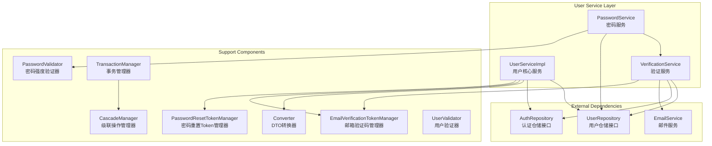
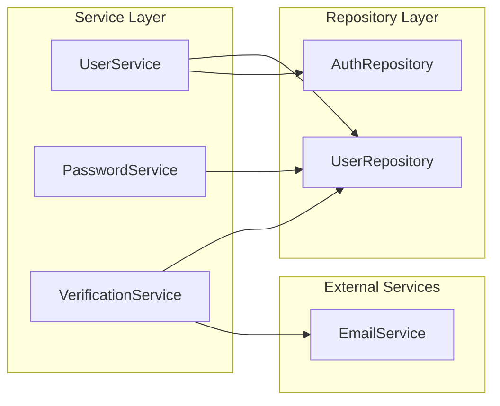
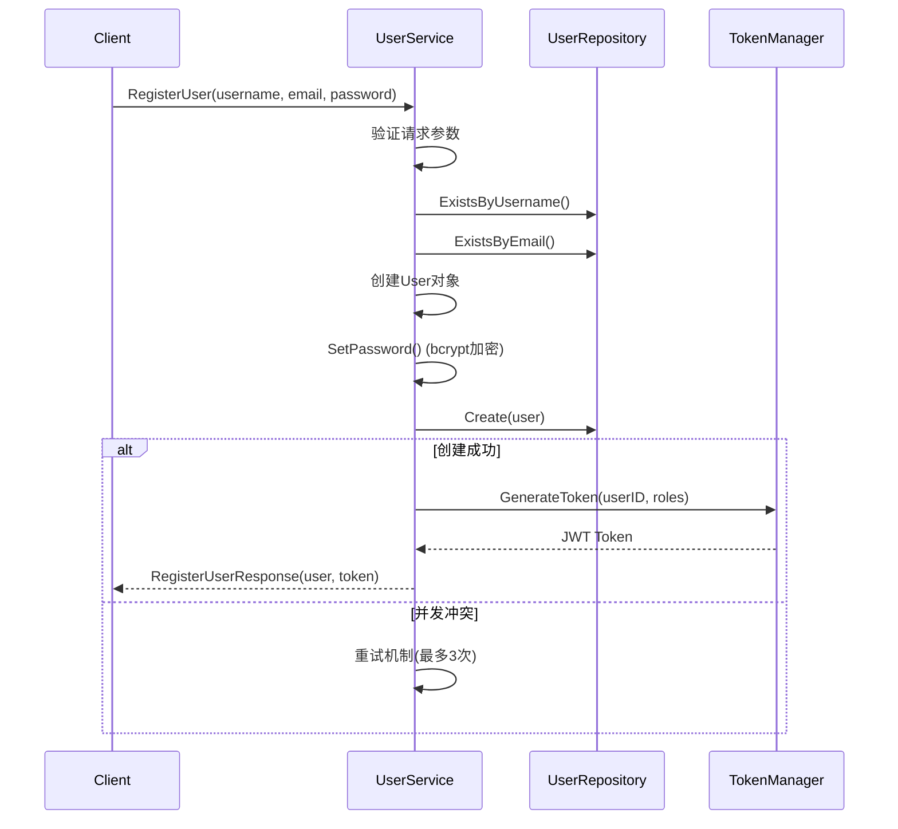
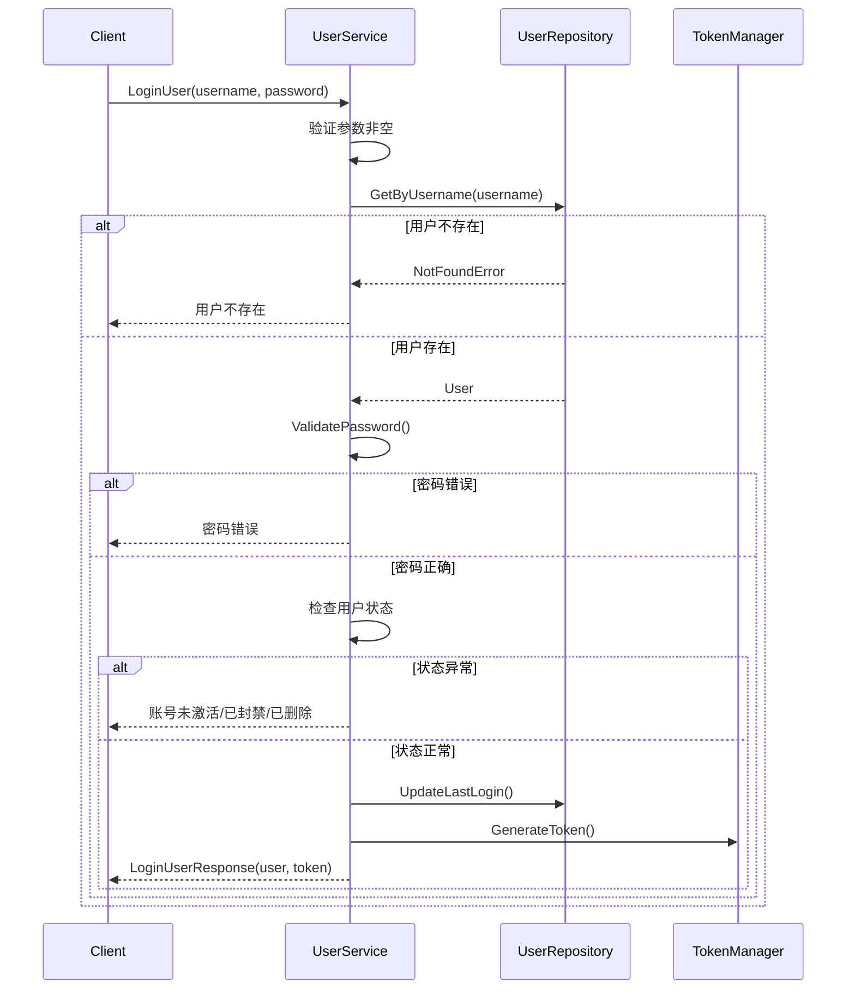
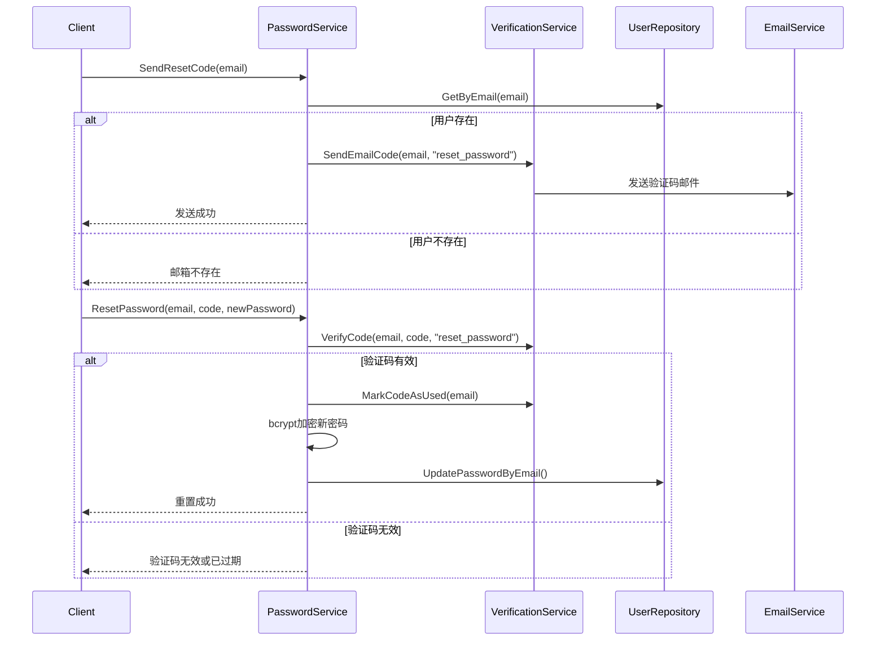
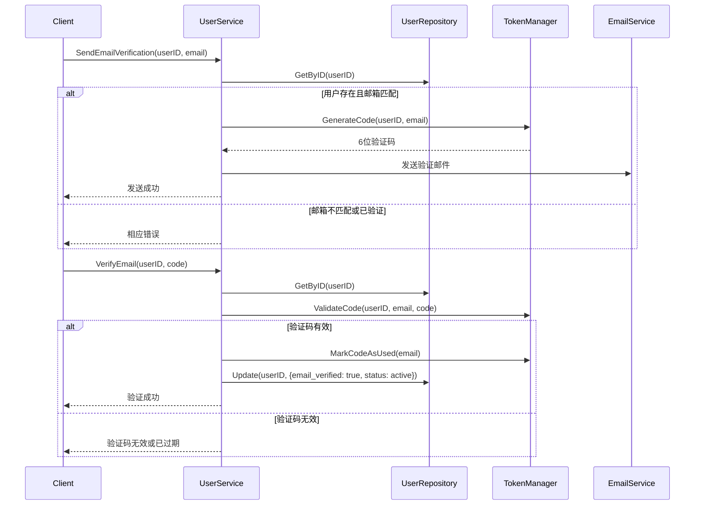

# User Service 模块架构文档

用户服务模块，提供用户注册、登录、密码管理、邮箱验证等核心用户业务逻辑。

## 架构图



## 核心服务列表

### UserServiceImpl - 用户核心服务

主服务实现，提供完整的用户管理功能。

| 方法 | 职责 |
|------|------|
| `CreateUser` | 创建用户（管理端） |
| `RegisterUser` | 用户注册（公开） |
| `LoginUser` | 用户登录认证 |
| `LogoutUser` | 用户登出 |
| `GetUser` | 获取用户信息 |
| `UpdateUser` | 更新用户信息 |
| `DeleteUser` | 删除用户 |
| `ListUsers` | 获取用户列表 |
| `UpdatePassword` | 修改密码（需旧密码） |
| `ResetPassword` | 重置密码（发送重置邮件） |
| `ConfirmPasswordReset` | 确认密码重置 |
| `SendEmailVerification` | 发送邮箱验证码 |
| `VerifyEmail` | 验证邮箱 |
| `AssignRole` | 分配角色 |
| `RemoveRole` | 移除角色 |
| `GetUserRoles` | 获取用户角色 |
| `GetUserPermissions` | 获取用户权限 |
| `DowngradeRole` | 角色降级 |

### PasswordService - 密码服务

密码管理专用服务。

| 方法 | 职责 |
|------|------|
| `SendResetCode` | 发送密码重置验证码 |
| `ResetPassword` | 通过验证码重置密码 |
| `UpdatePassword` | 修改密码（需验证旧密码） |

### VerificationService - 验证服务

验证码发送和校验服务。

| 方法 | 职责 |
|------|------|
| `SendEmailCode` | 发送邮箱验证码 |
| `SendPhoneCode` | 发送手机验证码 |
| `VerifyCode` | 验证验证码 |
| `MarkCodeAsUsed` | 标记验证码已使用 |
| `SetEmailVerified` | 设置邮箱已验证 |
| `SetPhoneVerified` | 设置手机已验证 |
| `CheckPassword` | 验证密码正确性 |
| `EmailExists` | 检查邮箱是否存在 |
| `PhoneExists` | 检查手机是否存在 |

## 辅助组件

### PasswordValidator - 密码验证器

密码强度验证和评分。

- 最小长度: 8位
- 必须包含: 大写字母、小写字母、数字
- 可选: 特殊字符
- 检测: 常见弱密码、连续字符

### EmailVerificationTokenManager - 邮箱验证码管理器

- 生成6位数字验证码
- 有效期: 30分钟
- 单例模式，自动清理过期Token

### PasswordResetTokenManager - 密码重置Token管理器

- 生成64字符随机Token
- 有效期: 1小时
- 支持一次性使用标记

### TransactionManager - 事务管理器

支持复杂业务场景的事务操作:

- `UserRegistrationTransaction`: 用户注册事务（用户+角色+配置）
- `UserDeletionTransaction`: 用户删除事务（软删除/硬删除）
- `SagaManager`: Saga模式分布式事务

### Converter - DTO转换器

Model 与 DTO 之间的转换:

- `ToUserDTO`: User Model -> UserDTO
- `ToUserDTOs`: 批量转换
- `ToUser`: DTO -> Model（用于更新）
- `ToUserWithoutID`: DTO -> Model（用于创建）

## 依赖关系



### Repository 依赖

| 服务 | Repository | 用途 |
|------|------------|------|
| UserServiceImpl | `UserRepository` | 用户CRUD、状态管理 |
| UserServiceImpl | `AuthRepository` | 角色、权限管理 |
| PasswordService | `UserRepository` | 密码更新、用户查询 |
| VerificationService | `UserRepository` | 用户信息查询、验证状态更新 |
| VerificationService | `AuthRepository` | 认证相关操作 |

## 核心流程说明

### 用户注册流程



### 用户登录流程



### 密码重置流程



### 邮箱验证流程



## 错误处理

模块使用统一的错误码体系:

| 错误码 | 说明 | HTTP状态码 |
|--------|------|------------|
| 40401 | 用户不存在 | 404 |
| 40001 | 邮箱格式无效 | 400 |
| 40002 | 密码格式无效 | 400 |
| 40901 | 用户已存在 | 409 |
| 40101 | 令牌无效 | 401 |
| 40102 | 令牌过期 | 401 |
| 40301 | 权限不足 | 403 |
| 50001 | 内部错误 | 500 |

## 文件结构

```
service/user/
├── user_service.go              # 用户核心服务实现
├── password_service.go          # 密码服务
├── verification_service.go      # 验证服务
├── password_validator.go        # 密码强度验证器
├── email_verification_token.go  # 邮箱验证码管理器
├── password_reset_token.go      # 密码重置Token管理器
├── transaction_manager.go       # 事务管理器
├── converter.go                 # DTO转换器
├── user_validator.go            # 用户验证器
├── errors.go                    # 错误定义
├── constants.go                 # 常量定义
└── mocks/                       # Mock文件（测试用）
    ├── mock_user_repository.go
    └── mock_auth_repository.go
```
