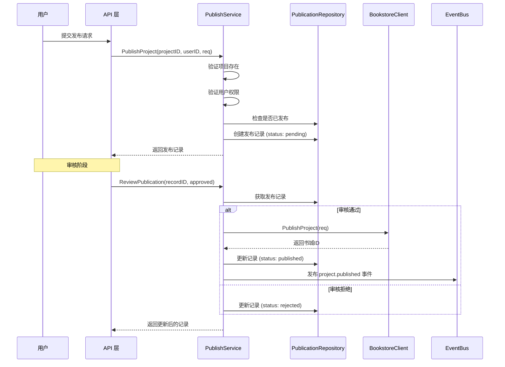
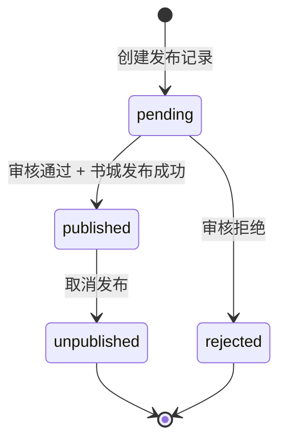

# Writer Service 模块

写作工作台核心业务服务层，提供项目管理、文档编辑、内容创作、协作批注、发布导出等功能。

## 模块职责

Writer Service 负责处理写作工作台的所有业务逻辑，包括项目的创建与管理、文档的编辑与版本控制、角色/地点/时间线等创作素材管理、批注协作、以及作品发布和导出功能。

## 架构图

```mermaid
graph TB
    subgraph "WriterService 统一接口"
        WS[WriterService]
        Factory[WriterServiceFactory]
    end

    subgraph "Port 实现 (impl/)"
        PM[ProjectManagementImpl]
        DM[DocumentManagementImpl]
        CM[ContentManagementImpl]
        CB[CollaborationImpl]
        PE[PublishExportImpl]
    end

    subgraph "project/ 子模块"
        PS[ProjectService]
        VS[VersionService]
        AS[AutoSaveService]
        NS[NodeService]
        DS_p[DocumentService]
    end

    subgraph "document/ 子模块"
        DS[DocumentService]
        DuS[DuplicateService]
        TS[TemplateService]
        BS[BatchOperationService]
        PS_d[PreflightService]
        RS[RetryService]
    end

    subgraph "核心服务"
        CS[CharacterService]
        LS[LocationService]
        TLS[TimelineService]
        CmS[CommentService]
        PService[PublishService]
        EService[ExportService]
    end

    WS --> Factory
    Factory --> PM
    Factory --> DM
    Factory --> CM
    Factory --> CB
    Factory --> PE

    PM --> PS
    DM --> DS
    CM --> CS
    CM --> LS
    CM --> TLS
    CB --> CmS
    PE --> PService
    PE --> EService

    PS --> VS
    PS --> AS
    DS --> DuS
    DS --> BS
    DS --> PS_d

    subgraph "Repository 依赖"
        PR[ProjectRepository]
        DR[DocumentRepository]
        DCR[DocumentContentRepository]
        CR[CharacterRepository]
        LR[LocationRepository]
        TR[TimelineRepository]
        CmR[CommentRepository]
        PubR[PublicationRepository]
    end

    PS --> PR
    DS --> DR
    DS --> DCR
    CS --> CR
    LS --> LR
    TLS --> TR
    CmS --> CmR
    PService --> PubR
```

## 核心服务列表

### project/ 子模块 - 项目管理

| 服务 | 职责 |
|------|------|
| `ProjectService` | 项目 CRUD、权限验证、状态管理、统计更新 |
| `VersionService` | 版本控制、修订历史、冲突检测、回滚操作 |
| `AutoSaveService` | 自动保存机制、定时保存会话管理 |
| `NodeService` | 节点管理（大纲节点） |
| `DocumentService` | 项目下的文档管理 |

### document/ 子模块 - 文档管理

| 服务 | 职责 |
|------|------|
| `DocumentService` | 文档 CRUD、树形结构、内容管理、自动保存 |
| `DuplicateService` | 文档复制、深拷贝 |
| `TemplateService` | 文档模板管理 |
| `BatchOperationService` | 批量操作（批量移动、删除等） |
| `PreflightService` | 操作前预检查 |
| `RetryService` | 重试机制 |

### impl/ 子模块 - Port 实现

| 实现 | 职责 |
|------|------|
| `ProjectManagementImpl` | 项目管理 Port 实现，委托给 ProjectService |
| `DocumentManagementImpl` | 文档管理 Port 实现，委托给 DocumentService |
| `ContentManagementImpl` | 内容管理 Port 实现，聚合 Character/Location/Timeline 服务 |
| `CollaborationImpl` | 协作批注 Port 实现，委托给 CommentService |
| `PublishExportImpl` | 发布导出 Port 实现，聚合 Publish/Export 服务 |

### 核心服务

| 服务 | 职责 |
|------|------|
| `CharacterService` | 角色卡管理、角色关系图 |
| `LocationService` | 地点管理、地点层级树 |
| `TimelineService` | 时间线管理、事件可视化 |
| `CommentService` | 批注/评论管理、线程管理 |
| `PublishService` | 发布到书城、审核流程 |
| `ExportService` | 导出为 TXT/MD/DOCX/ZIP |

## 依赖关系

### Repository 依赖

| 服务 | 依赖的 Repository |
|------|------------------|
| ProjectService | `ProjectRepository` |
| DocumentService | `DocumentRepository`, `DocumentContentRepository`, `ProjectRepository` |
| CharacterService | `CharacterRepository` |
| LocationService | `LocationRepository` |
| TimelineService | `TimelineRepository`, `TimelineEventRepository` |
| CommentService | `CommentRepository` |
| PublishService | `PublicationRepository`, `ProjectRepository`, `DocumentRepository` |
| ExportService | `DocumentRepository`, `DocumentContentRepository`, `ProjectRepository` |

### 其他依赖

| 服务 | 依赖 |
|------|------|
| 所有服务 | `EventBus` (事件总线) |
| PublishService | `BookstoreClient` (书城客户端接口) |
| ExportService | `FileStorage` (文件存储接口) |

## 发布流程说明

### 发布状态流转

## 版本控制说明

Writer 模块采用乐观锁版本控制机制：

1. **版本号管理**：每个 `DocumentContent` 都有 `version` 字段
2. **乐观锁更新**：`UpdateWithVersion` 方法验证版本号匹配后才更新
3. **冲突检测**：`DetectConflicts` 方法检测版本冲突
4. **快照存储**：`StoreSnapshot` 根据内容大小选择内联或外部存储
5. **回滚支持**：`RollbackToVersion` 支持回滚到历史版本

## 错误处理

模块定义了完整的错误码体系（`errors.go`）：

- `40xxx`：输入验证错误
- `401xx`：认证错误
- `403xx`：权限错误
- `404xx`：资源不存在错误
- `409xx`：冲突错误（版本冲突、编辑冲突）
- `50xxx`：内部错误（发布失败、导出失败、存储错误）

所有错误都实现了 `WriterError` 结构，支持：
- 错误码与 HTTP 状态码映射
- 字段级错误定位
- 可重试判断
- 元数据附加
